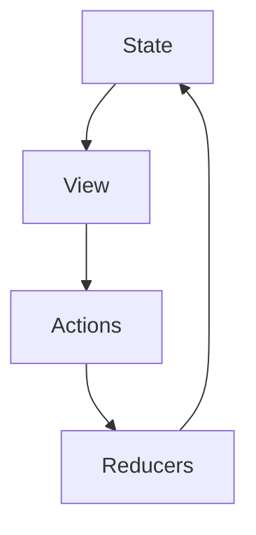

## 20.1 Redux Pattern in Clojure

State management is a critical aspect of building robust applications, and the Redux pattern offers a structured approach to handle it effectively. In this section, we will delve into the Redux pattern, its core principles, and how it can be adapted to Clojure, leveraging the language's strengths in immutability and functional programming.

### Understanding the Redux Pattern

The Redux pattern is a predictable state container for JavaScript apps, but its principles are highly applicable to Clojure due to the language's emphasis on immutability and functional purity. Let's explore the core principles of Redux:

#### Core Principles

- **Single Source of Truth:** The entire application state is stored in a single immutable data structure. This centralization simplifies state management and debugging.
- **State is Read-Only:** Direct modifications to the state are prohibited. Instead, actions are dispatched to signal changes, ensuring that state transitions are explicit and traceable.
- **Pure Functions for State Changes:** Reducers are pure functions that take the current state and an action, returning a new state. This purity ensures that state changes are predictable and testable.

#### Unidirectional Data Flow

Redux enforces a unidirectional data flow, which enhances the predictability of state changes. The data flows in one direction: from state to view to actions to reducers. This flow can be visualized as follows:



### Adapting Redux to Clojure

Clojure's functional paradigm aligns seamlessly with Redux's principles, making it an excellent choice for implementing the pattern.

#### Functional Paradigm Alignment

Clojure's emphasis on immutability and pure functions aligns well with Redux principles. The language's immutable data structures and functional programming constructs provide a natural fit for Redux's state management approach.

#### State Management with Atoms

In Clojure, an `atom` can be used to hold the application state, allowing for safe, concurrent state updates. Atoms provide a way to manage mutable state in a controlled manner, ensuring thread safety.

```clojure
(def app-state (atom {}))
```

### Implementing Redux Components

To implement the Redux pattern in Clojure, we need to define actions, reducers, and a dispatch function.

#### Actions

Actions represent events or intentions to change the state. They are typically defined as maps with a `:type` key and an optional payload.

```clojure
{:type :increment :value 1}
```

#### Reducers

Reducers are pure functions that determine how the state changes in response to actions. They use constructs like `case` or `cond` to handle different action types.

```clojure
(defn reducer [state action]
  (case (:type action)
    :increment (update state :count (fnil inc 0))
    :decrement (update state :count (fnil dec 0))
    state))
```

#### Dispatch Function

The dispatch function applies actions to the state atom using `swap!`, ensuring thread-safe updates to the state.

```clojure
(defn dispatch [action]
  (swap! app-state reducer action))
```

### Example Usage

Let's see how these components come together in a simple example.

#### Initializing State

Optionally, set an initial state for the application.

```clojure
(reset! app-state {:count 0})
```

#### Dispatching Actions

Update the state by dispatching actions.

```clojure
(dispatch {:type :increment :value 2})
(dispatch {:type :decrement})
```

#### Accessing State

Retrieve the current state using the dereferencing operator `@`.

```clojure
@app-state
;; => {:count 1}
```

### Benefits of Redux Pattern in Clojure

The Redux pattern offers several advantages when implemented in Clojure:

- **Predictability:** With a single source of truth and pure reducers, state changes are predictable and traceable.
- **Debugging and Testing:** Pure functions are easier to test, and state transitions are straightforward to reason about.
- **Time Travel and Undo:** Since states are immutable, it's possible to implement features like undo/redo by storing previous states.

### Best Practices

To maximize the effectiveness of the Redux pattern in Clojure, consider the following best practices:

- **Normalize State:** Structure state to avoid nested data where possible, simplifying updates.
- **Avoid Side Effects in Reducers:** Keep reducers pure; handle side effects elsewhere (e.g., middleware, event handlers).
- **Use Namespaced Keywords:** Prevent naming collisions by using namespaced keywords for action types.

### Extending Redux in Clojure

Redux can be extended in Clojure to handle more complex scenarios.

#### Middleware Pattern

Introduce middleware functions to handle side effects like logging and API calls.

#### Combining Reducers

Split reducers into smaller functions and combine them for modularity.

```clojure
(defn combined-reducer [state action]
  (-> state
      (counter-reducer action)
      (user-reducer action)))
```

### Libraries and Tools

Several libraries and tools can enhance the Redux pattern in Clojure:

- **Re-frame (ClojureScript):** For building reactive web applications using the Redux pattern.
- **Mount or Component:** For managing application state and lifecycle in server-side Clojure.

### Conclusion

The Redux pattern provides a robust framework for managing state in Clojure applications. By leveraging Clojure's strengths in immutability and functional programming, developers can create predictable, testable, and scalable applications. Whether you're building a web application with Re-frame or managing server-side state with Mount, the Redux pattern offers a powerful toolset for state management.

## Quiz Time!



### What is the core principle of Redux regarding the application state?

- [x] Single Source of Truth
- [ ] Multiple Sources of Truth
- [ ] No Source of Truth
- [ ] Dynamic Sources of Truth

> **Explanation:** Redux maintains a single source of truth, storing the entire application state in one immutable data structure.

### How are state changes signaled in Redux?

- [x] By dispatching actions
- [ ] By directly modifying the state
- [ ] By using callbacks
- [ ] By using promises

> **Explanation:** In Redux, state changes are signaled by dispatching actions, which are then processed by reducers.

### What is the role of reducers in Redux?

- [x] To determine how the state changes in response to actions
- [ ] To directly modify the state
- [ ] To handle side effects
- [ ] To manage user input

> **Explanation:** Reducers are pure functions that determine how the state changes in response to actions.

### How does Clojure's `atom` contribute to Redux implementation?

- [x] It holds the application state, allowing for safe, concurrent updates
- [ ] It directly modifies the state
- [ ] It handles side effects
- [ ] It manages user input

> **Explanation:** In Clojure, an `atom` is used to hold the application state, ensuring thread-safe updates.

### What is a best practice for structuring state in Redux?

- [x] Normalize state to avoid nested data
- [ ] Use deeply nested structures
- [ ] Store state in multiple places
- [ ] Avoid using maps

> **Explanation:** Normalizing state helps simplify updates and avoid deeply nested structures.

### What is a common extension of Redux in Clojure?

- [x] Middleware for handling side effects
- [ ] Direct state modification
- [ ] Using callbacks for state changes
- [ ] Storing state in multiple atoms

> **Explanation:** Middleware can be introduced to handle side effects like logging and API calls.

### Which library is recommended for building reactive web applications using Redux in ClojureScript?

- [x] Re-frame
- [ ] Mount
- [ ] Component
- [ ] Pedestal

> **Explanation:** Re-frame is a ClojureScript library for building reactive web applications using the Redux pattern.

### What is a benefit of using pure functions in Redux?

- [x] Easier to test and reason about state transitions
- [ ] Directly modifies the state
- [ ] Handles side effects
- [ ] Manages user input

> **Explanation:** Pure functions are easier to test and reason about, making state transitions predictable.

### How can Redux support features like undo/redo?

- [x] By storing previous states
- [ ] By using callbacks
- [ ] By directly modifying the state
- [ ] By using promises

> **Explanation:** Since states are immutable, storing previous states allows for implementing features like undo/redo.

### True or False: In Redux, reducers should handle side effects.

- [ ] True
- [x] False

> **Explanation:** Reducers should remain pure and not handle side effects; side effects should be managed elsewhere.


