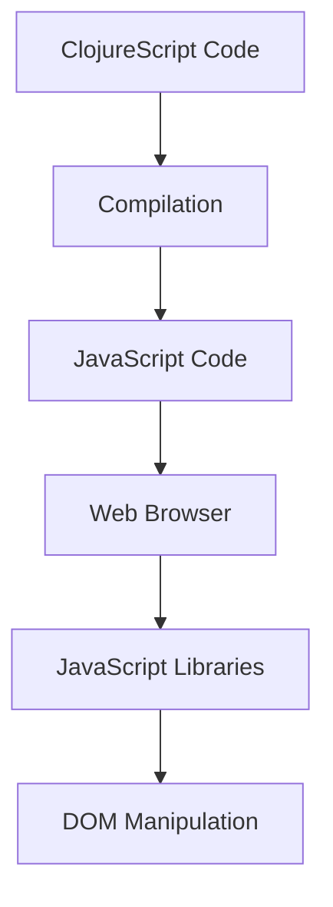

## 20.1. ClojureScript and Client-Side Development

ClojureScript is a powerful tool that brings the elegance and expressiveness of Clojure to the world of client-side JavaScript development. By compiling Clojure code into JavaScript, ClojureScript allows developers to leverage the benefits of functional programming in the browser. This section will guide you through the essentials of ClojureScript, its advantages, and how to set up and use it effectively in your projects.

### Understanding ClojureScript

ClojureScript is a variant of Clojure that compiles to JavaScript, enabling developers to write client-side applications using Clojure's syntax and functional programming paradigms. This approach offers several benefits, including code reuse between client and server, a more expressive syntax, and the ability to leverage Clojure's powerful features such as immutability and first-class functions.

#### How ClojureScript Compiles to JavaScript

ClojureScript code is transformed into JavaScript through a compilation process. This process involves several steps, including parsing the ClojureScript code, transforming it into an intermediate representation, and then generating JavaScript code that can be executed in a web browser. The ClojureScript compiler is highly optimized, producing efficient JavaScript code that integrates seamlessly with existing JavaScript libraries and frameworks.

```clojure
;; Example ClojureScript code
(defn greet [name]
  (str "Hello, " name "!"))

;; Compiled JavaScript equivalent
function greet(name) {
  return "Hello, " + name + "!";
}
```

### Benefits of Using ClojureScript

1. **Code Reuse**: ClojureScript enables developers to share code between the client and server, reducing duplication and ensuring consistency across the application.

2. **Functional Programming**: By using ClojureScript, developers can apply functional programming principles to client-side development, leading to more predictable and maintainable code.

3. **Immutable Data Structures**: ClojureScript's immutable data structures help prevent common bugs related to mutable state, making applications more robust.

4. **Interoperability**: ClojureScript can seamlessly interoperate with JavaScript, allowing developers to use existing JavaScript libraries and frameworks.

5. **Rich Ecosystem**: The ClojureScript ecosystem includes a variety of libraries and tools that enhance productivity and enable the development of complex applications.

### Setting Up a ClojureScript Project

To get started with ClojureScript, you'll need to set up a development environment. This typically involves installing the ClojureScript compiler, a build tool like Leiningen or Shadow CLJS, and a text editor or IDE.

#### Step-by-Step Guide to Setting Up a ClojureScript Project

1. **Install Clojure and Leiningen**: Ensure you have Clojure and Leiningen installed on your system. Leiningen is a popular build tool for Clojure projects.

2. **Create a New Project**: Use Leiningen to create a new ClojureScript project.

   ```bash
   lein new figwheel-main my-clojurescript-app
   ```

3. **Configure the Project**: Edit the `project.clj` file to include dependencies and configurations for ClojureScript.

4. **Write ClojureScript Code**: Create ClojureScript source files in the `src` directory and start writing your application code.

5. **Compile and Run**: Use Leiningen or Shadow CLJS to compile your ClojureScript code and run it in a web browser.

   ```bash
   lein figwheel
   ```

### Interoperability with JavaScript Libraries

ClojureScript provides excellent interoperability with JavaScript, allowing developers to use existing JavaScript libraries and frameworks. This is achieved through the use of JavaScript interop features, which enable ClojureScript code to call JavaScript functions and access JavaScript objects.

#### Example: Using a JavaScript Library in ClojureScript

Suppose you want to use the popular JavaScript library `lodash` in your ClojureScript project. Here's how you can do it:

1. **Add Lodash as a Dependency**: Include Lodash in your project's dependencies.

2. **Require Lodash in Your Code**: Use ClojureScript's `js/` interop to require and use Lodash functions.

   ```clojure
   (ns my-clojurescript-app.core
     (:require [cljsjs.lodash]))

   (defn example []
     (let [array (clj->js [1 2 3 4 5])]
       (js/console.log (js/_.chunk array 2))))
   ```

### Visualizing ClojureScript's Interaction with JavaScript

To better understand how ClojureScript interacts with JavaScript, let's visualize the process using a Mermaid.js diagram.



**Diagram Description**: This diagram illustrates the flow of ClojureScript code being compiled into JavaScript, which is then executed in a web browser. The JavaScript code can interact with existing JavaScript libraries and manipulate the DOM.

### Best Practices for ClojureScript Development

1. **Leverage Immutability**: Use ClojureScript's immutable data structures to manage state and prevent bugs related to mutable state.

2. **Embrace Functional Programming**: Apply functional programming principles, such as pure functions and higher-order functions, to write clean and maintainable code.

3. **Utilize JavaScript Interop**: Take advantage of ClojureScript's interoperability with JavaScript to use existing libraries and frameworks.

4. **Optimize Performance**: Use tools like Google Closure Compiler to optimize the performance of your ClojureScript code.

5. **Test Thoroughly**: Write tests for your ClojureScript code to ensure its correctness and reliability.

### Try It Yourself

To get hands-on experience with ClojureScript, try modifying the code examples provided in this section. Experiment with different JavaScript libraries, create your own ClojureScript functions, and see how they interact with the browser.

### Knowledge Check

- What are the benefits of using ClojureScript for client-side development?
- How does ClojureScript compile to JavaScript?
- What are some best practices for writing ClojureScript code?

### Summary

ClojureScript is a powerful tool for client-side development, offering the benefits of functional programming and seamless interoperability with JavaScript. By leveraging ClojureScript, developers can write robust, maintainable, and efficient client-side applications. As you continue your journey with ClojureScript, remember to experiment, explore new libraries, and embrace the functional programming paradigm.

## **Ready to Test Your Knowledge?**



### What is ClojureScript?

- [x] A variant of Clojure that compiles to JavaScript for client-side development.
- [ ] A JavaScript library for server-side development.
- [ ] A tool for compiling JavaScript into Clojure.
- [ ] A framework for building mobile applications.

> **Explanation:** ClojureScript is a variant of Clojure that compiles to JavaScript, enabling client-side development using Clojure's syntax and functional paradigms.

### What is one of the main benefits of using ClojureScript?

- [x] Code reuse between client and server.
- [ ] It eliminates the need for JavaScript entirely.
- [ ] It is faster than all JavaScript frameworks.
- [ ] It only works with Clojure servers.

> **Explanation:** ClojureScript allows for code reuse between client and server, reducing duplication and ensuring consistency.

### How does ClojureScript achieve interoperability with JavaScript?

- [x] Through JavaScript interop features that allow calling JavaScript functions and accessing objects.
- [ ] By converting JavaScript code into Clojure code.
- [ ] By using a special JavaScript compiler.
- [ ] By running JavaScript in a Clojure virtual machine.

> **Explanation:** ClojureScript provides JavaScript interop features that enable calling JavaScript functions and accessing JavaScript objects directly.

### Which tool is commonly used to set up a ClojureScript project?

- [x] Leiningen
- [ ] Maven
- [ ] Gradle
- [ ] NPM

> **Explanation:** Leiningen is a popular build tool for Clojure projects, including ClojureScript.

### What is the purpose of the `cljsjs` namespace in ClojureScript?

- [x] To include JavaScript libraries in ClojureScript projects.
- [ ] To compile ClojureScript into JavaScript.
- [ ] To manage ClojureScript dependencies.
- [ ] To provide built-in ClojureScript functions.

> **Explanation:** The `cljsjs` namespace is used to include JavaScript libraries in ClojureScript projects.

### What is a key feature of ClojureScript that helps prevent bugs related to mutable state?

- [x] Immutable data structures
- [ ] Dynamic typing
- [ ] Object-oriented programming
- [ ] Synchronous execution

> **Explanation:** ClojureScript's immutable data structures help prevent bugs related to mutable state, making applications more robust.

### What is the role of the Google Closure Compiler in ClojureScript development?

- [x] To optimize the performance of ClojureScript code.
- [ ] To compile JavaScript into ClojureScript.
- [ ] To provide a development environment for ClojureScript.
- [ ] To manage ClojureScript dependencies.

> **Explanation:** The Google Closure Compiler is used to optimize the performance of ClojureScript code.

### What is the primary language that ClojureScript compiles into?

- [x] JavaScript
- [ ] Java
- [ ] Python
- [ ] Ruby

> **Explanation:** ClojureScript compiles into JavaScript, enabling client-side development.

### True or False: ClojureScript can only be used for server-side development.

- [ ] True
- [x] False

> **Explanation:** False. ClojureScript is specifically designed for client-side development, compiling Clojure code into JavaScript for use in web browsers.

### Which of the following is a best practice for ClojureScript development?

- [x] Embrace functional programming principles.
- [ ] Avoid using JavaScript libraries.
- [ ] Use mutable data structures for better performance.
- [ ] Write code without testing.

> **Explanation:** Embracing functional programming principles is a best practice for writing clean and maintainable ClojureScript code.


