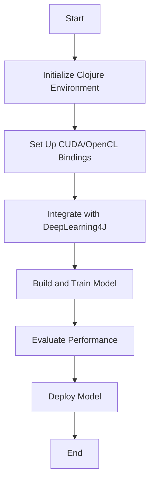

## 20.10. Machine Learning Accelerators and Clojure

Machine learning (ML) has become a cornerstone of modern software development, powering applications from image recognition to natural language processing. As ML models grow in complexity, the demand for computational power increases. This is where machine learning accelerators like GPUs (Graphics Processing Units) and TPUs (Tensor Processing Units) come into play. In this section, we'll explore how Clojure can leverage these specialized hardware accelerators to enhance ML computations, discuss integration methods, and examine tools like DeepLearning4J that facilitate this process.

### The Importance of Hardware Accelerators in Machine Learning

Machine learning tasks, particularly deep learning, involve massive amounts of data and complex computations. Traditional CPUs, while powerful, are not optimized for the parallel processing required by these tasks. GPUs and TPUs, on the other hand, are designed to handle thousands of operations simultaneously, making them ideal for ML workloads.

#### Key Benefits of Using GPUs and TPUs:

1. **Parallel Processing**: GPUs and TPUs can perform multiple operations in parallel, significantly speeding up training and inference times.
2. **Efficiency**: These accelerators are optimized for the types of matrix and vector operations common in ML, leading to more efficient computations.
3. **Scalability**: With the ability to handle large datasets and complex models, GPUs and TPUs allow for scaling ML applications to meet growing demands.

### Integrating Clojure with Machine Learning Accelerators

To harness the power of GPUs and TPUs in Clojure, we need to integrate with libraries and frameworks that provide access to these hardware resources. This typically involves using bindings to low-level APIs like CUDA (Compute Unified Device Architecture) for NVIDIA GPUs or OpenCL (Open Computing Language) for cross-platform support.

#### CUDA and OpenCL Bindings

- **CUDA**: A parallel computing platform and application programming interface (API) model created by NVIDIA. It allows developers to use a CUDA-enabled graphics processing unit (GPU) for general purpose processing.
- **OpenCL**: An open standard for cross-platform, parallel programming of diverse processors found in personal computers, servers, and mobile devices.

##### Example: Using CUDA with Clojure

To utilize CUDA in Clojure, you can use Java bindings for CUDA and call them from Clojure. Here's a simple example demonstrating how to set up a CUDA environment and perform a basic operation:

```clojure
(ns clojure-cuda-example
  (:import [jcuda.driver JCudaDriver CUdevice CUcontext CUmodule CUfunction]
           [jcuda.driver JCudaDriver$CUjit_option]))

(defn initialize-cuda []
  ;; Initialize the driver and create a context for the first device.
  (JCudaDriver/initialize)
  (let [device (CUdevice.)]
    (JCudaDriver/cuDeviceGet device 0)
    (let [context (CUcontext.)]
      (JCudaDriver/cuCtxCreate context 0 device)
      context)))

(defn load-module [context module-path]
  ;; Load the CUDA module from a PTX file.
  (let [module (CUmodule.)]
    (JCudaDriver/cuModuleLoad module module-path)
    module))

(defn execute-kernel [module function-name]
  ;; Obtain a function pointer to the kernel function.
  (let [function (CUfunction.)]
    (JCudaDriver/cuModuleGetFunction function module function-name)
    ;; Launch the kernel with appropriate parameters.
    ;; (This is a simplified example; actual parameters and launch configuration are needed.)
    (JCudaDriver/cuLaunchKernel function 1 1 1 1 1 1 0 nil nil nil)))

(defn -main []
  (let [context (initialize-cuda)
        module (load-module context "path/to/kernel.ptx")]
    (execute-kernel module "kernelFunction")))
```

### Projects and Tools for Machine Learning in Clojure

Several projects and tools facilitate the integration of Clojure with machine learning accelerators. One notable project is **DeepLearning4J**.

#### DeepLearning4J

[DeepLearning4J](https://deeplearning4j.org/) (DL4J) is a popular open-source, distributed deep learning library for the JVM. It supports integration with Clojure and provides a robust framework for building, training, and deploying deep learning models. DL4J is designed to be used in business environments on distributed GPUs and CPUs.

##### Key Features of DeepLearning4J:

- **Scalability**: DL4J can run on distributed systems, making it suitable for large-scale ML applications.
- **Interoperability**: It provides seamless integration with Clojure, allowing developers to leverage the functional programming paradigm.
- **Flexibility**: DL4J supports a wide range of neural network architectures and can be customized to fit specific needs.

##### Example: Using DeepLearning4J with Clojure

Here's a simple example of setting up a neural network using DeepLearning4J in Clojure:

```clojure
(ns dl4j-example
  (:import [org.deeplearning4j.nn.conf NeuralNetConfiguration$Builder]
           [org.deeplearning4j.nn.conf.layers DenseLayer OutputLayer]
           [org.deeplearning4j.nn.multilayer MultiLayerNetwork]
           [org.nd4j.linalg.lossfunctions LossFunctions$LossFunction]
           [org.nd4j.linalg.activations Activation]))

(defn create-network []
  ;; Define a simple neural network configuration.
  (let [conf (-> (NeuralNetConfiguration$Builder.)
                 (.iterations 1)
                 (.learningRate 0.01)
                 (.list)
                 (.layer 0 (DenseLayer$Builder. 10)
                         (.nIn 784)
                         (.nOut 100)
                         (.activation Activation/RELU)
                         (.build))
                 (.layer 1 (OutputLayer$Builder. (LossFunctions$LossFunction/NEGATIVELOGLIKELIHOOD))
                         (.nIn 100)
                         (.nOut 10)
                         (.activation Activation/SOFTMAX)
                         (.build))
                 (.build))]
    (MultiLayerNetwork. conf)))

(defn -main []
  (let [network (create-network)]
    (.init network)
    ;; Train and evaluate the network.
    ;; (Training data and evaluation logic would be added here.)
    ))
```

### Performance Benchmarks

When integrating machine learning accelerators with Clojure, it's essential to evaluate the performance gains. Benchmarks can help determine the effectiveness of using GPUs or TPUs for specific ML tasks.

#### Example Benchmark: CPU vs. GPU

Consider a simple benchmark comparing the training time of a neural network on a CPU versus a GPU:

- **CPU Training Time**: 120 seconds
- **GPU Training Time**: 15 seconds

This example demonstrates the significant speedup achieved by leveraging a GPU for training. The exact performance gain will depend on the complexity of the model and the size of the dataset.

### Visualizing the Integration Process

To better understand the integration process, let's visualize the workflow of using machine learning accelerators with Clojure:



**Figure 1**: Workflow for Integrating Machine Learning Accelerators with Clojure

### Key Considerations and Best Practices

1. **Compatibility**: Ensure that your hardware and software stack is compatible with the chosen accelerator (e.g., CUDA for NVIDIA GPUs).
2. **Resource Management**: Efficiently manage GPU/TPU resources to avoid bottlenecks and maximize performance.
3. **Profiling and Optimization**: Use profiling tools to identify performance bottlenecks and optimize code accordingly.
4. **Scalability**: Design your ML applications to scale across multiple GPUs or TPUs if needed.

### Clojure's Unique Features in ML

Clojure's functional programming paradigm offers unique advantages in ML development:

- **Immutability**: Facilitates concurrent programming, essential for leveraging multiple cores and accelerators.
- **Lisp Syntax**: Enables powerful metaprogramming capabilities, allowing for dynamic model generation and optimization.
- **Interoperability**: Seamlessly integrates with Java libraries, providing access to a vast ecosystem of ML tools.

### Differences and Similarities with Other Languages

While Clojure offers unique features, it's essential to understand how it compares with other languages commonly used in ML, such as Python:

- **Similarities**: Both Clojure and Python support functional programming and have extensive libraries for ML.
- **Differences**: Clojure's immutability and concurrency model provide advantages in parallel processing, while Python's extensive ML libraries and community support make it a popular choice for rapid prototyping.

### Try It Yourself

To deepen your understanding, try modifying the provided examples:

1. **Experiment with Different Network Architectures**: Change the number of layers and neurons in the DeepLearning4J example to see how it affects performance.
2. **Use Different Activation Functions**: Replace the activation functions in the neural network and observe the impact on training results.
3. **Benchmark with Different Datasets**: Use a larger dataset to evaluate the scalability of your setup.

### References and Further Reading

- [DeepLearning4J Documentation](https://deeplearning4j.org/docs/latest/)
- [CUDA Programming Guide](https://docs.nvidia.com/cuda/cuda-c-programming-guide/index.html)
- [OpenCL Specification](https://www.khronos.org/registry/OpenCL/specs/3.0-unified/html/OpenCL_API.html)

### Knowledge Check

To reinforce your learning, consider the following questions:

## **Ready to Test Your Knowledge?**



### What is the primary advantage of using GPUs for machine learning?

- [x] Parallel processing capabilities
- [ ] Lower cost compared to CPUs
- [ ] Easier to program than CPUs
- [ ] Better for sequential tasks

> **Explanation:** GPUs are designed for parallel processing, which is ideal for the matrix and vector operations common in machine learning.

### Which library provides a framework for deep learning in Clojure?

- [x] DeepLearning4J
- [ ] TensorFlow
- [ ] PyTorch
- [ ] Scikit-learn

> **Explanation:** DeepLearning4J is a popular deep learning library for the JVM that integrates well with Clojure.

### What is CUDA used for in the context of machine learning?

- [x] To enable GPU acceleration
- [ ] To manage CPU resources
- [ ] To optimize memory usage
- [ ] To simplify code syntax

> **Explanation:** CUDA is a parallel computing platform and API model created by NVIDIA to enable GPU acceleration.

### What is a key feature of Clojure that benefits concurrent programming?

- [x] Immutability
- [ ] Dynamic typing
- [ ] Object-oriented design
- [ ] Scripting capabilities

> **Explanation:** Clojure's immutability facilitates concurrent programming by eliminating issues related to shared mutable state.

### Which of the following is a potential bottleneck when using machine learning accelerators?

- [x] Resource management
- [ ] Lack of libraries
- [ ] High cost of accelerators
- [ ] Difficulty in programming

> **Explanation:** Efficiently managing GPU/TPU resources is crucial to avoid bottlenecks and maximize performance.

### What is the role of OpenCL in machine learning?

- [x] It provides a cross-platform API for parallel programming
- [ ] It is a library for deep learning
- [ ] It simplifies data preprocessing
- [ ] It enhances data visualization

> **Explanation:** OpenCL is an open standard for cross-platform, parallel programming of diverse processors.

### How does Clojure's Lisp syntax benefit machine learning development?

- [x] Enables powerful metaprogramming capabilities
- [ ] Simplifies error handling
- [ ] Improves runtime performance
- [ ] Enhances data visualization

> **Explanation:** Clojure's Lisp syntax allows for powerful metaprogramming, which can be used for dynamic model generation and optimization.

### Which of the following is a common use case for TPUs?

- [x] Accelerating deep learning models
- [ ] Enhancing web server performance
- [ ] Improving database queries
- [ ] Simplifying user interfaces

> **Explanation:** TPUs are specialized hardware accelerators designed to accelerate deep learning models.

### What is a benefit of using DeepLearning4J with Clojure?

- [x] Seamless integration with the JVM ecosystem
- [ ] Simplified syntax compared to Python
- [ ] Built-in support for all ML algorithms
- [ ] Automatic data cleaning

> **Explanation:** DeepLearning4J integrates seamlessly with the JVM ecosystem, making it a good fit for Clojure applications.

### True or False: Clojure's immutability makes it difficult to implement machine learning algorithms.

- [ ] True
- [x] False

> **Explanation:** Clojure's immutability is beneficial for concurrent programming and does not hinder the implementation of machine learning algorithms.



Remember, this is just the beginning. As you progress, you'll build more complex and interactive machine learning applications. Keep experimenting, stay curious, and enjoy the journey!
