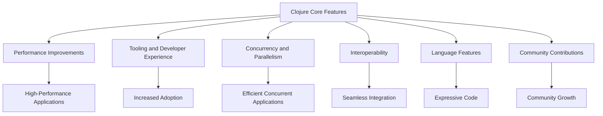

## 20.12. Exploring Clojure's Future Features

As we delve into the future of Clojure, it's essential to understand the trajectory of this powerful language and how upcoming features will shape the development landscape. Clojure, known for its functional programming paradigm, immutable data structures, and robust concurrency models, continues to evolve, offering developers new tools and capabilities. In this section, we will explore the planned features and enhancements for future releases of Clojure, as outlined in the [Clojure development roadmap](https://clojure.org/dev/roadmap). We will also speculate on the potential impact of these features on developers and encourage participation in the vibrant Clojure community.

### Understanding the Clojure Development Roadmap

The Clojure development roadmap provides insights into the language's future direction. It outlines the core team's priorities and the features they aim to introduce or enhance. The roadmap is a living document, reflecting the community's needs and the evolving software development landscape. Let's explore some of the key areas of focus for Clojure's future:

1. **Performance Improvements**: Clojure's performance has always been a priority, and future releases aim to optimize execution speed and memory usage. Enhancements in this area will make Clojure even more suitable for high-performance applications.

2. **Tooling and Developer Experience**: Improving the developer experience is crucial for Clojure's adoption. Future updates will focus on enhancing tooling, including better integration with IDEs, improved error messages, and more robust debugging capabilities.

3. **Concurrency and Parallelism**: Clojure's concurrency model is one of its standout features. Future enhancements will aim to make concurrent programming more intuitive and efficient, potentially introducing new abstractions or improving existing ones.

4. **Interoperability**: As a language that runs on the JVM, Clojure's interoperability with Java is a significant advantage. Future updates may enhance this interoperability, making it easier to integrate Clojure with other JVM languages and libraries.

5. **Language Features**: The core language itself will see enhancements, potentially introducing new syntax or constructs that simplify common programming tasks or enable new paradigms.

6. **Community Contributions**: The Clojure community plays a vital role in the language's evolution. Encouraging contributions and feedback will continue to be a priority, ensuring that Clojure remains responsive to its users' needs.

### Speculating on the Impact of Future Features

As we look forward to these enhancements, it's worth considering how they might impact developers and the broader software development ecosystem. Here are some potential implications:

- **Enhanced Performance**: Performance improvements will make Clojure more competitive with other high-performance languages, potentially expanding its use in domains like data processing, machine learning, and real-time systems.

- **Improved Developer Experience**: Better tooling and a more intuitive development environment will lower the barrier to entry for new developers, fostering greater adoption and community growth.

- **Simplified Concurrency**: Enhancements in concurrency and parallelism will make it easier for developers to write efficient, concurrent applications, reducing the complexity and potential for errors.

- **Seamless Interoperability**: Improved interoperability will enable developers to leverage the vast ecosystem of Java libraries more effectively, making Clojure a more attractive choice for enterprise applications.

- **Innovative Language Features**: New language features will empower developers to write more expressive and concise code, potentially introducing new programming paradigms or patterns.

### Encouraging Community Participation

The Clojure community is a vibrant and essential part of the language's ecosystem. As Clojure evolves, community participation will be crucial in shaping its future. Here are some ways you can get involved:

- **Contribute to Open Source**: Contributing to Clojure's open-source projects is a great way to give back to the community and help shape the language's future. Whether you're fixing bugs, adding features, or improving documentation, your contributions are valuable.

- **Participate in Discussions**: Engaging in community discussions, whether on forums, mailing lists, or social media, helps share knowledge and gather feedback on proposed features or changes.

- **Attend Conferences and Meetups**: Participating in Clojure conferences and meetups is an excellent way to connect with other developers, learn about the latest developments, and share your experiences.

- **Provide Feedback**: Providing feedback on new features or proposed changes helps ensure that Clojure continues to meet the needs of its users. Your insights can influence the direction of future releases.

### Code Examples and Diagrams

To illustrate the potential impact of future Clojure features, let's explore some hypothetical code examples and diagrams that demonstrate how these enhancements might be used in practice.

#### Example 1: Enhanced Concurrency with New Abstractions

Imagine a future version of Clojure introduces a new concurrency abstraction that simplifies managing state across multiple threads. Here's a hypothetical example:

```clojure
;; Hypothetical new concurrency abstraction
(defn process-data-concurrently [data]
  (let [state (new-concurrency-abstraction data)]
    (concurrent-process state)))

;; Simulate concurrent processing
(defn concurrent-process [state]
  ;; Process data concurrently
  (println "Processing data concurrently:" state))

;; Example usage
(process-data-concurrently [1 2 3 4 5])
```

In this example, the `new-concurrency-abstraction` is a fictional construct that simplifies concurrent data processing. While this specific feature doesn't exist yet, it illustrates how future enhancements could make concurrency more accessible.

#### Example 2: Improved Interoperability with Java

Future improvements in interoperability might make it easier to call Java methods from Clojure. Here's a hypothetical example:

```clojure
;; Hypothetical improved Java interoperability
(import 'java.util.ArrayList)

(defn create-java-list [elements]
  (let [list (new ArrayList)]
    (doseq [el elements]
      (.add list el))
    list))

;; Example usage
(def my-list (create-java-list [1 2 3 4 5]))
(println "Java List:" my-list)
```

This example demonstrates how improved interoperability could streamline the process of working with Java objects in Clojure, making it more intuitive and efficient.

#### Diagram: Visualizing Future Clojure Enhancements

To better understand the potential impact of these features, let's visualize the relationship between Clojure's core features and the planned enhancements.



This diagram illustrates how the core features of Clojure connect to the planned enhancements and their potential impact on the development landscape.

### Knowledge Check and Exercises

To reinforce your understanding of Clojure's future features, consider the following questions and exercises:

1. **What are some key areas of focus for Clojure's future development?**
2. **How might performance improvements impact the use of Clojure in high-performance applications?**
3. **What role does the community play in shaping Clojure's future?**
4. **How can you contribute to the Clojure community and its development?**
5. **Speculate on a new language feature that could be introduced in future Clojure releases. How might it benefit developers?**

### Embrace the Journey

As we explore the future of Clojure, remember that this is just the beginning. The language's evolution is driven by the needs of its users and the contributions of its community. By staying engaged and participating in the development process, you can help shape the future of Clojure and ensure it continues to be a powerful tool for building robust, efficient, and elegant software. Keep experimenting, stay curious, and enjoy the journey!

## **Ready to Test Your Knowledge?**



### What is one of the key areas of focus for Clojure's future development?

- [x] Performance Improvements
- [ ] Decreasing Language Complexity
- [ ] Removing Immutable Data Structures
- [ ] Eliminating Java Interoperability

> **Explanation:** Performance improvements are a key focus area for future Clojure development, as outlined in the Clojure development roadmap.

### How might improved tooling and developer experience impact Clojure adoption?

- [x] Lower the barrier to entry for new developers
- [ ] Increase language complexity
- [ ] Make Clojure less competitive
- [ ] Reduce community engagement

> **Explanation:** Improved tooling and developer experience can lower the barrier to entry for new developers, fostering greater adoption and community growth.

### What is a potential benefit of enhanced concurrency features in Clojure?

- [x] Simplified concurrent programming
- [ ] Increased language verbosity
- [ ] Reduced performance
- [ ] Less intuitive syntax

> **Explanation:** Enhanced concurrency features can simplify concurrent programming, making it easier for developers to write efficient, concurrent applications.

### How can improved interoperability with Java benefit Clojure developers?

- [x] Enable seamless integration with Java libraries
- [ ] Make Clojure less compatible with other languages
- [ ] Increase the complexity of Java interop
- [ ] Limit the use of Clojure in enterprise applications

> **Explanation:** Improved interoperability with Java can enable seamless integration with Java libraries, making Clojure a more attractive choice for enterprise applications.

### What role does the community play in Clojure's development?

- [x] Providing feedback and contributing to open-source projects
- [ ] Dictating all language changes
- [ ] Limiting the scope of language features
- [ ] Reducing the language's popularity

> **Explanation:** The community plays a vital role in Clojure's development by providing feedback and contributing to open-source projects, helping shape the language's future.

### How can you contribute to the Clojure community?

- [x] Participate in discussions and provide feedback
- [ ] Avoid engaging with other developers
- [ ] Discourage new developers from joining
- [ ] Limit contributions to documentation only

> **Explanation:** You can contribute to the Clojure community by participating in discussions, providing feedback, and contributing to open-source projects.

### What is a potential impact of new language features in Clojure?

- [x] Empower developers to write more expressive code
- [ ] Increase language verbosity
- [ ] Reduce the language's flexibility
- [ ] Limit the use of functional programming

> **Explanation:** New language features can empower developers to write more expressive and concise code, potentially introducing new programming paradigms or patterns.

### How might performance improvements affect Clojure's use in high-performance applications?

- [x] Make Clojure more competitive with other high-performance languages
- [ ] Decrease Clojure's suitability for high-performance applications
- [ ] Increase memory usage
- [ ] Reduce execution speed

> **Explanation:** Performance improvements can make Clojure more competitive with other high-performance languages, potentially expanding its use in domains like data processing and machine learning.

### What is the benefit of participating in Clojure conferences and meetups?

- [x] Connect with other developers and learn about the latest developments
- [ ] Limit exposure to new ideas
- [ ] Decrease community engagement
- [ ] Reduce opportunities for collaboration

> **Explanation:** Participating in Clojure conferences and meetups allows you to connect with other developers, learn about the latest developments, and share your experiences.

### True or False: The Clojure development roadmap is a static document that does not change.

- [ ] True
- [x] False

> **Explanation:** The Clojure development roadmap is a living document that reflects the community's needs and the evolving software development landscape.


