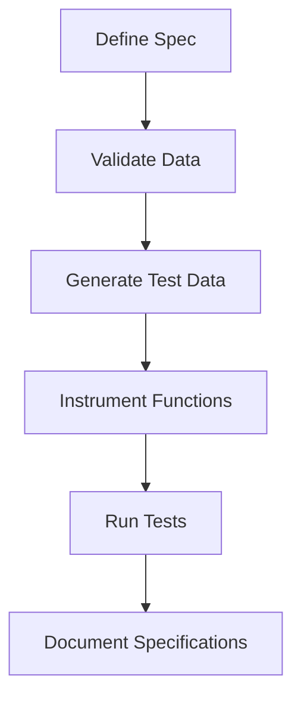

## 20.13. Formal Verification and Spec

### Introduction to Formal Verification

Formal verification is a process used in software engineering to prove or disprove the correctness of intended algorithms underlying a system with respect to a certain formal specification or property. This involves using mathematical methods to ensure that a program behaves as expected. In the context of Clojure, formal verification can be achieved through the use of **Clojure Spec**, a powerful library that allows developers to describe the structure of data and functions, validate data, and generate test data.

### Understanding Clojure Spec

Clojure Spec is a library for describing the structure of data and functions. It provides a way to specify the shape of data, validate it, and generate test data. Spec is not just a type system; it is a tool for describing the semantics of your data and functions in a way that is both human-readable and machine-checkable.

#### Key Features of Clojure Spec

- **Data Specification**: Define the shape and constraints of data structures.
- **Function Specification**: Describe the input and output of functions.
- **Validation**: Check if data conforms to a specification.
- **Instrumentation**: Automatically check function calls against their specifications.
- **Test Data Generation**: Generate data that conforms to a specification for testing purposes.

### Defining Specs

To define a spec, you use the `s/def` function, which associates a spec with a keyword. This keyword can then be used to validate data, generate test data, and more.

```clojure
(require '[clojure.spec.alpha :as s])

;; Define a spec for a simple integer
(s/def ::age int?)

;; Define a spec for a map with specific keys
(s/def ::person (s/keys :req [::name ::age]))

;; Example usage
(def person {:name "Alice" :age 30})

;; Validate the data
(s/valid? ::person person) ; => true
```

### Using Specs for Validation

Validation is one of the core functionalities of Clojure Spec. It allows you to check if a piece of data conforms to a given spec. This is particularly useful for ensuring that data passed to functions is correct.

```clojure
;; Define a spec for a positive integer
(s/def ::positive-int (s/and int? pos?))

;; Validate data
(s/valid? ::positive-int 42) ; => true
(s/valid? ::positive-int -1) ; => false

;; Explain why validation failed
(s/explain ::positive-int -1)
```

### Instrumentation with Spec

Instrumentation is a powerful feature of Clojure Spec that allows you to automatically check function calls against their specifications. This is done by wrapping the function with a check that validates the input and output.

```clojure
(require '[clojure.spec.test.alpha :as stest])

;; Define a function with a spec
(s/fdef add
  :args (s/cat :x int? :y int?)
  :ret int?)

(defn add [x y]
  (+ x y))

;; Instrument the function
(stest/instrument `add)

;; Call the function with invalid arguments
(add "a" 2) ; Throws an error due to spec violation
```

### Generating Test Data

Clojure Spec can also be used to generate test data that conforms to a specification. This is useful for property-based testing, where you want to test your functions with a wide range of inputs.

```clojure
(require '[clojure.spec.gen.alpha :as gen])

;; Generate a sample of valid data
(gen/sample (s/gen ::positive-int) 5)
```

### Spec and Documentation

Spec can also be used to generate documentation for your code. By defining specs for your data and functions, you create a form of executable documentation that describes how your code is supposed to work.

### Visualizing Spec Workflows

To better understand how Clojure Spec integrates into the development workflow, let's visualize the process using a flowchart.



**Caption**: This diagram illustrates the workflow of using Clojure Spec, from defining specifications to validating data, generating test data, instrumenting functions, running tests, and documenting specifications.

### Best Practices for Using Spec

- **Start Small**: Begin by defining specs for critical parts of your application.
- **Iterate**: Continuously refine your specs as your understanding of the data and functions evolves.
- **Use Specs for Testing**: Leverage the test data generation capabilities of Spec to enhance your testing strategy.
- **Document with Specs**: Use specs as a form of documentation to communicate the expected structure of data and functions.

### Common Pitfalls and How to Avoid Them

- **Over-Specification**: Avoid the temptation to over-specify your data and functions. Keep specs simple and focused on the most important constraints.
- **Ignoring Performance**: Be mindful of the performance implications of using Spec, especially in performance-critical parts of your application.
- **Neglecting Spec Evolution**: As your application evolves, ensure that your specs evolve with it. Regularly review and update your specs to reflect changes in your codebase.

### Clojure Spec in Practice

Let's explore a practical example of using Clojure Spec in a real-world scenario. Suppose we are building a simple user registration system. We want to ensure that the data we receive from users is valid before processing it.

```clojure
;; Define specs for user data
(s/def ::username (s/and string? #(> (count %) 3)))
(s/def ::password (s/and string? #(> (count %) 8)))
(s/def ::email (s/and string? #(re-matches #".+@.+\..+" %)))

(s/def ::user (s/keys :req [::username ::password ::email]))

;; Function to register a user
(s/fdef register-user
  :args (s/cat :user ::user)
  :ret boolean?)

(defn register-user [user]
  (if (s/valid? ::user user)
    (do
      ;; Process registration
      true)
    false))

;; Example usage
(register-user {:username "john_doe" :password "securepassword" :email "john@example.com"})
```

### Try It Yourself

Experiment with the code examples provided. Try modifying the specs to add additional constraints or change the validation logic. Observe how these changes affect the behavior of the validation and instrumentation processes.

### References and Further Reading

- [Clojure Spec Guide](https://clojure.org/guides/spec)
- [Clojure Spec API Documentation](https://clojure.github.io/spec.alpha/)
- [Property-Based Testing with Clojure Spec](https://clojure.org/guides/spec#_property_based_testing)

### Knowledge Check

To reinforce your understanding of Clojure Spec and formal verification, try answering the following questions.

## **Ready to Test Your Knowledge?**



### What is the primary purpose of Clojure Spec?

- [x] To describe the structure of data and functions
- [ ] To replace the type system
- [ ] To improve performance
- [ ] To generate UI components

> **Explanation:** Clojure Spec is designed to describe the structure of data and functions, providing a way to validate and generate data.

### How can you define a spec for a positive integer in Clojure Spec?

- [x] `(s/def ::positive-int (s/and int? pos?))`
- [ ] `(s/def ::positive-int (s/or int? pos?))`
- [ ] `(s/def ::positive-int (s/not int? pos?))`
- [ ] `(s/def ::positive-int (s/and pos?))`

> **Explanation:** The correct way to define a spec for a positive integer is by using `(s/and int? pos?)`, which ensures the value is both an integer and positive.

### What does the `s/valid?` function do?

- [x] Checks if data conforms to a spec
- [ ] Generates test data
- [ ] Instruments functions
- [ ] Documents specifications

> **Explanation:** The `s/valid?` function checks if a piece of data conforms to a given spec.

### Which feature of Clojure Spec allows automatic checking of function calls?

- [x] Instrumentation
- [ ] Validation
- [ ] Data Generation
- [ ] Documentation

> **Explanation:** Instrumentation allows automatic checking of function calls against their specifications.

### What is a common pitfall when using Clojure Spec?

- [x] Over-specification
- [ ] Under-specification
- [ ] Ignoring documentation
- [ ] Using too many specs

> **Explanation:** Over-specification can lead to overly complex and rigid specs that are difficult to maintain.

### How can Clojure Spec aid in testing?

- [x] By generating test data that conforms to specifications
- [ ] By replacing unit tests
- [ ] By improving code performance
- [ ] By reducing code complexity

> **Explanation:** Clojure Spec aids in testing by generating test data that conforms to specifications, which is useful for property-based testing.

### What is the benefit of using specs as documentation?

- [x] They provide executable documentation
- [ ] They replace all comments
- [ ] They improve code readability
- [ ] They reduce the need for tests

> **Explanation:** Specs serve as executable documentation, describing the expected structure and behavior of data and functions.

### How can you generate test data using Clojure Spec?

- [x] Using the `s/gen` function
- [ ] Using the `s/def` function
- [ ] Using the `s/valid?` function
- [ ] Using the `s/fdef` function

> **Explanation:** The `s/gen` function is used to generate test data that conforms to a specification.

### True or False: Clojure Spec can be used for both data and function specifications.

- [x] True
- [ ] False

> **Explanation:** Clojure Spec is designed to specify both data structures and functions, allowing for comprehensive validation and testing.

### What is the role of `s/explain` in Clojure Spec?

- [x] To provide detailed explanations of why validation failed
- [ ] To generate test data
- [ ] To instrument functions
- [ ] To document specifications

> **Explanation:** The `s/explain` function provides detailed explanations of why a piece of data does not conform to a spec.



Remember, mastering Clojure Spec is a journey. As you continue to explore its capabilities, you'll find new ways to ensure the correctness and reliability of your code. Keep experimenting, stay curious, and enjoy the process of building robust applications with Clojure!
