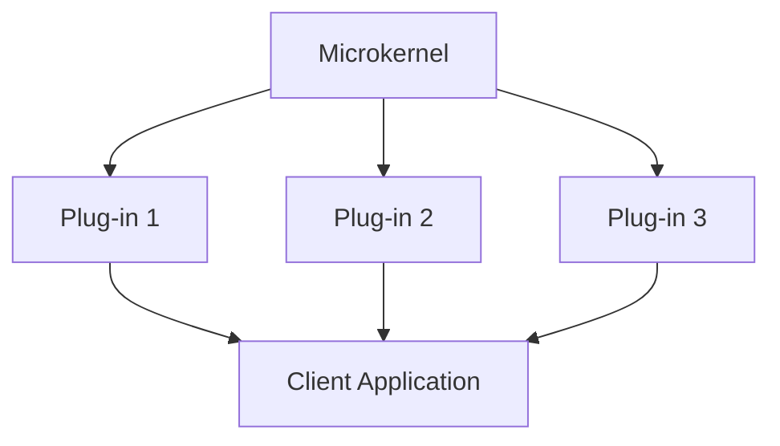

## 20.14. Microkernel Architecture Pattern

### Introduction

The microkernel architecture pattern is a software design pattern that structures an application into a core system (the microkernel) and a set of plug-in modules. This pattern is particularly useful for applications that require flexibility and extensibility, allowing new features to be added with minimal impact on the core system. In this section, we will explore how the microkernel architecture can be effectively implemented in Clojure, leveraging its inherent modularity and functional programming paradigms.

### Understanding the Microkernel Architecture

#### Definition

The microkernel architecture, also known as the plug-in architecture, is designed to separate minimal core functionality from extended features. The core system, or microkernel, provides the essential services required by the application, while additional features are implemented as plug-ins that interact with the core.

#### Components of Microkernel Architecture

1. **Microkernel**: The core component that provides essential services such as resource management, communication, and basic operations.
2. **Plug-ins**: Independent modules that extend the functionality of the microkernel. They can be added, removed, or updated without affecting the core system.
3. **Adapters**: Interfaces that allow plug-ins to communicate with the microkernel and with each other.
4. **Client Applications**: End-user applications that utilize the services provided by the microkernel and plug-ins.

### Clojure's Modularity and the Microkernel Pattern

Clojure's design is inherently modular, making it an excellent choice for implementing the microkernel architecture. The language's support for namespaces, dynamic typing, and functional programming paradigms facilitates the creation of independent modules that can be easily integrated into a larger system.

#### Key Features Supporting Modularity

- **Namespaces**: Clojure's namespaces allow for the logical grouping of related functions and data, promoting separation of concerns and reducing coupling between components.
- **Dynamic Typing**: This feature enables the creation of flexible interfaces between the microkernel and plug-ins, allowing for easy integration and extension.
- **Functional Programming**: Clojure's emphasis on immutability and pure functions ensures that plug-ins can be developed independently without side effects, enhancing reliability and maintainability.

### Implementing a Microkernel System in Clojure

Let's explore how to implement a microkernel system in Clojure with a practical example. We will create a simple application that manages tasks, with the core system handling basic task operations and plug-ins providing additional features like notifications and reporting.

#### Step 1: Define the Microkernel

The microkernel will handle basic task operations such as adding, removing, and listing tasks.

```clojure
(ns task-manager.core)

(def tasks (atom []))

(defn add-task [task]
  (swap! tasks conj task)
  (println "Task added:" task))

(defn remove-task [task]
  (swap! tasks #(remove #{task} %))
  (println "Task removed:" task))

(defn list-tasks []
  (println "Current tasks:" @tasks))
```

#### Step 2: Create Plug-ins

Plug-ins will extend the functionality of the task manager. Let's create a notification plug-in that sends a message when a task is added.

```clojure
(ns task-manager.plugins.notifications
  (:require [task-manager.core :as core]))

(defn notify [message]
  (println "Notification:" message))

(defn add-task-with-notification [task]
  (core/add-task task)
  (notify (str "New task added: " task)))
```

#### Step 3: Use Adapters for Integration

Adapters will allow the plug-ins to interact with the microkernel. In this case, the notification plug-in directly calls the core functions.

#### Step 4: Develop Client Applications

Client applications can use the core system and plug-ins to perform operations. Here's a simple example:

```clojure
(ns task-manager.client
  (:require [task-manager.plugins.notifications :as notifications]))

(defn run []
  (notifications/add-task-with-notification "Write Clojure Guide")
  (notifications/add-task-with-notification "Review Code")
  (notifications/add-task-with-notification "Deploy Application"))
```

### Advantages of the Microkernel Architecture

1. **Flexibility**: New features can be added as plug-ins without modifying the core system.
2. **Scalability**: The system can grow by adding more plug-ins, allowing it to handle increased workloads.
3. **Maintainability**: The separation of core functionality and plug-ins simplifies maintenance and reduces the risk of introducing bugs.
4. **Reusability**: Plug-ins can be reused across different applications, promoting code reuse and reducing development time.

### Scenarios for Using the Microkernel Pattern

- **Applications with Frequent Updates**: Systems that require frequent updates or new features can benefit from the microkernel architecture, as it allows for easy integration of new plug-ins.
- **Modular Systems**: Applications that need to support a wide range of features or configurations can use the microkernel pattern to manage different plug-ins.
- **Extensible Platforms**: Platforms that provide a base set of features and allow third-party developers to add custom functionality are ideal candidates for the microkernel architecture.

### Visualizing the Microkernel Architecture

Below is a diagram illustrating the microkernel architecture pattern, showing the interaction between the microkernel, plug-ins, and client applications.



**Diagram Description**: This diagram shows the microkernel at the center, with multiple plug-ins extending its functionality. Client applications interact with both the microkernel and the plug-ins.

### Clojure Unique Features

Clojure's unique features, such as its emphasis on immutability and functional programming, make it particularly well-suited for implementing the microkernel architecture. The language's support for dynamic typing and namespaces allows for the creation of flexible and modular systems, while its concurrency primitives enable efficient handling of parallel tasks.

### Differences and Similarities with Other Patterns

The microkernel architecture shares similarities with the plugin pattern, as both involve extending core functionality with additional modules. However, the microkernel pattern emphasizes a clear separation between the core system and plug-ins, whereas the plugin pattern may not enforce such strict boundaries.

### Design Considerations

When implementing the microkernel architecture, consider the following:

- **Define Clear Interfaces**: Ensure that the interfaces between the microkernel and plug-ins are well-defined to facilitate integration and extension.
- **Manage Dependencies**: Keep dependencies between plug-ins minimal to reduce coupling and enhance flexibility.
- **Ensure Compatibility**: Test plug-ins thoroughly to ensure they are compatible with the microkernel and do not introduce conflicts.

### Try It Yourself

To experiment with the microkernel architecture in Clojure, try modifying the task manager example:

- Add a new plug-in for reporting tasks.
- Implement a plug-in that categorizes tasks based on priority.
- Create a client application that uses multiple plug-ins to perform complex operations.

### References and Further Reading

- [Microkernel Architecture on Wikipedia](https://en.wikipedia.org/wiki/Microkernel)
- [Clojure Official Documentation](https://clojure.org/)
- [Functional Programming in Clojure](https://www.braveclojure.com/)

### Knowledge Check

To reinforce your understanding of the microkernel architecture pattern in Clojure, try answering the following questions.

## **Ready to Test Your Knowledge?**



### What is the primary role of the microkernel in the microkernel architecture pattern?

- [x] To provide essential services and manage communication between plug-ins
- [ ] To implement all application features
- [ ] To serve as a user interface
- [ ] To handle database operations

> **Explanation:** The microkernel provides essential services and manages communication between plug-ins, allowing for flexibility and extensibility.

### Which Clojure feature supports modularity in the microkernel architecture?

- [x] Namespaces
- [ ] Macros
- [ ] Atoms
- [ ] Refs

> **Explanation:** Namespaces in Clojure allow for logical grouping of related functions and data, promoting modularity and separation of concerns.

### How do plug-ins interact with the microkernel in Clojure?

- [x] Through well-defined interfaces or adapters
- [ ] By directly modifying the microkernel
- [ ] By using global variables
- [ ] By accessing the database

> **Explanation:** Plug-ins interact with the microkernel through well-defined interfaces or adapters, ensuring loose coupling and flexibility.

### What is a key advantage of using the microkernel architecture?

- [x] Flexibility and extensibility
- [ ] Increased complexity
- [ ] Reduced performance
- [ ] Limited scalability

> **Explanation:** The microkernel architecture provides flexibility and extensibility, allowing new features to be added as plug-ins without modifying the core system.

### In which scenario is the microkernel architecture particularly beneficial?

- [x] Applications with frequent updates
- [ ] Static websites
- [ ] Simple command-line tools
- [ ] Single-purpose scripts

> **Explanation:** The microkernel architecture is beneficial for applications with frequent updates, as it allows for easy integration of new plug-ins.

### What is the purpose of adapters in the microkernel architecture?

- [x] To facilitate communication between plug-ins and the microkernel
- [ ] To store data
- [ ] To render user interfaces
- [ ] To encrypt data

> **Explanation:** Adapters facilitate communication between plug-ins and the microkernel, ensuring compatibility and integration.

### How does Clojure's functional programming paradigm support the microkernel architecture?

- [x] By promoting immutability and pure functions
- [ ] By enforcing strict typing
- [ ] By using object-oriented principles
- [ ] By relying on global state

> **Explanation:** Clojure's functional programming paradigm promotes immutability and pure functions, enhancing reliability and maintainability in the microkernel architecture.

### What should be considered when designing interfaces between the microkernel and plug-ins?

- [x] Clear and well-defined interfaces
- [ ] Complex and tightly coupled interfaces
- [ ] Interfaces that rely on global variables
- [ ] Interfaces that are hidden from developers

> **Explanation:** Clear and well-defined interfaces between the microkernel and plug-ins facilitate integration and extension, reducing coupling.

### Which of the following is a potential pitfall when implementing the microkernel architecture?

- [x] Overcomplicating the system with unnecessary plug-ins
- [ ] Using too few plug-ins
- [ ] Simplifying the core system
- [ ] Reducing modularity

> **Explanation:** Overcomplicating the system with unnecessary plug-ins can lead to increased complexity and maintenance challenges.

### True or False: The microkernel architecture is similar to the plugin pattern but emphasizes a clear separation between the core system and plug-ins.

- [x] True
- [ ] False

> **Explanation:** True. The microkernel architecture emphasizes a clear separation between the core system and plug-ins, unlike the plugin pattern, which may not enforce such strict boundaries.



### Embrace the Journey

Remember, this is just the beginning. As you delve deeper into the microkernel architecture pattern, you'll discover new ways to build flexible and extensible systems in Clojure. Keep experimenting, stay curious, and enjoy the journey!
