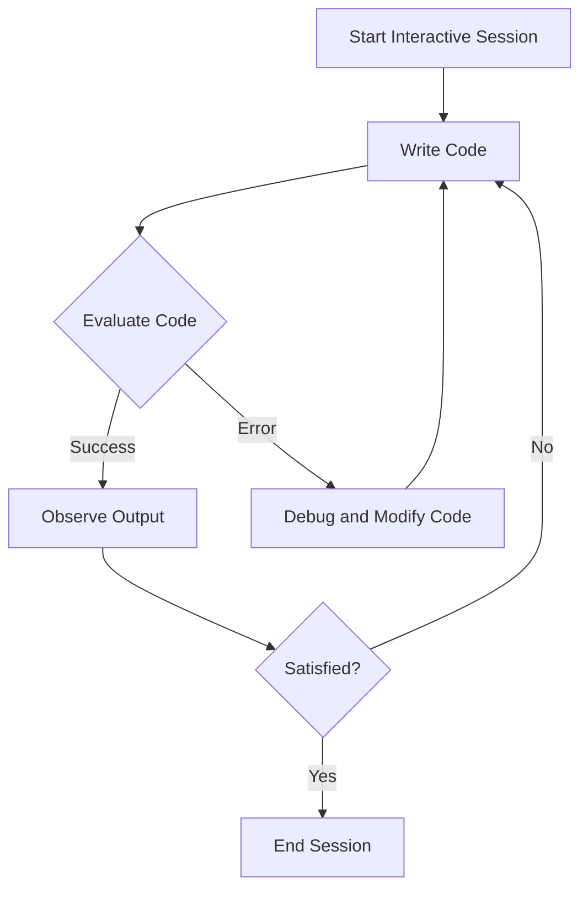

## 20.15. Interactive Programming and Live Coding

Interactive programming and live coding represent a paradigm shift in software development, emphasizing real-time feedback and creativity. In this section, we will explore how Clojure, with its powerful REPL (Read-Eval-Print Loop), facilitates interactive programming and live coding. We'll delve into tools like [Overtone](http://overtone.github.io/) for music and [Quil](https://github.com/quil/quil) for visuals, showcasing how these tools can be used for rapid development and creative coding.

### Understanding Interactive Programming and Live Coding

Interactive programming is a development approach where code is written and executed in small increments, allowing developers to see the results immediately. This real-time feedback loop enhances the ability to experiment, debug, and refine code quickly.

Live coding takes this concept further by incorporating performance elements, often used in creative fields like music and visual arts. In live coding, the programmer becomes a performer, writing code that generates music or visuals in real-time.

#### Key Concepts

- **Immediate Feedback**: Code changes are reflected instantly, allowing for rapid iteration.
- **Exploratory Programming**: Developers can experiment with different approaches and solutions without the overhead of a traditional compile-run-debug cycle.
- **Creative Expression**: Live coding is often used in artistic performances, where code is written live to create music or visuals.

### The Role of Clojure's REPL

Clojure's REPL is a powerful tool for interactive programming. It allows developers to evaluate expressions, test functions, and modify code on the fly. The REPL is central to Clojure's interactive development experience, enabling a seamless workflow for both exploratory programming and live coding.

#### Benefits of Using the REPL

- **Rapid Prototyping**: Quickly test ideas and iterate on solutions.
- **Debugging**: Identify and fix issues in real-time.
- **Learning and Experimentation**: Explore Clojure's features and libraries interactively.

### Tools for Live Coding in Clojure

Clojure's ecosystem includes several tools that enhance its capabilities for live coding, particularly in music and visual arts.

#### Overtone: Live Coding Music

[Overtone](http://overtone.github.io/) is a Clojure library for creating music. It provides an expressive platform for live coding music, leveraging the SuperCollider audio synthesis engine.

- **Expressive Sound Design**: Create complex soundscapes and compositions.
- **Real-Time Performance**: Modify music live during performances.
- **Community and Collaboration**: Engage with a community of artists and developers.

##### Example: Creating a Simple Synth in Overtone

```clojure
(ns live-coding-example
  (:use [overtone.live]))

(definst simple-synth [freq 440]
  (saw freq))

;; Play the synth at 440 Hz
(simple-synth)

;; Change the frequency to 880 Hz
(simple-synth 880)
```

In this example, we define a simple synthesizer using a saw wave. We can play the synth at different frequencies and modify it in real-time.

#### Quil: Live Coding Visuals

[Quil](https://github.com/quil/quil) is a Clojure library for creating interactive graphics. It is built on top of Processing, a popular framework for visual arts.

- **Interactive Graphics**: Create dynamic and interactive visualizations.
- **Real-Time Updates**: Modify visuals live during performances.
- **Integration with Clojure**: Leverage Clojure's functional programming features.

##### Example: Creating a Simple Animation in Quil

```clojure
(ns live-coding-visuals
  (:require [quil.core :as q]))

(defn setup []
  (q/frame-rate 30)
  (q/color-mode :hsb))

(defn draw []
  (q/background 240)
  (q/fill (q/random 255) 255 255)
  (q/ellipse (q/random (q/width)) (q/random (q/height)) 50 50))

(q/defsketch example
  :title "Live Coding Visuals"
  :setup setup
  :draw draw
  :size [500 500])
```

In this example, we create a simple animation that draws random colored circles on the screen. The visuals can be modified in real-time, allowing for dynamic performances.

### Benefits of Interactive Programming and Live Coding

Interactive programming and live coding offer several benefits, particularly in exploratory programming and debugging.

#### Exploratory Programming

- **Experimentation**: Try different approaches and solutions without the overhead of a traditional development cycle.
- **Discovery**: Uncover new insights and ideas through experimentation.
- **Flexibility**: Adapt and change code quickly in response to new information or requirements.

#### Debugging

- **Immediate Feedback**: Identify and fix issues in real-time.
- **Incremental Development**: Test small pieces of code independently, reducing the risk of introducing errors.
- **Enhanced Understanding**: Gain a deeper understanding of code behavior through interactive exploration.

### Visualizing Interactive Programming and Live Coding

To better understand the workflow of interactive programming and live coding, let's visualize the process using a flowchart.



**Figure 1**: This flowchart illustrates the iterative process of interactive programming and live coding, emphasizing the real-time feedback loop.

### Try It Yourself

To fully appreciate the power of interactive programming and live coding, try experimenting with the examples provided. Modify the code, change parameters, and observe the effects in real-time. Here are some suggestions:

- **Overtone**: Experiment with different waveforms and effects to create unique sounds.
- **Quil**: Modify the shapes, colors, and animations to create dynamic visuals.

### References and Further Reading

- [Overtone GitHub Repository](http://overtone.github.io/)
- [Quil GitHub Repository](https://github.com/quil/quil)
- [Clojure REPL Documentation](https://clojure.org/reference/repl_and_main)

### Knowledge Check

To reinforce your understanding of interactive programming and live coding, consider the following questions and challenges:

- What are the key benefits of using the REPL for interactive programming?
- How does live coding differ from traditional programming approaches?
- Experiment with creating a new sound or visual using Overtone or Quil.

### Embrace the Journey

Interactive programming and live coding open up new possibilities for creativity and exploration. Remember, this is just the beginning. As you progress, you'll discover more ways to leverage these techniques in your projects. Keep experimenting, stay curious, and enjoy the journey!

## **Ready to Test Your Knowledge?**



### What is a key benefit of interactive programming?

- [x] Immediate feedback
- [ ] Longer development cycles
- [ ] Increased complexity
- [ ] Reduced flexibility

> **Explanation:** Interactive programming provides immediate feedback, allowing developers to see the results of their code changes instantly.

### Which tool is used for live coding music in Clojure?

- [x] Overtone
- [ ] Quil
- [ ] Processing
- [ ] SuperCollider

> **Explanation:** Overtone is a Clojure library used for live coding music, leveraging the SuperCollider audio synthesis engine.

### What is the primary purpose of Quil in Clojure?

- [x] Creating interactive graphics
- [ ] Managing databases
- [ ] Building web applications
- [ ] Performing data analysis

> **Explanation:** Quil is a Clojure library for creating interactive graphics, built on top of Processing.

### How does live coding differ from traditional programming?

- [x] It involves real-time code execution and modification.
- [ ] It requires compiling code before execution.
- [ ] It is only used for backend development.
- [ ] It eliminates the need for debugging.

> **Explanation:** Live coding involves writing and modifying code in real-time, often used in creative fields like music and visual arts.

### What is the role of the REPL in Clojure?

- [x] Facilitating interactive programming
- [ ] Compiling code
- [ ] Managing dependencies
- [ ] Designing user interfaces

> **Explanation:** The REPL (Read-Eval-Print Loop) in Clojure facilitates interactive programming by allowing developers to evaluate expressions and see results immediately.

### Which of the following is a feature of interactive programming?

- [x] Exploratory programming
- [ ] Static analysis
- [ ] Batch processing
- [ ] Long compilation times

> **Explanation:** Interactive programming supports exploratory programming, allowing developers to experiment and iterate quickly.

### What is a common use case for live coding?

- [x] Creative performances
- [ ] Database management
- [ ] Network security
- [ ] File system operations

> **Explanation:** Live coding is commonly used in creative performances, such as music and visual arts.

### Which library is built on top of Processing for Clojure?

- [x] Quil
- [ ] Overtone
- [ ] Ring
- [ ] Compojure

> **Explanation:** Quil is a Clojure library for creating interactive graphics, built on top of Processing.

### What is a benefit of using Overtone for music?

- [x] Real-time performance
- [ ] Static sound design
- [ ] Limited sound options
- [ ] Complex setup

> **Explanation:** Overtone allows for real-time performance, enabling musicians to modify music live during performances.

### True or False: Interactive programming eliminates the need for debugging.

- [ ] True
- [x] False

> **Explanation:** While interactive programming provides immediate feedback, it does not eliminate the need for debugging. It allows developers to identify and fix issues in real-time.




