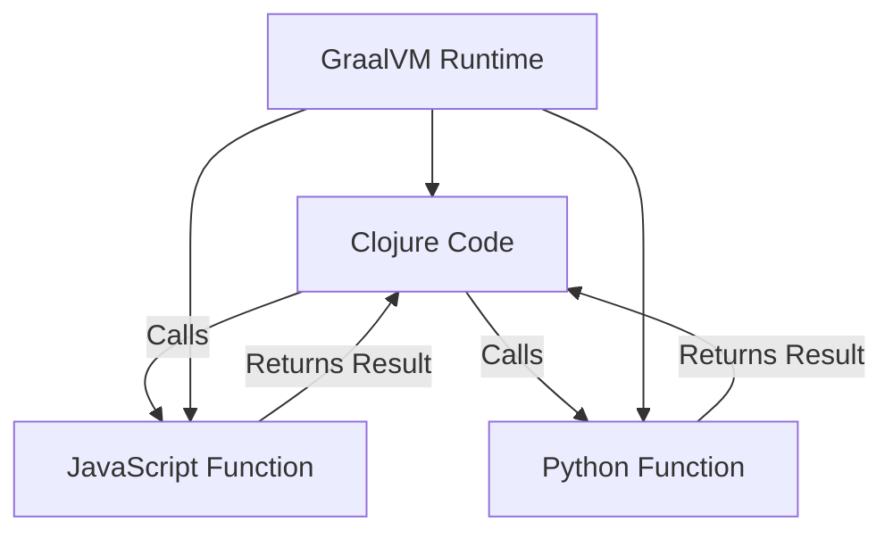

## 20.16. Polyglot Programming with GraalVM

### Introduction to GraalVM

GraalVM is a high-performance runtime that provides significant advantages for polyglot programming. It allows developers to run applications written in multiple languages, such as Java, JavaScript, Python, Ruby, and Clojure, within a single runtime environment. This capability enables seamless interoperability between languages, making it an ideal choice for projects that require the integration of diverse technologies.

GraalVM's polyglot capabilities are built on top of its ability to execute code from different languages in a shared runtime. This means that you can call functions and use libraries from one language in another without the overhead of separate processes or complex inter-process communication.

### Running Clojure Code on GraalVM

To run Clojure code on GraalVM, you need to ensure that your environment is set up correctly. GraalVM supports Clojure through its compatibility with the Java Virtual Machine (JVM). Here’s how you can get started:

1. **Install GraalVM**: Download and install GraalVM from the [official website](https://www.graalvm.org/). Ensure that you have the correct version for your operating system.

2. **Set Up Your Environment**: Configure your environment variables to use GraalVM as your default Java runtime. This typically involves setting the `JAVA_HOME` environment variable to point to the GraalVM installation directory.

3. **Install Clojure**: Use a build tool like Leiningen or Clojure CLI tools to manage your Clojure projects. These tools will work seamlessly with GraalVM.

4. **Run Your Clojure Code**: You can run Clojure code using the GraalVM `java` command. For example:
   ```bash
   graalvm/bin/java -cp clojure.jar clojure.main your_script.clj
   ```

### Calling Code Across Languages

One of the most powerful features of GraalVM is its ability to call code across different languages. This is particularly useful when you want to leverage libraries or functionality that are available in other languages but not in Clojure.

#### Example: Calling JavaScript from Clojure

Let's say you want to use a JavaScript library within your Clojure application. Here's how you can achieve this using GraalVM:

1. **Create a JavaScript File**: Write a simple JavaScript function and save it as `example.js`:
   ```javascript
   function greet(name) {
       return "Hello, " + name + "!";
   }
   ```

2. **Call JavaScript from Clojure**: Use GraalVM's polyglot API to call the JavaScript function from Clojure:
   ```clojure
   (ns polyglot-example.core
     (:import [org.graalvm.polyglot Context]))

   (defn call-js []
     (let [context (Context/create)]
       (.eval context "js" "function greet(name) { return 'Hello, ' + name + '!'; }")
       (let [result (.eval context "js" "greet('Clojure')")]
         (println result))))

   (call-js)
   ```

#### Example: Calling Python from Clojure

Similarly, you can call Python code from Clojure:

1. **Create a Python File**: Write a simple Python function and save it as `example.py`:
   ```python
   def add(a, b):
       return a + b
   ```

2. **Call Python from Clojure**: Use GraalVM's polyglot API to call the Python function from Clojure:
   ```clojure
   (ns polyglot-example.core
     (:import [org.graalvm.polyglot Context]))

   (defn call-python []
     (let [context (Context/create)]
       (.eval context "python" "def add(a, b): return a + b")
       (let [result (.eval context "python" "add(3, 4)")]
         (println result))))

   (call-python)
   ```

### Performance Implications and Use Cases

GraalVM offers several performance benefits, particularly when it comes to executing polyglot applications. By running multiple languages in a single runtime, GraalVM reduces the overhead associated with context switching and data serialization between different language runtimes.

#### Performance Considerations

- **JIT Compilation**: GraalVM uses Just-In-Time (JIT) compilation to optimize code execution, which can lead to significant performance improvements over traditional interpreted languages.
- **Ahead-Of-Time (AOT) Compilation**: GraalVM also supports AOT compilation, allowing you to compile your applications into native binaries. This can further enhance performance by reducing startup times and memory usage.
- **Interoperability Overhead**: While GraalVM minimizes the overhead of calling code across languages, there is still some performance cost associated with context switching. It's important to profile your application to understand where these costs occur.

#### Use Cases

- **Microservices**: GraalVM is ideal for microservices architectures where different services may be written in different languages. It allows for seamless integration and communication between services.
- **Data Science**: In data science, it's common to use libraries from multiple languages. GraalVM enables you to leverage the best tools from each language without the need for complex data pipelines.
- **Web Development**: GraalVM can be used to build web applications that require both server-side and client-side logic, allowing you to use the best language for each part of your application.

### Visualizing GraalVM's Polyglot Capabilities

To better understand how GraalVM enables polyglot programming, let's visualize the interaction between different languages using a diagram.



**Diagram Description**: This diagram illustrates how Clojure code can call functions written in JavaScript and Python using GraalVM. The GraalVM runtime facilitates the execution and communication between these languages, allowing for seamless interoperability.

### Knowledge Check

Before we conclude, let's reinforce our understanding with a few questions:

1. What is GraalVM, and what are its primary capabilities?
2. How does GraalVM enable polyglot programming?
3. What are some of the performance benefits of using GraalVM?
4. How can you call JavaScript code from Clojure using GraalVM?
5. What are some common use cases for GraalVM in software development?

### Embrace the Journey

Remember, polyglot programming with GraalVM opens up a world of possibilities for integrating diverse technologies. As you explore this powerful tool, keep experimenting and pushing the boundaries of what's possible. Stay curious, and enjoy the journey of discovering new ways to build robust and efficient applications.

### References and Links

- [GraalVM Official Website](https://www.graalvm.org/)
- [GraalVM Documentation](https://www.graalvm.org/docs/)
- [Clojure Documentation](https://clojure.org/)
- [JavaScript Documentation](https://developer.mozilla.org/en-US/docs/Web/JavaScript)
- [Python Documentation](https://docs.python.org/3/)

## **Ready to Test Your Knowledge?**



### What is GraalVM primarily used for?

- [x] Polyglot programming and running multiple languages in a single runtime
- [ ] Only for running Java applications
- [ ] Exclusively for web development
- [ ] For database management

> **Explanation:** GraalVM is designed for polyglot programming, allowing multiple languages to run in a single runtime environment.

### How can you run Clojure code using GraalVM?

- [x] By setting GraalVM as the default Java runtime and using Clojure build tools
- [ ] By converting Clojure code to JavaScript
- [ ] By using a Python interpreter
- [ ] By installing a special Clojure plugin for GraalVM

> **Explanation:** You can run Clojure code on GraalVM by configuring it as your Java runtime and using tools like Leiningen or Clojure CLI.

### What is a key benefit of GraalVM's JIT compilation?

- [x] Improved performance through optimized code execution
- [ ] Slower execution due to additional compilation steps
- [ ] Increased memory usage
- [ ] Limited language support

> **Explanation:** JIT compilation in GraalVM optimizes code execution, leading to better performance.

### Which languages can GraalVM support for polyglot programming?

- [x] Java, JavaScript, Python, Ruby, and Clojure
- [ ] Only Java and JavaScript
- [ ] C++ and C#
- [ ] HTML and CSS

> **Explanation:** GraalVM supports a wide range of languages, including Java, JavaScript, Python, Ruby, and Clojure.

### What is a common use case for GraalVM?

- [x] Microservices architecture with diverse language support
- [ ] Only for desktop applications
- [ ] For creating static websites
- [ ] For managing databases

> **Explanation:** GraalVM is ideal for microservices architectures where different services may be written in different languages.

### How does GraalVM handle interoperability between languages?

- [x] By using a shared runtime environment
- [ ] By converting all code to Java
- [ ] By using separate processes for each language
- [ ] By requiring manual data serialization

> **Explanation:** GraalVM uses a shared runtime to facilitate interoperability between languages.

### What is a potential performance cost of using GraalVM?

- [x] Context switching between languages
- [ ] Increased startup time
- [ ] Reduced memory usage
- [ ] Limited language support

> **Explanation:** While GraalVM minimizes overhead, context switching between languages can still incur some performance cost.

### How can you call a Python function from Clojure using GraalVM?

- [x] By using GraalVM's polyglot API
- [ ] By converting Python code to Clojure
- [ ] By using a JavaScript bridge
- [ ] By writing a custom interpreter

> **Explanation:** GraalVM's polyglot API allows you to call functions across languages, including Python from Clojure.

### What is AOT compilation in GraalVM?

- [x] Compiling applications into native binaries for better performance
- [ ] A method for interpreting code at runtime
- [ ] A technique for increasing memory usage
- [ ] A way to convert Java code to JavaScript

> **Explanation:** AOT compilation in GraalVM compiles applications into native binaries, enhancing performance.

### True or False: GraalVM can only run Java applications.

- [ ] True
- [x] False

> **Explanation:** GraalVM is designed for polyglot programming and can run applications written in multiple languages, not just Java.




