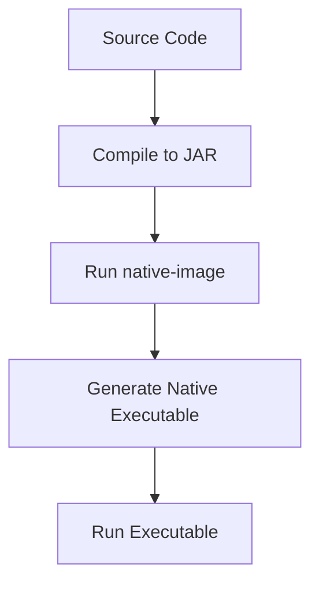

## 20.17. GraalVM and Native Image Compilation

### Introduction

GraalVM is a high-performance runtime that provides significant advantages for Clojure developers, particularly through its Native Image feature. By compiling Clojure applications into native executables, developers can achieve faster startup times and lower resource usage, which are crucial for cloud-native and microservices architectures. In this section, we will explore the benefits of native image compilation, walk through the process of compiling a Clojure application with GraalVM, discuss limitations, and provide troubleshooting tips and best practices.

### Benefits of Native Image Compilation

Native Image compilation offers several benefits that can enhance the performance and efficiency of Clojure applications:

1. **Faster Startup Times**: Native executables start almost instantaneously, which is beneficial for applications that need to scale quickly or are invoked frequently, such as serverless functions.

2. **Reduced Memory Footprint**: Native images consume less memory compared to JVM-based applications, making them ideal for environments with limited resources.

3. **Improved Performance**: Native executables can offer better runtime performance due to ahead-of-time (AOT) compilation, which optimizes code paths and reduces the overhead of just-in-time (JIT) compilation.

4. **Simplified Deployment**: Native images are standalone executables that do not require a JVM, simplifying deployment and reducing dependencies.

### Compiling a Clojure Application with GraalVM

Let's walk through the process of compiling a simple Clojure application into a native executable using GraalVM.

#### Step 1: Install GraalVM

First, download and install GraalVM from the [official website](https://www.graalvm.org/downloads/). Ensure that you have the `native-image` tool installed, which is part of the GraalVM distribution.

```bash
# Verify GraalVM installation
$ gu install native-image
```

#### Step 2: Create a Simple Clojure Application

Create a simple Clojure application that we will compile into a native image. For this example, we'll create a basic "Hello, World!" application.

```clojure
(ns hello-world.core)

(defn -main [& args]
  (println "Hello, World!"))
```

#### Step 3: Compile the Clojure Application

To compile the Clojure application, we need to first compile it into a JAR file. We can use Leiningen, a popular build tool for Clojure, to accomplish this.

```bash
# Create a new Leiningen project
$ lein new app hello-world

# Navigate to the project directory
$ cd hello-world

# Compile the project into a JAR
$ lein uberjar
```

#### Step 4: Generate the Native Image

With the JAR file ready, we can now use the `native-image` tool to compile it into a native executable.

```bash
# Generate the native image
$ native-image -jar target/uberjar/hello-world-0.1.0-SNAPSHOT-standalone.jar
```

This command will produce a native executable named `hello-world`.

#### Step 5: Run the Native Executable

Finally, run the native executable to see the result.

```bash
# Run the native executable
$ ./hello-world
Hello, World!
```

### Limitations and Considerations

While GraalVM's Native Image offers many benefits, there are some limitations and considerations to keep in mind:

1. **Reflection**: Native Image has limited support for reflection, which is commonly used in Clojure. You may need to provide configuration files to specify which classes and methods should be available for reflection.

2. **Dynamic Code Execution**: Features like dynamic class loading and method invocation are not supported in native images. This can impact libraries that rely on these features.

3. **Build Time**: Compiling a native image can take significantly longer than building a JAR file, especially for large applications.

4. **Compatibility**: Not all Java libraries are compatible with Native Image. It's important to test your application thoroughly to ensure compatibility.

### Troubleshooting Tips and Best Practices

To successfully compile and run Clojure applications as native images, consider the following tips and best practices:

- **Use Reflection Configuration**: Use the `--initialize-at-build-time` and `--initialize-at-run-time` options to control class initialization. Create reflection configuration files to specify which classes and methods require reflection.

- **Minimize Dynamic Features**: Avoid using dynamic features that are not supported by Native Image. Consider refactoring code to use static alternatives.

- **Optimize Build Process**: Use the `--no-fallback` option to prevent the generation of a fallback image, which can increase build time and executable size.

- **Monitor Resource Usage**: Use tools like `native-image-agent` to analyze your application's resource usage and generate configuration files automatically.

- **Stay Updated**: GraalVM is actively developed, and new features and improvements are regularly released. Stay updated with the latest version to benefit from enhancements and bug fixes.

### Visualizing the Native Image Compilation Process

To better understand the native image compilation process, let's visualize it using a flowchart.



**Figure 1**: The process of compiling a Clojure application into a native executable using GraalVM.

### Conclusion

GraalVM's Native Image compilation offers significant performance benefits for Clojure applications, particularly in environments where startup time and resource usage are critical. By understanding the process and limitations, developers can effectively leverage this technology to optimize their applications. Remember, this is just the beginning. As you progress, you'll build more complex and efficient applications. Keep experimenting, stay curious, and enjoy the journey!

## **Ready to Test Your Knowledge?**



### What is one of the main benefits of using GraalVM's Native Image for Clojure applications?

- [x] Faster startup times
- [ ] Increased code complexity
- [ ] Larger memory footprint
- [ ] Slower runtime performance

> **Explanation:** Native Image provides faster startup times, which is beneficial for applications that need to scale quickly.

### Which tool is used to compile a Clojure application into a native executable?

- [ ] Leiningen
- [x] native-image
- [ ] Maven
- [ ] Gradle

> **Explanation:** The `native-image` tool, part of GraalVM, is used to compile applications into native executables.

### What is a limitation of GraalVM's Native Image?

- [ ] It supports dynamic code execution
- [x] Limited support for reflection
- [ ] It reduces startup time
- [ ] It simplifies deployment

> **Explanation:** Native Image has limited support for reflection, which can impact applications that rely on it.

### What command is used to install the native-image tool in GraalVM?

- [x] gu install native-image
- [ ] lein install native-image
- [ ] apt-get install native-image
- [ ] brew install native-image

> **Explanation:** The `gu install native-image` command is used to install the native-image tool in GraalVM.

### Which of the following is a best practice when using GraalVM's Native Image?

- [x] Minimize dynamic features
- [ ] Use more reflection
- [ ] Increase build time
- [ ] Ignore compatibility issues

> **Explanation:** Minimizing dynamic features helps ensure compatibility with Native Image.

### What is the purpose of the `--no-fallback` option in native-image?

- [ ] To increase build time
- [x] To prevent the generation of a fallback image
- [ ] To enable dynamic code execution
- [ ] To reduce startup time

> **Explanation:** The `--no-fallback` option prevents the generation of a fallback image, which can increase build time and executable size.

### How can you analyze your application's resource usage for Native Image?

- [ ] Use `lein analyze`
- [x] Use `native-image-agent`
- [ ] Use `maven-analyzer`
- [ ] Use `gradle-inspector`

> **Explanation:** The `native-image-agent` tool can be used to analyze resource usage and generate configuration files.

### What is a common use case for GraalVM's Native Image?

- [x] Serverless functions
- [ ] Desktop applications
- [ ] Large monolithic applications
- [ ] Embedded systems

> **Explanation:** Native Image is beneficial for serverless functions due to its fast startup times and reduced resource usage.

### True or False: Native Image requires a JVM to run the executable.

- [ ] True
- [x] False

> **Explanation:** Native Image produces standalone executables that do not require a JVM to run.

### Which of the following is NOT a benefit of using GraalVM's Native Image?

- [ ] Faster startup times
- [ ] Reduced memory footprint
- [ ] Improved performance
- [x] Increased build complexity

> **Explanation:** While Native Image offers several benefits, it does not inherently increase build complexity.


