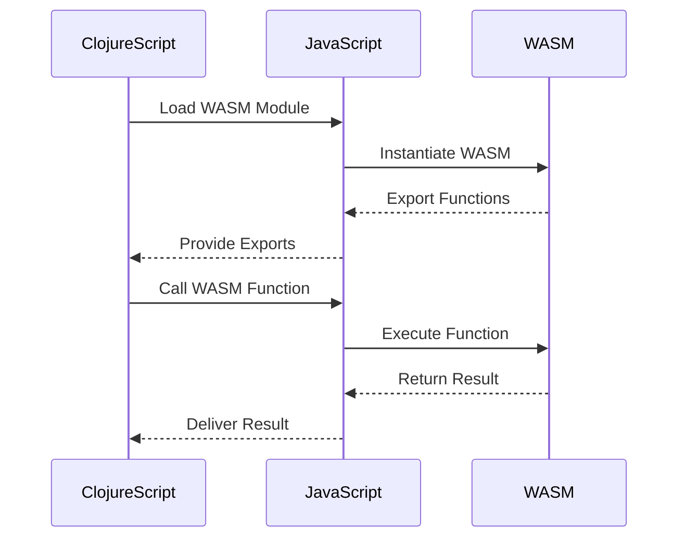

## 20.18. Integrating WebAssembly (WASM) with ClojureScript

### Introduction to WebAssembly (WASM)

WebAssembly (WASM) is a binary instruction format designed as a portable target for the compilation of high-level languages like C, C++, and Rust. It enables the execution of code at near-native speed in web browsers, providing a significant performance boost for web applications. WASM is supported by all major browsers, making it a powerful tool for developers looking to enhance the performance of their web applications.

#### The Role of WebAssembly in Web Development

WebAssembly was created to address the limitations of JavaScript in terms of performance, especially for compute-intensive tasks. While JavaScript is versatile and widely used, it can struggle with tasks that require heavy computation or real-time processing. WASM allows developers to write performance-critical code in languages that compile to WASM, which can then be executed alongside JavaScript in the browser.

### Compiling Performance-Critical Code to WASM

To leverage WASM, developers typically write code in a language that can be compiled to WASM. Popular choices include:

- **C/C++**: These languages are often used for their performance and control over system resources.
- **Rust**: Known for its safety and concurrency features, Rust is increasingly popular for WASM development.
- **AssemblyScript**: A TypeScript-like language that compiles to WASM, making it accessible for JavaScript developers.

#### Example: Compiling Rust to WASM

Let's explore how to compile a simple Rust function to WASM. First, ensure you have the Rust toolchain installed, along with the `wasm-pack` tool.

```bash
# Install wasm-pack
cargo install wasm-pack
```

Create a new Rust library project:

```bash
cargo new --lib my_wasm_project
cd my_wasm_project
```

Edit the `Cargo.toml` to include the `wasm-bindgen` dependency:

```toml
[dependencies]
wasm-bindgen = "0.2"
```

Write a simple Rust function in `src/lib.rs`:

```rust
use wasm_bindgen::prelude::*;

// This function will be exposed to JavaScript
#[wasm_bindgen]
pub fn add(a: i32, b: i32) -> i32 {
    a + b
}
```

Compile the Rust code to WASM:

```bash
wasm-pack build --target web
```

This command generates a `pkg` directory containing the WASM module and JavaScript bindings.

### Interacting with WASM Modules in ClojureScript

ClojureScript, being a dialect of Clojure that compiles to JavaScript, can interact with WASM modules using JavaScript interop. This allows ClojureScript applications to call functions defined in WASM modules, enabling performance-critical operations to be offloaded to WASM.

#### Loading and Using WASM in ClojureScript

To use a WASM module in ClojureScript, you typically load the module using JavaScript's `WebAssembly` API and then call the exported functions.

Here's how you can integrate the previously compiled Rust WASM module into a ClojureScript application:

1. **Include the WASM Module**: Ensure the `pkg` directory generated by `wasm-pack` is accessible to your ClojureScript application.

2. **Load the WASM Module**: Use JavaScript interop to load the WASM module.

```clojure
(ns my-app.core
  (:require [cljs.js :as js]))

(defn load-wasm []
  (let [wasm-url "path/to/pkg/my_wasm_project_bg.wasm"]
    (-> (js/WebAssembly.instantiateStreaming (js/fetch wasm-url))
        (.then (fn [result]
                 (let [exports (.-exports (.-instance result))]
                   (println "WASM module loaded")
                   (println "Result of add(2, 3):" ((.-add exports) 2 3))))))))
```

3. **Call WASM Functions**: Once the module is loaded, you can call its functions using the exported object.

### Benefits of Integrating WASM with ClojureScript

Integrating WASM with ClojureScript offers several benefits:

- **Performance**: Offload compute-intensive tasks to WASM for faster execution.
- **Interoperability**: Use existing libraries and codebases written in languages like C/C++ and Rust.
- **Security**: WASM runs in a sandboxed environment, reducing security risks.
- **Portability**: WASM modules can run in any environment that supports WebAssembly, including browsers and Node.js.

### Example: A Practical Use Case

Consider a ClojureScript application that performs image processing. Image processing can be computationally expensive, making it a perfect candidate for WASM.

#### Rust Code for Image Processing

Let's write a simple Rust function to invert the colors of an image:

```rust
use wasm_bindgen::prelude::*;
use image::{ImageBuffer, Rgba};

#[wasm_bindgen]
pub fn invert_colors(width: u32, height: u32, data: &[u8]) -> Vec<u8> {
    let mut img = ImageBuffer::<Rgba<u8>, _>::from_raw(width, height, data).unwrap();
    for pixel in img.pixels_mut() {
        let channels = pixel.0;
        pixel.0 = [255 - channels[0], 255 - channels[1], 255 - channels[2], channels[3]];
    }
    img.into_raw()
}
```

Compile this Rust code to WASM using `wasm-pack`.

#### ClojureScript Integration

In your ClojureScript application, load the WASM module and use the `invert_colors` function:

```clojure
(ns my-app.image
  (:require [cljs.js :as js]))

(defn invert-image [width height data]
  (let [wasm-url "path/to/pkg/my_wasm_project_bg.wasm"]
    (-> (js/WebAssembly.instantiateStreaming (js/fetch wasm-url))
        (.then (fn [result]
                 (let [exports (.-exports (.-instance result))
                       inverted-data ((.-invert_colors exports) width height data)]
                   (println "Image colors inverted")
                   inverted-data))))))
```

### Visualizing the Integration Process

To better understand the interaction between ClojureScript and WASM, let's visualize the process:



### Challenges and Considerations

While integrating WASM with ClojureScript can offer significant performance benefits, there are challenges to consider:

- **Debugging**: Debugging WASM can be more complex than JavaScript due to its binary nature.
- **Tooling**: Ensure you have the necessary tools and build systems in place to compile and manage WASM modules.
- **Interoperability**: Consider the overhead of data conversion between JavaScript and WASM.

### Try It Yourself

Experiment with the provided examples by modifying the Rust code to perform different image processing tasks, such as grayscale conversion or edge detection. Observe how the performance compares to a pure ClojureScript implementation.

### Further Reading and Resources

- [WebAssembly Official Website](https://webassembly.org/)
- [MDN Web Docs on WebAssembly](https://developer.mozilla.org/en-US/docs/WebAssembly)
- [Rust and WebAssembly Book](https://rustwasm.github.io/book/)
- [ClojureScript Documentation](https://clojurescript.org/)

### Summary

Integrating WebAssembly with ClojureScript provides a powerful way to enhance the performance of web applications by leveraging the strengths of both technologies. By offloading performance-critical tasks to WASM, developers can achieve near-native execution speeds while maintaining the flexibility and expressiveness of ClojureScript.

## **Ready to Test Your Knowledge?**



### What is the primary benefit of using WebAssembly in web applications?

- [x] Improved performance for compute-intensive tasks
- [ ] Enhanced security features
- [ ] Simplified code structure
- [ ] Better compatibility with older browsers

> **Explanation:** WebAssembly is designed to execute code at near-native speed, making it ideal for performance-critical tasks.

### Which language is NOT commonly used to compile code to WebAssembly?

- [ ] Rust
- [ ] C++
- [x] Python
- [ ] AssemblyScript

> **Explanation:** Python is not typically compiled to WebAssembly, whereas Rust, C++, and AssemblyScript are commonly used.

### How can ClojureScript interact with a WebAssembly module?

- [x] Using JavaScript interop to call exported WASM functions
- [ ] Directly compiling ClojureScript to WASM
- [ ] Embedding WASM code within ClojureScript files
- [ ] Using a special ClojureScript library

> **Explanation:** ClojureScript interacts with WASM modules through JavaScript interop, calling functions exported by the WASM module.

### What tool is used to compile Rust code to WebAssembly?

- [ ] Cargo
- [x] wasm-pack
- [ ] npm
- [ ] Babel

> **Explanation:** `wasm-pack` is a tool used to compile Rust code to WebAssembly, along with generating JavaScript bindings.

### What is a potential challenge when integrating WASM with ClojureScript?

- [x] Debugging the binary code
- [ ] Lack of browser support
- [ ] Incompatibility with JavaScript
- [ ] Limited language support

> **Explanation:** Debugging WebAssembly can be challenging due to its binary format, making it less straightforward than debugging JavaScript.

### Which of the following is a benefit of using WebAssembly?

- [x] Portability across different environments
- [ ] Automatic memory management
- [ ] Built-in support for all web APIs
- [ ] Simplified syntax compared to JavaScript

> **Explanation:** WebAssembly is portable and can run in any environment that supports it, such as browsers and Node.js.

### What is the purpose of the `wasm-bindgen` crate in Rust?

- [x] To facilitate interaction between Rust and JavaScript
- [ ] To compile Rust code to JavaScript
- [ ] To provide a GUI for Rust applications
- [ ] To manage Rust project dependencies

> **Explanation:** `wasm-bindgen` is used to generate bindings between Rust and JavaScript, making it easier to call Rust functions from JavaScript.

### What is a common use case for WebAssembly in web applications?

- [x] Image processing
- [ ] Form validation
- [ ] DOM manipulation
- [ ] CSS styling

> **Explanation:** WebAssembly is often used for tasks like image processing that require high performance.

### True or False: WebAssembly can only be used in web browsers.

- [ ] True
- [x] False

> **Explanation:** WebAssembly can be used in any environment that supports it, including Node.js and other non-browser environments.

### Which of the following is NOT a benefit of using WebAssembly?

- [ ] Near-native execution speed
- [ ] Security through sandboxing
- [ ] Portability across platforms
- [x] Automatic garbage collection

> **Explanation:** WebAssembly does not provide automatic garbage collection; this is managed by the host environment.


