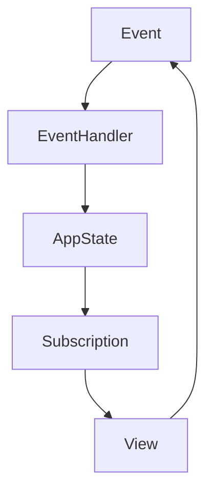
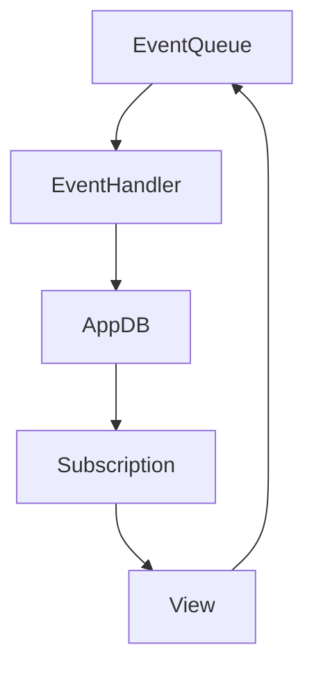

## 20.2. Functional Reactive Programming with Reagent and Re-frame

Functional Reactive Programming (FRP) is a paradigm that combines the benefits of functional programming with reactive programming to build responsive and interactive applications. In the Clojure ecosystem, **Reagent** and **Re-frame** are powerful tools that leverage FRP principles to create efficient and maintainable web applications. In this section, we'll explore how these libraries work together to provide a seamless development experience for building reactive user interfaces.

### Introduction to Reagent

**Reagent** is a minimalistic ClojureScript interface to React, a popular JavaScript library for building user interfaces. Reagent allows developers to write React components using ClojureScript, taking advantage of Clojure's immutable data structures and functional programming capabilities.

#### Key Features of Reagent

- **Simplicity**: Reagent provides a straightforward API for creating React components using ClojureScript.
- **Reactivity**: It uses ClojureScript's reactive atoms to manage state, automatically re-rendering components when the state changes.
- **Interoperability**: Reagent components can easily interoperate with JavaScript and other React components.

#### Creating a Simple Reagent Component

Let's start by creating a simple Reagent component. We'll create a "Hello, World!" component that displays a greeting message.

```clojure
(ns my-app.core
  (:require [reagent.core :as r]))

(defn hello-world []
  [:div
   [:h1 "Hello, World!"]])

(defn mount-root []
  (r/render [hello-world]
            (.getElementById js/document "app")))

(defn init []
  (mount-root))
```

In this example, we define a `hello-world` function that returns a vector representing a React component. The vector `[:div [:h1 "Hello, World!"]]` is a hiccup-style syntax used by Reagent to describe HTML elements. The `mount-root` function renders the component into the DOM.

### Introducing Re-frame

**Re-frame** is a ClojureScript framework built on top of Reagent that provides a structured way to manage application state and handle events. It follows the unidirectional data flow architecture, which simplifies state management and makes applications easier to reason about.

#### Key Features of Re-frame

- **Unidirectional Data Flow**: Re-frame enforces a single direction of data flow, making it easier to track how data changes over time.
- **Event-Driven Architecture**: It uses events to trigger state changes, promoting a clear separation between state management and UI rendering.
- **Subscription System**: Re-frame provides a subscription mechanism to efficiently manage and access application state.

#### Understanding Unidirectional Data Flow

In a unidirectional data flow architecture, data flows in a single direction through the application. This approach contrasts with bidirectional data binding, where changes in the UI can directly update the state and vice versa. The unidirectional flow in Re-frame can be visualized as follows:



- **Event**: User actions or external inputs trigger events.
- **Event Handler**: Processes events and updates the application state.
- **App State**: The centralized state of the application.
- **Subscription**: Provides a way for components to access the state.
- **View**: React components that render the UI based on the state.

### Building Interactive Components with Reagent and Re-frame

Let's build a simple counter application to demonstrate how Reagent and Re-frame work together to create interactive components.

#### Setting Up the Project

First, create a new ClojureScript project and add the necessary dependencies for Reagent and Re-frame.

```clojure
(defproject my-app "0.1.0-SNAPSHOT"
  :dependencies [[org.clojure/clojure "1.10.3"]
                 [org.clojure/clojurescript "1.10.844"]
                 [reagent "1.1.0"]
                 [re-frame "1.2.0"]])
```

#### Defining the Application State

In Re-frame, the application state is stored in a single atom, often referred to as the "app-db". We'll define an initial state for our counter application.

```clojure
(ns my-app.db)

(def default-db
  {:counter 0})
```

#### Creating Events and Event Handlers

Events in Re-frame are defined as keywords, and event handlers are functions that update the application state in response to events.

```clojure
(ns my-app.events
  (:require [re-frame.core :as re-frame]
            [my-app.db :as db]))

(re-frame/reg-event-db
 :initialize-db
 (fn [_ _]
   db/default-db))

(re-frame/reg-event-db
 :increment-counter
 (fn [db _]
   (update db :counter inc)))

(re-frame/reg-event-db
 :decrement-counter
 (fn [db _]
   (update db :counter dec)))
```

In this example, we define three events: `:initialize-db`, `:increment-counter`, and `:decrement-counter`. Each event handler updates the state accordingly.

#### Creating Subscriptions

Subscriptions in Re-frame allow components to access the application state. We'll create a subscription to access the counter value.

```clojure
(ns my-app.subs
  (:require [re-frame.core :as re-frame]))

(re-frame/reg-sub
 :counter
 (fn [db _]
   (:counter db)))
```

#### Building the UI with Reagent

Now, let's create the UI components using Reagent. We'll create a simple counter component that displays the counter value and buttons to increment and decrement the counter.

```clojure
(ns my-app.views
  (:require [re-frame.core :as re-frame]))

(defn counter []
  (let [counter (re-frame/subscribe [:counter])]
    (fn []
      [:div
       [:h1 "Counter: " @counter]
       [:button {:on-click #(re-frame/dispatch [:increment-counter])} "Increment"]
       [:button {:on-click #(re-frame/dispatch [:decrement-counter])} "Decrement"]])))

(defn main-panel []
  [:div
   [counter]])
```

In this code, we define a `counter` component that subscribes to the `:counter` subscription. The component renders the counter value and provides buttons to dispatch increment and decrement events.

#### Initializing the Application

Finally, we need to initialize the application by dispatching the `:initialize-db` event and rendering the main panel.

```clojure
(ns my-app.core
  (:require [reagent.core :as r]
            [re-frame.core :as re-frame]
            [my-app.events]
            [my-app.subs]
            [my-app.views :as views]))

(defn mount-root []
  (re-frame/dispatch-sync [:initialize-db])
  (r/render [views/main-panel]
            (.getElementById js/document "app")))

(defn init []
  (mount-root))
```

### Benefits of Unidirectional Data Flow

The unidirectional data flow architecture in Re-frame offers several benefits:

- **Predictability**: With a single source of truth, it's easier to predict how the application will behave in response to events.
- **Debugging**: The clear separation between state management and UI rendering simplifies debugging and tracing state changes.
- **Scalability**: As applications grow, the unidirectional flow helps maintain a consistent structure, making it easier to manage complexity.

### Try It Yourself

To get hands-on experience with Reagent and Re-frame, try modifying the counter application:

- Add a reset button to set the counter back to zero.
- Display a message when the counter reaches a specific value.
- Experiment with different UI layouts and styles.

### Visualizing the Re-frame Architecture

To better understand how Re-frame manages state and events, let's visualize the architecture using a Mermaid.js diagram.



- **Event Queue**: A queue that holds events to be processed.
- **Event Handler**: Functions that process events and update the AppDB.
- **AppDB**: The centralized application state.
- **Subscription**: Mechanisms to access state data.
- **View**: Components that render the UI based on state data.

### References and Further Reading

- [Reagent Documentation](https://reagent-project.github.io/)
- [Re-frame GitHub Repository](https://github.com/day8/re-frame)
- [React Documentation](https://reactjs.org/docs/getting-started.html)
- [ClojureScript Documentation](https://clojurescript.org/)

### Knowledge Check

Let's reinforce your understanding of Reagent and Re-frame with some questions and exercises.

## **Ready to Test Your Knowledge?**



### What is the primary purpose of Reagent in ClojureScript?

- [x] To provide a minimalistic interface to React for building user interfaces.
- [ ] To manage application state in a ClojureScript application.
- [ ] To handle HTTP requests and responses.
- [ ] To perform data validation and transformation.

> **Explanation:** Reagent is a ClojureScript library that provides a minimalistic interface to React, allowing developers to build user interfaces using ClojureScript.

### How does Re-frame enforce unidirectional data flow?

- [x] By using events to trigger state changes and subscriptions to access state.
- [ ] By allowing direct manipulation of the DOM.
- [ ] By using bidirectional data binding.
- [ ] By storing state in local component variables.

> **Explanation:** Re-frame enforces unidirectional data flow by using events to trigger state changes and subscriptions to access the state, ensuring a single direction of data flow.

### Which of the following is a key benefit of unidirectional data flow in Re-frame?

- [x] Predictability and easier debugging.
- [ ] Faster rendering of components.
- [ ] Direct manipulation of the DOM.
- [ ] Automatic state synchronization with the server.

> **Explanation:** Unidirectional data flow provides predictability and easier debugging by maintaining a single source of truth and a clear separation between state management and UI rendering.

### What is the role of subscriptions in Re-frame?

- [x] To provide a mechanism for components to access application state.
- [ ] To handle user input events.
- [ ] To manage HTTP requests and responses.
- [ ] To define the layout of UI components.

> **Explanation:** Subscriptions in Re-frame provide a mechanism for components to access the application state, allowing them to reactively update when the state changes.

### In the Re-frame architecture, what is the AppDB?

- [x] The centralized application state.
- [ ] A database for storing user data.
- [ ] A component for rendering the UI.
- [ ] A function for handling events.

> **Explanation:** The AppDB in Re-frame is the centralized application state that stores all the data needed by the application.

### How can you modify the counter application to reset the counter to zero?

- [x] Add a new event and event handler for resetting the counter.
- [ ] Directly modify the DOM to reset the counter.
- [ ] Use a subscription to reset the counter.
- [ ] Change the initial state in the AppDB.

> **Explanation:** To reset the counter to zero, you need to add a new event and event handler that updates the AppDB to set the counter value to zero.

### What is the purpose of the `re-frame/dispatch` function?

- [x] To trigger an event that updates the application state.
- [ ] To render a component to the DOM.
- [ ] To create a new subscription.
- [ ] To define a new event handler.

> **Explanation:** The `re-frame/dispatch` function is used to trigger an event that updates the application state by invoking the corresponding event handler.

### Which library does Reagent wrap to provide its functionality?

- [x] React
- [ ] Angular
- [ ] Vue.js
- [ ] jQuery

> **Explanation:** Reagent is a minimalistic wrapper around React, providing a ClojureScript interface to build user interfaces.

### True or False: Re-frame allows direct manipulation of the DOM.

- [ ] True
- [x] False

> **Explanation:** False. Re-frame does not allow direct manipulation of the DOM. Instead, it uses a unidirectional data flow where state changes trigger UI updates.

### What is the primary advantage of using Re-frame for state management?

- [x] It provides a structured and predictable way to manage application state.
- [ ] It allows direct manipulation of the DOM.
- [ ] It automatically synchronizes state with the server.
- [ ] It provides built-in support for animations.

> **Explanation:** The primary advantage of using Re-frame for state management is that it provides a structured and predictable way to manage application state through its unidirectional data flow architecture.



Remember, this is just the beginning. As you progress, you'll build more complex and interactive web applications using Reagent and Re-frame. Keep experimenting, stay curious, and enjoy the journey!
