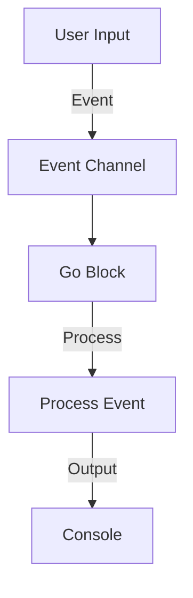

## 20.3. Event-Driven Architecture with Core.Async

### Introduction to Event-Driven Architecture

Event-driven architecture (EDA) is a software design paradigm in which the flow of the program is determined by events. These events can be user actions, sensor outputs, or messages from other programs. The core idea is to decouple the components of a system, allowing them to communicate through events, which leads to more scalable and maintainable systems.

#### Key Principles of Event-Driven Architecture

1. **Decoupling**: Components in an event-driven system are loosely coupled, meaning they do not need to know about each other. They communicate through events, which are handled by an event bus or broker.
   
2. **Asynchronicity**: Events are processed asynchronously, allowing the system to handle many events simultaneously without blocking.
   
3. **Scalability**: By decoupling components and processing events asynchronously, systems can scale more easily to handle increased loads.
   
4. **Flexibility**: New components can be added to the system without affecting existing ones, as long as they adhere to the event contract.

### Core.Async: Enabling Concurrency in Clojure

Clojure's `core.async` library provides powerful abstractions for asynchronous programming. It introduces concepts such as channels and go blocks, which facilitate the implementation of event-driven systems.

#### Core Concepts of Core.Async

- **Channels**: Channels are the primary means of communication between different parts of a program in `core.async`. They are similar to queues and can be used to pass messages between different threads or processes.

- **Go Blocks**: Go blocks are lightweight threads that allow you to write asynchronous code in a synchronous style. They use channels to communicate with other go blocks or threads.

- **Pipelines**: Pipelines are a higher-level abstraction that allows you to process data through a series of transformations, each running in its own go block.

#### How Core.Async Facilitates Concurrency

Core.async provides a way to manage concurrency without the complexity of traditional threading models. By using channels and go blocks, you can write code that is easy to reason about and maintain, while still taking advantage of the performance benefits of asynchronous processing.

### Implementing Event-Driven Systems with Core.Async

Let's explore how to implement an event-driven system using `core.async`. We'll start with a simple example and gradually introduce more complex concepts.

#### Example: A Simple Event-Driven System

Consider a system where we want to process user input events asynchronously. We'll use `core.async` to handle these events.

```clojure
(ns event-driven-example
  (:require [clojure.core.async :refer [chan go <! >!]]))

(defn process-event [event]
  (println "Processing event:" event))

(defn event-loop [event-channel]
  (go
    (loop []
      (when-let [event (<! event-channel)]
        (process-event event)
        (recur)))))

(defn start-system []
  (let [event-channel (chan)]
    (event-loop event-channel)
    event-channel))

;; Usage
(def event-channel (start-system))
(go (>! event-channel {:type :user-input :data "Hello, World!"}))
```

In this example, we create a channel `event-channel` to communicate events. The `event-loop` function runs in a go block, continuously listening for events on the channel and processing them with `process-event`.

#### Handling Asynchronous Events

Core.async makes it easy to handle asynchronous events by allowing you to compose go blocks and channels. Let's extend our example to handle multiple types of events.

```clojure
(defn process-user-input [data]
  (println "User input received:" data))

(defn process-system-event [data]
  (println "System event received:" data))

(defn process-event [event]
  (case (:type event)
    :user-input (process-user-input (:data event))
    :system-event (process-system-event (:data event))
    (println "Unknown event type:" (:type event))))

;; Usage
(go (>! event-channel {:type :system-event :data "System update"}))
```

Here, we use a `case` expression to handle different types of events. This pattern allows us to easily extend the system to handle new event types.

### Best Practices for Using Core.Async

1. **Keep Channels Local**: Avoid exposing channels as part of your API. Instead, encapsulate them within functions or components to maintain modularity.

2. **Limit Go Block Usage**: Use go blocks judiciously. Each go block introduces a small amount of overhead, so it's best to use them only when necessary.

3. **Avoid Blocking Operations**: Inside go blocks, avoid blocking operations such as I/O or long computations. Use channels to offload these tasks to separate threads.

4. **Use Buffers Wisely**: Channels can have buffers, which allow them to store a limited number of messages. Use buffers to prevent backpressure, but be mindful of memory usage.

5. **Error Handling**: Implement error handling within go blocks to prevent unhandled exceptions from crashing your program.

### Potential Pitfalls

- **Deadlocks**: Be cautious of deadlocks, which can occur if channels are not used correctly. Ensure that every `<!` has a corresponding `>!`.

- **Resource Leaks**: Channels that are not properly closed can lead to resource leaks. Always close channels when they are no longer needed.

- **Complexity**: While core.async simplifies concurrency, it can still introduce complexity. Keep your design simple and modular to manage this complexity.

### Visualizing Event-Driven Architecture with Core.Async

To better understand how event-driven architecture works with core.async, let's visualize the flow of events and data.



**Diagram Description**: This diagram illustrates the flow of events in our example system. User input is sent as an event to the event channel, which is then processed by a go block. The processed event is output to the console.

### Try It Yourself

Experiment with the code examples provided. Here are some suggestions for modifications:

- Add a new event type and implement a handler for it.
- Introduce a delay in processing events to simulate long-running tasks.
- Implement a buffer for the event channel and observe how it affects the system's behavior.

### References and Further Reading

- [Clojure Core.Async Documentation](https://clojure.github.io/core.async/)
- [Event-Driven Architecture on Wikipedia](https://en.wikipedia.org/wiki/Event-driven_architecture)
- [Concurrency in Clojure](https://clojure.org/about/concurrent_programming)

### Knowledge Check

Let's test your understanding of event-driven architecture and core.async with some questions.

## **Ready to Test Your Knowledge?**



### What is the primary benefit of using event-driven architecture?

- [x] Decoupling components
- [ ] Increasing code complexity
- [ ] Reducing system flexibility
- [ ] Decreasing scalability

> **Explanation:** Event-driven architecture decouples components, allowing them to communicate through events, which enhances scalability and flexibility.

### What is a channel in core.async?

- [x] A communication mechanism for passing messages
- [ ] A type of data structure
- [ ] A function for processing events
- [ ] A concurrency primitive in Java

> **Explanation:** Channels in core.async are used to pass messages between different parts of a program, facilitating communication and concurrency.

### How do go blocks in core.async help with concurrency?

- [x] They allow asynchronous code to be written in a synchronous style
- [ ] They block the main thread
- [ ] They are used for error handling
- [ ] They replace traditional threads

> **Explanation:** Go blocks enable writing asynchronous code in a synchronous style, simplifying concurrency management.

### What should you avoid inside go blocks?

- [x] Blocking operations
- [ ] Channel operations
- [ ] Error handling
- [ ] Non-blocking I/O

> **Explanation:** Blocking operations should be avoided inside go blocks to prevent performance issues.

### Which of the following is a best practice when using core.async?

- [x] Keep channels local to maintain modularity
- [ ] Use go blocks for every operation
- [ ] Avoid using buffers in channels
- [ ] Expose channels as part of your API

> **Explanation:** Keeping channels local helps maintain modularity and encapsulation in your code.

### What is a potential pitfall of using core.async?

- [x] Deadlocks
- [ ] Improved performance
- [ ] Simplified concurrency
- [ ] Enhanced scalability

> **Explanation:** Deadlocks can occur if channels are not used correctly, leading to potential issues in your program.

### How can you prevent resource leaks with channels?

- [x] Close channels when they are no longer needed
- [ ] Use unlimited buffers
- [ ] Avoid using channels
- [ ] Use go blocks for closing channels

> **Explanation:** Closing channels when they are no longer needed prevents resource leaks.

### What is the role of buffers in channels?

- [x] To store a limited number of messages
- [ ] To increase channel complexity
- [ ] To decrease memory usage
- [ ] To block message passing

> **Explanation:** Buffers allow channels to store a limited number of messages, helping manage backpressure.

### What does the `<!` operator do in core.async?

- [x] Takes a message from a channel
- [ ] Puts a message into a channel
- [ ] Closes a channel
- [ ] Opens a channel

> **Explanation:** The `<!` operator is used to take a message from a channel in core.async.

### True or False: Core.async replaces traditional threading models entirely.

- [ ] True
- [x] False

> **Explanation:** Core.async provides abstractions for managing concurrency but does not replace traditional threading models entirely.



Remember, mastering event-driven architecture with core.async is a journey. Keep experimenting, stay curious, and enjoy the process of building scalable and maintainable systems!
