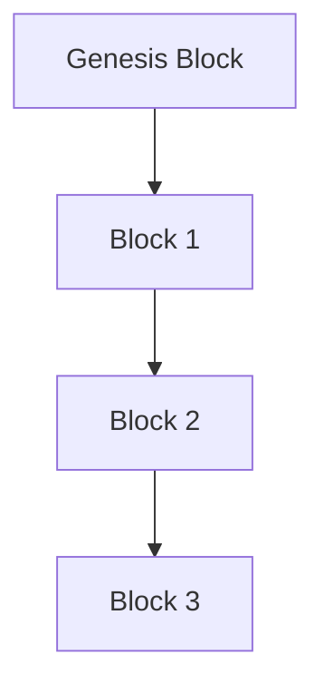

## 20.4. Clojure for Blockchain and Distributed Ledger Technologies

### Introduction to Blockchain Concepts

Blockchain technology has emerged as a revolutionary approach to managing digital transactions and data across decentralized networks. At its core, a blockchain is a distributed ledger that records transactions in a secure, immutable, and transparent manner. Each block in the chain contains a list of transactions, a timestamp, and a cryptographic hash of the previous block, ensuring the integrity and chronological order of the data.

#### Key Characteristics of Blockchain

1. **Decentralization**: Unlike traditional databases, blockchains operate on a peer-to-peer network, eliminating the need for a central authority.
2. **Immutability**: Once data is recorded in a blockchain, it cannot be altered retroactively, ensuring data integrity.
3. **Transparency**: All participants in the network have access to the same data, promoting trust and accountability.
4. **Security**: Cryptographic techniques secure the data, making it resistant to unauthorized access and tampering.

### Clojure's Suitability for Blockchain Applications

Clojure, a modern Lisp dialect that runs on the Java Virtual Machine (JVM), offers several features that make it an excellent choice for developing blockchain solutions:

1. **Functional Programming Paradigm**: Clojure's emphasis on pure functions and immutability aligns well with the principles of blockchain, where data integrity and consistency are paramount.

2. **Immutable Data Structures**: Clojure's persistent data structures ensure that data is never modified in place, which is crucial for maintaining the immutability of blockchain records.

3. **Concurrency Models**: Clojure provides robust concurrency primitives such as atoms, refs, agents, and core.async channels, enabling efficient handling of concurrent transactions and state management in a distributed network.

4. **Interoperability with Java**: Clojure's seamless integration with Java allows developers to leverage existing Java libraries and tools, facilitating the development of blockchain applications.

5. **Metaprogramming with Macros**: Clojure's powerful macro system allows for the creation of domain-specific languages (DSLs) and custom abstractions, which can be used to define smart contracts and other blockchain-specific logic.

### Existing Clojure Blockchain Projects

One notable project in the Clojure blockchain ecosystem is **[Liskov](https://github.com/riemann/liskov)**. Liskov is a Clojure library designed for building distributed systems with a focus on consensus algorithms, which are fundamental to blockchain technology. It provides tools for implementing Byzantine fault-tolerant consensus protocols, making it a valuable resource for developers building blockchain applications in Clojure.

### Challenges and Opportunities in Blockchain Development with Clojure

#### Challenges

1. **Scalability**: As blockchain networks grow, scalability becomes a critical concern. Clojure developers must design systems that can handle increasing transaction volumes without compromising performance.

2. **Complexity of Consensus Algorithms**: Implementing consensus algorithms such as Proof of Work (PoW) or Proof of Stake (PoS) can be complex. Clojure's functional paradigm can help manage this complexity, but developers need to be well-versed in both blockchain and functional programming concepts.

3. **Security**: Ensuring the security of blockchain applications is paramount. Developers must be vigilant in protecting against vulnerabilities and attacks, leveraging Clojure's immutable data structures and robust concurrency models to enhance security.

#### Opportunities

1. **Smart Contracts**: Clojure's metaprogramming capabilities make it an ideal language for developing smart contracts, which are self-executing contracts with the terms of the agreement directly written into code.

2. **Decentralized Applications (DApps)**: The rise of DApps presents an opportunity for Clojure developers to create innovative applications that leverage blockchain's decentralized nature.

3. **Integration with Existing Systems**: Clojure's interoperability with Java allows for seamless integration with existing enterprise systems, enabling businesses to adopt blockchain technology without overhauling their entire infrastructure.

### Sample Code Snippet: Implementing a Simple Blockchain in Clojure

Let's explore a simple implementation of a blockchain in Clojure to illustrate some of the concepts discussed.

```clojure
(ns simple-blockchain.core
  (:require [clojure.string :as str]
            [clojure.data.json :as json]))

(defn hash-block [block]
  ;; Generate a hash for a block using SHA-256
  (let [block-json (json/write-str block)]
    (-> block-json
        (.getBytes "UTF-8")
        (java.security.MessageDigest/getInstance "SHA-256")
        (.digest)
        (map #(format "%02x" %))
        (apply str))))

(defn create-block [index previous-hash timestamp data]
  ;; Create a new block with the given parameters
  {:index index
   :previous-hash previous-hash
   :timestamp timestamp
   :data data
   :hash (hash-block {:index index
                      :previous-hash previous-hash
                      :timestamp timestamp
                      :data data})})

(defn genesis-block []
  ;; Create the genesis block (first block in the blockchain)
  (create-block 0 "0" (System/currentTimeMillis) "Genesis Block"))

(defn add-block [blockchain data]
  ;; Add a new block to the blockchain
  (let [previous-block (last blockchain)
        new-index (inc (:index previous-block))
        new-timestamp (System/currentTimeMillis)
        new-block (create-block new-index (:hash previous-block) new-timestamp data)]
    (conj blockchain new-block)))

(defn validate-blockchain [blockchain]
  ;; Validate the integrity of the blockchain
  (every? (fn [[prev-block curr-block]]
            (= (:hash prev-block) (:previous-hash curr-block)))
          (partition 2 1 blockchain)))

;; Example usage
(def blockchain (atom [(genesis-block)]))

(swap! blockchain add-block "First transaction")
(swap! blockchain add-block "Second transaction")

(println "Blockchain:" @blockchain)
(println "Is blockchain valid?" (validate-blockchain @blockchain))
```

### Explanation of the Code

- **Hashing Function**: The `hash-block` function generates a SHA-256 hash for a given block, ensuring data integrity.
- **Block Creation**: The `create-block` function constructs a new block with an index, previous hash, timestamp, and data.
- **Genesis Block**: The `genesis-block` function creates the first block in the blockchain, known as the genesis block.
- **Adding Blocks**: The `add-block` function appends a new block to the blockchain, using the hash of the previous block to maintain the chain's integrity.
- **Blockchain Validation**: The `validate-blockchain` function checks the integrity of the blockchain by ensuring that each block's previous hash matches the hash of the preceding block.

### Visualizing Blockchain Structure

To better understand the structure of a blockchain, let's visualize it using a Mermaid.js diagram.



**Diagram Description**: This diagram illustrates a simple blockchain with a genesis block followed by three subsequent blocks. Each block points to the previous block, forming a chain.

### Try It Yourself

Experiment with the code by adding more blocks to the blockchain or modifying the data within each block. Observe how the blockchain's integrity is maintained through the hashing mechanism.

### Conclusion

Clojure offers a robust set of features that make it well-suited for blockchain and distributed ledger technologies. Its functional programming paradigm, immutable data structures, and powerful concurrency models provide a solid foundation for developing secure, scalable, and efficient blockchain applications. As the blockchain landscape continues to evolve, Clojure developers have the opportunity to contribute to this exciting field by leveraging the language's unique capabilities.

### References and Further Reading

- [Clojure Official Website](https://clojure.org/)
- [Liskov GitHub Repository](https://github.com/riemann/liskov)
- [Blockchain Basics on Investopedia](https://www.investopedia.com/terms/b/blockchain.asp)

## **Ready to Test Your Knowledge?**



### What is a key characteristic of blockchain technology?

- [x] Immutability
- [ ] Centralization
- [ ] Volatility
- [ ] Anonymity

> **Explanation:** Immutability ensures that once data is recorded in a blockchain, it cannot be altered retroactively, maintaining data integrity.

### How does Clojure's functional programming paradigm benefit blockchain development?

- [x] It aligns with blockchain's principles of data integrity and consistency.
- [ ] It allows for mutable state management.
- [ ] It simplifies the implementation of consensus algorithms.
- [ ] It enhances the volatility of blockchain data.

> **Explanation:** Clojure's functional programming paradigm emphasizes pure functions and immutability, which align with blockchain's need for data integrity and consistency.

### Which Clojure feature is crucial for maintaining blockchain data integrity?

- [x] Immutable Data Structures
- [ ] Dynamic Typing
- [ ] Homoiconicity
- [ ] Macros

> **Explanation:** Immutable data structures ensure that data is never modified in place, which is crucial for maintaining the immutability of blockchain records.

### What is the role of the `hash-block` function in the sample code?

- [x] It generates a SHA-256 hash for a block.
- [ ] It creates a new block in the blockchain.
- [ ] It validates the blockchain's integrity.
- [ ] It manages the blockchain's state.

> **Explanation:** The `hash-block` function generates a SHA-256 hash for a given block, ensuring data integrity.

### What does the `validate-blockchain` function do?

- [x] It checks the integrity of the blockchain.
- [ ] It adds a new block to the blockchain.
- [ ] It generates a hash for a block.
- [ ] It creates the genesis block.

> **Explanation:** The `validate-blockchain` function checks the integrity of the blockchain by ensuring that each block's previous hash matches the hash of the preceding block.

### Which Clojure project is notable in the blockchain ecosystem?

- [x] Liskov
- [ ] Ring
- [ ] Compojure
- [ ] Pedestal

> **Explanation:** Liskov is a Clojure library designed for building distributed systems with a focus on consensus algorithms, which are fundamental to blockchain technology.

### What is a challenge in blockchain development with Clojure?

- [x] Scalability
- [ ] Immutability
- [ ] Transparency
- [ ] Security

> **Explanation:** Scalability is a critical concern as blockchain networks grow, and developers must design systems that can handle increasing transaction volumes without compromising performance.

### How can Clojure's metaprogramming capabilities be utilized in blockchain?

- [x] For developing smart contracts
- [ ] For managing mutable state
- [ ] For simplifying consensus algorithms
- [ ] For enhancing data volatility

> **Explanation:** Clojure's metaprogramming capabilities allow for the creation of domain-specific languages (DSLs) and custom abstractions, which can be used to define smart contracts and other blockchain-specific logic.

### What is the purpose of the genesis block in a blockchain?

- [x] It is the first block in the blockchain.
- [ ] It validates the blockchain's integrity.
- [ ] It generates a hash for a block.
- [ ] It manages the blockchain's state.

> **Explanation:** The genesis block is the first block in the blockchain, serving as the foundation for all subsequent blocks.

### True or False: Clojure's interoperability with Java allows for seamless integration with existing enterprise systems.

- [x] True
- [ ] False

> **Explanation:** Clojure's seamless integration with Java allows developers to leverage existing Java libraries and tools, facilitating the development of blockchain applications and enabling businesses to adopt blockchain technology without overhauling their entire infrastructure.



Remember, this is just the beginning. As you progress, you'll build more complex and interactive blockchain applications. Keep experimenting, stay curious, and enjoy the journey!
