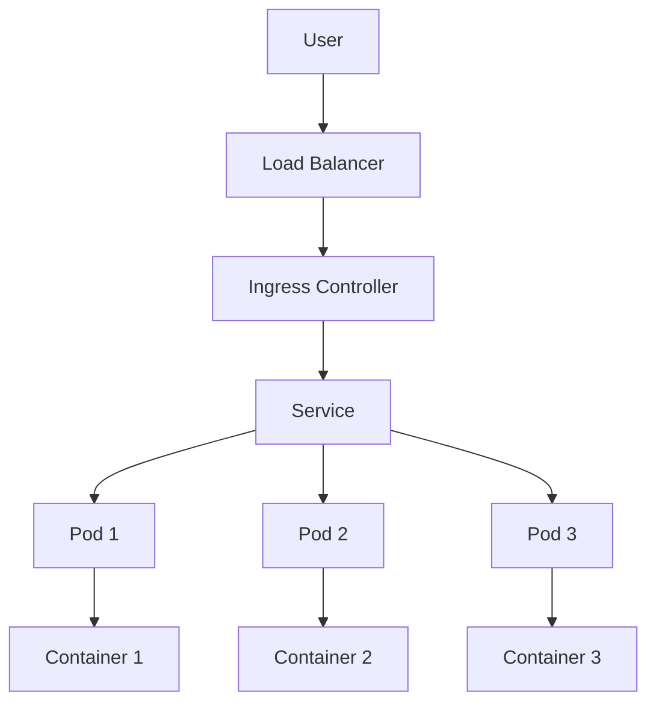

## 20.5. Clojure in Cloud-Native Applications

Cloud-native applications are designed to leverage the full potential of cloud computing, offering scalability, resilience, and ease of deployment. Clojure, with its functional programming paradigm and robust ecosystem, is well-suited for building cloud-native applications. In this section, we will explore the principles of cloud-native development, how Clojure aligns with these principles, and the tools and frameworks that facilitate cloud-native development in Clojure.

### Understanding Cloud-Native Principles

Cloud-native applications are characterized by several key principles:

1. **Microservices Architecture**: Applications are composed of small, independent services that communicate over a network. This architecture allows for flexibility, scalability, and resilience.

2. **Containerization**: Applications are packaged in containers, ensuring consistency across environments and simplifying deployment.

3. **Continuous Integration and Continuous Deployment (CI/CD)**: Automated pipelines are used to integrate and deploy code changes rapidly and reliably.

4. **Scalability and Resilience**: Applications are designed to scale horizontally and recover from failures gracefully.

5. **DevOps Culture**: Development and operations teams collaborate closely, emphasizing automation and monitoring.

### Clojure's Alignment with Cloud-Native Principles

Clojure's features and ecosystem align well with cloud-native principles:

- **Functional Programming**: Clojure's functional paradigm promotes immutability and statelessness, which are beneficial for building scalable and resilient systems.
- **Immutable Data Structures**: These structures simplify concurrent programming and reduce the risk of state-related bugs.
- **Concurrency Support**: Clojure provides powerful concurrency primitives, such as atoms, refs, and agents, which are essential for building responsive cloud-native applications.
- **Interoperability with Java**: Clojure runs on the JVM, allowing seamless integration with Java libraries and tools, including those used in cloud environments.

### Tools and Frameworks for Cloud-Native Development in Clojure

Several tools and frameworks enhance Clojure's capabilities for cloud-native development:

#### Polylith

[Polylith](https://polylith.gitbook.io/polylith/) is an architectural framework that simplifies the development of modular and maintainable systems. It encourages the reuse of components across projects and supports both monolithic and microservices architectures.

- **Component Reusability**: Polylith allows developers to build reusable components that can be shared across different projects.
- **Simplified Development**: By focusing on components rather than services, Polylith reduces complexity and improves maintainability.
- **Seamless Integration**: Polylith integrates with existing Clojure tools and workflows, making it easy to adopt.

#### Duct

Duct is a framework for building modular and extensible applications in Clojure. It provides a flexible configuration system and supports the integration of various libraries and components.

- **Modularity**: Duct encourages the separation of concerns and promotes the use of independent modules.
- **Configuration Management**: Duct's configuration system allows for easy customization and extension of applications.
- **Integration**: Duct integrates with popular Clojure libraries, such as Ring and Compojure, for web development.

#### Luminus

Luminus is a micro-framework for building web applications in Clojure. It provides a comprehensive set of tools and libraries for rapid development.

- **Full-Stack Development**: Luminus includes support for front-end and back-end development, making it suitable for building complete web applications.
- **Ease of Use**: Luminus simplifies common tasks, such as routing, database access, and authentication, allowing developers to focus on business logic.
- **Community Support**: Luminus has a vibrant community and extensive documentation, making it easy to get started.

### Deploying Clojure Applications to Cloud Services

Deploying Clojure applications to cloud services involves several steps, including containerization, configuration, and monitoring. Let's explore these steps in detail.

#### Containerization with Docker

Docker is a popular tool for containerizing applications, ensuring consistency across environments. Here's how to containerize a Clojure application using Docker:

```dockerfile
# Use the official Clojure image as the base
FROM clojure:openjdk-11-tools-deps

# Set the working directory
WORKDIR /app

# Copy the project files into the container
COPY . .

# Install dependencies and build the application
RUN clj -M:depstar

# Define the command to run the application
CMD ["java", "-jar", "target/app.jar"]
```

- **Base Image**: We use the official Clojure image, which includes the necessary tools and dependencies.
- **Working Directory**: The application files are copied into the `/app` directory.
- **Build Command**: We use `clj -M:depstar` to build the application into a JAR file.
- **Run Command**: The application is executed using the `java` command.

#### Deploying to Kubernetes

Kubernetes is a powerful platform for managing containerized applications. Here's how to deploy a Clojure application to Kubernetes:

```yaml
apiVersion: apps/v1
kind: Deployment
metadata:
  name: clojure-app
spec:
  replicas: 3
  selector:
    matchLabels:
      app: clojure-app
  template:
    metadata:
      labels:
        app: clojure-app
    spec:
      containers:
      - name: clojure-app
        image: myregistry/clojure-app:latest
        ports:
        - containerPort: 8080
```

- **Deployment**: We define a deployment with three replicas for scalability and resilience.
- **Container Image**: The application is packaged as a Docker image and stored in a container registry.
- **Port Configuration**: The application listens on port 8080.

#### Monitoring and Logging

Monitoring and logging are crucial for maintaining the health and performance of cloud-native applications. Tools like Prometheus and Grafana can be used to monitor Clojure applications, while ELK Stack (Elasticsearch, Logstash, Kibana) can be used for logging.

### Best Practices for Scalability and Maintainability

To ensure scalability and maintainability, consider the following best practices:

- **Design for Failure**: Assume that failures will occur and design your application to handle them gracefully.
- **Automate Everything**: Use CI/CD pipelines to automate testing, deployment, and monitoring.
- **Use Immutable Infrastructure**: Treat infrastructure as code and use tools like Terraform to manage it.
- **Implement Observability**: Use monitoring and logging tools to gain insights into your application's performance and behavior.
- **Optimize for Performance**: Use Clojure's concurrency primitives and immutable data structures to build efficient applications.

### Try It Yourself

Experiment with the code examples provided in this section. Try modifying the Dockerfile to use a different base image or change the Kubernetes deployment to use a different number of replicas. Explore the Polylith framework by creating a simple Clojure project and breaking it down into reusable components.

### Visualizing Cloud-Native Architecture

Below is a diagram illustrating the architecture of a cloud-native application using Kubernetes and Docker:



**Diagram Description**: This diagram represents a cloud-native application architecture. Users interact with the application through a load balancer, which routes traffic to an ingress controller. The ingress controller directs requests to a service, which distributes them across multiple pods. Each pod contains one or more containers running the application.

### References and Links

- [Polylith Documentation](https://polylith.gitbook.io/polylith/)
- [Docker Official Documentation](https://docs.docker.com/)
- [Kubernetes Official Documentation](https://kubernetes.io/docs/)
- [Prometheus Monitoring](https://prometheus.io/)
- [Grafana Visualization](https://grafana.com/)
- [ELK Stack for Logging](https://www.elastic.co/what-is/elk-stack)

### Knowledge Check

- What are the key principles of cloud-native applications?
- How does Clojure's functional programming paradigm benefit cloud-native development?
- What is the role of containerization in cloud-native applications?
- How can Polylith help in building cloud-native applications?
- What are some best practices for deploying Clojure applications to the cloud?

### Embrace the Journey

Remember, building cloud-native applications is an iterative process. As you gain experience, you'll discover new tools and techniques to enhance your applications. Keep experimenting, stay curious, and enjoy the journey!

## **Ready to Test Your Knowledge?**



### What is a key characteristic of cloud-native applications?

- [x] Microservices architecture
- [ ] Monolithic architecture
- [ ] Single-threaded execution
- [ ] Manual deployment

> **Explanation:** Cloud-native applications are typically built using a microservices architecture, which allows for flexibility, scalability, and resilience.

### How does Clojure's functional programming paradigm benefit cloud-native development?

- [x] Promotes immutability and statelessness
- [ ] Encourages mutable state
- [ ] Requires complex state management
- [ ] Limits concurrency

> **Explanation:** Clojure's functional programming paradigm promotes immutability and statelessness, which are beneficial for building scalable and resilient cloud-native applications.

### What tool is commonly used for containerizing applications?

- [x] Docker
- [ ] Kubernetes
- [ ] Terraform
- [ ] Jenkins

> **Explanation:** Docker is a popular tool for containerizing applications, ensuring consistency across environments.

### Which framework simplifies the development of modular and maintainable systems in Clojure?

- [x] Polylith
- [ ] Luminus
- [ ] Duct
- [ ] Ring

> **Explanation:** Polylith is an architectural framework that simplifies the development of modular and maintainable systems in Clojure.

### What is the role of Kubernetes in cloud-native applications?

- [x] Manages containerized applications
- [ ] Provides a web server
- [ ] Handles database queries
- [ ] Compiles Clojure code

> **Explanation:** Kubernetes is a platform for managing containerized applications, providing features like scaling, deployment, and monitoring.

### What is a best practice for ensuring scalability in cloud-native applications?

- [x] Design for failure
- [ ] Use monolithic architecture
- [ ] Avoid automation
- [ ] Limit observability

> **Explanation:** Designing for failure is a best practice for ensuring scalability and resilience in cloud-native applications.

### Which tool can be used for monitoring Clojure applications?

- [x] Prometheus
- [ ] Docker
- [ ] Terraform
- [ ] Jenkins

> **Explanation:** Prometheus is a tool used for monitoring applications, including those built with Clojure.

### What is the purpose of using immutable infrastructure?

- [x] Treat infrastructure as code
- [ ] Allow manual configuration
- [ ] Increase deployment time
- [ ] Reduce automation

> **Explanation:** Immutable infrastructure treats infrastructure as code, allowing for consistent and automated deployments.

### What is the benefit of using Polylith in cloud-native development?

- [x] Encourages component reusability
- [ ] Requires complex configurations
- [ ] Limits scalability
- [ ] Increases deployment time

> **Explanation:** Polylith encourages component reusability, simplifying the development and maintenance of cloud-native applications.

### True or False: Clojure's concurrency primitives are essential for building responsive cloud-native applications.

- [x] True
- [ ] False

> **Explanation:** Clojure's concurrency primitives, such as atoms, refs, and agents, are essential for building responsive and scalable cloud-native applications.


