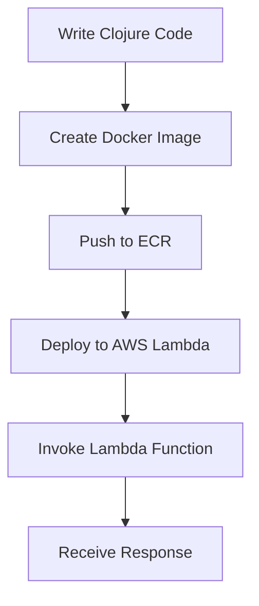

## 20.6. Serverless Architecture with AWS Lambda and Babashka

Serverless architecture has revolutionized the way we build and deploy applications by abstracting away the complexities of server management. In this section, we will explore how to leverage AWS Lambda, a leading serverless computing service, alongside Babashka, a fast-starting scripting environment for Clojure, to create efficient and scalable serverless applications.

### Understanding Serverless Architecture

Serverless architecture allows developers to build and run applications without managing the underlying infrastructure. Instead of provisioning and maintaining servers, developers can focus on writing code, while the cloud provider handles the execution, scaling, and maintenance of the application. This model offers several benefits:

- **Cost Efficiency**: Pay only for the compute time you consume, eliminating the need for idle server resources.
- **Scalability**: Automatically scales with the demand, handling varying loads seamlessly.
- **Reduced Operational Complexity**: Simplifies deployment and management, allowing developers to concentrate on application logic.

AWS Lambda is a popular serverless computing service that executes code in response to events, such as HTTP requests, database updates, or file uploads. It supports various programming languages, including Clojure, through custom runtimes.

### Introducing Babashka

Babashka is a lightweight, fast-starting scripting environment for Clojure. It is designed for scripting tasks and quick execution, making it an excellent choice for serverless functions where startup time is critical. Babashka provides a subset of Clojure's functionality, optimized for performance and ease of use.

### Writing and Deploying Clojure Code to AWS Lambda

To deploy Clojure code to AWS Lambda, we need to create a custom runtime that can execute Clojure scripts. Babashka simplifies this process by providing a fast Clojure interpreter that can be bundled with our Lambda function.

#### Step-by-Step Tutorial

Let's walk through the process of creating and deploying a Clojure-based AWS Lambda function using Babashka.

#### Step 1: Setting Up Your Environment

Before we begin, ensure you have the following prerequisites:

- **AWS Account**: Sign up for an AWS account if you don't have one.
- **AWS CLI**: Install and configure the AWS Command Line Interface.
- **Docker**: Install Docker for building the custom runtime.
- **Babashka**: Download and install Babashka from [GitHub](https://github.com/babashka/babashka).

#### Step 2: Writing the Lambda Function

Create a new directory for your Lambda function and navigate to it:

```bash
mkdir clojure-lambda
cd clojure-lambda
```

Create a file named `handler.clj` with the following content:

```clojure
(ns handler)

(defn handle-request [event context]
  ;; Extract information from the event
  (let [name (get event "name" "World")]
    ;; Return a greeting message
    {:statusCode 200
     :body (str "Hello, " name "!")}))
```

This simple function takes an event with a `name` parameter and returns a greeting message.

#### Step 3: Creating a Custom Runtime

To run Clojure code on AWS Lambda, we need to create a custom runtime using Docker. Create a `Dockerfile` with the following content:

```dockerfile
FROM babashka/babashka:latest

COPY handler.clj /var/task/

CMD ["bb", "-m", "handler/handle-request"]
```

This Dockerfile uses the Babashka image and copies our `handler.clj` file into the Lambda environment. The `CMD` instruction specifies the command to execute our function.

#### Step 4: Building and Deploying the Lambda Function

Build the Docker image:

```bash
docker build -t clojure-lambda .
```

Push the image to Amazon Elastic Container Registry (ECR):

```bash
# Create an ECR repository
aws ecr create-repository --repository-name clojure-lambda

# Authenticate Docker to the ECR registry
aws ecr get-login-password --region <your-region> | docker login --username AWS --password-stdin <your-account-id>.dkr.ecr.<your-region>.amazonaws.com

# Tag the image
docker tag clojure-lambda:latest <your-account-id>.dkr.ecr.<your-region>.amazonaws.com/clojure-lambda:latest

# Push the image
docker push <your-account-id>.dkr.ecr.<your-region>.amazonaws.com/clojure-lambda:latest
```

Create the Lambda function using the AWS CLI:

```bash
aws lambda create-function \
  --function-name clojure-lambda \
  --package-type Image \
  --code ImageUri=<your-account-id>.dkr.ecr.<your-region>.amazonaws.com/clojure-lambda:latest \
  --role <your-lambda-execution-role-arn>
```

#### Step 5: Testing the Lambda Function

Invoke the Lambda function using the AWS CLI:

```bash
aws lambda invoke \
  --function-name clojure-lambda \
  --payload '{"name": "Clojure Developer"}' \
  response.json

cat response.json
```

You should see the output: `{"statusCode":200,"body":"Hello, Clojure Developer!"}`

### Visualizing the Serverless Workflow

Below is a diagram illustrating the workflow of deploying a Clojure-based AWS Lambda function using Babashka:



**Diagram Description**: This flowchart represents the process of writing Clojure code, creating a Docker image, pushing it to ECR, deploying it to AWS Lambda, invoking the function, and receiving a response.

### Key Considerations

- **Cold Start Latency**: Serverless functions may experience latency during the initial invocation. Babashka's fast startup time helps mitigate this issue.
- **Resource Limits**: AWS Lambda has limits on execution time, memory, and payload size. Ensure your function adheres to these constraints.
- **Security**: Use IAM roles and policies to secure your Lambda functions and restrict access to necessary resources.

### Clojure Unique Features

Clojure's immutable data structures and functional programming paradigm make it well-suited for serverless applications. Babashka enhances this by providing a fast, lightweight environment for executing Clojure scripts.

### Differences and Similarities

While AWS Lambda supports various languages, using Clojure with Babashka offers unique advantages in terms of startup time and functional programming capabilities. Compared to other languages, Clojure's emphasis on immutability and concurrency aligns well with the stateless nature of serverless functions.

### Try It Yourself

Experiment with the code examples by modifying the `handle-request` function to perform different tasks, such as interacting with AWS services or processing data. Deploy your changes and observe the results.

### References and Links

- [AWS Lambda Documentation](https://docs.aws.amazon.com/lambda/latest/dg/welcome.html)
- [Babashka GitHub Repository](https://github.com/babashka/babashka)
- [Docker Documentation](https://docs.docker.com/)

## **Ready to Test Your Knowledge?**



### What is a key benefit of serverless architecture?

- [x] Cost efficiency
- [ ] Increased server maintenance
- [ ] Manual scaling
- [ ] Complex deployment

> **Explanation:** Serverless architecture offers cost efficiency by charging only for the compute time used, eliminating idle server costs.

### What is Babashka?

- [x] A fast-starting scripting environment for Clojure
- [ ] A cloud service provider
- [ ] A database management tool
- [ ] A JavaScript framework

> **Explanation:** Babashka is a lightweight scripting environment for Clojure, designed for quick execution and scripting tasks.

### How do you deploy a Clojure function to AWS Lambda?

- [x] Create a custom runtime using Docker and deploy via AWS CLI
- [ ] Directly upload Clojure code to Lambda
- [ ] Use a JavaScript runtime
- [ ] Deploy using a Python script

> **Explanation:** Deploying Clojure to AWS Lambda involves creating a custom runtime with Docker and using the AWS CLI for deployment.

### What command is used to build a Docker image?

- [x] `docker build -t clojure-lambda .`
- [ ] `docker create clojure-lambda`
- [ ] `docker run clojure-lambda`
- [ ] `docker deploy clojure-lambda`

> **Explanation:** The `docker build -t clojure-lambda .` command is used to build a Docker image with the specified tag.

### What is the purpose of the `CMD` instruction in a Dockerfile?

- [x] Specifies the command to run when the container starts
- [ ] Installs software packages
- [ ] Copies files into the container
- [ ] Configures environment variables

> **Explanation:** The `CMD` instruction in a Dockerfile specifies the command to execute when the container starts.

### Which AWS service is used to store Docker images for Lambda deployment?

- [x] Amazon Elastic Container Registry (ECR)
- [ ] Amazon S3
- [ ] Amazon RDS
- [ ] Amazon EC2

> **Explanation:** Amazon ECR is used to store Docker images, which can be deployed to AWS Lambda.

### What is a cold start in serverless computing?

- [x] Initial latency experienced when a function is invoked for the first time
- [ ] A server crash
- [ ] A network timeout
- [ ] A database connection error

> **Explanation:** A cold start refers to the initial latency experienced when a serverless function is invoked for the first time.

### What is the role of IAM in AWS Lambda?

- [x] Provides security and access control for Lambda functions
- [ ] Manages database connections
- [ ] Handles network traffic
- [ ] Configures server settings

> **Explanation:** IAM (Identity and Access Management) provides security and access control for AWS Lambda functions.

### What is the main advantage of using Babashka with AWS Lambda?

- [x] Fast startup time for serverless functions
- [ ] Larger memory allocation
- [ ] Enhanced graphics processing
- [ ] Built-in database support

> **Explanation:** Babashka offers a fast startup time, which is beneficial for serverless functions that need to execute quickly.

### True or False: Clojure's immutability is beneficial for serverless applications.

- [x] True
- [ ] False

> **Explanation:** Clojure's immutability is beneficial for serverless applications as it aligns with the stateless nature of serverless functions.



Remember, this is just the beginning. As you progress, you'll build more complex and interactive serverless applications. Keep experimenting, stay curious, and enjoy the journey!
