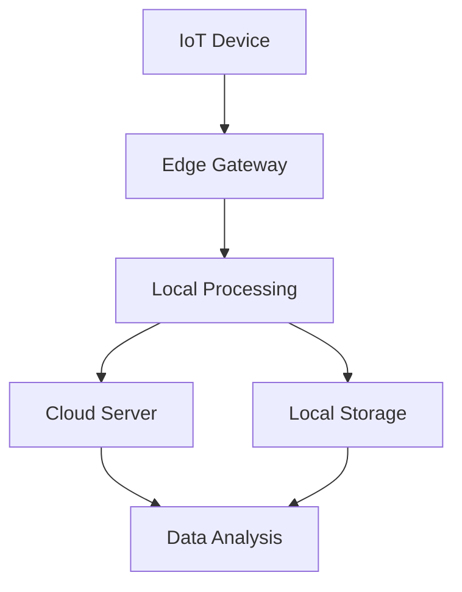

## 20.7. Edge Computing and IoT

### Introduction to Edge Computing and IoT

Edge computing and the Internet of Things (IoT) are transforming the way we process and analyze data. By moving computation closer to the data source, edge computing reduces latency, conserves bandwidth, and enhances the responsiveness of applications. In this section, we will explore how Clojure, with its functional programming paradigm and powerful concurrency models, can be effectively utilized in edge computing and IoT applications.

### Understanding Edge Computing

**Edge computing** refers to the practice of processing data near the source of data generation rather than relying on a centralized data-processing warehouse. This approach offers several advantages:

- **Reduced Latency**: By processing data closer to where it is generated, edge computing minimizes the time it takes for data to travel to a central server and back, leading to faster response times.
- **Bandwidth Efficiency**: Only necessary data is sent to the cloud or central servers, reducing the amount of data that needs to be transmitted over the network.
- **Improved Reliability**: Local processing can continue even if the connection to the central server is lost, ensuring continuous operation.
- **Enhanced Security**: Sensitive data can be processed locally, reducing the risk of exposure during transmission.

### The Role of IoT in Edge Computing

The **Internet of Things (IoT)** involves a network of interconnected devices that collect and exchange data. These devices range from simple sensors to complex machinery, all of which can benefit from edge computing. By processing data at the edge, IoT devices can make real-time decisions, leading to more efficient operations and improved user experiences.

### Why Clojure for Edge Computing and IoT?

Clojure is a functional programming language that runs on the Java Virtual Machine (JVM). It is known for its simplicity, expressiveness, and powerful concurrency support, making it an excellent choice for edge computing and IoT applications. Here are some reasons why Clojure is well-suited for these domains:

- **Immutable Data Structures**: Clojure's immutable data structures ensure that data is not accidentally modified, which is crucial for maintaining consistency in distributed systems.
- **Concurrency Support**: Clojure provides robust concurrency primitives like atoms, refs, and agents, allowing developers to build responsive and scalable applications.
- **Interoperability with Java**: Running on the JVM, Clojure can leverage the vast ecosystem of Java libraries, making it easier to integrate with existing systems and technologies.
- **Lightweight and Expressive**: Clojure's concise syntax and functional nature enable developers to write clear and maintainable code, which is particularly beneficial in resource-constrained environments.

### Applying Clojure in Resource-Constrained Environments

Edge devices often have limited computational resources, such as CPU power, memory, and storage. Clojure's functional programming paradigm and efficient data structures make it possible to write performant code even in these constrained environments. Here are some strategies for using Clojure effectively in such scenarios:

- **Optimize Data Structures**: Use Clojure's persistent data structures to minimize memory usage and improve performance.
- **Leverage Transducers**: Transducers allow you to compose data transformation pipelines without creating intermediate collections, reducing memory overhead.
- **Use Lazy Sequences**: Clojure's lazy sequences enable efficient processing of large datasets by computing elements only as needed.
- **Profile and Optimize**: Use profiling tools to identify bottlenecks and optimize critical sections of your code for better performance.

### Example IoT Applications Using Clojure

Let's explore some practical examples of IoT applications where Clojure can be applied:

#### 1. Smart Home Automation

In a smart home setup, various sensors and devices collect data to automate tasks like lighting, heating, and security. Clojure can be used to process sensor data locally, enabling real-time decision-making and reducing the need for constant cloud communication.

```clojure
(ns smart-home.core
  (:require [clojure.core.async :refer [go chan <! >!]]))

(defn process-sensor-data [data]
  ;; Process sensor data and make decisions
  (println "Processing data:" data))

(defn start-sensor-listener []
  (let [sensor-chan (chan)]
    (go
      (while true
        (let [data (<! sensor-chan)]
          (process-sensor-data data))))
    sensor-chan))

(def sensor-channel (start-sensor-listener))

;; Simulate incoming sensor data
(go (>! sensor-channel {:temperature 22 :humidity 45}))
```

In this example, we use Clojure's `core.async` library to handle asynchronous data processing from sensors. The `process-sensor-data` function processes incoming data and makes decisions based on it.

#### 2. Industrial IoT Monitoring

In industrial settings, IoT devices monitor machinery and equipment to predict failures and optimize maintenance schedules. Clojure can be used to analyze sensor data in real-time, providing insights and alerts to operators.

```clojure
(ns industrial-iot.core
  (:require [clojure.core.async :refer [go-loop chan <! >! timeout]]))

(defn analyze-data [data]
  ;; Analyze data and detect anomalies
  (when (> (:vibration data) 5)
    (println "Alert: High vibration detected!")))

(defn start-monitoring []
  (let [data-chan (chan)]
    (go-loop []
      (let [data (<! data-chan)]
        (analyze-data data)
        (recur)))
    data-chan))

(def monitoring-channel (start-monitoring))

;; Simulate incoming data
(go (>! monitoring-channel {:vibration 6 :temperature 75}))
```

This example demonstrates how Clojure can be used to monitor industrial equipment. The `analyze-data` function checks for anomalies in the data and triggers alerts when necessary.

### Relevant Libraries and Frameworks

Clojure's ecosystem includes several libraries and frameworks that facilitate edge computing and IoT development:

- **core.async**: Provides facilities for asynchronous programming and communication between concurrent processes.
- **clj-http**: A simple and flexible HTTP client for interacting with web services and APIs.
- **aleph**: A library for asynchronous communication, useful for building real-time applications.
- **onyx**: A distributed, masterless, high-performance data processing system that can be used for real-time analytics and data processing at the edge.

### Visualizing Edge Computing Architecture

To better understand how edge computing works, let's visualize a typical architecture using a flowchart:



**Figure 1: Edge Computing Architecture**

In this architecture, IoT devices send data to an edge gateway, where local processing occurs. The processed data can be stored locally or sent to a cloud server for further analysis. This setup reduces latency and bandwidth usage while ensuring data availability even if the cloud connection is lost.

### Challenges and Considerations

While Clojure offers many advantages for edge computing and IoT, there are also challenges to consider:

- **Resource Constraints**: Edge devices may have limited resources, requiring careful optimization of code and data structures.
- **Network Reliability**: Ensuring reliable communication between devices and servers is crucial for seamless operation.
- **Security**: Protecting sensitive data and ensuring secure communication channels is essential in IoT applications.
- **Scalability**: Designing systems that can scale with the number of devices and data volume is important for future-proofing applications.

### Conclusion

Clojure's functional programming paradigm, immutable data structures, and powerful concurrency support make it an excellent choice for edge computing and IoT applications. By processing data closer to the source, we can reduce latency, conserve bandwidth, and improve the responsiveness of our applications. As you explore the possibilities of Clojure in these domains, remember to optimize for resource constraints, ensure reliable communication, and prioritize security.

### Try It Yourself

Experiment with the provided code examples by modifying the sensor data and processing logic. Consider adding new features, such as logging or alerting, to enhance the functionality of your IoT applications.

### Ready to Test Your Knowledge?



### What is the primary advantage of edge computing?

- [x] Reduced latency
- [ ] Increased data storage
- [ ] Enhanced graphics processing
- [ ] Improved user interface design

> **Explanation:** Edge computing reduces latency by processing data closer to the source, minimizing the time it takes for data to travel to a central server and back.

### Which Clojure feature is particularly beneficial for maintaining consistency in distributed systems?

- [x] Immutable data structures
- [ ] Dynamic typing
- [ ] Homogeneous collections
- [ ] Macro system

> **Explanation:** Immutable data structures ensure that data is not accidentally modified, which is crucial for maintaining consistency in distributed systems.

### What library in Clojure is used for asynchronous programming?

- [x] core.async
- [ ] clj-http
- [ ] aleph
- [ ] onyx

> **Explanation:** The `core.async` library provides facilities for asynchronous programming and communication between concurrent processes.

### In the context of IoT, what does the term "local processing" refer to?

- [x] Processing data at the edge device or gateway
- [ ] Sending data to the cloud for processing
- [ ] Storing data in a central database
- [ ] Analyzing data on a personal computer

> **Explanation:** Local processing refers to processing data at the edge device or gateway, reducing the need for constant cloud communication.

### What is a common challenge when using Clojure in edge computing?

- [x] Resource constraints
- [ ] Lack of concurrency support
- [ ] Inability to handle HTTP requests
- [ ] Poor integration with Java

> **Explanation:** Edge devices often have limited computational resources, requiring careful optimization of code and data structures.

### Which of the following is a benefit of using Clojure's lazy sequences?

- [x] Efficient processing of large datasets
- [ ] Immediate computation of all elements
- [ ] Increased memory usage
- [ ] Simplified syntax

> **Explanation:** Clojure's lazy sequences enable efficient processing of large datasets by computing elements only as needed.

### What is the role of an edge gateway in edge computing?

- [x] It processes data locally before sending it to the cloud
- [ ] It stores all data permanently
- [ ] It acts as a user interface for IoT devices
- [ ] It provides power to IoT devices

> **Explanation:** An edge gateway processes data locally before sending it to the cloud, reducing latency and bandwidth usage.

### Which Clojure library is useful for building real-time applications?

- [x] aleph
- [ ] clj-http
- [ ] core.async
- [ ] onyx

> **Explanation:** Aleph is a library for asynchronous communication, useful for building real-time applications.

### What is a key consideration when designing IoT applications?

- [x] Ensuring reliable communication between devices and servers
- [ ] Maximizing the number of devices
- [ ] Using the latest hardware
- [ ] Focusing solely on cloud processing

> **Explanation:** Ensuring reliable communication between devices and servers is crucial for seamless operation in IoT applications.

### True or False: Clojure's interoperability with Java is a disadvantage in IoT applications.

- [ ] True
- [x] False

> **Explanation:** Clojure's interoperability with Java is an advantage, as it allows developers to leverage the vast ecosystem of Java libraries for IoT applications.


