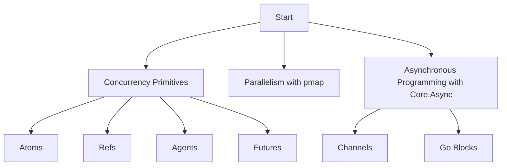

## 20.8. High-Performance Computing with Clojure

High-performance computing (HPC) is a critical area in software development, enabling the execution of complex computations and data processing tasks at high speeds. Clojure, with its functional programming paradigm and robust concurrency model, offers unique advantages for HPC. In this section, we will explore the requirements and challenges of HPC, discuss how to leverage parallelism and concurrency in Clojure, introduce libraries like Parallel Colt for numerical computing, and provide optimization strategies and profiling tools.

### Understanding High-Performance Computing Requirements

High-performance computing involves executing tasks that require significant computational power and memory. These tasks often include simulations, data analysis, and scientific computations. The primary requirements for HPC include:

- **Scalability**: The ability to efficiently utilize multiple processors or cores.
- **Concurrency**: Managing multiple computations simultaneously without conflicts.
- **Efficiency**: Minimizing resource usage while maximizing performance.
- **Reliability**: Ensuring accurate and consistent results.

### Challenges in High-Performance Computing

While HPC offers significant benefits, it also presents several challenges:

- **Complexity**: Designing algorithms that efficiently utilize parallelism and concurrency.
- **Synchronization**: Managing shared resources without introducing bottlenecks.
- **Data Management**: Handling large datasets efficiently.
- **Debugging**: Identifying and resolving issues in concurrent environments.

### Leveraging Parallelism and Concurrency in Clojure

Clojure provides several constructs and libraries to harness parallelism and concurrency effectively:

#### Concurrency Primitives

Clojure's concurrency model is built around several primitives:

- **Atoms**: For managing shared, synchronous, independent state.
- **Refs**: For coordinated, synchronous updates to shared state using Software Transactional Memory (STM).
- **Agents**: For asynchronous updates to shared state.
- **Futures**: For executing tasks asynchronously and retrieving results later.

#### Parallelism with `pmap` and `future`

Clojure's `pmap` function allows for parallel processing of collections, distributing the workload across available cores:

```clojure
(defn compute-intensive-task [x]
  ;; Simulate a compute-intensive task
  (Thread/sleep 1000)
  (* x x))

(def results (pmap compute-intensive-task (range 10)))
```

In this example, `pmap` executes `compute-intensive-task` in parallel, leveraging multiple cores to reduce execution time.

#### Asynchronous Programming with Core.Async

Core.Async provides channels for asynchronous communication between processes, enabling complex workflows without blocking:

```clojure
(require '[clojure.core.async :as async])

(defn async-task [ch]
  (async/go
    (let [result (compute-intensive-task 42)]
      (async/>! ch result))))

(let [ch (async/chan)]
  (async-task ch)
  (println "Result:" (async/<!! ch)))
```

### Introducing Parallel Colt for Numerical Computing

For numerical computing, Clojure can leverage the Parallel Colt library, which provides high-performance data structures and algorithms for scientific computing:

- **Matrix Operations**: Efficient matrix manipulation and linear algebra routines.
- **Random Number Generation**: High-quality random number generators.
- **Statistical Functions**: A wide range of statistical functions for data analysis.

#### Example: Matrix Multiplication with Parallel Colt

```clojure
(import '[cern.colt.matrix.tdouble DoubleFactory2D DoubleMatrix2D])

(defn matrix-multiply [a b]
  (let [factory (DoubleFactory2D/dense)]
    (.zMult a b nil)))

(let [a (DoubleFactory2D/dense/make 1000 1000 1.0)
      b (DoubleFactory2D/dense/make 1000 1000 2.0)]
  (time (matrix-multiply a b)))
```

This example demonstrates matrix multiplication using Parallel Colt, showcasing its ability to handle large datasets efficiently.

### Optimization Strategies for High-Performance Clojure

To achieve optimal performance in Clojure applications, consider the following strategies:

#### Profiling and Benchmarking

Use profiling tools like YourKit and VisualVM to identify bottlenecks and optimize code:

- **YourKit**: A powerful profiler for Java applications, providing insights into CPU and memory usage.
- **VisualVM**: A visual tool for monitoring and troubleshooting Java applications.

#### Code Optimization Techniques

- **Use Transients**: For temporary mutable state within a single thread, improving performance.
- **Avoid Reflection**: Use type hints to eliminate reflection overhead.
- **Leverage Primitives**: Use primitive data types for numerical computations to reduce boxing and unboxing overhead.

#### Memory Management

- **Optimize Data Structures**: Choose efficient data structures for your use case.
- **Minimize Garbage Collection**: Reduce object creation and leverage persistent data structures.

### Visualizing Concurrency and Parallelism

To better understand concurrency and parallelism in Clojure, consider the following diagram:



**Diagram Description**: This diagram illustrates the flow of concurrency and parallelism in Clojure, highlighting key primitives and techniques.

### References and Further Reading

- [Clojure Official Documentation](https://clojure.org/reference/documentation)
- [Parallel Colt GitHub Repository](https://github.com/parallelcolt/parallelcolt)
- [YourKit Java Profiler](https://www.yourkit.com/)
- [VisualVM](https://visualvm.github.io/)

### Knowledge Check

To reinforce your understanding of high-performance computing with Clojure, consider the following questions and exercises:

- What are the primary requirements for high-performance computing?
- How does Clojure's concurrency model differ from traditional threading models?
- Implement a parallel computation using `pmap` for a custom function.
- Explore the Parallel Colt library and perform a statistical analysis on a dataset.
- Profile a Clojure application using YourKit or VisualVM and identify potential optimizations.

### Embrace the Journey

Remember, mastering high-performance computing with Clojure is a journey. As you explore these concepts and techniques, you'll unlock new possibilities for building efficient and scalable applications. Keep experimenting, stay curious, and enjoy the process!

## **Ready to Test Your Knowledge?**



### What is a key requirement for high-performance computing?

- [x] Scalability
- [ ] Simplicity
- [ ] Low memory usage
- [ ] Single-threaded execution

> **Explanation:** Scalability is crucial for high-performance computing to efficiently utilize multiple processors or cores.

### Which Clojure primitive is used for asynchronous updates to shared state?

- [ ] Atoms
- [ ] Refs
- [x] Agents
- [ ] Vars

> **Explanation:** Agents are used for asynchronous updates to shared state in Clojure.

### What is the purpose of the `pmap` function in Clojure?

- [x] To process collections in parallel
- [ ] To manage shared state
- [ ] To handle asynchronous communication
- [ ] To create immutable data structures

> **Explanation:** `pmap` is used to process collections in parallel, distributing the workload across available cores.

### Which library is recommended for numerical computing in Clojure?

- [ ] Core.Async
- [ ] Ring
- [x] Parallel Colt
- [ ] Compojure

> **Explanation:** Parallel Colt is recommended for numerical computing in Clojure.

### What tool can be used for profiling Clojure applications?

- [x] YourKit
- [ ] Leiningen
- [ ] Core.Async
- [ ] Ring

> **Explanation:** YourKit is a powerful profiler for Java applications, including Clojure.

### How can you minimize garbage collection in Clojure?

- [ ] Use more atoms
- [x] Reduce object creation
- [ ] Increase thread count
- [ ] Use more macros

> **Explanation:** Reducing object creation helps minimize garbage collection in Clojure.

### What is a benefit of using transients in Clojure?

- [ ] They are immutable
- [x] They improve performance for temporary mutable state
- [ ] They simplify code
- [ ] They increase memory usage

> **Explanation:** Transients improve performance for temporary mutable state within a single thread.

### Which concurrency primitive in Clojure uses Software Transactional Memory (STM)?

- [ ] Atoms
- [x] Refs
- [ ] Agents
- [ ] Futures

> **Explanation:** Refs use Software Transactional Memory (STM) for coordinated, synchronous updates to shared state.

### What is the role of channels in Core.Async?

- [x] To enable asynchronous communication
- [ ] To manage shared state
- [ ] To create immutable data structures
- [ ] To perform matrix operations

> **Explanation:** Channels in Core.Async enable asynchronous communication between processes.

### True or False: Clojure's concurrency model is based on traditional threading.

- [ ] True
- [x] False

> **Explanation:** Clojure's concurrency model is not based on traditional threading; it uses concurrency primitives like atoms, refs, agents, and futures.


