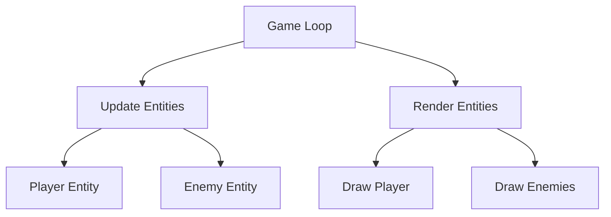

## 20.9. Clojure in Unconventional Domains (Game Development)

### Introduction

Clojure, a modern Lisp dialect that runs on the Java Virtual Machine (JVM), is renowned for its functional programming capabilities, immutable data structures, and powerful concurrency models. While traditionally used in data processing, web development, and concurrent applications, Clojure's unique features also make it a compelling choice for game development. In this section, we will explore how Clojure can be applied to game development, leveraging its functional programming paradigms to create interactive and engaging experiences.

### Functional Programming in Game Logic

Functional programming (FP) offers a paradigm shift from imperative programming by emphasizing the use of pure functions, immutability, and higher-order functions. These principles can be particularly advantageous in game development, where managing state and concurrency are common challenges.

#### Pure Functions and Immutability

In game development, maintaining consistent game state is crucial. Pure functions, which do not have side effects and always produce the same output for the same input, help ensure that game logic is predictable and easier to debug. Immutability, a core concept in Clojure, prevents accidental state changes, reducing bugs and making it easier to reason about the code.

#### Higher-Order Functions and Composition

Higher-order functions, which take other functions as arguments or return them as results, allow for flexible and reusable game logic. Function composition enables developers to build complex behaviors by combining simpler functions, promoting code reuse and modularity.

### Introducing play-clj

[play-clj](https://github.com/oakes/play-clj) is a Clojure library built on top of the popular libGDX framework, which provides a rich set of tools for game development. play-clj leverages Clojure's functional programming features to offer a concise and expressive way to create games.

#### Key Features of play-clj

- **Cross-Platform Support**: play-clj supports multiple platforms, including desktop, Android, and iOS, allowing developers to write once and deploy everywhere.
- **Entity-Component System (ECS)**: play-clj uses an ECS architecture, which separates data (components) from behavior (systems), making it easier to manage complex game logic.
- **Functional API**: The library provides a functional API that integrates seamlessly with Clojure's syntax and paradigms, promoting clean and maintainable code.

### Developing a Simple Game in Clojure

Let's walk through the development of a simple game using play-clj to illustrate how Clojure's features can be applied in game development.

#### Setting Up the Environment

First, ensure you have Leiningen, a build automation tool for Clojure, installed. Create a new play-clj project using the following command:

```bash
lein new play-clj my-game
```

This command sets up a basic project structure with the necessary dependencies.

#### Creating Game Entities

In an ECS architecture, entities are composed of components that define their data. Here's how you can define a simple player entity with position and velocity components:

```clojure
(def player
  {:position {:x 0 :y 0}
   :velocity {:x 1 :y 1}})
```

#### Implementing Game Logic

Next, implement the game logic using pure functions. For example, you can create a function to update the player's position based on its velocity:

```clojure
(defn update-position [entity]
  (let [{:keys [position velocity]} entity]
    (assoc entity :position
           {:x (+ (:x position) (:x velocity))
            :y (+ (:y position) (:y velocity))})))
```

#### Rendering the Game

Rendering is a crucial part of game development. In play-clj, you can define a render function to draw game entities on the screen:

```clojure
(defn render [entities]
  (doseq [entity entities]
    (let [{:keys [position]} entity]
      ;; Render logic here
      )))
```

#### Main Game Loop

The main game loop updates the game state and renders entities. Here's a simple loop using play-clj:

```clojure
(defscreen main-screen
  :on-show
  (fn [screen entities]
    (update! screen :renderer (orthogonal-tiled-map "map.tmx" 32 32))
    entities)

  :on-render
  (fn [screen entities]
    (clear!)
    (render entities)
    (map update-position entities)))
```

### Unique Benefits and Challenges

#### Benefits

- **Conciseness and Expressiveness**: Clojure's syntax and functional paradigms allow for concise and expressive code, reducing boilerplate and improving readability.
- **Concurrency**: Clojure's concurrency primitives, such as atoms and agents, facilitate safe and efficient state management in games.
- **Interactive Development**: The REPL (Read-Eval-Print Loop) enables interactive development, allowing developers to test and iterate on game logic in real-time.

#### Challenges

- **Performance**: While Clojure offers many benefits, its performance may not match that of lower-level languages like C++ or Rust, especially in performance-critical sections of a game.
- **Learning Curve**: Developers new to functional programming or Lisp syntax may face a steep learning curve when adopting Clojure for game development.

### Visualizing Game Architecture

To better understand how Clojure's features integrate into game development, let's visualize a simple game architecture using a Mermaid.js diagram.



**Diagram Description**: This diagram illustrates a basic game loop architecture, where the game loop updates and renders entities. Entities like players and enemies are updated and drawn on the screen.

### Try It Yourself

Experiment with the code examples provided by modifying the player's velocity or adding new entities. Observe how these changes affect the game's behavior and rendering. This hands-on approach will deepen your understanding of Clojure's application in game development.

### References and Further Reading

- [play-clj GitHub Repository](https://github.com/oakes/play-clj)
- [libGDX Official Website](https://libgdx.com/)
- [Functional Programming in Clojure](https://clojure.org/about/rationale)

### Knowledge Check

To reinforce your understanding of Clojure in game development, try answering the following questions and challenges.

## **Ready to Test Your Knowledge?**



### What is a key advantage of using functional programming in game development?

- [x] Predictable and easier to debug game logic
- [ ] Faster execution speed
- [ ] More complex code
- [ ] Increased memory usage

> **Explanation:** Functional programming emphasizes pure functions and immutability, making game logic predictable and easier to debug.

### Which library is commonly used for game development in Clojure?

- [x] play-clj
- [ ] React
- [ ] Django
- [ ] TensorFlow

> **Explanation:** play-clj is a Clojure library built on top of libGDX, specifically designed for game development.

### What is the primary architecture used in play-clj?

- [x] Entity-Component System (ECS)
- [ ] Model-View-Controller (MVC)
- [ ] Client-Server
- [ ] Microservices

> **Explanation:** play-clj uses an Entity-Component System (ECS) architecture, which separates data from behavior.

### What is a challenge of using Clojure for game development?

- [x] Performance may not match lower-level languages
- [ ] Lack of concurrency support
- [ ] Inability to handle game state
- [ ] No support for graphics rendering

> **Explanation:** Clojure's performance may not match that of lower-level languages, which can be a challenge in performance-critical sections of a game.

### How does Clojure handle concurrency in game development?

- [x] Using concurrency primitives like atoms and agents
- [ ] By avoiding concurrency altogether
- [ ] Through manual thread management
- [ ] With global variables

> **Explanation:** Clojure provides concurrency primitives like atoms and agents to facilitate safe and efficient state management.

### What is a benefit of using the REPL in Clojure game development?

- [x] Enables interactive development and testing
- [ ] Increases code complexity
- [ ] Slows down development
- [ ] Requires more boilerplate code

> **Explanation:** The REPL allows developers to interactively test and iterate on game logic in real-time.

### What is a common use of higher-order functions in game development?

- [x] Building complex behaviors by combining simpler functions
- [ ] Increasing code verbosity
- [ ] Reducing code readability
- [ ] Managing memory manually

> **Explanation:** Higher-order functions allow for flexible and reusable game logic by combining simpler functions.

### What is the purpose of the render function in play-clj?

- [x] To draw game entities on the screen
- [ ] To update game logic
- [ ] To manage game state
- [ ] To handle user input

> **Explanation:** The render function is responsible for drawing game entities on the screen.

### True or False: Clojure's immutability can help reduce bugs in game development.

- [x] True
- [ ] False

> **Explanation:** Immutability prevents accidental state changes, reducing bugs and making it easier to reason about the code.

### What is a unique feature of Clojure that benefits game development?

- [x] Concurrency primitives
- [ ] Lack of data structures
- [ ] Complex syntax
- [ ] Manual memory management

> **Explanation:** Clojure's concurrency primitives, such as atoms and agents, facilitate safe and efficient state management in games.



### Conclusion

Clojure's functional programming paradigms, combined with libraries like play-clj, offer a unique approach to game development. While there are challenges, such as performance considerations and a learning curve, the benefits of concise code, concurrency support, and interactive development make Clojure a viable option for creating engaging and interactive games. Remember, this is just the beginning. As you progress, you'll build more complex and interactive games. Keep experimenting, stay curious, and enjoy the journey!
