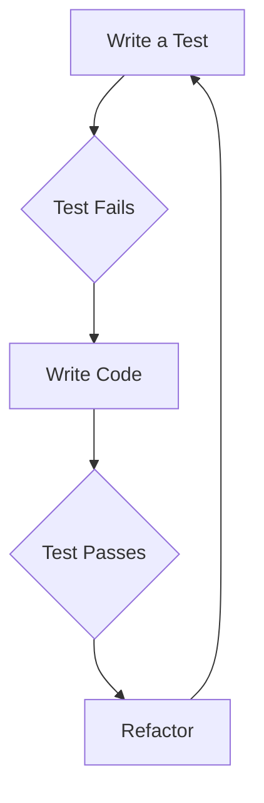

## 21.1. Test-Driven Development (TDD) with Clojure

### Introduction to Test-Driven Development (TDD)

Test-Driven Development (TDD) is a software development approach in which tests are written before the actual code. This methodology emphasizes the importance of writing tests to define the desired functionality, then implementing the minimal amount of code necessary to pass these tests, and finally refactoring the code to improve its structure while ensuring that all tests still pass. TDD is a powerful technique that can lead to better software design, fewer bugs, and more maintainable code.

### The TDD Cycle

The TDD cycle consists of three main steps:

1. **Write a Test**: Start by writing a test for a new feature or functionality. This test should fail initially since the feature is not yet implemented.

2. **Make It Pass**: Write the minimal amount of code necessary to make the test pass. This step focuses on implementing the functionality defined by the test.

3. **Refactor**: Once the test passes, refactor the code to improve its structure and readability without changing its behavior. Ensure that all tests still pass after refactoring.

This cycle is often referred to as "Red-Green-Refactor," where "Red" indicates a failing test, "Green" indicates a passing test, and "Refactor" involves improving the code.

### Integrating TDD with Clojure's REPL-Driven Development

Clojure's REPL (Read-Eval-Print Loop) is a powerful tool for interactive development, allowing developers to test and experiment with code in real-time. Integrating TDD with REPL-driven development can enhance the development process by providing immediate feedback and enabling rapid iteration.

#### Using the REPL for TDD

- **Interactive Testing**: Use the REPL to run tests interactively, allowing for quick feedback and iteration. This can be particularly useful for experimenting with different implementations and refactoring strategies.

- **Incremental Development**: Develop code incrementally by writing small tests and implementing functionality in small steps. This approach aligns well with the REPL's interactive nature.

- **Immediate Feedback**: The REPL provides immediate feedback on code changes, making it easier to identify and fix issues early in the development process.

### Implementing TDD with `clojure.test`

Clojure provides a built-in testing framework called `clojure.test`, which is widely used for writing and running tests. Let's explore how to implement TDD using `clojure.test`.

#### Setting Up `clojure.test`

To use `clojure.test`, include it in your namespace:

```clojure
(ns my-project.core-test
  (:require [clojure.test :refer :all]
            [my-project.core :refer :all]))
```

#### Writing a Test

Start by writing a test for a new feature. For example, let's write a test for a function that adds two numbers:

```clojure
(deftest test-add
  (testing "Addition of two numbers"
    (is (= 5 (add 2 3)))))
```

#### Implementing the Function

Next, implement the `add` function to make the test pass:

```clojure
(defn add [a b]
  (+ a b))
```

#### Running the Test

Run the test using the REPL or a build tool like Leiningen:

```shell
lein test
```

#### Refactoring

Once the test passes, refactor the code if necessary. For example, you might extract common logic into helper functions or improve the function's readability.

### Benefits of TDD

TDD offers several benefits that can significantly improve the software development process:

- **Improved Code Design**: Writing tests first encourages developers to think about the desired functionality and design before implementing code. This can lead to cleaner, more modular code.

- **Faster Debugging**: Tests provide a safety net that can quickly identify issues and prevent regressions. This can reduce the time spent debugging and fixing bugs.

- **Increased Confidence**: With a comprehensive suite of tests, developers can make changes to the codebase with confidence, knowing that any issues will be caught by the tests.

- **Better Documentation**: Tests serve as documentation for the code, providing examples of how the code is expected to behave.

### Common Challenges and Solutions

While TDD offers many benefits, it can also present challenges, especially in a Clojure context. Here are some common challenges and how to overcome them:

- **Test Granularity**: Determining the right level of granularity for tests can be challenging. Aim for small, focused tests that cover specific functionality.

- **Test Maintenance**: As the codebase evolves, tests may need to be updated. Regularly review and refactor tests to ensure they remain relevant and maintainable.

- **Integration with Legacy Code**: Introducing TDD to an existing codebase can be difficult. Start by writing tests for new features and gradually add tests for existing code as it is modified.

- **Performance Considerations**: Running a large suite of tests can be time-consuming. Use tools like `test.check` for property-based testing to reduce the number of test cases while maintaining coverage.

### Try It Yourself

To get hands-on experience with TDD in Clojure, try the following exercises:

1. **Modify the `add` Function**: Extend the `add` function to handle more than two arguments. Write tests to cover this new functionality.

2. **Implement a New Feature**: Choose a simple feature, such as a function to calculate the factorial of a number, and implement it using TDD.

3. **Refactor Existing Code**: Take a piece of existing code and refactor it using TDD. Write tests to cover the current functionality, then refactor the code while ensuring all tests pass.

### Visualizing the TDD Cycle

Below is a diagram illustrating the TDD cycle:



This diagram shows the iterative nature of TDD, where each cycle involves writing a test, implementing code to pass the test, and refactoring the code.

### References and Further Reading

- [Clojure Documentation](https://clojure.org/)
- [clojure.test API](https://clojure.github.io/clojure/clojure.test-api.html)
- [Test-Driven Development by Example](https://www.amazon.com/Test-Driven-Development-Kent-Beck/dp/0321146530) by Kent Beck

### Knowledge Check

- What are the three main steps of the TDD cycle?
- How does TDD integrate with Clojure's REPL-driven development?
- What are some benefits of using TDD in software development?
- How can you overcome the challenge of test maintenance in a TDD workflow?

### Embrace the Journey

Remember, TDD is a journey, not a destination. As you practice TDD, you'll develop a deeper understanding of your code and improve your ability to write clean, maintainable software. Keep experimenting, stay curious, and enjoy the process!

## **Ready to Test Your Knowledge?**



### What is the first step in the TDD cycle?

- [x] Write a test
- [ ] Implement the feature
- [ ] Refactor the code
- [ ] Run the test

> **Explanation:** The first step in the TDD cycle is to write a test for the desired functionality.

### How does TDD improve code design?

- [x] Encourages thinking about functionality before implementation
- [ ] Forces developers to write more code
- [ ] Eliminates the need for documentation
- [ ] Increases the complexity of the code

> **Explanation:** TDD encourages developers to think about the desired functionality and design before implementing code, leading to cleaner, more modular code.

### What tool is commonly used for testing in Clojure?

- [x] clojure.test
- [ ] JUnit
- [ ] Mocha
- [ ] Jasmine

> **Explanation:** `clojure.test` is the built-in testing framework commonly used in Clojure.

### What is a benefit of using the REPL in TDD?

- [x] Provides immediate feedback
- [ ] Slows down the development process
- [ ] Makes code less readable
- [ ] Increases the number of bugs

> **Explanation:** The REPL provides immediate feedback on code changes, making it easier to identify and fix issues early in the development process.

### What is the purpose of refactoring in the TDD cycle?

- [x] Improve code structure and readability
- [ ] Add new features
- [x] Ensure all tests still pass
- [ ] Increase code complexity

> **Explanation:** Refactoring aims to improve the code's structure and readability while ensuring that all tests still pass.

### How can you handle test maintenance in TDD?

- [x] Regularly review and refactor tests
- [ ] Ignore outdated tests
- [ ] Write fewer tests
- [ ] Avoid testing complex features

> **Explanation:** Regularly reviewing and refactoring tests ensures they remain relevant and maintainable.

### What is a common challenge when introducing TDD to an existing codebase?

- [x] Integration with legacy code
- [ ] Writing too many tests
- [ ] Reducing code complexity
- [ ] Eliminating all bugs

> **Explanation:** Introducing TDD to an existing codebase can be challenging due to the need to integrate with legacy code.

### What is the role of `test.check` in Clojure testing?

- [x] Property-based testing
- [ ] Unit testing
- [ ] Integration testing
- [ ] Performance testing

> **Explanation:** `test.check` is used for property-based testing in Clojure, which can reduce the number of test cases while maintaining coverage.

### True or False: TDD eliminates the need for debugging.

- [ ] True
- [x] False

> **Explanation:** While TDD can reduce the time spent debugging, it does not eliminate the need for debugging entirely.

### What is a key takeaway from practicing TDD?

- [x] Improved understanding of code
- [ ] Increased code complexity
- [ ] Reduced need for testing
- [ ] Slower development process

> **Explanation:** Practicing TDD leads to an improved understanding of your code and the ability to write clean, maintainable software.


