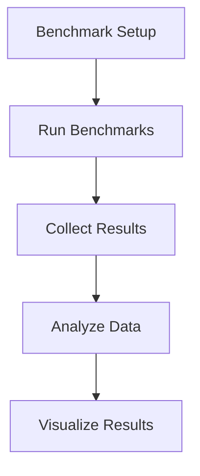

## 21.10. Performance Testing and Benchmarking with Criterium

Performance testing is a crucial aspect of software development, especially when working with a language like Clojure that runs on the Java Virtual Machine (JVM). Understanding how your code performs under various conditions can help you identify bottlenecks and optimize your applications for better efficiency. In this section, we will explore how to use **Criterium**, a powerful library for performance testing and benchmarking in Clojure.

### Why Performance Testing is Essential

Performance testing helps ensure that your application can handle expected loads and perform efficiently. It involves measuring the speed, scalability, and stability of your application under different conditions. Here are some reasons why performance testing is essential:

- **Identify Bottlenecks**: Discover parts of your code that are slow or inefficient.
- **Optimize Resource Usage**: Ensure your application uses CPU, memory, and other resources efficiently.
- **Improve User Experience**: Faster applications lead to better user satisfaction.
- **Ensure Scalability**: Verify that your application can handle increased loads as your user base grows.

### Introduction to Criterium

[Criterium](https://github.com/hugoduncan/criterium) is a Clojure library designed for accurate benchmarking. It provides robust tools for measuring the performance of your code, taking into account JVM warm-up times and other factors that can affect benchmark accuracy.

#### Key Features of Criterium

- **Statistical Analysis**: Provides detailed statistical analysis of benchmark results.
- **JVM Warm-up**: Automatically handles JVM warm-up to ensure accurate measurements.
- **GC Interference Mitigation**: Minimizes the impact of garbage collection on benchmark results.
- **Ease of Use**: Simple API for setting up and running benchmarks.

### Setting Up Criterium

To start using Criterium, you need to add it to your project dependencies. If you're using Leiningen, add the following to your `project.clj`:

```clojure
:dependencies [[criterium "0.4.6"]]
```

For tools.deps, include it in your `deps.edn`:

```clojure
{:deps {criterium {:mvn/version "0.4.6"}}}
```

### Writing Benchmarks with Criterium

Let's explore how to write benchmarks using Criterium. We'll start with a simple example to measure the performance of a function that calculates the sum of a list of numbers.

#### Example: Benchmarking a Sum Function

```clojure
(ns myapp.benchmark
  (:require [criterium.core :refer [bench]]))

(defn sum [numbers]
  (reduce + numbers))

(defn benchmark-sum []
  (let [numbers (range 1 10001)]
    (bench (sum numbers))))
```

In this example, we define a `sum` function that calculates the sum of a list of numbers using `reduce`. The `benchmark-sum` function uses Criterium's `bench` function to measure the performance of the `sum` function.

### Interpreting Benchmark Results

When you run the `benchmark-sum` function, Criterium will output detailed statistics about the performance of the `sum` function. Here's a breakdown of the key metrics:

- **Execution Time**: The time it takes to execute the function.
- **Standard Deviation**: Indicates the variability in execution time.
- **Percentiles**: Provides insights into the distribution of execution times.
- **Garbage Collection**: Information about garbage collection during the benchmark.

#### Example Output

```
Evaluation count : 60 in 6 samples of 10 calls.
             Execution time mean : 1.234567 ms
    Execution time std-deviation : 0.123456 ms
   Execution time lower quantile : 1.123456 ms ( 2.5%)
   Execution time upper quantile : 1.345678 ms (97.5%)
                   Overhead used : 1.234567 ns
```

### Tips for Writing Meaningful Performance Tests

1. **Isolate the Code**: Ensure that the code you're benchmarking is isolated from other operations that might affect performance.
2. **Warm-up the JVM**: Allow the JVM to warm up before taking measurements to get more accurate results.
3. **Use Realistic Data**: Test with data that reflects real-world usage scenarios.
4. **Repeat Measurements**: Run benchmarks multiple times to account for variability.
5. **Consider Garbage Collection**: Be aware of how garbage collection might impact your results.

### Advanced Benchmarking Techniques

#### Using `quick-bench` for Fast Feedback

Criterium also provides a `quick-bench` function for faster feedback during development. It runs fewer iterations and provides quicker results, which can be useful for iterative testing.

```clojure
(quick-bench (sum (range 1 10001)))
```

#### Benchmarking with Different Data Structures

Clojure offers a variety of data structures, each with its own performance characteristics. Benchmarking different data structures can help you choose the most efficient one for your use case.

```clojure
(defn benchmark-data-structures []
  (let [vec (vec (range 1 10001))
        list (list (range 1 10001))]
    (bench (reduce + vec))
    (bench (reduce + list))))
```

### Visualizing Benchmark Results

Visualizing benchmark results can provide additional insights into performance characteristics. While Criterium does not provide built-in visualization tools, you can export results to a format suitable for visualization in tools like Excel or Google Sheets.



### Common Pitfalls in Performance Testing

- **Ignoring JVM Warm-up**: Failing to account for JVM warm-up can lead to misleading results.
- **Overlooking Garbage Collection**: Not considering the impact of garbage collection can skew results.
- **Testing in Isolation**: Ensure that benchmarks reflect real-world usage and are not overly isolated.

### Conclusion

Performance testing and benchmarking are essential practices for optimizing Clojure applications. By using Criterium, you can gain valuable insights into the performance characteristics of your code and make informed decisions about optimizations. Remember, performance testing is an iterative process—keep experimenting, refining, and testing to achieve the best results.

### Further Reading

- [Criterium GitHub Repository](https://github.com/hugoduncan/criterium)
- [Clojure Performance Tips](https://clojure.org/guides/performance)

## **Ready to Test Your Knowledge?**



### What is the primary purpose of performance testing?

- [x] To identify performance bottlenecks
- [ ] To improve code readability
- [ ] To ensure code correctness
- [ ] To enhance security

> **Explanation:** Performance testing is primarily used to identify parts of the code that are slow or inefficient, allowing developers to optimize them.

### Which library is used for performance testing in Clojure?

- [x] Criterium
- [ ] Midje
- [ ] clojure.test
- [ ] Ring

> **Explanation:** Criterium is a Clojure library specifically designed for performance testing and benchmarking.

### What does Criterium automatically handle to ensure accurate measurements?

- [x] JVM warm-up
- [ ] Code formatting
- [ ] Error handling
- [ ] Security checks

> **Explanation:** Criterium automatically handles JVM warm-up to ensure that benchmarks are accurate and not skewed by initial startup costs.

### What is the function used in Criterium for quick feedback during development?

- [x] quick-bench
- [ ] fast-bench
- [ ] rapid-bench
- [ ] instant-bench

> **Explanation:** The `quick-bench` function in Criterium provides faster feedback by running fewer iterations.

### What should you consider when writing meaningful performance tests?

- [x] Isolate the code
- [ ] Use complex data
- [x] Warm-up the JVM
- [ ] Ignore garbage collection

> **Explanation:** Isolating the code and allowing the JVM to warm up are important considerations for accurate performance testing.

### What is a common pitfall in performance testing?

- [x] Ignoring JVM warm-up
- [ ] Using too much data
- [ ] Over-optimizing code
- [ ] Testing too frequently

> **Explanation:** Ignoring JVM warm-up can lead to inaccurate benchmark results, as the JVM needs time to optimize the code execution.

### What is the benefit of visualizing benchmark results?

- [x] Provides additional insights
- [ ] Improves code readability
- [ ] Enhances security
- [ ] Ensures code correctness

> **Explanation:** Visualizing benchmark results can help identify trends and patterns that may not be immediately obvious from raw data.

### What is the output of Criterium's `bench` function?

- [x] Detailed statistical analysis
- [ ] Code coverage report
- [ ] Error log
- [ ] Security audit

> **Explanation:** Criterium's `bench` function provides detailed statistical analysis of the performance of the code being tested.

### What is a key feature of Criterium?

- [x] Statistical analysis
- [ ] Code formatting
- [ ] Error handling
- [ ] Security checks

> **Explanation:** Criterium provides statistical analysis of benchmark results, helping developers understand the performance characteristics of their code.

### True or False: Criterium can be used to measure the performance of any Clojure function.

- [x] True
- [ ] False

> **Explanation:** Criterium is designed to measure the performance of any Clojure function, providing insights into execution time and other metrics.


