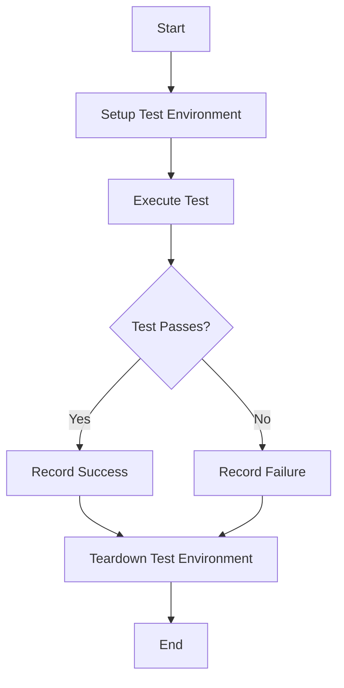

## 21.11. Writing Effective Tests

Testing is a crucial aspect of software development, ensuring that code behaves as expected and remains robust over time. In Clojure, writing effective tests involves leveraging the language's functional programming paradigms, immutability, and expressive syntax. This guide will delve into the principles and best practices for writing clear, maintainable, and effective tests in Clojure.

### The Importance of Testing in Clojure

Before diving into the specifics of writing tests, it's essential to understand why testing is critical in Clojure development. Testing helps:

- **Ensure Code Quality**: By verifying that code behaves as expected, tests help maintain high-quality software.
- **Facilitate Refactoring**: With a comprehensive test suite, developers can refactor code with confidence, knowing that tests will catch regressions.
- **Document Behavior**: Tests serve as documentation, illustrating how functions and modules are intended to work.
- **Encourage Modularity**: Writing tests often leads to more modular and decoupled code, as developers strive to make code testable.

### Principles of Writing Effective Tests

#### Clarity and Simplicity

Effective tests should be clear and simple. They should communicate their purpose without requiring the reader to decipher complex logic. Here are some guidelines to achieve clarity and simplicity:

- **Use Descriptive Names**: Test names should clearly describe what the test is verifying. For example, `test-addition-of-two-positive-numbers` is more descriptive than `test-addition`.
- **Keep Tests Focused**: Each test should focus on a single aspect of the code. This makes it easier to identify the cause of a failure.
- **Avoid Complex Logic**: Tests should not contain complex logic. If a test requires complex setup, consider refactoring the code under test to make it more testable.

#### Test Isolation and Determinism

Tests should be isolated and deterministic to ensure they are reliable and repeatable:

- **Avoid External Dependencies**: Tests should not rely on external systems like databases or network services. Use mocks or stubs to simulate these dependencies.
- **Ensure Determinism**: Tests should produce the same result every time they are run. Avoid using random data or relying on the current time unless explicitly testing randomness or time-based behavior.

#### Structuring and Organizing Tests

Organizing tests effectively can make them easier to maintain and understand:

- **Group Related Tests**: Use namespaces to group related tests together. This helps keep the test suite organized and makes it easier to find specific tests.
- **Use Setup and Teardown Functions**: If tests require common setup or teardown logic, use functions to encapsulate this logic and avoid duplication.
- **Follow a Consistent Structure**: Adopt a consistent structure for tests, such as Arrange-Act-Assert (AAA), to make them easier to read and understand.

#### Naming Conventions

Adopting consistent naming conventions for tests can improve readability and maintainability:

- **Use Verbose Descriptions**: Test names should describe the behavior being tested and the expected outcome.
- **Include Edge Cases**: When testing edge cases, include the edge case in the test name. For example, `test-addition-with-zero` clearly indicates that the test is verifying behavior when adding zero.

#### Testing Edge Cases and Error Conditions

Testing edge cases and error conditions is crucial for ensuring robustness:

- **Identify Edge Cases**: Consider the boundaries of the input domain and test these boundaries explicitly.
- **Test Error Handling**: Verify that error conditions are handled gracefully and that appropriate error messages are returned.

#### Balancing Test Coverage and Maintenance

While high test coverage is desirable, it's essential to balance coverage with maintenance overhead:

- **Focus on Critical Paths**: Prioritize testing critical paths and high-risk areas of the codebase.
- **Avoid Over-Testing**: Avoid writing tests for trivial code that is unlikely to change or break.
- **Regularly Review Tests**: Periodically review the test suite to remove obsolete tests and update tests as the code evolves.

### Code Examples

Let's explore some code examples to illustrate these principles in action.

#### Example 1: Testing a Simple Function

Consider a simple function that adds two numbers:

```clojure
(defn add [a b]
  (+ a b))
```

A clear and effective test for this function might look like this:

```clojure
(ns myapp.core-test
  (:require [clojure.test :refer :all]
            [myapp.core :refer :all]))

(deftest test-addition-of-two-positive-numbers
  (testing "Addition of two positive numbers"
    (is (= 5 (add 2 3)))))

(deftest test-addition-with-zero
  (testing "Addition with zero"
    (is (= 3 (add 3 0)))))
```

- **Descriptive Names**: The test names clearly describe the scenarios being tested.
- **Focused Tests**: Each test focuses on a single scenario, making it easy to identify failures.

#### Example 2: Testing Edge Cases

Let's test a function that divides two numbers, handling division by zero:

```clojure
(defn divide [a b]
  (if (zero? b)
    :division-by-zero
    (/ a b)))
```

The tests for this function might include:

```clojure
(deftest test-division-by-non-zero
  (testing "Division by a non-zero number"
    (is (= 2 (divide 6 3)))))

(deftest test-division-by-zero
  (testing "Division by zero"
    (is (= :division-by-zero (divide 6 0)))))
```

- **Edge Case Testing**: The test suite includes a test for division by zero, an important edge case.
- **Error Handling**: The test verifies that the function returns a specific value when division by zero occurs.

### Visualizing Test Structure

To better understand how tests are structured and executed, let's visualize the process using a flowchart.



**Figure 1**: This flowchart illustrates the typical flow of a test execution, from setup to teardown.

### References and Further Reading

- [Clojure Testing Documentation](https://clojure.org/guides/testing)
- [Effective Testing with Clojure](https://pragprog.com/titles/rspec/effective-testing-with-clojure/)
- [Test-Driven Development by Example](https://www.amazon.com/Test-Driven-Development-Kent-Beck/dp/0321146530)

### Knowledge Check

Let's reinforce what we've learned with some questions and exercises.

## **Ready to Test Your Knowledge?**



### What is the primary purpose of writing tests in Clojure?

- [x] To ensure code behaves as expected and remains robust over time.
- [ ] To increase the complexity of the codebase.
- [ ] To make the code harder to understand.
- [ ] To reduce code quality.

> **Explanation:** Tests help ensure that code behaves as expected and remains robust, facilitating refactoring and serving as documentation.

### Which of the following is a best practice for naming tests?

- [x] Use descriptive names that clearly describe the behavior being tested.
- [ ] Use short, cryptic names to save space.
- [ ] Name tests after the developer who wrote them.
- [ ] Use random names for tests.

> **Explanation:** Descriptive names help communicate the purpose of the test and make it easier to understand what is being verified.

### Why is test isolation important?

- [x] To ensure tests are reliable and repeatable.
- [ ] To make tests dependent on external systems.
- [ ] To increase the complexity of tests.
- [ ] To make tests run slower.

> **Explanation:** Test isolation ensures that tests do not interfere with each other and produce consistent results.

### What should you avoid when writing tests?

- [x] Complex logic within the test code.
- [ ] Descriptive test names.
- [ ] Testing edge cases.
- [ ] Using mocks or stubs.

> **Explanation:** Tests should be simple and focused, avoiding complex logic that can make them difficult to understand and maintain.

### How can you ensure tests are deterministic?

- [x] Avoid using random data or relying on the current time.
- [ ] Use random data to test different scenarios.
- [ ] Depend on external systems for test data.
- [ ] Change the test environment frequently.

> **Explanation:** Deterministic tests produce the same result every time they are run, avoiding randomness and external dependencies.

### What is the benefit of grouping related tests?

- [x] It helps keep the test suite organized and makes it easier to find specific tests.
- [ ] It makes the test suite more complex.
- [ ] It increases the number of test files.
- [ ] It makes tests harder to understand.

> **Explanation:** Grouping related tests helps maintain organization and improves the readability of the test suite.

### Why is it important to test edge cases?

- [x] To ensure robustness by verifying behavior at the boundaries of the input domain.
- [ ] To make tests more complex.
- [ ] To increase the number of tests.
- [ ] To focus only on typical use cases.

> **Explanation:** Testing edge cases helps ensure that the code handles unusual or extreme inputs correctly.

### What is a potential downside of high test coverage?

- [x] Increased maintenance overhead.
- [ ] Improved code quality.
- [ ] Easier refactoring.
- [ ] Better documentation.

> **Explanation:** While high test coverage is beneficial, it can lead to increased maintenance overhead if not managed properly.

### What is the Arrange-Act-Assert (AAA) structure?

- [x] A consistent structure for tests that makes them easier to read and understand.
- [ ] A method for organizing test files.
- [ ] A way to increase test complexity.
- [ ] A strategy for reducing test coverage.

> **Explanation:** The AAA structure helps organize tests by separating setup, execution, and verification steps.

### True or False: Tests should rely on external systems like databases or network services.

- [ ] True
- [x] False

> **Explanation:** Tests should avoid relying on external systems to ensure they are isolated and deterministic.



Remember, writing effective tests is an ongoing process. As you continue to develop and maintain your Clojure applications, keep refining your testing practices to ensure your code remains robust, maintainable, and well-documented. Embrace the journey of continuous improvement, and enjoy the confidence that comes with a comprehensive and effective test suite!
