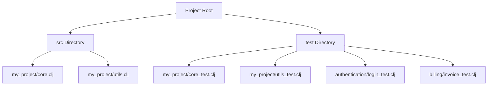

## 21.12. Test Organization and Management

In the realm of software development, testing is a critical component that ensures the reliability and quality of applications. As Clojure projects grow in complexity, organizing and managing tests effectively becomes paramount. This section delves into strategies for structuring test directories and namespaces, grouping tests by feature or module, setting up test fixtures, handling test data, and utilizing tools for managing test suites and dependencies.

### Structuring Test Directories and Namespaces

Organizing test files in a coherent structure is the first step towards effective test management. In Clojure, tests are typically placed in a `test` directory parallel to the `src` directory. This separation helps maintain a clear distinction between production code and test code.

#### Directory Structure

A common directory structure for Clojure projects might look like this:

```
my-clojure-project/
├── src/
│   ├── my_project/
│   │   ├── core.clj
│   │   └── utils.clj
└── test/
    ├── my_project/
    │   ├── core_test.clj
    │   └── utils_test.clj
```

- **`src/` Directory**: Contains the source code of the application.
- **`test/` Directory**: Mirrors the structure of the `src/` directory, with each source file having a corresponding test file.

#### Namespace Conventions

In Clojure, namespaces in test files should reflect the namespaces of the source files they test. For example, the tests for `my_project.core` would reside in `my_project.core_test`. This naming convention aids in quickly locating tests related to specific parts of the codebase.

```clojure
(ns my-project.core-test
  (:require [clojure.test :refer :all]
            [my-project.core :as core]))

(deftest example-test
  (is (= 4 (core/add 2 2))))
```

### Grouping Tests by Feature or Module

Grouping tests logically by feature or module enhances readability and maintainability. This approach allows developers to focus on specific areas of functionality when running tests.

#### Feature-Based Grouping

Organize tests by feature when your application is divided into distinct functional areas. This method is particularly useful for applications with well-defined modules or components.

```
test/
├── authentication/
│   ├── login_test.clj
│   └── registration_test.clj
└── billing/
    ├── invoice_test.clj
    └── payment_test.clj
```

#### Module-Based Grouping

For applications with a modular architecture, grouping tests by module can be beneficial. Each module's tests are contained within its own directory, reflecting the module's structure.

```
test/
├── module-a/
│   ├── feature-x_test.clj
│   └── feature-y_test.clj
└── module-b/
    ├── feature-z_test.clj
    └── feature-w_test.clj
```

### Setting Up Test Fixtures and Shared Contexts

Test fixtures and shared contexts are essential for setting up and tearing down the environment needed for tests. They help ensure that tests run in a consistent state.

#### Test Fixtures

Clojure's `clojure.test` library provides support for test fixtures, which can be functions that set up and tear down the test environment.

```clojure
(use-fixtures :each
  (fn [f]
    (println "Setting up")
    (f)
    (println "Tearing down")))
```

- **`:each` Fixture**: Runs before and after each test.
- **`:once` Fixture**: Runs once before and after all tests in a namespace.

#### Shared Contexts

Shared contexts are useful for tests that require common setup. Define shared data or state that multiple tests can use.

```clojure
(def shared-data {:db "test-db"})

(deftest test-with-shared-data
  (is (= "test-db" (:db shared-data))))
```

### Handling Test Data and Configurations

Managing test data and configurations is crucial for ensuring tests are reproducible and independent.

#### Test Data Management

Use factories or fixtures to create test data. This approach helps maintain consistency and reduces duplication.

```clojure
(defn create-user [name]
  {:name name :id (java.util.UUID/randomUUID)})

(deftest test-user-creation
  (let [user (create-user "Alice")]
    (is (= "Alice" (:name user)))))
```

#### Configuration Management

Separate test configurations from production configurations. Use environment variables or configuration files to manage different settings for testing.

```clojure
(def config
  (if (= (System/getenv "ENV") "test")
    {:db "test-db"}
    {:db "prod-db"}))
```

### Tools for Managing Test Suites and Dependencies

Several tools can aid in managing test suites and dependencies in Clojure projects.

#### Leiningen

Leiningen is a popular build tool for Clojure that supports running tests with the `lein test` command. It can also manage dependencies and plugins for testing.

```clojure
;; project.clj
(defproject my-clojure-project "0.1.0-SNAPSHOT"
  :dependencies [[org.clojure/clojure "1.10.3"]
                 [org.clojure/test.check "1.1.0"]]
  :plugins [[lein-test-refresh "0.24.1"]])
```

#### Test Refresh

Leiningen's `lein-test-refresh` plugin automatically runs tests when files change, providing immediate feedback during development.

#### Test Check

`clojure.test.check` is a property-based testing library that generates test cases based on specifications. It complements traditional example-based testing.

```clojure
(require '[clojure.test.check :as tc]
         '[clojure.test.check.properties :as prop])

(tc/quick-check 100
  (prop/for-all [v (gen/vector gen/int)]
    (= (reverse (reverse v)) v)))
```

### Visualizing Test Organization

To better understand how tests are organized and managed, let's visualize the process using a Mermaid.js diagram.



**Diagram Description**: This diagram illustrates a typical Clojure project structure, highlighting the parallel organization of source and test directories.

### Knowledge Check

Before we conclude, let's pose a few questions to reinforce the concepts covered in this section:

- **Why is it important to mirror the structure of the `src` directory in the `test` directory?**
- **What are the benefits of grouping tests by feature or module?**
- **How do test fixtures contribute to test consistency?**
- **What role does Leiningen play in managing test suites?**

### Embrace the Journey

Remember, organizing and managing tests is an ongoing process that evolves with your project. As you gain experience, you'll develop your own strategies and preferences. Keep experimenting, stay curious, and enjoy the journey of mastering test organization in Clojure!

## **Ready to Test Your Knowledge?**



### Why is it important to mirror the structure of the `src` directory in the `test` directory?

- [x] To maintain a clear correspondence between source files and their tests
- [ ] To reduce the number of test files
- [ ] To increase the complexity of the project
- [ ] To make it harder to find tests

> **Explanation:** Mirroring the structure helps in quickly locating tests related to specific parts of the codebase.

### What is the primary benefit of grouping tests by feature?

- [x] It enhances readability and maintainability
- [ ] It reduces the number of test cases
- [ ] It complicates the test structure
- [ ] It makes tests harder to run

> **Explanation:** Grouping by feature allows developers to focus on specific areas of functionality when running tests.

### How do test fixtures contribute to test consistency?

- [x] By setting up and tearing down the environment needed for tests
- [ ] By increasing the number of test cases
- [ ] By making tests run slower
- [ ] By complicating the test setup

> **Explanation:** Test fixtures ensure that tests run in a consistent state by managing setup and teardown processes.

### What is the role of Leiningen in managing test suites?

- [x] It supports running tests and managing dependencies
- [ ] It only manages dependencies
- [ ] It only runs tests
- [ ] It is not related to testing

> **Explanation:** Leiningen is a build tool that supports running tests and managing dependencies and plugins for testing.

### Which library is used for property-based testing in Clojure?

- [x] clojure.test.check
- [ ] clojure.test
- [ ] clojure.core
- [ ] clojure.data

> **Explanation:** `clojure.test.check` is a property-based testing library that generates test cases based on specifications.

### What is a common use of shared contexts in tests?

- [x] To define shared data or state that multiple tests can use
- [ ] To make tests run slower
- [ ] To increase the complexity of tests
- [ ] To reduce the number of test cases

> **Explanation:** Shared contexts are useful for tests that require common setup, reducing duplication and maintaining consistency.

### How can test data be managed effectively?

- [x] By using factories or fixtures to create test data
- [ ] By hardcoding data in each test
- [ ] By using random data for each test
- [ ] By not using any test data

> **Explanation:** Using factories or fixtures helps maintain consistency and reduces duplication in test data management.

### What is the purpose of the `lein-test-refresh` plugin?

- [x] To automatically run tests when files change
- [ ] To increase the number of test cases
- [ ] To complicate the test setup
- [ ] To make tests run slower

> **Explanation:** `lein-test-refresh` provides immediate feedback during development by automatically running tests when files change.

### What is the benefit of separating test configurations from production configurations?

- [x] It ensures tests are reproducible and independent
- [ ] It increases the complexity of the project
- [ ] It reduces the number of test cases
- [ ] It makes tests run slower

> **Explanation:** Separating configurations ensures that tests run in a controlled environment, independent of production settings.

### True or False: Test fixtures can only be used with `:each` fixtures.

- [ ] True
- [x] False

> **Explanation:** Test fixtures can be used with both `:each` and `:once` fixtures, depending on the desired setup and teardown frequency.




