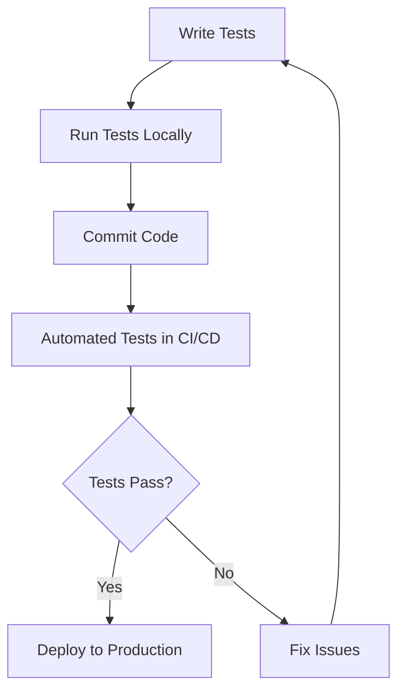

## 21.14. Best Practices in Testing Clojure Applications

Testing is a critical aspect of software development, ensuring that applications function as intended and are free from defects. In Clojure, a functional programming language known for its simplicity and expressiveness, testing takes on unique characteristics that leverage its strengths. This section will guide you through best practices for testing Clojure applications, drawing on principles from earlier topics and providing a comprehensive checklist for effective testing.

### Introduction to Testing in Clojure

Testing in Clojure involves verifying the correctness of your code, ensuring that it behaves as expected under various conditions. Clojure's functional nature, immutability, and expressive syntax make it well-suited for writing concise and effective tests. Let's explore the key concepts and best practices for testing in Clojure.

### Key Concepts in Clojure Testing

1. **Functional Purity**: Clojure's emphasis on pure functions—functions that have no side effects and return the same output for the same input—simplifies testing. Pure functions are easier to test because they don't depend on external state.

2. **Immutability**: Clojure's immutable data structures ensure that data cannot be changed once created. This characteristic reduces the complexity of tests, as you don't need to account for changes in state.

3. **REPL-Driven Development**: The Read-Eval-Print Loop (REPL) in Clojure allows for interactive development and testing. You can quickly test functions and experiment with code snippets in real-time.

4. **Namespaces and Modularity**: Organizing code into namespaces promotes modularity and makes it easier to test individual components in isolation.

### Best Practices for Testing Clojure Applications

#### 1. Write Tests Early and Often

- **Adopt Test-Driven Development (TDD)**: Begin by writing tests before implementing the corresponding functionality. This approach helps clarify requirements and ensures that your code meets the desired behavior from the start.

- **Use `clojure.test` for Unit Testing**: Clojure's built-in testing library, `clojure.test`, provides a simple and effective framework for writing unit tests. It supports assertions, test fixtures, and test runners.

```clojure
(ns myapp.core-test
  (:require [clojure.test :refer :all]
            [myapp.core :refer :all]))

(deftest test-addition
  (testing "Addition of two numbers"
    (is (= 4 (add 2 2)))))
```

- **Leverage Property-Based Testing**: Use libraries like `test.check` for property-based testing, which generates random test cases to explore the behavior of your code under various conditions.

#### 2. Maintain Test Isolation

- **Avoid Shared State**: Ensure that tests do not rely on shared state or external resources. Each test should be independent and not affect others.

- **Use Fixtures for Setup and Teardown**: Fixtures allow you to set up the necessary environment before tests run and clean up afterward. This practice ensures that tests start with a known state.

```clojure
(use-fixtures :each
  (fn [f]
    (setup-database)
    (f)
    (teardown-database)))
```

#### 3. Test for Edge Cases and Error Handling

- **Identify Edge Cases**: Consider edge cases and boundary conditions when writing tests. These scenarios often reveal hidden bugs.

- **Test Error Handling**: Ensure that your code handles errors gracefully. Write tests to verify that exceptions are thrown and handled as expected.

```clojure
(deftest test-division-by-zero
  (testing "Division by zero should throw an exception"
    (is (thrown? ArithmeticException (divide 1 0)))))
```

#### 4. Use Mocking and Stubbing

- **Mock External Dependencies**: When testing functions that interact with external systems (e.g., databases, APIs), use mocking to simulate these interactions. Libraries like `mock` can help create mock objects.

- **Stub Functions for Controlled Behavior**: Stubbing allows you to replace functions with predefined behavior during tests. This technique is useful for isolating the code under test.

#### 5. Ensure Comprehensive Test Coverage

- **Measure Code Coverage**: Use tools like Cloverage to measure test coverage and identify untested code paths. Aim for high coverage, but prioritize meaningful tests over achieving 100% coverage.

- **Test All Code Paths**: Ensure that all branches and conditions in your code are tested. This practice helps catch logic errors and unexpected behavior.

#### 6. Embrace Continuous Integration

- **Automate Testing with CI/CD**: Integrate automated testing into your continuous integration and deployment (CI/CD) pipeline. This practice ensures that tests are run consistently and that code changes do not introduce regressions.

- **Use Docker for Consistent Environments**: Containerize your application and testing environment using Docker. This approach ensures that tests run consistently across different machines and environments.

#### 7. Optimize Test Performance

- **Parallelize Tests**: Run tests in parallel to reduce execution time. Clojure's immutable data structures and functional purity make it easier to parallelize tests without side effects.

- **Profile and Optimize Slow Tests**: Identify and optimize slow tests to improve overall test performance. Use profiling tools to pinpoint bottlenecks.

#### 8. Document and Maintain Tests

- **Write Clear and Descriptive Test Names**: Use descriptive names for test functions and assertions to convey their purpose and expected behavior.

- **Keep Tests Up-to-Date**: Regularly review and update tests as your codebase evolves. Remove obsolete tests and add new ones for new features.

### Avoiding Common Pitfalls and Anti-Patterns

1. **Overusing Macros in Tests**: While macros are powerful, overusing them in tests can lead to complex and hard-to-maintain code. Use macros judiciously and prefer functions for test logic.

2. **Ignoring Test Failures**: Don't ignore failing tests. Investigate and fix the underlying issues promptly to maintain code quality.

3. **Testing Implementation Details**: Focus on testing the behavior and outcomes of your code rather than its internal implementation. This approach makes tests more robust to changes.

4. **Neglecting Integration and System Tests**: While unit tests are essential, don't neglect integration and system tests. These tests verify that components work together as expected.

### Real-World Examples and Anecdotes

- **Case Study: Improving Test Coverage in a Clojure Web Application**: A team working on a Clojure web application identified gaps in their test coverage. By adopting property-based testing and increasing their focus on edge cases, they significantly improved the reliability of their application.

- **Anecdote: The Importance of Test Isolation**: A developer shared an experience where shared state between tests led to intermittent failures. By refactoring tests to eliminate shared state, they achieved consistent and reliable test results.

### Continuous Learning and Adaptation

Testing is an evolving discipline, and staying updated with the latest tools and techniques is crucial. Engage with the Clojure community, attend conferences, and participate in workshops to learn from others' experiences and share your insights.

### Try It Yourself

Experiment with the following code examples to reinforce your understanding of Clojure testing practices. Modify the tests to explore different scenarios and edge cases.

```clojure
(ns myapp.core-test
  (:require [clojure.test :refer :all]
            [myapp.core :refer :all]))

(deftest test-subtraction
  (testing "Subtraction of two numbers"
    (is (= 0 (subtract 2 2)))))

(deftest test-multiplication
  (testing "Multiplication of two numbers"
    (is (= 4 (multiply 2 2)))))
```

### Visualizing Testing Strategies

Below is a flowchart illustrating the testing process in a Clojure application, from writing tests to integrating them into a CI/CD pipeline.



### Summary and Key Takeaways

- **Adopt TDD**: Write tests before implementing functionality to ensure code meets requirements.
- **Maintain Test Isolation**: Avoid shared state and use fixtures for setup and teardown.
- **Test Edge Cases**: Identify and test edge cases and error handling scenarios.
- **Automate Testing**: Integrate automated testing into your CI/CD pipeline for consistent quality assurance.
- **Optimize Performance**: Parallelize tests and profile slow tests to improve performance.

### Ready to Test Your Knowledge?



### What is a key benefit of using pure functions in Clojure testing?

- [x] They are easier to test due to no side effects.
- [ ] They require more complex setup.
- [ ] They depend on external state.
- [ ] They are harder to isolate.

> **Explanation:** Pure functions have no side effects and return the same output for the same input, making them easier to test.

### Which library is commonly used for property-based testing in Clojure?

- [ ] clojure.test
- [x] test.check
- [ ] mock
- [ ] clj-http

> **Explanation:** `test.check` is a library used for property-based testing in Clojure, generating random test cases.

### What is the purpose of using fixtures in tests?

- [x] To set up and clean up the environment before and after tests.
- [ ] To increase test coverage.
- [ ] To mock external dependencies.
- [ ] To parallelize tests.

> **Explanation:** Fixtures are used to set up the necessary environment before tests run and clean up afterward.

### Why is it important to avoid shared state in tests?

- [x] To ensure tests are independent and do not affect each other.
- [ ] To increase test complexity.
- [ ] To reduce test coverage.
- [ ] To make tests run slower.

> **Explanation:** Avoiding shared state ensures that tests are independent and do not affect each other, leading to more reliable results.

### What is a common pitfall when using macros in tests?

- [x] Overusing them can lead to complex and hard-to-maintain code.
- [ ] They simplify test logic.
- [ ] They improve test performance.
- [ ] They increase test coverage.

> **Explanation:** Overusing macros in tests can lead to complex and hard-to-maintain code, so they should be used judiciously.

### How can you measure test coverage in Clojure?

- [ ] Using clojure.test
- [x] Using Cloverage
- [ ] Using test.check
- [ ] Using Docker

> **Explanation:** Cloverage is a tool used to measure test coverage in Clojure applications.

### What is the benefit of automating tests in a CI/CD pipeline?

- [x] Ensures tests are run consistently and code changes do not introduce regressions.
- [ ] Increases test complexity.
- [ ] Reduces test coverage.
- [ ] Slows down the deployment process.

> **Explanation:** Automating tests in a CI/CD pipeline ensures that tests are run consistently and code changes do not introduce regressions.

### Why is it important to test edge cases?

- [x] They often reveal hidden bugs.
- [ ] They are less important than other tests.
- [ ] They increase test complexity.
- [ ] They reduce test coverage.

> **Explanation:** Testing edge cases is important because they often reveal hidden bugs and ensure the robustness of the application.

### What should you focus on when writing tests?

- [x] Testing the behavior and outcomes of the code.
- [ ] Testing the internal implementation details.
- [ ] Increasing test complexity.
- [ ] Reducing test coverage.

> **Explanation:** Focus on testing the behavior and outcomes of the code rather than its internal implementation details for more robust tests.

### True or False: It is acceptable to ignore failing tests if they are not critical.

- [ ] True
- [x] False

> **Explanation:** Ignoring failing tests is not acceptable, as it can lead to undetected issues and reduced code quality.



Remember, testing is an ongoing journey. As you continue to develop and maintain Clojure applications, keep refining your testing strategies and learning from the community. Happy testing!
