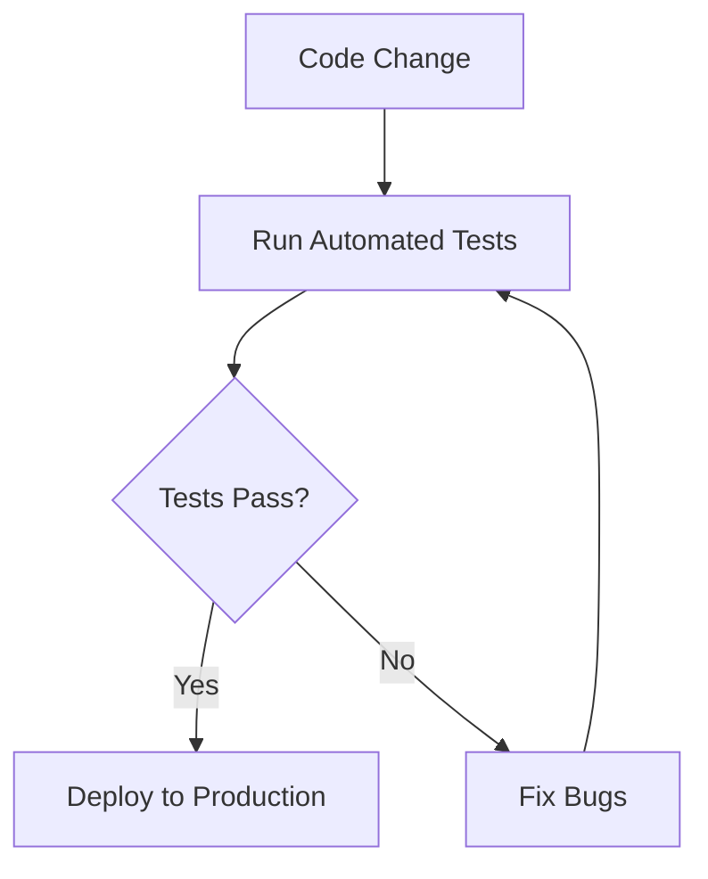

## 21.15. Regression Testing and Bug Tracking

In the ever-evolving landscape of software development, maintaining the quality and reliability of your codebase is paramount. Regression testing and bug tracking are two critical practices that help ensure that new changes do not introduce unexpected issues and that existing bugs are effectively managed. In this section, we will delve into the concepts of regression testing and bug tracking, explore their importance, and provide practical strategies for integrating these practices into your Clojure development workflow.

### Understanding Regression Testing

**Regression testing** is a type of software testing that ensures that recent code changes have not adversely affected existing functionality. It is a crucial step in the software development lifecycle, as it helps maintain the integrity of the application by catching bugs that may have been inadvertently introduced during development.

#### Importance of Regression Testing

1. **Ensures Stability**: By verifying that new changes do not break existing features, regression testing helps maintain the stability of the software.
2. **Facilitates Continuous Integration**: Regular regression testing supports continuous integration practices by providing immediate feedback on the impact of code changes.
3. **Reduces Risk**: It minimizes the risk of deploying faulty code to production, thereby protecting the user experience and the reputation of the software.
4. **Supports Agile Development**: In agile environments, where changes are frequent, regression testing ensures that the pace of development does not compromise quality.

### Integrating Regression Tests in the Development Cycle

To effectively integrate regression testing into your development cycle, consider the following strategies:

#### 1. **Automate Regression Tests**

Automating regression tests is essential for efficiency and consistency. Automated tests can be run frequently and provide quick feedback, allowing developers to identify and address issues early in the development process.

```clojure
(ns myapp.test.core
  (:require [clojure.test :refer :all]
            [myapp.core :refer :all]))

(deftest test-addition
  (testing "Addition function"
    (is (= 4 (add 2 2)))
    (is (= 0 (add -1 1)))))
```

In this example, we define a simple automated test for an addition function using `clojure.test`. Automated tests like these can be run as part of a continuous integration pipeline to ensure that changes do not introduce regressions.

#### 2. **Use Continuous Integration Tools**

Integrate regression tests with continuous integration (CI) tools such as Jenkins, Travis CI, or GitHub Actions. These tools can automatically run your test suite whenever changes are pushed to the repository, providing immediate feedback on the impact of those changes.

#### 3. **Prioritize Test Coverage**

Focus on achieving high test coverage for critical parts of your application. Use tools like `cloverage` to measure test coverage and identify areas that require additional testing.

#### 4. **Regularly Update Test Suites**

As your application evolves, so should your test suites. Regularly review and update your tests to cover new features and changes in functionality.

### Tools for Bug Tracking

Effective bug tracking is essential for managing and resolving issues in a timely manner. Several tools can help streamline this process:

#### 1. **Jira**

Jira is a popular bug tracking and project management tool that allows teams to track issues, plan sprints, and manage workflows. It provides a comprehensive platform for organizing and prioritizing bugs.

#### 2. **GitHub Issues**

For teams using GitHub, GitHub Issues offers a simple and integrated way to track bugs and feature requests. It supports labels, milestones, and project boards for organizing issues.

#### 3. **Trello**

Trello is a flexible project management tool that can be adapted for bug tracking. Its card-based interface allows teams to visualize and manage bugs in a Kanban-style workflow.

### Strategies for Prioritizing and Fixing Bugs

Once bugs are identified, it's important to prioritize and address them effectively. Here are some strategies to consider:

#### 1. **Categorize Bugs by Severity**

Classify bugs based on their impact on the application. Critical bugs that affect core functionality should be prioritized over minor issues.

#### 2. **Use a Bug Triage Process**

Implement a bug triage process to review and prioritize bugs regularly. This involves assessing the severity, impact, and urgency of each bug and deciding on the appropriate course of action.

#### 3. **Assign Bugs to the Right Team Members**

Ensure that bugs are assigned to team members with the appropriate expertise to resolve them efficiently.

#### 4. **Track Bug Resolution Progress**

Use your bug tracking tool to monitor the progress of bug resolution. This helps ensure that bugs are addressed in a timely manner and that stakeholders are kept informed.

### The Role of Automated Tests in Preventing Regressions

Automated tests play a crucial role in preventing regressions by providing a safety net that catches issues before they reach production. Here are some best practices for leveraging automated tests:

#### 1. **Develop a Comprehensive Test Suite**

Ensure that your test suite covers all critical functionality and edge cases. This increases the likelihood of catching regressions early.

#### 2. **Run Tests Frequently**

Run your automated tests frequently, ideally as part of a CI pipeline. This provides continuous feedback and helps identify issues as soon as they are introduced.

#### 3. **Use Test-Driven Development (TDD)**

Adopt TDD practices to write tests before implementing new features. This ensures that tests are in place to catch regressions from the outset.

#### 4. **Incorporate Regression Tests into Code Reviews**

Include regression tests as part of the code review process. This encourages developers to consider the impact of their changes on existing functionality.

### Visualizing the Regression Testing Workflow

To better understand the regression testing workflow, let's visualize it using a flowchart:



**Figure 1**: This flowchart illustrates the regression testing workflow, where code changes trigger automated tests. If tests pass, the code is deployed to production. If tests fail, bugs are fixed, and tests are rerun.

### Knowledge Check

- **What is regression testing, and why is it important?**
- **How can automated tests help prevent regressions?**
- **What are some popular tools for bug tracking?**
- **How should bugs be prioritized and managed?**

### Summary

Regression testing and bug tracking are essential practices for maintaining the quality and reliability of your software. By integrating automated tests into your development workflow and using effective bug tracking tools, you can catch and address issues early, ensuring that your application remains stable and robust. Remember, this is just the beginning. As you progress, you'll build more complex and interactive applications. Keep experimenting, stay curious, and enjoy the journey!

## **Ready to Test Your Knowledge?**



### What is the primary goal of regression testing?

- [x] To ensure new code changes do not break existing functionality
- [ ] To test new features only
- [ ] To optimize code performance
- [ ] To refactor code for better readability

> **Explanation:** Regression testing focuses on verifying that recent changes have not adversely affected existing features.

### Which tool is commonly used for bug tracking in software development?

- [x] Jira
- [ ] Docker
- [ ] Kubernetes
- [ ] Ansible

> **Explanation:** Jira is a popular tool for bug tracking and project management.

### How can automated tests be integrated into the development process?

- [x] By using continuous integration tools
- [ ] By manually running tests after each deployment
- [ ] By writing tests after the project is completed
- [ ] By using them only for performance testing

> **Explanation:** Continuous integration tools can automatically run tests whenever changes are made, providing immediate feedback.

### What is a key benefit of using automated regression tests?

- [x] They provide quick feedback on code changes
- [ ] They eliminate the need for manual testing
- [ ] They are only useful for large projects
- [ ] They replace the need for bug tracking

> **Explanation:** Automated tests offer quick feedback, allowing developers to identify issues early.

### What is a common strategy for prioritizing bugs?

- [x] Categorizing bugs by severity
- [ ] Fixing bugs in the order they were reported
- [ ] Assigning all bugs to a single developer
- [ ] Ignoring minor bugs

> **Explanation:** Categorizing bugs by severity helps prioritize those that have the most significant impact.

### What role does TDD play in regression testing?

- [x] It ensures tests are written before features are implemented
- [ ] It eliminates the need for regression tests
- [ ] It focuses on performance optimization
- [ ] It is only applicable to UI testing

> **Explanation:** TDD encourages writing tests before implementing features, ensuring tests are in place to catch regressions.

### Which of the following is a benefit of using a bug tracking tool?

- [x] It helps organize and prioritize bugs
- [ ] It automatically fixes bugs
- [ ] It eliminates the need for testing
- [ ] It is only useful for large teams

> **Explanation:** Bug tracking tools help teams organize, prioritize, and manage bugs effectively.

### What is a key component of a regression testing workflow?

- [x] Automated tests
- [ ] Manual code reviews
- [ ] Performance benchmarks
- [ ] User feedback

> **Explanation:** Automated tests are a crucial part of regression testing workflows, providing consistent and efficient verification.

### How can test coverage be measured in Clojure?

- [x] Using tools like `cloverage`
- [ ] By manually reviewing test cases
- [ ] By counting the number of tests
- [ ] By using performance profiling tools

> **Explanation:** `cloverage` is a tool that measures test coverage in Clojure projects.

### True or False: Regression testing is only necessary for large projects.

- [ ] True
- [x] False

> **Explanation:** Regression testing is important for projects of all sizes to ensure code changes do not introduce new issues.


