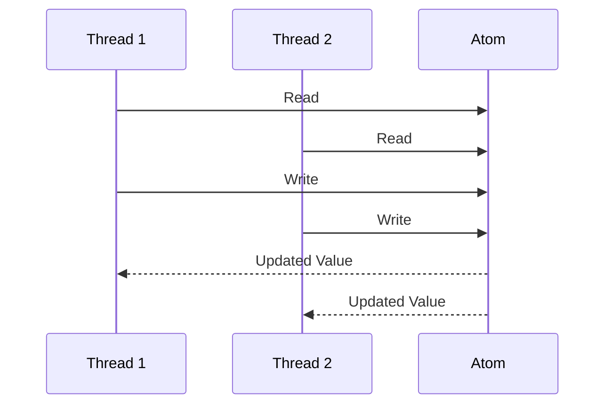

## 21.16. Testing Patterns in Concurrency

Concurrency in programming introduces complexities that can lead to subtle and hard-to-detect bugs. In Clojure, with its rich set of concurrency primitives like atoms, refs, agents, and software transactional memory (STM), testing concurrent code becomes crucial to ensure correctness and reliability. This section delves into the intricacies of testing concurrent and multithreaded code in Clojure, providing you with techniques and tools to simulate concurrent interactions, detect race conditions, and perform stress testing.

### Understanding the Complexities of Concurrent Programming

Concurrent programming involves multiple computations happening simultaneously, which can lead to issues such as race conditions, deadlocks, and inconsistent state. These problems arise due to the non-deterministic nature of thread execution order, making it challenging to predict and reproduce bugs.

#### Key Challenges in Concurrent Programming

- **Race Conditions**: Occur when multiple threads access shared data simultaneously, leading to unpredictable results.
- **Deadlocks**: Happen when two or more threads are waiting indefinitely for resources held by each other.
- **Starvation**: Occurs when a thread is perpetually denied access to resources, preventing it from making progress.
- **Consistency**: Ensuring that shared data remains consistent across different threads.

### Techniques for Testing Concurrent Code in Clojure

Clojure provides several concurrency primitives that help manage shared state and ensure thread safety. Let's explore how to test code using these primitives effectively.

#### Testing with Atoms

Atoms provide a way to manage shared, mutable state in a thread-safe manner. They are ideal for scenarios where updates are independent and do not require coordination.

```clojure
(def counter (atom 0))

(defn increment-counter []
  (swap! counter inc))

;; Test function to simulate concurrent increments
(defn test-concurrent-increments []
  (let [threads (repeatedly 100 #(future (increment-counter)))]
    (doseq [t threads] @t)
    @counter))

;; Run the test
(println "Final counter value:" (test-concurrent-increments))
```

In this example, we create an atom `counter` and a function `increment-counter` that increments its value. We then simulate concurrent increments using futures and verify the final value of the counter.

#### Testing with Refs and STM

Refs and STM (Software Transactional Memory) are used when multiple pieces of state need to be coordinated. STM ensures that transactions are atomic, consistent, isolated, and durable (ACID).

```clojure
(def account-a (ref 100))
(def account-b (ref 200))

(defn transfer [from to amount]
  (dosync
    (alter from - amount)
    (alter to + amount)))

;; Test function to simulate concurrent transfers
(defn test-concurrent-transfers []
  (let [threads (repeatedly 100 #(future (transfer account-a account-b 10)))]
    (doseq [t threads] @t)
    {:account-a @account-a :account-b @account-b}))

;; Run the test
(println "Final account balances:" (test-concurrent-transfers))
```

In this example, we define two accounts as refs and a `transfer` function that moves money between them. We simulate concurrent transfers and check the final balances to ensure correctness.

#### Testing with Agents

Agents are suitable for managing independent, asynchronous updates to shared state. They provide a way to handle state changes without blocking the calling thread.

```clojure
(def agent-counter (agent 0))

(defn increment-agent-counter []
  (send agent-counter inc))

;; Test function to simulate concurrent agent updates
(defn test-concurrent-agent-updates []
  (let [threads (repeatedly 100 #(future (increment-agent-counter)))]
    (doseq [t threads] @t)
    @agent-counter))

;; Run the test
(println "Final agent counter value:" (test-concurrent-agent-updates))
```

Here, we use an agent to manage a counter and simulate concurrent updates. The final value of the agent counter is checked to ensure it reflects all increments.

### Simulating Concurrent Interactions and Race Conditions

To effectively test concurrent code, it's essential to simulate real-world scenarios where race conditions might occur. This involves creating tests that run code under various conditions and verifying the outcomes.

#### Using `stm-stress` for Stress Testing

The `stm-stress` library is a tool designed to stress test STM transactions in Clojure. It helps identify potential issues by running transactions under heavy load.

```clojure
(require '[stm-stress.core :as stm])

(defn stress-test []
  (stm/stress-test
    (fn []
      (dosync
        (alter account-a - 10)
        (alter account-b + 10)))
    :threads 100
    :iterations 1000))

;; Run the stress test
(stress-test)
```

In this example, we use `stm-stress` to perform stress testing on the `transfer` function, simulating a high number of concurrent transactions to ensure robustness.

### Addressing Synchronization and Timing Issues in Tests

Synchronization and timing issues can lead to flaky tests that pass or fail unpredictably. To address these issues, consider the following strategies:

- **Use Timeouts**: Set timeouts for operations that might block indefinitely.
- **Introduce Delays**: Add artificial delays to simulate real-world conditions and expose timing issues.
- **Repeat Tests**: Run tests multiple times to increase the likelihood of catching intermittent failures.

### Visualizing Concurrency Testing

To better understand the flow of concurrent operations, we can use diagrams to visualize the interactions between threads and shared state.



This sequence diagram illustrates two threads interacting with an atom, highlighting potential race conditions when both threads read and write concurrently.

### Best Practices for Testing Concurrent Code

- **Isolate Tests**: Ensure tests do not interfere with each other by isolating shared state.
- **Use Mocking**: Mock dependencies to focus on the concurrency aspects of the code.
- **Automate Testing**: Integrate concurrency tests into your CI/CD pipeline to catch issues early.
- **Review Code**: Regularly review and refactor code to simplify concurrency logic and reduce potential errors.

### Knowledge Check

Before we conclude, let's reinforce our understanding with a few questions:

- What are the key challenges in concurrent programming?
- How can atoms be used to manage shared state in a thread-safe manner?
- What role does STM play in ensuring consistency across multiple pieces of state?
- How can `stm-stress` help in testing concurrent code?

### Embrace the Journey

Remember, mastering concurrency testing is a journey. As you progress, you'll develop a deeper understanding of Clojure's concurrency primitives and how to test them effectively. Keep experimenting, stay curious, and enjoy the journey!

## **Ready to Test Your Knowledge?**



### What is a race condition?

- [x] A situation where the outcome depends on the non-deterministic order of execution.
- [ ] A condition where a program runs out of memory.
- [ ] A scenario where a program enters an infinite loop.
- [ ] A state where a program crashes unexpectedly.

> **Explanation:** A race condition occurs when the outcome of a program depends on the timing or order of execution of concurrent threads.

### Which Clojure primitive is best for managing independent, asynchronous updates?

- [ ] Atoms
- [ ] Refs
- [x] Agents
- [ ] Vars

> **Explanation:** Agents are designed for managing independent, asynchronous updates to shared state without blocking the calling thread.

### What does STM stand for?

- [x] Software Transactional Memory
- [ ] Synchronous Thread Management
- [ ] State Transfer Mechanism
- [ ] Shared Task Manager

> **Explanation:** STM stands for Software Transactional Memory, a concurrency control mechanism that ensures atomicity and consistency.

### How can you simulate race conditions in tests?

- [x] By running code under various concurrent conditions and verifying outcomes.
- [ ] By using a single-threaded execution model.
- [ ] By avoiding shared state in tests.
- [ ] By using only synchronous operations.

> **Explanation:** Simulating race conditions involves creating tests that run code under various concurrent conditions to verify outcomes.

### What is the purpose of `stm-stress`?

- [x] To stress test STM transactions under heavy load.
- [ ] To optimize memory usage in Clojure applications.
- [ ] To manage thread pools efficiently.
- [ ] To serialize data for network transmission.

> **Explanation:** `stm-stress` is a tool for stress testing STM transactions, helping identify potential issues under heavy load.

### How can you address synchronization issues in tests?

- [x] Use timeouts and introduce delays.
- [ ] Ignore timing issues.
- [ ] Run tests only once.
- [ ] Avoid using concurrency primitives.

> **Explanation:** Addressing synchronization issues involves using timeouts, introducing delays, and repeating tests to catch intermittent failures.

### What is the role of `dosync` in Clojure?

- [x] To create a transactional context for refs.
- [ ] To synchronize access to atoms.
- [ ] To manage asynchronous updates with agents.
- [ ] To define a namespace.

> **Explanation:** `dosync` is used to create a transactional context for refs, ensuring atomic and consistent updates.

### Which concurrency primitive is suitable for coordinated state updates?

- [ ] Atoms
- [x] Refs
- [ ] Agents
- [ ] Vars

> **Explanation:** Refs are suitable for coordinated state updates, as they allow multiple pieces of state to be updated transactionally.

### What is a deadlock?

- [x] A situation where two or more threads are waiting indefinitely for resources held by each other.
- [ ] A condition where a program runs out of memory.
- [ ] A scenario where a program enters an infinite loop.
- [ ] A state where a program crashes unexpectedly.

> **Explanation:** A deadlock occurs when two or more threads are waiting indefinitely for resources held by each other, preventing progress.

### True or False: Agents block the calling thread during updates.

- [ ] True
- [x] False

> **Explanation:** Agents do not block the calling thread during updates; they handle state changes asynchronously.



By understanding and applying these testing patterns, you can ensure that your concurrent Clojure code is robust, reliable, and free from subtle concurrency-related bugs.
