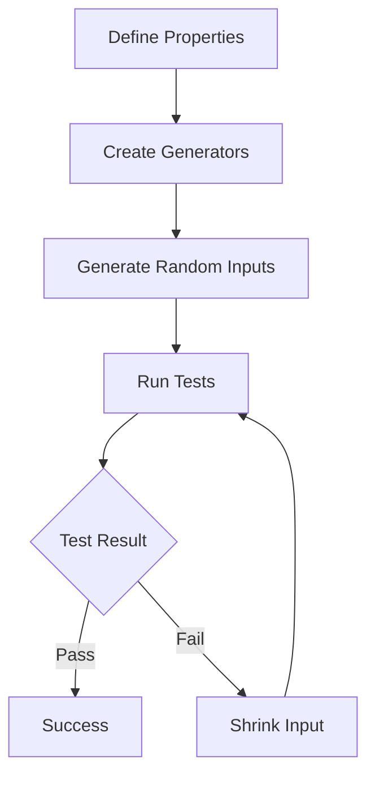

## 21.17. Generative Testing Techniques

In the realm of software development, testing is a crucial component that ensures the reliability and correctness of applications. While traditional testing methods involve writing specific test cases, generative testing takes a different approach by automatically generating a wide range of test scenarios based on defined specifications. This technique is particularly powerful in uncovering edge cases that might be missed in manual testing. In this section, we will delve into the world of generative testing in Clojure, focusing on the use of the `test.check` library to create robust and comprehensive test suites.

### Understanding Generative Testing

Generative testing, also known as property-based testing, is a testing methodology where the properties of the system under test are defined, and test cases are automatically generated to verify these properties. Unlike traditional testing, which involves writing explicit test cases, generative testing focuses on the behavior and characteristics of the system.

#### Key Concepts

- **Properties**: These are the expected behaviors or characteristics of the system. Properties are defined as logical assertions that should hold true for any input.
- **Generators**: These are responsible for producing random input data for the tests. Generators can create a wide variety of inputs, including edge cases, to thoroughly test the system.
- **Shrinking**: When a test fails, shrinking attempts to find the smallest input that still causes the failure, making it easier to diagnose the problem.

### How Generative Testing Differs from Traditional Testing

Traditional testing involves writing specific test cases with predefined inputs and expected outputs. This approach can be limited by the developer's ability to anticipate all possible scenarios, especially edge cases. Generative testing, on the other hand, uses random data generation to explore a vast space of possible inputs, increasing the likelihood of discovering unexpected behaviors.

### Using `test.check` for Generative Testing in Clojure

Clojure's `test.check` library is a powerful tool for implementing generative testing. It allows developers to define properties and generators, automatically generating test cases to verify the properties.

#### Setting Up `test.check`

To get started with `test.check`, add it to your project dependencies:

```clojure
;; Add to your project.clj or deps.edn
{:deps {org.clojure/test.check {:mvn/version "1.1.0"}}}
```

#### Defining Generators

Generators are at the heart of generative testing. They produce random data that is used to test the properties of your system. `test.check` provides a variety of built-in generators, and you can also create custom generators.

```clojure
(require '[clojure.test.check.generators :as gen])

;; Example: Generating random integers
(def int-gen (gen/int))

;; Example: Generating random strings
(def string-gen (gen/string))

;; Example: Custom generator for even numbers
(def even-gen (gen/fmap #(* 2 %) gen/int))
```

#### Defining Properties

Properties are logical assertions about your system that should hold true for any input generated by the generators. You define properties using the `defspec` macro.

```clojure
(require '[clojure.test.check.properties :as prop])
(require '[clojure.test.check :as tc])

;; Example: Property that checks if reversing a list twice returns the original list
(defspec reverse-twice-is-original
  100 ;; Number of tests to run
  (prop/for-all [v (gen/vector int-gen)]
    (= v (reverse (reverse v)))))
```

In this example, the property asserts that reversing a list twice should yield the original list. The `gen/vector int-gen` generator produces random vectors of integers for testing.

### Benefits of Generative Testing

Generative testing offers several advantages over traditional testing:

1. **Uncovering Edge Cases**: By generating a wide range of inputs, generative testing is more likely to uncover edge cases that might be missed in manual testing.

2. **Increased Test Coverage**: Generative testing explores a larger space of possible inputs, providing more comprehensive test coverage.

3. **Simplified Test Maintenance**: Since properties are defined at a higher level of abstraction, tests are less brittle and require less maintenance when the system changes.

4. **Automatic Test Case Generation**: Developers do not need to manually write every test case, saving time and effort.

### Challenges in Specifying Correct Properties

While generative testing is powerful, it also presents challenges, particularly in specifying correct properties:

- **Complexity in Property Definition**: Defining properties that accurately capture the desired behavior of the system can be challenging, especially for complex systems.

- **False Positives/Negatives**: Incorrectly specified properties can lead to false positives (tests passing when they should fail) or false negatives (tests failing when they should pass).

- **Understanding Failures**: When a test fails, understanding the cause can be difficult, especially if the property is complex or the input data is large.

### Visualizing the Generative Testing Process

To better understand the generative testing process, let's visualize it using a flowchart:



**Figure 1**: The generative testing process involves defining properties, creating generators, generating random inputs, running tests, and shrinking inputs when tests fail.

### Example: Testing a Sorting Function

Let's apply generative testing to a sorting function. We want to verify that the function correctly sorts a list of integers.

```clojure
(defn sort-fn [coll]
  (sort coll))

(defspec sort-is-idempotent
  100
  (prop/for-all [v (gen/vector int-gen)]
    (= (sort-fn v) (sort-fn (sort-fn v)))))

(defspec sort-preserves-elements
  100
  (prop/for-all [v (gen/vector int-gen)]
    (= (set v) (set (sort-fn v)))))

(defspec sort-produces-ordered-output
  100
  (prop/for-all [v (gen/vector int-gen)]
    (let [sorted (sort-fn v)]
      (every? (fn [[a b]] (<= a b)) (partition 2 1 sorted)))))
```

In this example, we define three properties for the sorting function:

1. **Idempotency**: Sorting a list twice should yield the same result as sorting it once.
2. **Element Preservation**: The sorted list should contain the same elements as the original list.
3. **Ordered Output**: The elements in the sorted list should be in non-decreasing order.

### Try It Yourself

Experiment with the code examples provided. Try modifying the generators to produce different types of data, or define new properties for other functions in your codebase. This hands-on approach will deepen your understanding of generative testing.

### References and Further Reading

- [Clojure `test.check` GitHub Repository](https://github.com/clojure/test.check)
- [Property-Based Testing with `test.check` - ClojureDocs](https://clojuredocs.org/clojure.test.check)
- [Introduction to Property-Based Testing - Martin Fowler](https://martinfowler.com/articles/property-based-testing.html)

### Knowledge Check

To reinforce your understanding of generative testing techniques, let's explore some questions and challenges.

## **Ready to Test Your Knowledge?**



### What is the primary advantage of generative testing over traditional testing?

- [x] It automatically generates a wide range of test scenarios.
- [ ] It requires less setup time.
- [ ] It is easier to write than traditional tests.
- [ ] It does not require any input data.

> **Explanation:** Generative testing automatically generates a wide range of test scenarios, increasing the likelihood of uncovering edge cases.

### Which Clojure library is commonly used for generative testing?

- [x] `test.check`
- [ ] `clojure.test`
- [ ] `midje`
- [ ] `expectations`

> **Explanation:** `test.check` is the Clojure library commonly used for generative testing.

### What is the role of a generator in generative testing?

- [x] To produce random input data for tests.
- [ ] To define the expected output of a test.
- [ ] To execute the test cases.
- [ ] To log test results.

> **Explanation:** Generators produce random input data for tests, allowing the exploration of a wide range of scenarios.

### What is shrinking in the context of generative testing?

- [x] Finding the smallest input that causes a test to fail.
- [ ] Reducing the number of test cases.
- [ ] Minimizing the test execution time.
- [ ] Compressing test results.

> **Explanation:** Shrinking is the process of finding the smallest input that still causes a test to fail, aiding in diagnosing the problem.

### Which of the following is a challenge in generative testing?

- [x] Specifying correct properties.
- [ ] Writing test cases manually.
- [ ] Managing test dependencies.
- [ ] Setting up the testing environment.

> **Explanation:** Specifying correct properties can be challenging in generative testing, as incorrect properties can lead to false positives or negatives.

### How does generative testing increase test coverage?

- [x] By exploring a larger space of possible inputs.
- [ ] By reducing the number of test cases.
- [ ] By focusing on specific edge cases.
- [ ] By using predefined inputs.

> **Explanation:** Generative testing increases test coverage by exploring a larger space of possible inputs, including edge cases.

### What is a property in the context of generative testing?

- [x] A logical assertion about the system under test.
- [ ] A specific test case with predefined inputs.
- [ ] A configuration setting for the test environment.
- [ ] A type of generator used in tests.

> **Explanation:** A property is a logical assertion about the system under test that should hold true for any input.

### What is the purpose of the `defspec` macro in `test.check`?

- [x] To define a property-based test.
- [ ] To create a new generator.
- [ ] To execute a test case.
- [ ] To log test results.

> **Explanation:** The `defspec` macro is used to define a property-based test in `test.check`.

### True or False: Generative testing can help uncover edge cases that might be missed in manual testing.

- [x] True
- [ ] False

> **Explanation:** True. Generative testing can help uncover edge cases by generating a wide range of inputs.

### What is the benefit of using `test.check` for generative testing in Clojure?

- [x] It provides a powerful framework for defining properties and generators.
- [ ] It simplifies the process of writing traditional test cases.
- [ ] It eliminates the need for any manual testing.
- [ ] It automatically fixes bugs in the code.

> **Explanation:** `test.check` provides a powerful framework for defining properties and generators, facilitating generative testing in Clojure.



Remember, mastering generative testing techniques is a journey. As you continue to explore and experiment with these concepts, you'll gain deeper insights into the behavior of your software, leading to more robust and reliable applications. Keep pushing the boundaries, stay curious, and enjoy the process of discovery!
