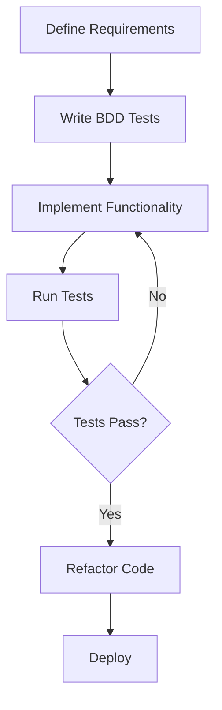

## 21.18. BDD-Style Testing with `expectations` and `midje`

Behavior-Driven Development (BDD) is a software development approach that emphasizes collaboration between developers, QA, and non-technical stakeholders. It encourages writing tests in a language that is easily understandable by all parties involved, focusing on the behavior of the application rather than its implementation details. In Clojure, two popular frameworks for implementing BDD-style testing are **Expectations** and **Midje**. This section will explore these frameworks, their features, and how they can be integrated into your development workflow to enhance test readability and expressiveness.

### Introduction to BDD Concepts

Behavior-Driven Development extends Test-Driven Development (TDD) by using natural language constructs to describe the behavior of software. The primary goal of BDD is to improve communication between technical and non-technical team members, ensuring that everyone has a clear understanding of the requirements and expected outcomes.

#### Advantages of BDD

1. **Improved Communication**: BDD encourages collaboration and communication among team members, leading to a shared understanding of the project requirements.
2. **Readable Tests**: Tests are written in a way that describes the behavior of the application, making them more readable and understandable.
3. **Focus on Behavior**: By focusing on the behavior rather than the implementation, BDD helps ensure that the software meets the user's needs.
4. **Early Detection of Issues**: BDD tests can help identify issues early in the development process, reducing the cost and effort required to fix them later.

### Comparing `expectations` and `midje`

Both **Expectations** and **Midje** are designed to facilitate BDD-style testing in Clojure, but they have different philosophies and features.

#### Expectations

- **Simplicity**: Expectations is known for its simplicity and ease of use. It provides a minimalistic syntax that is easy to read and write.
- **Focus on Assertions**: The framework focuses on assertions, allowing developers to express expectations about the behavior of their code.
- **Integration with Clojure**: Expectations integrates seamlessly with Clojure's existing testing infrastructure.

#### Midje

- **Expressiveness**: Midje offers a more expressive syntax, allowing for more detailed and descriptive tests.
- **Flexible Testing**: It provides flexibility in defining tests, including support for mocking and stubbing.
- **Rich Reporting**: Midje offers rich reporting features, making it easier to understand test results and diagnose issues.

### Writing BDD-Style Tests

Let's explore how to write BDD-style tests using both Expectations and Midje, starting with Expectations.

#### Writing Tests with Expectations

Expectations uses a simple syntax to define tests. Here's an example of a basic test using Expectations:

```clojure
(ns myapp.core-test
  (:require [expectations :refer :all]
            [myapp.core :refer :all]))

(expect 4 (add 2 2))
(expect 0 (subtract 2 2))
```

In this example, we define two expectations: one for the `add` function and one for the `subtract` function. The `expect` macro is used to assert that the result of the function call matches the expected value.

#### Writing Tests with Midje

Midje provides a more expressive syntax for writing tests. Here's an example of a similar test using Midje:

```clojure
(ns myapp.core-test
  (:require [midje.sweet :refer :all]
            [myapp.core :refer :all]))

(fact "addition works correctly"
  (add 2 2) => 4)

(fact "subtraction works correctly"
  (subtract 2 2) => 0)
```

In this example, we use the `fact` macro to describe the behavior of the `add` and `subtract` functions. The `=>` operator is used to assert that the result of the function call matches the expected value.

### Enhancing Test Readability and Expressiveness

Both Expectations and Midje enhance test readability and expressiveness by allowing developers to write tests that closely resemble natural language descriptions of the desired behavior.

#### Expectations

- **Concise Syntax**: The concise syntax of Expectations makes it easy to write and read tests.
- **Focus on Behavior**: By focusing on the expected behavior, Expectations helps ensure that tests are aligned with the requirements.

#### Midje

- **Descriptive Tests**: Midje's expressive syntax allows for more descriptive tests, making it easier to understand the behavior being tested.
- **Support for Mocking**: Midje provides built-in support for mocking and stubbing, allowing developers to isolate the code under test.

### Integrating BDD into the Development Workflow

Integrating BDD into your development workflow can enhance collaboration and ensure that your software meets the user's needs. Here are some tips for integrating BDD with Expectations and Midje:

1. **Collaborate with Stakeholders**: Involve stakeholders in the test-writing process to ensure that tests accurately reflect the desired behavior.
2. **Write Tests First**: Adopt a test-first approach, writing tests before implementing the corresponding functionality.
3. **Use Descriptive Names**: Use descriptive names for your tests to clearly convey the behavior being tested.
4. **Review and Refactor**: Regularly review and refactor your tests to ensure they remain relevant and maintainable.

### Code Examples and Exercises

Let's dive deeper into some practical examples and exercises to solidify your understanding of BDD-style testing with Expectations and Midje.

#### Example 1: Testing a Calculator Function

Consider a simple calculator function that performs basic arithmetic operations. We'll write tests for this function using both Expectations and Midje.

**Calculator Function**

```clojure
(ns myapp.calculator)

(defn calculate [operation a b]
  (case operation
    :add (+ a b)
    :subtract (- a b)
    :multiply (* a b)
    :divide (/ a b)
    (throw (IllegalArgumentException. "Invalid operation"))))
```

**Tests with Expectations**

```clojure
(ns myapp.calculator-test
  (:require [expectations :refer :all]
            [myapp.calculator :refer :all]))

(expect 5 (calculate :add 2 3))
(expect 1 (calculate :subtract 3 2))
(expect 6 (calculate :multiply 2 3))
(expect 2 (calculate :divide 6 3))
(expect (throws? IllegalArgumentException) (calculate :mod 6 3))
```

**Tests with Midje**

```clojure
(ns myapp.calculator-test
  (:require [midje.sweet :refer :all]
            [myapp.calculator :refer :all]))

(fact "addition works correctly"
  (calculate :add 2 3) => 5)

(fact "subtraction works correctly"
  (calculate :subtract 3 2) => 1)

(fact "multiplication works correctly"
  (calculate :multiply 2 3) => 6)

(fact "division works correctly"
  (calculate :divide 6 3) => 2)

(fact "throws exception for invalid operation"
  (calculate :mod 6 3) => (throws IllegalArgumentException))
```

#### Try It Yourself

Experiment with the calculator function by adding new operations or modifying existing ones. Update the tests accordingly to ensure they cover all scenarios.

### Visualizing BDD Workflow

To better understand the BDD workflow, let's visualize the process using a flowchart.



**Description**: This flowchart illustrates the BDD workflow, starting with defining requirements, writing BDD tests, implementing functionality, running tests, and deploying the code if tests pass.

### References and Further Reading

- [Expectations GitHub Repository](https://github.com/clojure-expectations/expectations)
- [Midje GitHub Repository](https://github.com/marick/Midje)
- [Clojure Official Website](https://clojure.org/)
- [Behavior-Driven Development on Wikipedia](https://en.wikipedia.org/wiki/Behavior-driven_development)

### Knowledge Check

To reinforce your understanding, let's test your knowledge with some quiz questions.

## **Ready to Test Your Knowledge?**



### What is the primary goal of Behavior-Driven Development (BDD)?

- [x] To improve communication between technical and non-technical team members
- [ ] To focus solely on the implementation details
- [ ] To replace Test-Driven Development (TDD)
- [ ] To eliminate the need for testing

> **Explanation:** BDD aims to improve communication and ensure a shared understanding of the project's requirements.

### Which framework is known for its simplicity and ease of use in Clojure?

- [x] Expectations
- [ ] Midje
- [ ] JUnit
- [ ] Mockito

> **Explanation:** Expectations is known for its minimalistic syntax and ease of use.

### What does the `=>` operator signify in Midje tests?

- [x] It asserts that the result of a function call matches the expected value
- [ ] It is used to define a function
- [ ] It indicates a comment
- [ ] It is a logical operator

> **Explanation:** In Midje, the `=>` operator is used to assert expected outcomes.

### How does BDD enhance test readability?

- [x] By using natural language constructs to describe behavior
- [ ] By focusing on implementation details
- [ ] By reducing the number of tests
- [ ] By using complex syntax

> **Explanation:** BDD uses natural language to make tests more readable and understandable.

### Which framework provides built-in support for mocking and stubbing?

- [ ] Expectations
- [x] Midje
- [ ] JUnit
- [ ] Spock

> **Explanation:** Midje offers built-in support for mocking and stubbing, enhancing test flexibility.

### What is a key benefit of adopting a test-first approach in BDD?

- [x] It helps identify issues early in the development process
- [ ] It eliminates the need for documentation
- [ ] It reduces the number of tests required
- [ ] It focuses solely on UI testing

> **Explanation:** A test-first approach helps catch issues early, reducing the cost and effort of fixing them later.

### In the BDD workflow, what follows after running tests?

- [x] Refactor Code
- [ ] Define Requirements
- [ ] Implement Functionality
- [ ] Deploy

> **Explanation:** After running tests, the next step is to refactor the code if tests pass.

### What is the purpose of using descriptive names for tests?

- [x] To clearly convey the behavior being tested
- [ ] To make tests more complex
- [ ] To reduce test execution time
- [ ] To focus on implementation details

> **Explanation:** Descriptive names help convey the behavior being tested, improving test readability.

### Which of the following is NOT a feature of Midje?

- [ ] Expressive syntax
- [ ] Rich reporting
- [x] Minimalistic syntax
- [ ] Support for mocking

> **Explanation:** Midje is known for its expressive syntax, not minimalistic syntax.

### True or False: BDD tests focus on the behavior of the application rather than its implementation details.

- [x] True
- [ ] False

> **Explanation:** BDD emphasizes understanding and testing the behavior of the application.



Remember, this is just the beginning. As you progress, you'll build more complex and interactive tests. Keep experimenting, stay curious, and enjoy the journey!
