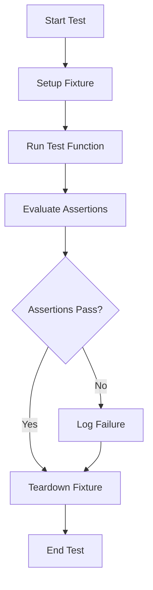

## 21.2. Unit Testing with `clojure.test`

Unit testing is a crucial aspect of software development, ensuring that individual components of your codebase function as expected. In Clojure, the built-in `clojure.test` library provides a robust framework for writing and running unit tests. This guide will walk you through the essentials of using `clojure.test`, from writing your first test to organizing comprehensive test suites.

### Introduction to `clojure.test`

`clojure.test` is a testing framework included with Clojure, designed to help developers verify the correctness of their code. It provides a set of macros and functions that make it easy to define and run tests. The key components of `clojure.test` include:

- **`deftest`**: Defines a test function.
- **`testing`**: Groups related assertions within a test.
- **`is`**: Asserts that an expression evaluates to true.

Let's explore these components in detail.

### Writing Your First Test

To get started with `clojure.test`, you need to include it in your namespace. Here's a simple example of a test using `clojure.test`:

```clojure
(ns myapp.core-test
  (:require [clojure.test :refer :all]
            [myapp.core :refer :all]))

(deftest test-addition
  (testing "Simple addition"
    (is (= 4 (add 2 2)))))
```

In this example:

- We define a namespace `myapp.core-test` for our tests.
- We require `clojure.test` and the namespace containing the code we want to test.
- We use `deftest` to define a test function `test-addition`.
- Inside `deftest`, we use `testing` to describe the test scenario.
- We use `is` to assert that the result of `(add 2 2)` is `4`.

### Organizing Test Suites and Namespaces

Organizing your tests effectively is crucial for maintaining a clean and scalable codebase. Here are some best practices:

- **Separate Test Files**: Place your test files in a separate directory, typically `test`, mirroring the structure of your `src` directory.
- **Naming Conventions**: Use the `-test` suffix for test namespaces and files, e.g., `myapp.core-test`.
- **Grouping Tests**: Use `testing` to group related assertions within a test function.

Here's an example of organizing tests:

```clojure
(ns myapp.utils-test
  (:require [clojure.test :refer :all]
            [myapp.utils :refer :all]))

(deftest test-string-reverse
  (testing "Reversing strings"
    (is (= "cba" (reverse-string "abc")))
    (is (= "" (reverse-string "")))))
```

### Running Tests

You can run your tests in several ways:

#### From the REPL

Running tests from the REPL is straightforward. Load your test namespace and use the `run-tests` function:

```clojure
(require '[clojure.test :refer :all])
(require '[myapp.core-test])

(run-tests 'myapp.core-test)
```

#### From the Command Line

If you're using Leiningen, you can run all tests with:

```bash
lein test
```

This command will automatically find and run all test namespaces in your project.

### Best Practices for Unit Testing in Clojure

To make the most of unit testing in Clojure, consider the following best practices:

- **Write Tests First**: Adopt a test-driven development (TDD) approach to guide your code design.
- **Keep Tests Independent**: Ensure tests do not depend on each other or external state.
- **Use Descriptive Names**: Name your tests and assertions clearly to convey their purpose.
- **Test Edge Cases**: Cover edge cases and potential failure points in your tests.
- **Leverage Fixtures**: Use `clojure.test/use-fixtures` to set up and tear down state before and after tests.

### Advanced Testing Techniques

#### Using Fixtures

Fixtures allow you to run setup and teardown code around your tests. Here's how you can use them:

```clojure
(use-fixtures :each
  (fn [f]
    (println "Setting up")
    (f)
    (println "Tearing down")))
```

This fixture will print messages before and after each test.

#### Testing Asynchronous Code

For asynchronous code, you can use `async` and `await` to handle promises or futures. Here's an example:

```clojure
(deftest test-async-operation
  (testing "Asynchronous operation"
    (let [result (promise)]
      (future (deliver result (async-operation)))
      (is (= expected-value @result)))))
```

### Visualizing Test Execution Flow

To better understand the flow of test execution, consider the following diagram illustrating the lifecycle of a test in `clojure.test`:



This flowchart shows the sequence of steps involved in running a test, from setup to teardown.

### Try It Yourself

Experiment with the examples provided by modifying the test cases or adding new ones. Try running tests with different inputs and observe the results. This hands-on approach will deepen your understanding of `clojure.test`.

### References and Further Reading

- [Clojure Official Documentation](https://clojure.org/)
- [Clojure Test API](https://clojure.github.io/clojure/clojure.test-api.html)
- [Leiningen](https://leiningen.org/)

### Knowledge Check

To reinforce your understanding, try answering the following questions:

## **Ready to Test Your Knowledge?**



### What is the primary purpose of `clojure.test`?

- [x] To provide a framework for writing and running unit tests in Clojure.
- [ ] To compile Clojure code into Java bytecode.
- [ ] To manage dependencies in a Clojure project.
- [ ] To optimize Clojure code for performance.

> **Explanation:** `clojure.test` is a built-in library in Clojure designed for writing and running unit tests.

### Which macro is used to define a test function in `clojure.test`?

- [x] `deftest`
- [ ] `defn`
- [ ] `defmacro`
- [ ] `def`

> **Explanation:** `deftest` is the macro used to define a test function in `clojure.test`.

### How can you group related assertions within a test?

- [x] Using the `testing` macro.
- [ ] Using the `group` macro.
- [ ] Using the `assert` macro.
- [ ] Using the `check` macro.

> **Explanation:** The `testing` macro is used to group related assertions within a test function.

### What command is used to run all tests in a Leiningen project from the command line?

- [x] `lein test`
- [ ] `lein run`
- [ ] `lein compile`
- [ ] `lein clean`

> **Explanation:** `lein test` is the command used to run all tests in a Leiningen project.

### What is the purpose of using fixtures in `clojure.test`?

- [x] To set up and tear down state before and after tests.
- [ ] To compile Clojure code.
- [ ] To manage project dependencies.
- [ ] To optimize test performance.

> **Explanation:** Fixtures are used to set up and tear down state before and after tests in `clojure.test`.

### Which function is used to run tests from the REPL?

- [x] `run-tests`
- [ ] `execute-tests`
- [ ] `start-tests`
- [ ] `init-tests`

> **Explanation:** `run-tests` is the function used to run tests from the REPL in `clojure.test`.

### What is a best practice for naming test functions?

- [x] Use descriptive names that convey the test's purpose.
- [ ] Use short, cryptic names to save space.
- [ ] Use random names for each test.
- [ ] Use the same name for all tests.

> **Explanation:** Descriptive names help convey the purpose of the test and make the code more readable.

### How can you test asynchronous code in Clojure?

- [x] By using promises and futures.
- [ ] By using the `async` keyword.
- [ ] By using the `await` keyword.
- [ ] By using the `sync` keyword.

> **Explanation:** Promises and futures are used to handle asynchronous code in Clojure.

### What is the recommended directory structure for test files in a Clojure project?

- [x] Place test files in a separate `test` directory mirroring the `src` directory.
- [ ] Place test files in the same directory as source files.
- [ ] Place test files in a `lib` directory.
- [ ] Place test files in a `bin` directory.

> **Explanation:** It's recommended to place test files in a separate `test` directory that mirrors the `src` directory structure.

### True or False: `clojure.test` can only be used for unit testing.

- [ ] True
- [x] False

> **Explanation:** While `clojure.test` is primarily used for unit testing, it can also be used for integration and other types of testing.



Remember, mastering unit testing is a journey. As you continue to write and refine tests, you'll gain deeper insights into your code and improve its reliability. Keep experimenting, stay curious, and enjoy the process of building robust software with Clojure!
