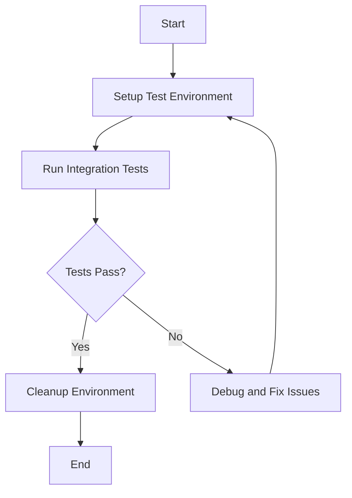

## 21.3. Integration Testing Strategies

Integration testing is a critical phase in the software development lifecycle, ensuring that different components of an application work together as expected. In the context of Clojure, a language known for its functional programming paradigm and robust concurrency models, integration testing takes on unique characteristics and challenges. This section will guide you through the essentials of integration testing in Clojure, from setting up your test environment to employing effective strategies and tools.

### Understanding Integration Testing

Integration testing is the process of testing the interfaces between components or systems to ensure they work together correctly. It sits between unit testing, which tests individual components, and system testing, which tests the entire system as a whole. In the testing pyramid, integration tests are fewer in number than unit tests but more than end-to-end tests, striking a balance between speed and coverage.

**Role in the Testing Pyramid:**

- **Unit Tests:** Fast, isolated tests for individual functions or methods.
- **Integration Tests:** Test interactions between components, such as databases, APIs, and services.
- **End-to-End Tests:** Validate the entire application flow from start to finish.

### Setting Up Integration Tests in Clojure

To effectively conduct integration testing in Clojure, you need a well-structured setup that allows for seamless interaction between various components. Here's how you can achieve that:

#### 1. Project Structure

Organize your Clojure project to separate integration tests from unit tests. A common practice is to place integration tests in a dedicated directory, such as `test/integration`.

```plaintext
src/
  my_app/
    core.clj
test/
  unit/
    core_test.clj
  integration/
    integration_test.clj
```

#### 2. Dependencies and Tools

Clojure offers several libraries and tools to facilitate integration testing:

- **`clojure.test`:** The built-in testing framework for Clojure.
- **`midje`:** A popular testing library that provides a more expressive syntax.
- **`clj-http`:** A library for making HTTP requests, useful for testing HTTP services.
- **`hikari-cp`:** A Clojure wrapper for the HikariCP connection pool, useful for database testing.
- **`test-containers`:** A library for managing Docker containers in tests, useful for setting up test environments.

Add these dependencies to your `project.clj` or `deps.edn` file as needed.

#### 3. Configuration Management

Use environment variables or configuration files to manage different test environments. Libraries like `aero` or `environ` can help manage configurations for development, testing, and production environments.

### Testing Database Interactions

Testing database interactions is a crucial aspect of integration testing. It ensures that your application can correctly read from and write to the database.

#### Example: Testing with H2 Database

H2 is an in-memory database that is ideal for testing purposes. Here's how you can set up and test database interactions in Clojure:

```clojure
(ns my-app.integration.db-test
  (:require [clojure.test :refer :all]
            [clojure.java.jdbc :as jdbc]
            [hikari-cp.core :as hikari]))

(def db-spec
  {:datasource (hikari/make-datasource {:jdbc-url "jdbc:h2:mem:test;DB_CLOSE_DELAY=-1"})})

(deftest test-db-interaction
  (jdbc/execute! db-spec ["CREATE TABLE users (id INT PRIMARY KEY, name VARCHAR(255))"])
  (jdbc/insert! db-spec :users {:id 1 :name "Alice"})
  (let [result (jdbc/query db-spec ["SELECT * FROM users WHERE id = ?" 1])]
    (is (= [{:id 1 :name "Alice"}] result))))
```

**Key Points:**

- Use an in-memory database like H2 for fast and isolated tests.
- Ensure that the database schema is set up and torn down for each test to maintain isolation.

### Testing HTTP Services

Testing HTTP services involves ensuring that your application can correctly interact with external APIs or internal services.

#### Example: Testing with `clj-http`

Here's how you can test HTTP interactions using the `clj-http` library:

```clojure
(ns my-app.integration.http-test
  (:require [clojure.test :refer :all]
            [clj-http.client :as client]))

(deftest test-http-request
  (let [response (client/get "http://api.example.com/data" {:as :json})]
    (is (= 200 (:status response)))
    (is (= "application/json" (get-in response [:headers "content-type"])))
    (is (contains? (:body response) :expected-key))))
```

**Key Points:**

- Mock external services when possible to avoid dependencies on external systems.
- Validate both the status code and the response body to ensure correctness.

### Testing External APIs

When your application interacts with external APIs, it's crucial to test these interactions to ensure reliability and correctness.

#### Strategies for Testing External APIs

1. **Mocking:** Use libraries like `clj-http-fake` to mock API responses.
2. **Stubbing:** Create stub servers that simulate API behavior.
3. **Contract Testing:** Ensure that your application adheres to the API contract.

### Managing Test Environments and Dependencies

Managing test environments and dependencies is essential for reliable integration testing. Here are some strategies:

#### 1. Use Docker for Test Environments

Docker allows you to create isolated environments for testing. Use `test-containers` to manage Docker containers within your tests.

```clojure
(ns my-app.integration.docker-test
  (:require [clojure.test :refer :all]
            [test-containers.core :as tc]))

(deftest test-with-docker
  (tc/with-container [container (tc/create {:image-name "postgres:latest"})]
    (let [db-spec {:dbtype "postgresql"
                   :dbname "test"
                   :host (tc/get-host container)
                   :port (tc/get-port container 5432)}]
      ;; Perform database tests here
      )))
```

#### 2. Dependency Injection

Use dependency injection to manage dependencies in your tests. This allows you to replace real dependencies with mocks or stubs.

#### 3. Environment-Specific Configurations

Use environment-specific configurations to manage different settings for development, testing, and production environments.

### Tools and Libraries for Integration Testing

Several tools and libraries can facilitate integration testing in Clojure:

- **`clojure.test`:** The built-in testing framework, suitable for most testing needs.
- **`midje`:** Offers a more expressive syntax for writing tests.
- **`clj-http`:** Useful for testing HTTP services.
- **`hikari-cp`:** A connection pool library for database testing.
- **`test-containers`:** Manages Docker containers for test environments.
- **`clj-http-fake`:** Mocks HTTP responses for testing.

### Visualizing Integration Testing Workflow

To better understand the integration testing workflow, let's visualize it using a Mermaid.js diagram:



**Diagram Description:** This flowchart illustrates the typical workflow for integration testing. It starts with setting up the test environment, running the tests, and then either cleaning up the environment if tests pass or debugging issues if they fail.

### Knowledge Check

Before we conclude, let's reinforce what we've learned with a few questions:

- What is the role of integration testing in the testing pyramid?
- How can you manage test environments using Docker in Clojure?
- What are some strategies for testing external APIs?

### Conclusion

Integration testing is a vital part of ensuring that your Clojure application functions correctly as a whole. By setting up a robust testing environment, using the right tools and libraries, and employing effective strategies, you can ensure that your application components work together seamlessly. Remember, integration testing is not just about finding bugs; it's about building confidence in your software's reliability and performance.

## **Ready to Test Your Knowledge?**



### What is the primary role of integration testing?

- [x] To test the interaction between different components of an application.
- [ ] To test individual functions or methods in isolation.
- [ ] To validate the entire application flow from start to finish.
- [ ] To perform load testing on the application.

> **Explanation:** Integration testing focuses on testing the interfaces and interactions between different components of an application.

### Which library is commonly used in Clojure for making HTTP requests during integration testing?

- [ ] hikari-cp
- [x] clj-http
- [ ] midje
- [ ] test-containers

> **Explanation:** `clj-http` is a popular library in Clojure for making HTTP requests, which is useful for testing HTTP services.

### How can Docker be used in integration testing?

- [x] By creating isolated environments for testing using containers.
- [ ] By mocking HTTP responses.
- [ ] By providing a more expressive syntax for writing tests.
- [ ] By managing database connections.

> **Explanation:** Docker allows you to create isolated environments for testing, which is useful for integration testing.

### What is a common strategy for testing external APIs in Clojure?

- [ ] Using hikari-cp for connection pooling.
- [x] Mocking API responses with clj-http-fake.
- [ ] Using midje for expressive syntax.
- [ ] Using test-containers for managing Docker containers.

> **Explanation:** Mocking API responses with `clj-http-fake` is a common strategy for testing external APIs in Clojure.

### Which tool is used for managing Docker containers in Clojure tests?

- [ ] clj-http
- [ ] hikari-cp
- [x] test-containers
- [ ] midje

> **Explanation:** `test-containers` is a library used for managing Docker containers in Clojure tests.

### What is the benefit of using an in-memory database like H2 for testing?

- [x] It provides fast and isolated tests.
- [ ] It allows for mocking HTTP responses.
- [ ] It offers a more expressive syntax for writing tests.
- [ ] It manages Docker containers.

> **Explanation:** An in-memory database like H2 provides fast and isolated tests, which is beneficial for integration testing.

### How can dependency injection help in integration testing?

- [x] By allowing you to replace real dependencies with mocks or stubs.
- [ ] By managing Docker containers.
- [ ] By providing a more expressive syntax for writing tests.
- [ ] By mocking HTTP responses.

> **Explanation:** Dependency injection allows you to replace real dependencies with mocks or stubs, which is useful for integration testing.

### What is the purpose of environment-specific configurations in integration testing?

- [x] To manage different settings for development, testing, and production environments.
- [ ] To mock HTTP responses.
- [ ] To provide a more expressive syntax for writing tests.
- [ ] To manage Docker containers.

> **Explanation:** Environment-specific configurations help manage different settings for development, testing, and production environments.

### Which library provides a more expressive syntax for writing tests in Clojure?

- [ ] clj-http
- [ ] hikari-cp
- [ ] test-containers
- [x] midje

> **Explanation:** `midje` is a library that provides a more expressive syntax for writing tests in Clojure.

### True or False: Integration tests should be more numerous than unit tests in the testing pyramid.

- [ ] True
- [x] False

> **Explanation:** In the testing pyramid, unit tests are more numerous than integration tests, which are fewer but more than end-to-end tests.



Remember, this is just the beginning. As you progress, you'll build more complex and interactive applications. Keep experimenting, stay curious, and enjoy the journey!
