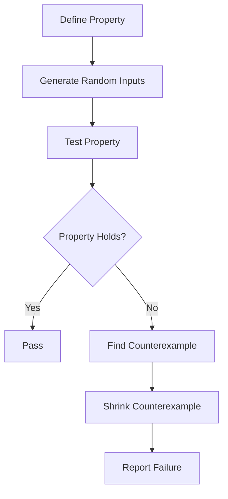

## 21.4. Property-Based Testing with `test.check`

In the realm of software testing, ensuring that your code behaves correctly under a wide range of inputs is crucial. Traditional unit testing often involves writing specific test cases with predetermined inputs and expected outputs. However, this approach can miss edge cases and unexpected scenarios. Enter property-based testing, a powerful technique that can help uncover these hidden issues by automatically generating test cases. In this section, we will explore property-based testing using the `test.check` library in Clojure.

### What is Property-Based Testing?

Property-based testing is a testing methodology where you define properties or invariants that your code should satisfy for a wide range of inputs. Instead of specifying individual test cases, you describe the general behavior of your code. The testing framework then generates random inputs to test these properties, helping to uncover edge cases and unexpected behaviors.

#### Advantages of Property-Based Testing

1. **Comprehensive Coverage**: By generating a wide range of inputs, property-based testing can uncover edge cases that might be missed by traditional unit tests.
2. **Automated Test Case Generation**: The testing framework automatically generates test cases, reducing the manual effort required to write tests.
3. **Focus on Behavior**: By defining properties, you focus on the expected behavior of your code rather than specific inputs and outputs.
4. **Discovering Edge Cases**: Property-based testing is particularly effective at discovering edge cases and unexpected scenarios.

### Integrating `test.check` with `clojure.test`

Clojure's `test.check` library provides a robust framework for property-based testing. It integrates seamlessly with `clojure.test`, allowing you to leverage the familiar testing environment while benefiting from property-based testing.

To get started, add `test.check` to your project dependencies:

```clojure
;; Add to your project.clj or deps.edn
{:deps {org.clojure/test.check {:mvn/version "1.1.0"}}}
```

### Defining Properties and Generators

In property-based testing, properties are assertions about your code's behavior, and generators are used to produce random inputs for testing these properties.

#### Defining a Simple Property

Let's start with a simple example. Suppose we have a function `reverse` that reverses a list. A property we might want to test is that reversing a list twice should yield the original list.

```clojure
(ns myproject.core-test
  (:require [clojure.test :refer :all]
            [clojure.test.check :refer [quick-check]]
            [clojure.test.check.properties :as prop]
            [clojure.test.check.generators :as gen]))

(defn reverse [coll]
  (reduce conj () coll))

(def reverse-twice-property
  (prop/for-all [v (gen/vector gen/int)]
    (= v (reverse (reverse v)))))

(deftest test-reverse-twice
  (is (quick-check 100 reverse-twice-property)))
```

In this example, we define a property `reverse-twice-property` using `prop/for-all`, which states that for any vector of integers, reversing it twice should yield the original vector. We use `gen/vector` and `gen/int` to generate random vectors of integers.

#### Interpreting Failures and Shrinking

When a property fails, `test.check` provides a counterexample that demonstrates the failure. Additionally, it attempts to "shrink" the counterexample to the smallest input that still causes the failure, making it easier to diagnose the issue.

```clojure
;; Example failure output
{:result false,
 :seed 123456789,
 :failing-size 0,
 :num-tests 1,
 :fail [[1 2 3]],
 :shrunk {:total-nodes-visited 5,
          :depth 2,
          :result false,
          :smallest [[1 2 3]]}}
```

In this output, `test.check` reports that the property failed with the input `[1 2 3]` and that the smallest failing input is also `[1 2 3]`.

### Best Practices for Property-Based Testing

1. **Start Simple**: Begin with simple properties and gradually increase complexity.
2. **Use Shrinking**: Leverage shrinking to simplify failing test cases and make debugging easier.
3. **Combine with Unit Tests**: Use property-based testing alongside traditional unit tests for comprehensive coverage.
4. **Focus on Invariants**: Identify key invariants or properties that your code should satisfy.
5. **Iterate and Refine**: Continuously refine your properties and generators as your understanding of the code evolves.

### When to Use Property-Based Testing

Property-based testing is particularly useful in the following scenarios:

- **Complex Algorithms**: When testing complex algorithms where edge cases are difficult to anticipate.
- **Data Transformations**: For functions that transform data, ensuring that transformations are reversible or maintain certain properties.
- **Protocol Implementations**: When implementing protocols or interfaces, ensuring that all implementations adhere to the expected behavior.

### Try It Yourself

To get hands-on experience with property-based testing, try modifying the `reverse` function or the property definition to test different scenarios. Experiment with different generators and properties to see how `test.check` handles various cases.

### Visualizing Property-Based Testing

Below is a flowchart illustrating the process of property-based testing with `test.check`:



This diagram shows the steps involved in property-based testing, from defining properties to reporting failures.

### References and Links

For further reading on property-based testing and `test.check`, consider the following resources:

- [Clojure `test.check` GitHub Repository](https://github.com/clojure/test.check)
- [Clojure Documentation](https://clojure.org/)
- [Property-Based Testing: A Quick Introduction](https://fsharpforfunandprofit.com/posts/property-based-testing/)

### Knowledge Check

To reinforce your understanding of property-based testing with `test.check`, try answering the following questions:

## **Ready to Test Your Knowledge?**



### What is the main advantage of property-based testing?

- [x] It automatically generates test cases.
- [ ] It requires less code than unit testing.
- [ ] It is faster than unit testing.
- [ ] It eliminates the need for manual testing.

> **Explanation:** Property-based testing automatically generates test cases, which helps uncover edge cases and unexpected scenarios.

### How does `test.check` integrate with `clojure.test`?

- [x] By using `quick-check` within `deftest`.
- [ ] By replacing `clojure.test` entirely.
- [ ] By using a separate testing framework.
- [ ] By requiring additional plugins.

> **Explanation:** `test.check` integrates with `clojure.test` by using the `quick-check` function within `deftest` to run property-based tests.

### What is the purpose of shrinking in `test.check`?

- [x] To simplify failing test cases.
- [ ] To increase test coverage.
- [ ] To speed up test execution.
- [ ] To reduce memory usage.

> **Explanation:** Shrinking simplifies failing test cases by finding the smallest input that still causes the failure, making it easier to diagnose issues.

### Which of the following is a best practice for property-based testing?

- [x] Start with simple properties.
- [ ] Avoid using shrinking.
- [ ] Use only property-based tests.
- [ ] Focus on specific inputs.

> **Explanation:** Starting with simple properties and gradually increasing complexity is a best practice for property-based testing.

### When is property-based testing particularly useful?

- [x] When testing complex algorithms.
- [ ] When writing documentation.
- [ ] When optimizing performance.
- [ ] When designing user interfaces.

> **Explanation:** Property-based testing is particularly useful when testing complex algorithms where edge cases are difficult to anticipate.

### What is a property in property-based testing?

- [x] An assertion about code behavior.
- [ ] A specific test case.
- [ ] A type of data structure.
- [ ] A configuration setting.

> **Explanation:** A property in property-based testing is an assertion about the general behavior of the code that should hold true for a wide range of inputs.

### What does `gen/vector` do in `test.check`?

- [x] Generates random vectors.
- [ ] Sorts a vector.
- [ ] Filters a vector.
- [ ] Maps a function over a vector.

> **Explanation:** `gen/vector` is a generator in `test.check` that produces random vectors for testing properties.

### How can you interpret a failure in `test.check`?

- [x] By examining the counterexample and shrunk input.
- [ ] By rerunning the test multiple times.
- [ ] By checking the test coverage report.
- [ ] By reviewing the test documentation.

> **Explanation:** Interpreting a failure in `test.check` involves examining the counterexample and the shrunk input to diagnose the issue.

### True or False: Property-based testing can replace all unit tests.

- [ ] True
- [x] False

> **Explanation:** False. Property-based testing complements unit tests but does not replace them entirely. Both have their strengths and are useful in different scenarios.

### What is the role of generators in `test.check`?

- [x] To produce random inputs for testing properties.
- [ ] To execute the test cases.
- [ ] To log test results.
- [ ] To configure the testing environment.

> **Explanation:** Generators in `test.check` are used to produce random inputs for testing properties, helping to uncover edge cases and unexpected behaviors.



Remember, mastering property-based testing with `test.check` is a journey. As you continue to explore and experiment, you'll gain deeper insights into your code's behavior and improve its robustness. Keep testing, stay curious, and enjoy the process!
