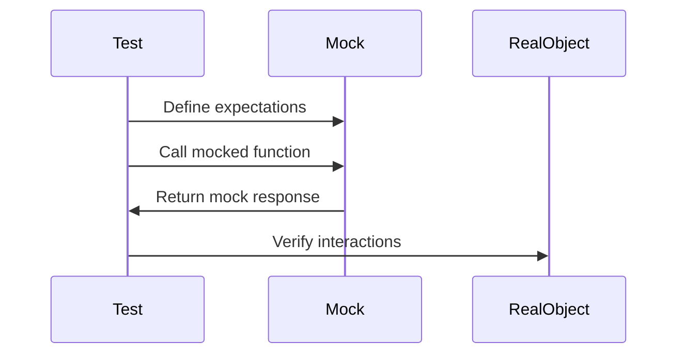

## 21.5. Mocks and Stubs with `mock`

In the realm of software testing, especially unit testing, the concepts of mocks and stubs play a crucial role in isolating the code under test from its dependencies. This isolation ensures that tests are reliable, fast, and focused solely on the functionality of the unit being tested. In this section, we will delve into the use of mocks and stubs in Clojure, leveraging the [`mock`](https://github.com/circleci/mocked/blob/master/doc/user_guide.md) library to achieve effective testing practices.

### Understanding Mocks and Stubs

Before diving into the specifics of the `mock` library, let's clarify what mocks and stubs are and why they are essential in testing.

- **Mocks**: These are objects that simulate the behavior of real objects. They are used to verify interactions between the object under test and its dependencies. Mocks can be programmed to expect certain calls and can assert that these calls were made.

- **Stubs**: These are simplified implementations of interfaces or classes that return predefined responses. Unlike mocks, stubs do not verify interactions; they simply provide canned responses to method calls.

### The Purpose of Mocks and Stubs

Mocks and stubs are primarily used to:

- **Isolate the Unit Under Test**: By replacing real dependencies with mocks or stubs, we can ensure that the test focuses solely on the unit's behavior without interference from external systems.

- **Simulate External Dependencies**: Mocks and stubs allow us to simulate interactions with external systems such as databases, web services, or file systems, which might be unavailable or costly to use during testing.

- **Improve Test Performance**: By avoiding real interactions with external systems, tests run faster and are more reliable.

- **Facilitate Testing of Edge Cases**: Mocks and stubs can be configured to simulate rare or difficult-to-reproduce scenarios, enabling thorough testing of edge cases.

### Introducing the `mock` Library

The `mock` library in Clojure provides a straightforward way to create mocks and stubs. It allows you to define expectations for function calls, simulate return values, and verify that interactions occurred as expected.

#### Key Features of the `mock` Library

- **Function Mocking**: Easily mock Clojure functions to simulate their behavior.
- **Expectation Setting**: Define what calls are expected and what responses should be returned.
- **Verification**: Check that the expected interactions occurred during the test.
- **Flexibility**: Supports a wide range of mocking scenarios, including HTTP calls and database operations.

### Creating and Using Mocks with `mock`

Let's explore how to create and use mocks in Clojure tests using the `mock` library.

#### Setting Up the `mock` Library

First, ensure that the `mock` library is included in your project dependencies. Add the following to your `project.clj`:

```clojure
:dependencies [[circleci/mocked "0.1.0"]]
```

#### Mocking Functions

To mock a function, use the `mock` macro provided by the library. Here's a simple example:

```clojure
(ns myapp.core-test
  (:require [clojure.test :refer :all]
            [mocked.core :refer :all]))

(defn fetch-data [url]
  ;; Simulate a function that fetches data from a URL
  (println "Fetching data from" url))

(deftest test-fetch-data
  (mock [fetch-data (fn [url] "mocked response")]
    (is (= "mocked response" (fetch-data "http://example.com")))))
```

In this example, we mock the `fetch-data` function to return a "mocked response" instead of executing its real implementation.

#### Mocking HTTP Calls

Mocking HTTP calls is a common requirement in testing. Here's how you can mock an HTTP call using the `mock` library:

```clojure
(ns myapp.http-test
  (:require [clojure.test :refer :all]
            [mocked.core :refer :all]
            [clj-http.client :as client]))

(defn get-user [user-id]
  (client/get (str "http://api.example.com/users/" user-id)))

(deftest test-get-user
  (mock [client/get (fn [url] {:status 200 :body "mocked user data"})]
    (let [response (get-user 123)]
      (is (= 200 (:status response)))
      (is (= "mocked user data" (:body response))))))
```

In this test, we mock the `client/get` function to return a predefined response, simulating a successful HTTP call.

#### Mocking Database Operations

Database operations can also be mocked to test how your code interacts with a database without requiring a real database connection:

```clojure
(ns myapp.db-test
  (:require [clojure.test :refer :all]
            [mocked.core :refer :all]))

(defn fetch-user-from-db [user-id]
  ;; Simulate a database fetch operation
  (println "Fetching user from database"))

(deftest test-fetch-user-from-db
  (mock [fetch-user-from-db (fn [user-id] {:id user-id :name "Mocked User"})]
    (let [user (fetch-user-from-db 123)]
      (is (= 123 (:id user)))
      (is (= "Mocked User" (:name user))))))
```

Here, we mock the `fetch-user-from-db` function to return a mock user object.

### Importance of Isolation in Unit Testing

Isolation is a fundamental principle in unit testing. By isolating the unit under test from its dependencies, we ensure that tests are:

- **Deterministic**: Tests produce the same results every time they are run, regardless of external factors.
- **Fast**: Tests execute quickly because they do not rely on slow external systems.
- **Focused**: Tests concentrate on the functionality of the unit under test, making it easier to identify and fix issues.

### Visualizing Mocking and Stubbing

To better understand the flow of mocking and stubbing, let's visualize the process using a sequence diagram:



This diagram illustrates how the test interacts with the mock, which in turn simulates the behavior of the real object.

### Try It Yourself

To deepen your understanding, try modifying the code examples provided:

- Change the mocked responses to simulate different scenarios.
- Add more complex logic to the mocked functions.
- Experiment with verifying interactions using the `verify` function from the `mock` library.

### References and Further Reading

- [Mock Library Documentation](https://github.com/circleci/mocked/blob/master/doc/user_guide.md)
- [Clojure Testing with clojure.test](https://clojure.github.io/clojure/clojure.test-api.html)
- [Effective Unit Testing](https://martinfowler.com/bliki/UnitTest.html)

### Knowledge Check

- What is the difference between mocks and stubs?
- How does the `mock` library help in testing Clojure code?
- Why is isolation important in unit testing?

### Summary

In this section, we explored the use of mocks and stubs in Clojure testing using the `mock` library. We learned how to create and use mocks to simulate external dependencies, ensuring that our tests are isolated, fast, and reliable. By mastering these techniques, you can write more effective and maintainable tests for your Clojure applications.

## **Ready to Test Your Knowledge?**



### What is the primary purpose of using mocks in testing?

- [x] To simulate the behavior of real objects and verify interactions.
- [ ] To provide a real implementation of a function.
- [ ] To slow down the testing process.
- [ ] To increase the complexity of tests.

> **Explanation:** Mocks are used to simulate the behavior of real objects and verify interactions between the object under test and its dependencies.

### How does the `mock` library assist in testing Clojure code?

- [x] By allowing the creation of mocks and stubs for functions.
- [ ] By providing a real database connection.
- [ ] By slowing down the execution of tests.
- [ ] By removing the need for tests.

> **Explanation:** The `mock` library allows developers to create mocks and stubs for functions, enabling the simulation of external dependencies in tests.

### What is a key benefit of isolating the unit under test?

- [x] Tests become deterministic and produce consistent results.
- [ ] Tests become slower and less reliable.
- [ ] Tests require more external dependencies.
- [ ] Tests become more complex and harder to maintain.

> **Explanation:** Isolating the unit under test ensures that tests are deterministic, producing consistent results regardless of external factors.

### What is the difference between mocks and stubs?

- [x] Mocks verify interactions, while stubs provide predefined responses.
- [ ] Mocks provide real implementations, while stubs simulate behavior.
- [ ] Mocks are slower than stubs.
- [ ] Mocks are used for performance testing, while stubs are not.

> **Explanation:** Mocks are used to verify interactions, whereas stubs provide predefined responses without verifying interactions.

### Which function is used to mock HTTP calls in the provided example?

- [x] `client/get`
- [ ] `client/post`
- [ ] `fetch-data`
- [ ] `fetch-user-from-db`

> **Explanation:** In the example, the `client/get` function is mocked to simulate an HTTP call.

### What is a common use case for stubs in testing?

- [x] To provide canned responses for method calls.
- [ ] To verify interactions between objects.
- [ ] To slow down the execution of tests.
- [ ] To increase the complexity of tests.

> **Explanation:** Stubs are used to provide canned responses for method calls, allowing tests to simulate specific scenarios.

### How can you verify interactions in a test using the `mock` library?

- [x] By using the `verify` function.
- [ ] By using the `println` function.
- [ ] By using the `assert` function.
- [ ] By using the `mock` function.

> **Explanation:** The `verify` function in the `mock` library is used to check that expected interactions occurred during the test.

### What is the benefit of using mocks for HTTP calls in tests?

- [x] Tests run faster and do not rely on real HTTP servers.
- [ ] Tests become slower and less reliable.
- [ ] Tests require a real HTTP server.
- [ ] Tests become more complex and harder to maintain.

> **Explanation:** By using mocks for HTTP calls, tests run faster and do not rely on real HTTP servers, making them more reliable.

### What is the role of the `mock` macro in the `mock` library?

- [x] To define expectations and simulate function behavior.
- [ ] To provide real implementations of functions.
- [ ] To slow down the execution of tests.
- [ ] To increase the complexity of tests.

> **Explanation:** The `mock` macro is used to define expectations and simulate the behavior of functions in tests.

### True or False: Stubs can verify interactions between objects.

- [ ] True
- [x] False

> **Explanation:** Stubs do not verify interactions; they only provide predefined responses to method calls.



Remember, mastering the use of mocks and stubs is just the beginning. As you progress, you'll build more robust and reliable tests for your Clojure applications. Keep experimenting, stay curious, and enjoy the journey!
