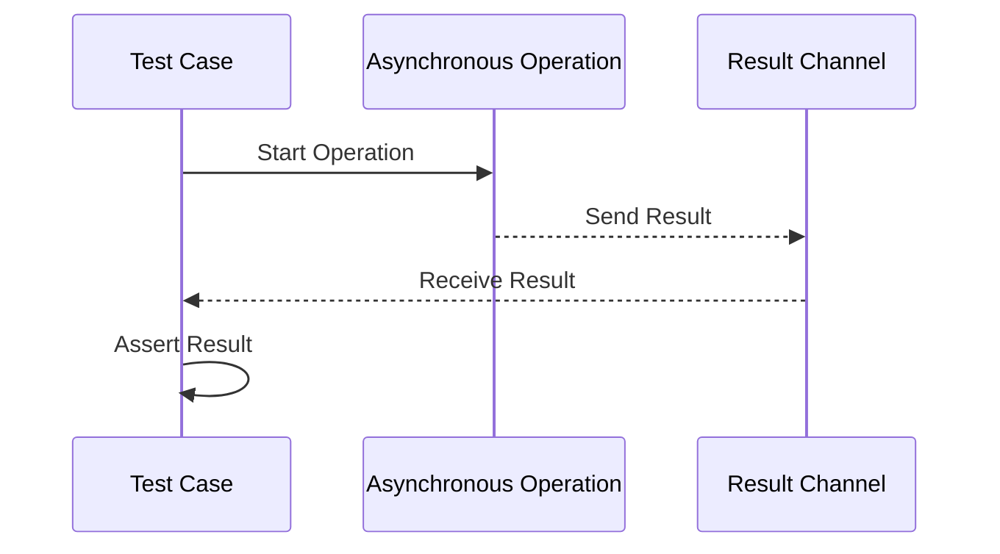

## 21.6. Testing Asynchronous Code

Asynchronous programming is a powerful paradigm that allows developers to write non-blocking code, enabling applications to perform multiple operations concurrently. However, testing asynchronous code presents unique challenges, especially in ensuring that code behaves correctly over time or when executed in parallel. In this section, we will explore strategies and techniques for effectively testing asynchronous code in Clojure, focusing on `core.async` channels, futures, promises, and using testing utilities in `clojure.test` and external libraries like `expectations`.

### Understanding the Challenges of Testing Asynchronous Code

Testing asynchronous code can be challenging due to the following reasons:

- **Timing Issues**: Asynchronous operations may complete at different times, making it difficult to predict when a test should check for results.
- **Race Conditions**: Concurrent operations may lead to race conditions, where the outcome depends on the timing of events.
- **State Management**: Managing shared state across asynchronous operations can lead to inconsistencies if not handled properly.
- **Complexity**: Asynchronous code often involves callbacks, promises, or channels, which can complicate the control flow and make tests harder to write and understand.

### Techniques for Testing Asynchronous Code

#### Using `core.async` Channels

`core.async` is a Clojure library that provides facilities for asynchronous programming using channels. Testing code that uses `core.async` involves ensuring that messages are passed correctly through channels and that the system behaves as expected under concurrent conditions.

**Example: Testing `core.async` Channels**

```clojure
(ns async-test.core
  (:require [clojure.test :refer :all]
            [clojure.core.async :refer [chan go >! <! <!!]]))

(defn async-operation [input]
  (let [c (chan)]
    (go
      (<! (timeout 100)) ; Simulate asynchronous delay
      (>! c (* input 2)))
    c))

(deftest test-async-operation
  (let [result-chan (async-operation 5)]
    (is (= 10 (<!! result-chan)))))
```

In this example, we define an asynchronous operation that doubles an input value after a delay. The test uses `<!!` to block until the result is available, ensuring that the test waits for the asynchronous operation to complete.

#### Testing Futures and Promises

Futures and promises are constructs for handling asynchronous computations in Clojure. A future represents a computation that will complete at some point, while a promise is a placeholder for a value that will be delivered later.

**Example: Testing Futures**

```clojure
(ns future-test.core
  (:require [clojure.test :refer :all]))

(defn future-operation [input]
  (future
    (Thread/sleep 100) ; Simulate delay
    (* input 2)))

(deftest test-future-operation
  (let [result (deref (future-operation 5))]
    (is (= 10 result))))
```

Here, we use `deref` to wait for the future to complete and obtain the result. This ensures that the test only proceeds once the asynchronous computation is finished.

**Example: Testing Promises**

```clojure
(ns promise-test.core
  (:require [clojure.test :refer :all]))

(defn promise-operation [input]
  (let [p (promise)]
    (future
      (Thread/sleep 100)
      (deliver p (* input 2)))
    p))

(deftest test-promise-operation
  (let [result (deref (promise-operation 5))]
    (is (= 10 result))))
```

In this example, a promise is used to deliver the result of an asynchronous computation. The test waits for the promise to be fulfilled using `deref`.

#### Using `clojure.test` for Asynchronous Testing

`clojure.test` is the standard testing library in Clojure, and it can be used to test asynchronous code by leveraging blocking operations like `<!!` or `deref`. However, for more complex scenarios, you might need to use additional utilities or libraries.

**Example: Using `clojure.test` with `core.async`**

```clojure
(ns clojure-test-async.core
  (:require [clojure.test :refer :all]
            [clojure.core.async :refer [chan go >! <! <!!]]))

(defn async-add [a b]
  (let [c (chan)]
    (go
      (<! (timeout 100))
      (>! c (+ a b)))
    c))

(deftest test-async-add
  (let [result-chan (async-add 3 7)]
    (is (= 10 (<!! result-chan)))))
```

This test demonstrates how to use `clojure.test` to verify the result of an asynchronous addition operation using `core.async`.

#### External Libraries for Asynchronous Testing

Libraries like `expectations` provide additional utilities for testing asynchronous code. These libraries often include features for handling timeouts, retries, and other asynchronous testing concerns.

**Example: Using `expectations` for Asynchronous Testing**

```clojure
(ns expectations-test.core
  (:require [expectations :refer :all]
            [clojure.core.async :refer [chan go >! <! <!!]]))

(defn async-multiply [a b]
  (let [c (chan)]
    (go
      (<! (timeout 100))
      (>! c (* a b)))
    c))

(expect 20 (<!! (async-multiply 4 5)))
```

In this example, `expectations` is used to assert that the result of an asynchronous multiplication operation is correct.

### Handling Race Conditions

Race conditions occur when the outcome of a program depends on the timing of uncontrollable events, such as thread scheduling. Detecting and handling race conditions is crucial in asynchronous testing.

**Strategies for Handling Race Conditions**

- **Use Locks or Synchronization**: Ensure that shared resources are accessed in a thread-safe manner.
- **Leverage STM (Software Transactional Memory)**: Use Clojure's STM to manage shared state without locks.
- **Test with Different Schedules**: Run tests under various conditions to expose potential race conditions.

### Waiting for Asynchronous Operations

In asynchronous testing, it's often necessary to wait for operations to complete before asserting results. This can be achieved using blocking operations like `<!!` or `deref`, or by using timeouts and retries.

**Example: Waiting with Timeouts**

```clojure
(ns timeout-test.core
  (:require [clojure.test :refer :all]
            [clojure.core.async :refer [chan go >! <! timeout <!!]]))

(defn async-task [input]
  (let [c (chan)]
    (go
      (<! (timeout 100))
      (>! c (* input 3)))
    c))

(deftest test-async-task
  (let [result-chan (async-task 4)
        result (<!! (timeout 200) result-chan)]
    (is (= 12 result))))
```

In this test, we use a timeout to ensure that the test does not hang indefinitely if the asynchronous operation takes too long.

### Detecting and Preventing Race Conditions

Race conditions can lead to unpredictable behavior in concurrent systems. Detecting and preventing them is essential for reliable asynchronous code.

**Techniques for Detecting Race Conditions**

- **Stress Testing**: Run tests under high load or with many concurrent operations to expose race conditions.
- **Code Reviews**: Carefully review code for potential race conditions, especially in shared state management.
- **Automated Tools**: Use tools that can detect race conditions or concurrency issues in your code.

### Best Practices for Testing Asynchronous Code

- **Use Timeouts**: Always use timeouts when waiting for asynchronous operations to prevent tests from hanging indefinitely.
- **Isolate Tests**: Ensure that tests do not depend on each other and can be run independently.
- **Mock External Dependencies**: Use mocks or stubs for external services to isolate the code under test.
- **Test Edge Cases**: Consider edge cases and unusual conditions that might affect asynchronous behavior.

### Try It Yourself

Experiment with the code examples provided in this section. Try modifying the input values, adding delays, or introducing race conditions to see how the tests behave. This hands-on approach will help you understand the intricacies of testing asynchronous code in Clojure.

### Visualizing Asynchronous Testing

To better understand the flow of asynchronous testing, let's visualize the process using a sequence diagram.



This diagram illustrates the interaction between a test case, an asynchronous operation, and the result channel. The test initiates the operation, waits for the result, and then asserts the expected outcome.

### References and Further Reading

- [Clojure Documentation](https://clojure.org/reference/documentation)
- [Core.Async Guide](https://clojure.github.io/core.async/)
- [Expectations Library](https://github.com/clojure-expectations/expectations)

### Knowledge Check

To reinforce your understanding of testing asynchronous code in Clojure, try answering the following questions and challenges.

## **Ready to Test Your Knowledge?**



### What is a common challenge when testing asynchronous code?

- [x] Timing issues
- [ ] Lack of libraries
- [ ] Syntax errors
- [ ] Compilation errors

> **Explanation:** Timing issues are a common challenge because asynchronous operations may complete at unpredictable times.

### Which Clojure construct is used for asynchronous programming with channels?

- [x] core.async
- [ ] clojure.test
- [ ] clojure.java.io
- [ ] clojure.string

> **Explanation:** `core.async` is a Clojure library that provides facilities for asynchronous programming using channels.

### How can you wait for a future to complete in Clojure?

- [x] Using deref
- [ ] Using println
- [ ] Using map
- [ ] Using reduce

> **Explanation:** `deref` is used to wait for a future to complete and obtain its result.

### What is a promise in Clojure?

- [x] A placeholder for a value to be delivered later
- [ ] A function that returns a future
- [ ] A type of channel in core.async
- [ ] A built-in testing library

> **Explanation:** A promise is a placeholder for a value that will be delivered later, often used in asynchronous programming.

### Which library provides additional utilities for testing asynchronous code in Clojure?

- [x] Expectations
- [ ] clojure.java.io
- [ ] clojure.string
- [ ] clojure.set

> **Explanation:** `Expectations` is a library that provides additional utilities for testing asynchronous code in Clojure.

### How can you prevent tests from hanging indefinitely when waiting for asynchronous operations?

- [x] Use timeouts
- [ ] Use println
- [ ] Use map
- [ ] Use reduce

> **Explanation:** Using timeouts ensures that tests do not hang indefinitely if an asynchronous operation takes too long.

### What is a race condition?

- [x] A situation where the outcome depends on the timing of events
- [ ] A type of error in synchronous code
- [ ] A method for optimizing code
- [ ] A feature of clojure.test

> **Explanation:** A race condition occurs when the outcome of a program depends on the timing of uncontrollable events, such as thread scheduling.

### Which tool can be used to detect race conditions in code?

- [x] Automated tools
- [ ] clojure.string
- [ ] clojure.java.io
- [ ] clojure.set

> **Explanation:** Automated tools can be used to detect race conditions or concurrency issues in code.

### What is the purpose of using locks or synchronization in asynchronous code?

- [x] To ensure thread-safe access to shared resources
- [ ] To improve code readability
- [ ] To increase code complexity
- [ ] To reduce memory usage

> **Explanation:** Locks or synchronization are used to ensure that shared resources are accessed in a thread-safe manner, preventing race conditions.

### True or False: Mocking external dependencies is a best practice in testing asynchronous code.

- [x] True
- [ ] False

> **Explanation:** Mocking external dependencies is a best practice because it isolates the code under test and ensures that tests do not depend on external services.



Remember, this is just the beginning. As you progress, you'll build more complex and interactive tests for asynchronous code. Keep experimenting, stay curious, and enjoy the journey!
