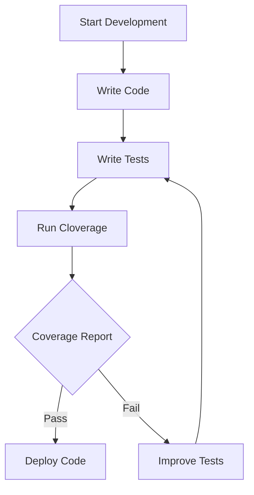

## 21.7. Code Coverage Analysis with Cloverage

### Introduction to Code Coverage

Code coverage is a critical metric in software development that measures the extent to which the source code of a program is tested by a particular test suite. It provides insights into which parts of the codebase are exercised during testing and which are not, helping developers identify untested parts of an application. High code coverage is often associated with higher code quality and reliability, as it suggests that more of the code has been verified to work as expected.

#### Why Code Coverage Matters

1. **Ensures Test Completeness**: Code coverage helps ensure that all parts of the code are tested, reducing the likelihood of undetected bugs.
2. **Improves Code Quality**: By identifying untested code, developers can write additional tests to cover these areas, leading to more robust and maintainable code.
3. **Facilitates Refactoring**: With comprehensive tests in place, developers can refactor code with confidence, knowing that any regressions will be caught by the tests.
4. **Supports Continuous Integration**: Code coverage metrics can be integrated into CI/CD pipelines to enforce quality gates, ensuring that only well-tested code is deployed.

### Introducing Cloverage

Cloverage is a popular code coverage tool for Clojure projects. It provides detailed coverage reports, including line and branch coverage, helping developers understand how thoroughly their code is tested. Cloverage integrates seamlessly with Leiningen, the most widely used build tool for Clojure, making it easy to add to existing projects.

#### Key Features of Cloverage

- **Line and Branch Coverage**: Cloverage measures both line and branch coverage, providing a comprehensive view of test coverage.
- **Detailed Reports**: Generates detailed HTML reports that highlight covered and uncovered code.
- **Thresholds and Failures**: Allows setting coverage thresholds to fail builds if coverage is below a specified level.
- **Integration with CI/CD**: Easily integrates with continuous integration systems to enforce coverage standards.

### Integrating Cloverage into a Clojure Project

To start using Cloverage, you need to add it as a dependency in your project. This is typically done in the `project.clj` file for Leiningen-based projects.

```clojure
(defproject my-clojure-app "0.1.0-SNAPSHOT"
  :dependencies [[org.clojure/clojure "1.10.3"]]
  :plugins [[lein-cloverage "1.2.2"]])
```

#### Running Cloverage

Once Cloverage is added to your project, you can run it using the following command:

```bash
lein cloverage
```

This command will execute your test suite and generate a coverage report. By default, the report is generated in the `target/coverage` directory.

### Interpreting Cloverage Results

Cloverage provides a detailed HTML report that shows the coverage percentage for each namespace, file, and line of code. Here's how to interpret the results:

- **Overall Coverage**: The report starts with an overall coverage percentage, indicating the proportion of the codebase that is covered by tests.
- **Namespace Coverage**: Each namespace is listed with its own coverage percentage, allowing you to identify which parts of the codebase need more testing.
- **Line Coverage**: Lines of code are color-coded to indicate whether they are covered (green) or uncovered (red).

#### Example Report

Below is a simplified example of what a Cloverage report might look like:

```plaintext
Namespace: my-clojure-app.core
--------------------------------
Line Coverage: 85%
Branch Coverage: 75%

1. (defn add [a b] ;; Covered
2.   (+ a b)) ;; Covered

3. (defn subtract [a b] ;; Uncovered
4.   (- a b)) ;; Uncovered
```

In this example, the `add` function is fully covered by tests, while the `subtract` function is not tested at all.

### Setting Coverage Thresholds

Cloverage allows you to set coverage thresholds to ensure that your codebase maintains a minimum level of test coverage. This can be configured in the `project.clj` file:

```clojure
:cloverage {:fail-threshold 80}
```

With this configuration, the build will fail if the overall coverage falls below 80%. This is a useful way to enforce quality standards and prevent the introduction of poorly tested code.

### Generating and Customizing Reports

Cloverage generates HTML reports by default, but you can customize the output format and location. For example, you can generate a JSON report by specifying the `:output` option:

```bash
lein cloverage --output json
```

This flexibility allows you to integrate Cloverage reports with other tools and systems, such as dashboards or reporting services.

### Limitations of Code Coverage Metrics

While code coverage is a valuable metric, it is not a silver bullet. Here are some limitations to keep in mind:

1. **Coverage Does Not Equal Quality**: High coverage does not guarantee that the tests are effective or that the code is bug-free.
2. **False Sense of Security**: Developers might focus on achieving high coverage numbers rather than writing meaningful tests.
3. **Does Not Measure Test Quality**: Coverage metrics do not assess the quality or effectiveness of the tests themselves.
4. **Can Be Misleading**: Code that is covered by tests might still contain bugs if the tests are not comprehensive or well-designed.

### Best Practices for Using Cloverage

- **Focus on Meaningful Tests**: Aim for tests that validate the behavior and logic of your code, not just increasing coverage numbers.
- **Use Coverage as a Guide**: Use coverage reports to identify untested areas, but prioritize writing high-quality tests.
- **Integrate with CI/CD**: Automate coverage analysis in your CI/CD pipeline to ensure consistent quality checks.
- **Review Coverage Reports Regularly**: Regularly review coverage reports to identify trends and areas for improvement.

### Try It Yourself

To get hands-on experience with Cloverage, try integrating it into a sample Clojure project. Experiment with running Cloverage, interpreting the results, and setting coverage thresholds. Modify the code and tests to see how coverage metrics change.

### Visualizing Code Coverage with Cloverage

To better understand how Cloverage fits into the development workflow, let's visualize the process using a flowchart.



**Figure 1**: This flowchart illustrates the integration of Cloverage into the development process, highlighting the feedback loop between writing tests and improving coverage.

### References and Further Reading

- [Cloverage GitHub Repository](https://github.com/cloverage/cloverage)
- [Leiningen Documentation](https://leiningen.org/)
- [Clojure Official Website](https://clojure.org/)

### Knowledge Check

Before we wrap up, let's test your understanding of code coverage analysis with Cloverage.

## **Ready to Test Your Knowledge?**



### What is the primary purpose of code coverage analysis?

- [x] To measure the extent to which the source code is tested
- [ ] To improve code performance
- [ ] To refactor code
- [ ] To deploy code to production

> **Explanation:** Code coverage analysis measures how much of the source code is exercised by the test suite, helping identify untested areas.

### Which tool is commonly used for code coverage analysis in Clojure projects?

- [x] Cloverage
- [ ] JUnit
- [ ] Mocha
- [ ] Jest

> **Explanation:** Cloverage is a popular tool for measuring code coverage in Clojure projects.

### How do you add Cloverage to a Clojure project?

- [x] By adding it as a plugin in the `project.clj` file
- [ ] By installing it globally on the system
- [ ] By writing custom scripts
- [ ] By using a Docker container

> **Explanation:** Cloverage is added as a plugin in the `project.clj` file for Leiningen-based projects.

### What command is used to run Cloverage?

- [x] lein cloverage
- [ ] lein test
- [ ] lein run
- [ ] lein compile

> **Explanation:** The `lein cloverage` command runs Cloverage to generate coverage reports.

### What does a coverage threshold in Cloverage do?

- [x] It fails the build if coverage is below a specified level
- [ ] It increases the test execution speed
- [ ] It optimizes the code for performance
- [ ] It generates a detailed error log

> **Explanation:** Coverage thresholds ensure that the build fails if the coverage falls below a certain percentage, enforcing quality standards.

### What is a limitation of code coverage metrics?

- [x] They do not measure test quality
- [ ] They improve code performance
- [ ] They guarantee bug-free code
- [ ] They reduce code complexity

> **Explanation:** Code coverage metrics do not assess the quality or effectiveness of the tests themselves.

### How can Cloverage reports be customized?

- [x] By specifying output formats and locations
- [ ] By modifying the source code
- [ ] By using a different programming language
- [ ] By changing the operating system

> **Explanation:** Cloverage allows customization of reports by specifying different output formats and locations.

### What is the benefit of integrating Cloverage with CI/CD?

- [x] It ensures consistent quality checks
- [ ] It speeds up the deployment process
- [ ] It reduces server costs
- [ ] It eliminates the need for manual testing

> **Explanation:** Integrating Cloverage with CI/CD automates coverage analysis, ensuring consistent quality checks.

### What does a high code coverage percentage indicate?

- [x] A large portion of the codebase is tested
- [ ] The code is optimized for performance
- [ ] The code is ready for production
- [ ] The code is free of bugs

> **Explanation:** A high code coverage percentage indicates that a large portion of the codebase is exercised by tests.

### True or False: Code coverage guarantees that the code is bug-free.

- [ ] True
- [x] False

> **Explanation:** Code coverage does not guarantee bug-free code; it only indicates the extent to which the code is tested.



### Embrace the Journey

Remember, mastering code coverage analysis with Cloverage is just one step in your journey to becoming a proficient Clojure developer. As you continue to explore and experiment, you'll gain deeper insights into testing and quality assurance. Keep pushing the boundaries, stay curious, and enjoy the process of learning and growing as a developer!
