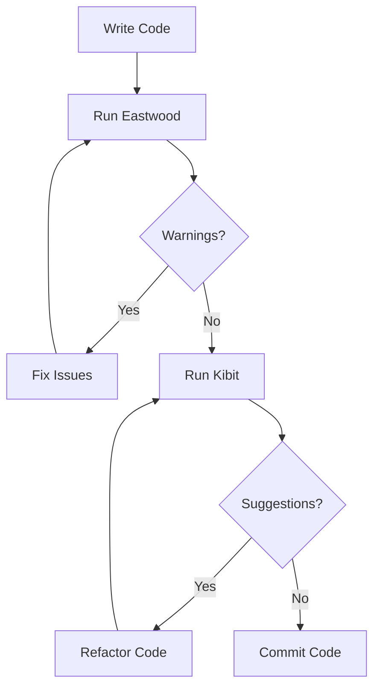

## 21.8. Static Code Analysis with Eastwood and Kibit

### Introduction to Static Code Analysis

Static code analysis is a method of debugging by examining source code before a program is run. This process helps identify potential errors, code smells, and areas for improvement without executing the code. In the Clojure ecosystem, tools like Eastwood and Kibit are invaluable for maintaining high code quality and ensuring adherence to idiomatic practices.

#### Benefits of Static Code Analysis

- **Early Detection of Errors**: Identify potential bugs and issues before they manifest in runtime.
- **Code Consistency**: Enforce coding standards and best practices across the codebase.
- **Improved Readability**: Suggest idiomatic improvements that make code easier to understand.
- **Cost Efficiency**: Reduce the cost of fixing bugs by catching them early in the development cycle.

### Setting Up Eastwood for Linting

Eastwood is a Clojure lint tool that analyzes your code to find potential problems. It is akin to a spellchecker for your code, providing warnings about possible issues.

#### Installation and Setup

To use Eastwood, you need to add it to your project dependencies. If you're using Leiningen, add the following to your `project.clj`:

```clojure
:plugins [[jonase/eastwood "0.3.15"]]
```

For tools.deps, include it in your `deps.edn`:

```clojure
{:deps {jonase/eastwood {:mvn/version "0.3.15"}}}
```

#### Running Eastwood

Once installed, you can run Eastwood from the command line:

```bash
lein eastwood
```

This command will analyze your code and provide a list of warnings and suggestions. Eastwood checks for a variety of issues, including:

- Unused variables
- Deprecated functions
- Potentially confusing code constructs

#### Example Warnings

Consider the following Clojure code snippet:

```clojure
(defn example-fn [x]
  (let [y (+ x 1)]
    (println "Result:" y)
    y))
```

Running Eastwood might produce a warning about the unused variable `y` if it is not used elsewhere in the code.

### Kibit: Suggesting Idiomatic Clojure

Kibit is another static analysis tool that focuses on suggesting idiomatic Clojure code. It provides recommendations for refactoring code to use more idiomatic constructs.

#### Installation and Setup

Similar to Eastwood, Kibit can be added to your project dependencies. For Leiningen, add:

```clojure
:plugins [[lein-kibit "0.1.8"]]
```

For tools.deps, include it in your `deps.edn`:

```clojure
{:deps {lein-kibit {:mvn/version "0.1.8"}}}
```

#### Running Kibit

To run Kibit, use the following command:

```bash
lein kibit
```

Kibit will analyze your code and suggest more idiomatic alternatives. For example, it might suggest replacing `(if (not (empty? coll)) ...)` with `(when (seq coll) ...)`.

#### Example Suggestions

Consider this code snippet:

```clojure
(if (not (empty? coll))
  (do-something))
```

Kibit would suggest:

```clojure
(when (seq coll)
  (do-something))
```

This suggestion improves readability and aligns with idiomatic Clojure practices.

### Integrating Eastwood and Kibit into Your Workflow

To maximize the benefits of Eastwood and Kibit, integrate them into your development workflow. Here are some strategies:

- **Pre-Commit Hooks**: Use tools like `pre-commit` to run Eastwood and Kibit before code is committed to the repository.
- **Continuous Integration**: Incorporate these tools into your CI/CD pipeline to ensure code quality is maintained across all branches.
- **Regular Code Reviews**: Use the output from Eastwood and Kibit as part of your code review process to catch issues early.

### Common Warnings and Suggestions

Both Eastwood and Kibit provide a range of warnings and suggestions. Here are some common ones:

- **Unused Variables**: Eastwood will warn about variables that are declared but not used.
- **Deprecated Functions**: Eastwood identifies deprecated functions and suggests alternatives.
- **Idiomatic Constructs**: Kibit suggests replacing non-idiomatic constructs with more idiomatic ones.

### Visualizing the Workflow

To better understand how Eastwood and Kibit fit into the development workflow, consider the following diagram:



**Diagram Description**: This flowchart illustrates the process of writing code, running Eastwood and Kibit, addressing warnings and suggestions, and finally committing the code.

### Encouragement and Best Practices

Remember, static code analysis is a tool to aid in writing better code, not a replacement for thoughtful development practices. Embrace these tools as part of your journey to becoming a more proficient Clojure developer. Keep experimenting, stay curious, and enjoy the process of refining your code.

### Knowledge Check

To reinforce your understanding of static code analysis with Eastwood and Kibit, consider the following questions and exercises:

- **What are the primary benefits of using static code analysis tools like Eastwood and Kibit?**
- **How can you integrate these tools into your existing development workflow?**
- **Try modifying a code snippet to trigger a warning from Eastwood or a suggestion from Kibit. What changes did you make?**

### Conclusion

Static code analysis with Eastwood and Kibit is a powerful way to enhance the quality of your Clojure code. By integrating these tools into your workflow, you can catch potential issues early, enforce coding standards, and write more idiomatic and maintainable code. Keep exploring and refining your skills, and you'll find that these tools become an indispensable part of your development toolkit.

## **Ready to Test Your Knowledge?**



### What is the primary purpose of static code analysis?

- [x] To identify potential errors and code smells before runtime
- [ ] To execute code and find runtime errors
- [ ] To compile code into machine language
- [ ] To optimize code for performance

> **Explanation:** Static code analysis examines source code to find potential issues without executing the code.

### Which tool is used for suggesting idiomatic Clojure code?

- [ ] Eastwood
- [x] Kibit
- [ ] Leiningen
- [ ] ClojureScript

> **Explanation:** Kibit suggests idiomatic Clojure code improvements.

### How do you run Eastwood using Leiningen?

- [ ] lein run eastwood
- [x] lein eastwood
- [ ] lein lint
- [ ] lein check

> **Explanation:** The command `lein eastwood` runs Eastwood for linting Clojure code.

### What kind of issues does Eastwood typically identify?

- [x] Unused variables and deprecated functions
- [ ] Syntax errors
- [ ] Performance bottlenecks
- [ ] Memory leaks

> **Explanation:** Eastwood identifies issues like unused variables and deprecated functions.

### How can you integrate Eastwood and Kibit into your workflow?

- [x] Use pre-commit hooks and CI/CD pipelines
- [ ] Only run them manually before deployment
- [ ] Use them for syntax highlighting
- [ ] Integrate them into the database

> **Explanation:** Integrating these tools into pre-commit hooks and CI/CD pipelines ensures consistent code quality.

### What is a common suggestion made by Kibit?

- [x] Replace `(if (not (empty? coll)) ...)` with `(when (seq coll) ...)`
- [ ] Use `println` for debugging
- [ ] Optimize loops with `recur`
- [ ] Use `defn` for all functions

> **Explanation:** Kibit suggests idiomatic constructs, such as using `when` instead of `if` with `not`.

### What is the benefit of using static code analysis tools early in the development cycle?

- [x] Reducing the cost of fixing bugs
- [ ] Increasing the complexity of code
- [ ] Delaying the deployment process
- [ ] Eliminating the need for testing

> **Explanation:** Early detection of issues reduces the cost and effort required to fix them.

### Which of the following is NOT a feature of Eastwood?

- [ ] Identifying unused variables
- [ ] Detecting deprecated functions
- [ ] Suggesting idiomatic code
- [x] Running performance benchmarks

> **Explanation:** Eastwood focuses on linting, not performance benchmarking.

### True or False: Kibit can be used to enforce coding standards.

- [x] True
- [ ] False

> **Explanation:** Kibit suggests idiomatic improvements, helping enforce coding standards.

### What is the role of pre-commit hooks in using Eastwood and Kibit?

- [x] To run these tools before code is committed
- [ ] To deploy code to production
- [ ] To compile code into bytecode
- [ ] To manage dependencies

> **Explanation:** Pre-commit hooks ensure code quality by running tools like Eastwood and Kibit before committing changes.




