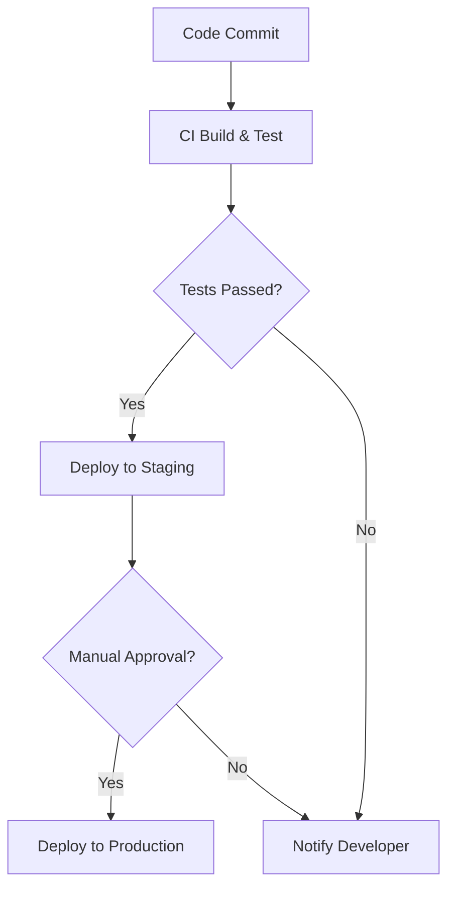

## 21.9. Continuous Integration and Deployment

Continuous Integration (CI) and Continuous Deployment (CD) are essential practices in modern software development, enabling teams to deliver high-quality software rapidly and reliably. In this section, we will explore how to implement CI/CD pipelines for Clojure applications, automate testing, building, and deployment processes, and ensure that your software is always in a deployable state.

### Understanding CI/CD

**Continuous Integration (CI)** is a development practice where developers integrate code into a shared repository frequently, ideally several times a day. Each integration is verified by an automated build and automated tests to detect integration errors as quickly as possible.

**Continuous Deployment (CD)** extends CI by automatically deploying code changes to a production environment after passing the CI tests. This practice ensures that software can be released to users at any time, reducing the time between writing code and deploying it.

#### Importance of CI/CD

- **Faster Feedback**: CI/CD provides immediate feedback on the quality of the code, allowing developers to address issues quickly.
- **Reduced Integration Problems**: By integrating frequently, teams can avoid the "integration hell" that often occurs when merging large changes.
- **Increased Deployment Frequency**: Automating the deployment process allows teams to deploy more frequently and with confidence.
- **Improved Collaboration**: CI/CD encourages collaboration by making the integration process transparent and shared among team members.

### Popular CI/CD Tools for Clojure

Several CI/CD tools can be used to automate the build, test, and deployment processes for Clojure applications. Let's explore some of the most popular options:

#### Jenkins

Jenkins is an open-source automation server that supports building, deploying, and automating any project. It is highly extensible with a rich ecosystem of plugins.

- **Setup**: Jenkins can be installed on a server or run as a Docker container. It requires a Jenkinsfile to define the CI/CD pipeline.
- **Configuration**: Use the Jenkins Pipeline DSL to define stages such as build, test, and deploy.
- **Integration**: Jenkins integrates with various version control systems, including Git, and can trigger builds based on code changes.

#### CircleCI

CircleCI is a cloud-based CI/CD service that automates the software development process using continuous integration and continuous delivery.

- **Setup**: CircleCI requires a `.circleci/config.yml` file in your repository to define the pipeline.
- **Configuration**: Define jobs and workflows to specify the sequence of steps for building, testing, and deploying your application.
- **Integration**: CircleCI integrates seamlessly with GitHub and Bitbucket, triggering builds on code changes.

#### GitHub Actions

GitHub Actions is a CI/CD platform that allows you to automate your workflow directly from your GitHub repository.

- **Setup**: Define workflows using YAML files in the `.github/workflows` directory.
- **Configuration**: Use actions to define jobs and steps for building, testing, and deploying your application.
- **Integration**: GitHub Actions integrates natively with GitHub, providing a seamless experience for repositories hosted on GitHub.

### Setting Up CI/CD for Clojure Projects

Let's walk through the process of setting up a CI/CD pipeline for a Clojure project using GitHub Actions as an example.

#### Step 1: Create a GitHub Repository

First, create a new GitHub repository for your Clojure project. If you already have a repository, ensure that your code is committed and pushed to the repository.

#### Step 2: Define a Workflow

Create a new directory named `.github/workflows` in the root of your repository. Inside this directory, create a YAML file (e.g., `ci.yml`) to define your workflow.

```yaml
name: CI

on:
  push:
    branches:
      - main
  pull_request:
    branches:
      - main

jobs:
  build:
    runs-on: ubuntu-latest

    steps:
    - name: Checkout code
      uses: actions/checkout@v2

    - name: Set up JDK 11
      uses: actions/setup-java@v2
      with:
        java-version: '11'

    - name: Install Leiningen
      run: |
        curl https://raw.githubusercontent.com/technomancy/leiningen/stable/bin/lein > ~/lein
        chmod +x ~/lein
        sudo mv ~/lein /usr/local/bin/lein

    - name: Build and test
      run: lein test
```

#### Step 3: Configure the Workflow

- **Trigger Events**: The workflow is triggered on `push` and `pull_request` events to the `main` branch.
- **Jobs and Steps**: The `build` job runs on the latest Ubuntu environment. It checks out the code, sets up JDK 11, installs Leiningen (a build tool for Clojure), and runs the tests using `lein test`.

#### Step 4: Commit and Push

Commit the workflow file to your repository and push the changes. GitHub Actions will automatically trigger the workflow based on the defined events.

### Best Practices for CI/CD Pipelines

- **Keep Pipelines Simple**: Start with a simple pipeline and gradually add complexity as needed. Avoid over-engineering.
- **Use Caching**: Cache dependencies and build artifacts to speed up the build process.
- **Fail Fast**: Configure your pipeline to fail early if any step fails. This approach saves time and resources.
- **Monitor and Optimize**: Regularly monitor your CI/CD pipelines for performance bottlenecks and optimize them.
- **Secure Your Pipelines**: Ensure that sensitive information, such as API keys and credentials, is stored securely and not exposed in logs.

### Security Considerations in Automation

- **Access Control**: Limit access to your CI/CD tools and ensure that only authorized users can trigger builds and deployments.
- **Environment Isolation**: Run builds and tests in isolated environments to prevent interference and ensure consistency.
- **Secret Management**: Use secret management tools to securely store and access sensitive information.
- **Audit and Logging**: Enable logging and auditing to track changes and identify potential security issues.

### Try It Yourself

Experiment with the provided GitHub Actions workflow by modifying the steps to include additional tasks, such as deploying to a cloud provider or running additional tests. Explore other CI/CD tools like Jenkins and CircleCI to understand their configuration and capabilities.

### Visualizing CI/CD Workflow

Below is a Mermaid.js diagram illustrating a typical CI/CD workflow:



This diagram represents the flow from code commit to deployment, highlighting decision points such as test results and manual approvals.

### References and Links

- [GitHub Actions Documentation](https://docs.github.com/en/actions)
- [CircleCI Documentation](https://circleci.com/docs/)
- [Jenkins Documentation](https://www.jenkins.io/doc/)

### Knowledge Check

To reinforce your understanding of CI/CD for Clojure applications, try answering the following questions:

## **Ready to Test Your Knowledge?**



### What is the primary goal of Continuous Integration (CI)?

- [x] To integrate code into a shared repository frequently and verify it with automated tests.
- [ ] To deploy code changes to production automatically.
- [ ] To manage version control for software projects.
- [ ] To monitor application performance in production.

> **Explanation:** Continuous Integration focuses on integrating code frequently and verifying it with automated tests to detect integration errors early.

### Which CI/CD tool is natively integrated with GitHub?

- [ ] Jenkins
- [ ] CircleCI
- [x] GitHub Actions
- [ ] Travis CI

> **Explanation:** GitHub Actions is natively integrated with GitHub, providing a seamless experience for automating workflows directly from GitHub repositories.

### What is the purpose of the `checkout` step in a GitHub Actions workflow?

- [x] To retrieve the code from the repository for the workflow to operate on.
- [ ] To deploy the code to a production environment.
- [ ] To install dependencies for the project.
- [ ] To run tests on the code.

> **Explanation:** The `checkout` step retrieves the code from the repository, allowing subsequent steps to operate on the codebase.

### What is a best practice for managing sensitive information in CI/CD pipelines?

- [ ] Hardcode sensitive information in the workflow files.
- [x] Use secret management tools to securely store and access sensitive information.
- [ ] Share sensitive information via email with team members.
- [ ] Store sensitive information in plain text files in the repository.

> **Explanation:** Using secret management tools ensures that sensitive information is stored securely and accessed safely within CI/CD pipelines.

### Which of the following is a benefit of Continuous Deployment (CD)?

- [x] Increased deployment frequency and reduced time to market.
- [ ] Reduced need for automated testing.
- [ ] Simplified version control management.
- [ ] Manual approval for every deployment.

> **Explanation:** Continuous Deployment allows for increased deployment frequency, reducing the time between writing code and deploying it to production.

### What is the role of caching in CI/CD pipelines?

- [x] To speed up the build process by reusing dependencies and build artifacts.
- [ ] To store logs and audit trails of the pipeline runs.
- [ ] To manage version control for the project.
- [ ] To deploy code changes to production.

> **Explanation:** Caching helps speed up the build process by reusing dependencies and build artifacts, reducing the time needed for subsequent builds.

### How can you ensure that a CI/CD pipeline fails fast?

- [x] Configure the pipeline to stop execution immediately if any step fails.
- [ ] Run all steps in parallel to save time.
- [ ] Ignore test failures and proceed with deployment.
- [ ] Manually review each step before proceeding.

> **Explanation:** Configuring the pipeline to stop execution immediately upon failure saves time and resources by preventing unnecessary steps from running.

### What is the significance of environment isolation in CI/CD?

- [x] To prevent interference between builds and ensure consistency.
- [ ] To deploy code changes to multiple environments simultaneously.
- [ ] To manage version control for the project.
- [ ] To store sensitive information securely.

> **Explanation:** Environment isolation ensures that builds and tests run in isolated environments, preventing interference and ensuring consistent results.

### Which CI/CD tool uses a Jenkinsfile to define the pipeline?

- [x] Jenkins
- [ ] CircleCI
- [ ] GitHub Actions
- [ ] Travis CI

> **Explanation:** Jenkins uses a Jenkinsfile to define the CI/CD pipeline, specifying the stages and steps for building, testing, and deploying the application.

### True or False: Continuous Deployment (CD) requires manual approval for every deployment.

- [ ] True
- [x] False

> **Explanation:** Continuous Deployment automates the deployment process, allowing code changes to be deployed to production automatically without manual approval.



Remember, mastering CI/CD is a journey. As you implement and refine your pipelines, you'll gain insights into optimizing your development workflow. Keep experimenting, stay curious, and enjoy the process of delivering high-quality software efficiently!
