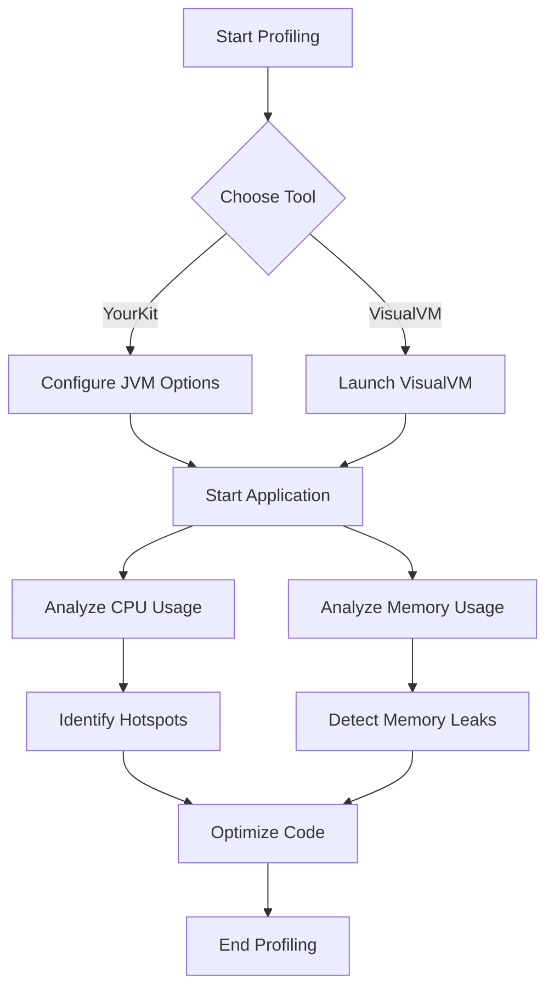

## 22.1. Profiling Tools and Techniques for Clojure: YourKit and VisualVM

In the world of software development, performance optimization is a critical aspect that can significantly impact the user experience and resource utilization of applications. Profiling tools like **YourKit** and **VisualVM** are indispensable for developers looking to identify and resolve performance bottlenecks in Clojure applications. In this section, we will explore the importance of profiling, introduce these powerful tools, and demonstrate how to effectively use them to optimize Clojure applications.

### The Importance of Profiling in Performance Optimization

Profiling is the process of analyzing a program to determine where it spends most of its time and how it uses resources such as memory and CPU. This information is crucial for:

- **Identifying Bottlenecks**: Pinpointing parts of the code that are inefficient or consume excessive resources.
- **Improving Performance**: Making informed decisions about where to focus optimization efforts.
- **Ensuring Scalability**: Understanding how an application behaves under load to ensure it can scale effectively.
- **Enhancing User Experience**: Reducing latency and improving responsiveness for end-users.

Without profiling, developers may rely on guesswork, leading to suboptimal performance improvements and wasted effort.

### Introducing YourKit and VisualVM

#### YourKit

**YourKit** is a commercial Java profiler known for its powerful features and user-friendly interface. It provides detailed insights into CPU and memory usage, thread activity, and more. Key features include:

- **CPU Profiling**: Analyze method execution times and identify slow methods.
- **Memory Profiling**: Detect memory leaks and analyze object allocations.
- **Thread Profiling**: Monitor thread states and identify deadlocks.
- **Integration with IDEs**: Seamless integration with popular IDEs for easy profiling.

#### VisualVM

**VisualVM** is a free, open-source tool that provides a visual interface for monitoring and troubleshooting Java applications. It is bundled with the JDK and offers features such as:

- **CPU and Memory Monitoring**: Real-time graphs and statistics.
- **Heap Dump Analysis**: Inspect memory usage and identify leaks.
- **Thread Analysis**: View thread activity and detect issues.
- **Plugin Support**: Extend functionality with plugins.

### Setting Up YourKit and VisualVM with Clojure Applications

#### Setting Up YourKit

1. **Download and Install**: Obtain YourKit from [yourkit.com](https://www.yourkit.com/) and follow the installation instructions.
2. **Configure Your Application**: Add the YourKit agent to your Clojure application's JVM options. For example:
   ```shell
   java -agentpath:/path/to/yourkit/libyjpagent.so -jar your-clojure-app.jar
   ```
3. **Start Profiling**: Launch YourKit and connect it to your running Clojure application.

#### Setting Up VisualVM

1. **Install VisualVM**: VisualVM is included with the JDK. Ensure you have the JDK installed, or download VisualVM from [visualvm.github.io](https://visualvm.github.io/).
2. **Launch VisualVM**: Start VisualVM and locate your running Clojure application in the Applications pane.
3. **Attach to the Application**: Double-click your application to start monitoring.

### Analyzing CPU and Memory Usage

#### CPU Profiling with YourKit

1. **Start CPU Profiling**: In YourKit, select the CPU tab and click "Start CPU Profiling."
2. **Run Your Application**: Execute the code paths you want to analyze.
3. **Stop Profiling**: Click "Stop CPU Profiling" to capture the data.
4. **Analyze Results**: Examine the call tree and hotspots to identify slow methods.

#### Memory Profiling with YourKit

1. **Start Memory Profiling**: Navigate to the Memory tab and click "Start Memory Profiling."
2. **Trigger Garbage Collection**: Use the "Force GC" button to clean up unused objects.
3. **Capture Snapshot**: Click "Capture Memory Snapshot" to analyze memory usage.
4. **Inspect Objects**: Review object allocations and identify potential leaks.

#### CPU and Memory Monitoring with VisualVM

1. **Monitor CPU Usage**: Use the CPU tab to view real-time CPU usage graphs.
2. **Analyze Memory Usage**: The Memory tab provides insights into heap usage and garbage collection.
3. **Heap Dump Analysis**: Capture a heap dump and use the Heap Dump tab to inspect memory allocations.

### Interpreting Profiling Results

Interpreting profiling results is crucial for making informed optimization decisions. Here are some tips:

- **Focus on Hotspots**: Prioritize optimizing methods with the highest execution times.
- **Identify Memory Leaks**: Look for objects that are not being garbage collected.
- **Analyze Thread Activity**: Ensure threads are not blocked or waiting unnecessarily.
- **Consider Trade-offs**: Optimization may involve trade-offs between CPU and memory usage.

### Visualizing Profiling Data

To better understand the profiling process, let's visualize the workflow using a Mermaid.js diagram:



**Diagram Description**: This flowchart illustrates the steps involved in profiling a Clojure application using YourKit or VisualVM, from starting the profiling process to analyzing results and optimizing code.

### Try It Yourself

To gain hands-on experience, try the following exercises:

1. **Experiment with YourKit**: Profile a simple Clojure application and identify a method that can be optimized.
2. **Use VisualVM**: Monitor a Clojure application and capture a heap dump. Analyze the dump to find memory leaks.
3. **Modify Code**: Make changes to your code based on profiling insights and observe the impact on performance.

### References and Further Reading

- [YourKit Java Profiler Documentation](https://www.yourkit.com/docs/)
- [VisualVM Documentation](https://visualvm.github.io/documentation.html)
- [Clojure Performance Optimization](https://clojure.org/guides/performance)

### Key Takeaways

- Profiling is essential for identifying performance bottlenecks in Clojure applications.
- YourKit and VisualVM are powerful tools for CPU and memory analysis.
- Effective profiling involves setting up the tools, capturing data, and interpreting results to inform optimizations.

## **Ready to Test Your Knowledge?**



### What is the primary purpose of profiling in software development?

- [x] Identifying performance bottlenecks
- [ ] Writing unit tests
- [ ] Designing user interfaces
- [ ] Managing project timelines

> **Explanation:** Profiling is used to identify performance bottlenecks and optimize resource usage in applications.

### Which of the following is a feature of YourKit?

- [x] CPU Profiling
- [ ] Code Refactoring
- [ ] Version Control
- [ ] Continuous Integration

> **Explanation:** YourKit provides CPU profiling, memory analysis, and thread monitoring features.

### How do you start profiling a Clojure application with YourKit?

- [x] Add the YourKit agent to JVM options
- [ ] Install a Clojure plugin
- [ ] Use a command-line tool
- [ ] Modify the application code

> **Explanation:** To start profiling with YourKit, you add the YourKit agent to the JVM options of your application.

### What is VisualVM primarily used for?

- [x] Monitoring and troubleshooting Java applications
- [ ] Designing databases
- [ ] Writing documentation
- [ ] Creating user interfaces

> **Explanation:** VisualVM is a tool for monitoring and troubleshooting Java applications, including Clojure apps.

### Which tool is bundled with the JDK?

- [x] VisualVM
- [ ] YourKit
- [ ] Eclipse
- [ ] IntelliJ IDEA

> **Explanation:** VisualVM is bundled with the JDK and provides profiling and monitoring capabilities.

### What can you analyze with a heap dump in VisualVM?

- [x] Memory usage and object allocations
- [ ] CPU usage
- [ ] Network traffic
- [ ] File system operations

> **Explanation:** A heap dump allows you to analyze memory usage and object allocations in an application.

### What is a common use case for thread profiling?

- [x] Identifying deadlocks
- [ ] Writing unit tests
- [ ] Designing user interfaces
- [ ] Managing project timelines

> **Explanation:** Thread profiling helps identify deadlocks and monitor thread activity.

### What should you focus on when interpreting CPU profiling results?

- [x] Hotspots with high execution times
- [ ] Methods with low execution times
- [ ] Unused variables
- [ ] Code comments

> **Explanation:** Focus on hotspots with high execution times to identify areas for optimization.

### Which of the following is a benefit of using profiling tools?

- [x] Improved performance and scalability
- [ ] Increased code complexity
- [ ] Longer development cycles
- [ ] Reduced code readability

> **Explanation:** Profiling tools help improve performance and scalability by identifying bottlenecks.

### True or False: Profiling can help enhance user experience by reducing latency.

- [x] True
- [ ] False

> **Explanation:** Profiling helps enhance user experience by identifying and resolving performance issues, reducing latency.



Remember, this is just the beginning. As you progress, you'll uncover more advanced techniques and tools to further optimize your Clojure applications. Keep experimenting, stay curious, and enjoy the journey!
