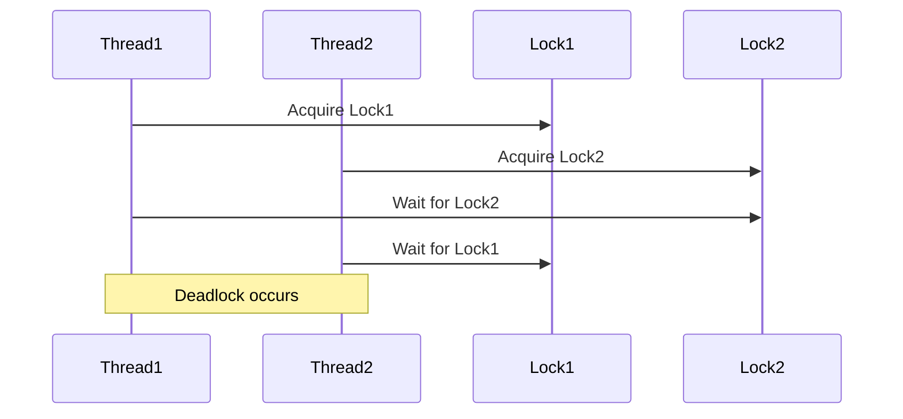

## 22.10. Performance Considerations in Concurrency

Concurrency is a powerful tool in modern programming, allowing us to perform multiple operations simultaneously and efficiently utilize system resources. However, it also introduces complexity and potential performance pitfalls. In this section, we will explore common performance issues in concurrent programming, such as lock contention, deadlocks, and context switching, and provide strategies for minimizing synchronization overhead. We will also delve into lock-free data structures and algorithms, with examples of optimizing concurrent code in Clojure.

### Understanding Concurrency in Clojure

Concurrency in Clojure is built on a foundation of immutable data structures and functional programming principles. This makes it easier to reason about concurrent code, as immutable data cannot be modified by multiple threads simultaneously. However, performance considerations still play a crucial role in writing efficient concurrent programs.

#### Key Concepts

- **Lock Contention**: Occurs when multiple threads compete for the same lock, leading to performance degradation.
- **Deadlocks**: A situation where two or more threads are blocked forever, waiting for each other to release locks.
- **Context Switching**: The overhead of switching between threads, which can impact performance if not managed properly.

### Common Performance Pitfalls in Concurrent Code

1. **Lock Contention**

Lock contention is a significant performance bottleneck in concurrent programming. When multiple threads attempt to acquire the same lock, they are forced to wait, leading to reduced throughput and increased latency.

**Example of Lock Contention:**

```clojure
(defn increment-counter [counter]
  (locking counter
    (Thread/sleep 100) ; Simulate some work
    (swap! counter inc)))

(def counter (atom 0))

(defn run-concurrent-tasks []
  (let [threads (map #(Thread. (fn [] (increment-counter counter))) (range 10))]
    (doseq [t threads] (.start t))
    (doseq [t threads] (.join t))
    @counter))

(run-concurrent-tasks)
```

In this example, multiple threads attempt to increment a shared counter, leading to lock contention on the `counter` atom.

2. **Deadlocks**

Deadlocks occur when two or more threads are waiting for each other to release locks, resulting in a standstill. This can happen when locks are acquired in different orders by different threads.

**Example of Deadlock:**

```clojure
(def lock1 (Object.))
(def lock2 (Object.))

(defn task1 []
  (locking lock1
    (Thread/sleep 100)
    (locking lock2
      (println "Task 1 completed"))))

(defn task2 []
  (locking lock2
    (Thread/sleep 100)
    (locking lock1
      (println "Task 2 completed"))))

(defn run-deadlock-example []
  (let [t1 (Thread. task1)
        t2 (Thread. task2)]
    (.start t1)
    (.start t2)
    (.join t1)
    (.join t2)))

(run-deadlock-example)
```

In this example, `task1` and `task2` can cause a deadlock if `task1` acquires `lock1` and `task2` acquires `lock2` simultaneously.

3. **Context Switching**

Context switching occurs when the CPU switches from executing one thread to another. This involves saving the state of the current thread and loading the state of the next thread, which can be costly in terms of performance.

### Strategies for Minimizing Synchronization Overhead

1. **Use Lock-Free Data Structures**

Lock-free data structures allow multiple threads to operate on shared data without the need for locks, reducing contention and improving performance.

**Example of Lock-Free Data Structure:**

Clojure's `atom` provides a lock-free mechanism for managing shared state.

```clojure
(def counter (atom 0))

(defn increment-counter []
  (swap! counter inc))

(defn run-lock-free-example []
  (let [threads (map #(Thread. increment-counter) (range 10))]
    (doseq [t threads] (.start t))
    (doseq [t threads] (.join t))
    @counter))

(run-lock-free-example)
```

In this example, the `atom` is used to manage a shared counter without locks, allowing for concurrent updates.

2. **Minimize Lock Scope**

Reduce the scope of locks to the smallest possible section of code to minimize contention.

```clojure
(defn increment-counter [counter]
  (let [new-value (inc @counter)]
    (locking counter
      (reset! counter new-value))))

(def counter (atom 0))

(defn run-minimized-lock-scope []
  (let [threads (map #(Thread. (fn [] (increment-counter counter))) (range 10))]
    (doseq [t threads] (.start t))
    (doseq [t threads] (.join t))
    @counter))

(run-minimized-lock-scope)
```

Here, the lock is only held during the update operation, reducing the time other threads must wait.

3. **Avoid Blocking Operations**

Avoid operations that block threads, such as I/O operations, within critical sections to reduce contention.

4. **Use Concurrent Collections**

Clojure provides several concurrent collections, such as `ConcurrentHashMap`, that are optimized for concurrent access.

### Lock-Free Programming Techniques

Lock-free programming involves designing algorithms that do not require locks for synchronization, relying instead on atomic operations.

**Example of Lock-Free Programming:**

```clojure
(defn compare-and-swap [atom old-value new-value]
  (if (= @atom old-value)
    (reset! atom new-value)
    @atom))

(def counter (atom 0))

(defn increment-counter []
  (loop []
    (let [old-value @counter
          new-value (inc old-value)]
      (when-not (= (compare-and-swap counter old-value new-value) old-value)
        (recur)))))

(defn run-lock-free-programming []
  (let [threads (map #(Thread. increment-counter) (range 10))]
    (doseq [t threads] (.start t))
    (doseq [t threads] (.join t))
    @counter))

(run-lock-free-programming)
```

In this example, the `compare-and-swap` function is used to implement a lock-free increment operation.

### Optimizing Concurrent Code in Clojure

1. **Use Software Transactional Memory (STM)**

Clojure's STM provides a mechanism for managing shared state with transactions, ensuring consistency without locks.

**Example of STM:**

```clojure
(def counter (ref 0))

(defn increment-counter []
  (dosync
    (alter counter inc)))

(defn run-stm-example []
  (let [threads (map #(Thread. increment-counter) (range 10))]
    (doseq [t threads] (.start t))
    (doseq [t threads] (.join t))
    @counter))

(run-stm-example)
```

2. **Leverage Core.Async for Asynchronous Programming**

Core.Async provides channels for communication between threads, allowing for non-blocking concurrent programming.

**Example of Core.Async:**

```clojure
(require '[clojure.core.async :refer [chan go <! >!]])

(defn async-task [ch]
  (go
    (Thread/sleep 100)
    (>! ch "Task completed")))

(defn run-core-async-example []
  (let [ch (chan)]
    (async-task ch)
    (println (<! ch))))

(run-core-async-example)
```

### Visualizing Concurrency Concepts

To better understand the flow of concurrent operations, let's visualize the process of lock contention and deadlocks using Mermaid.js diagrams.



**Diagram Description:** This sequence diagram illustrates a deadlock scenario where `Thread1` and `Thread2` are waiting for each other to release locks, resulting in a deadlock.

### Knowledge Check

- **What is lock contention, and how can it impact performance?**
- **Explain how deadlocks occur and provide strategies to avoid them.**
- **What is context switching, and why is it important to minimize it in concurrent programming?**
- **Describe the benefits of using lock-free data structures.**
- **How can Clojure's STM be used to manage shared state in concurrent programs?**

### Summary

In this section, we explored performance considerations in concurrent programming with Clojure. We identified common pitfalls such as lock contention, deadlocks, and context switching, and provided strategies for minimizing synchronization overhead. We also discussed lock-free programming techniques and demonstrated how to optimize concurrent code using Clojure's unique features, such as STM and Core.Async.

Remember, mastering concurrency is an ongoing journey. As you continue to explore and experiment with these concepts, you'll gain a deeper understanding of how to write efficient and performant concurrent programs in Clojure.

## **Ready to Test Your Knowledge?**



### What is lock contention?

- [x] When multiple threads compete for the same lock, leading to performance degradation.
- [ ] When a thread is unable to acquire any lock.
- [ ] When a lock is never released by a thread.
- [ ] When a thread holds multiple locks simultaneously.

> **Explanation:** Lock contention occurs when multiple threads attempt to acquire the same lock, causing them to wait and leading to performance issues.

### How can deadlocks be avoided?

- [x] By acquiring locks in a consistent order.
- [ ] By using more locks.
- [ ] By avoiding the use of locks altogether.
- [ ] By increasing the number of threads.

> **Explanation:** Acquiring locks in a consistent order can prevent deadlocks by ensuring that threads do not wait for each other indefinitely.

### What is context switching?

- [x] The overhead of switching between threads.
- [ ] The process of acquiring a lock.
- [ ] The act of releasing a lock.
- [ ] The execution of a thread.

> **Explanation:** Context switching involves saving and loading the state of threads, which can be costly in terms of performance.

### What is the benefit of lock-free data structures?

- [x] They allow multiple threads to operate on shared data without locks.
- [ ] They eliminate the need for synchronization.
- [ ] They prevent deadlocks.
- [ ] They increase the number of threads.

> **Explanation:** Lock-free data structures enable concurrent access to shared data without the need for locks, reducing contention and improving performance.

### How does Clojure's STM help in concurrent programming?

- [x] It manages shared state with transactions, ensuring consistency without locks.
- [ ] It eliminates the need for threads.
- [ ] It provides a mechanism for acquiring locks.
- [ ] It increases the number of locks.

> **Explanation:** Clojure's STM allows for managing shared state through transactions, ensuring consistency without the need for locks.

### What is a common performance pitfall in concurrent programming?

- [x] Lock contention.
- [ ] Using too many threads.
- [ ] Avoiding locks.
- [ ] Using immutable data structures.

> **Explanation:** Lock contention is a common performance pitfall where multiple threads compete for the same lock, leading to reduced throughput.

### What is the role of Core.Async in Clojure?

- [x] It provides channels for non-blocking communication between threads.
- [ ] It eliminates the need for locks.
- [ ] It increases the number of threads.
- [ ] It manages shared state with transactions.

> **Explanation:** Core.Async provides channels for communication between threads, allowing for non-blocking concurrent programming.

### What is a lock-free programming technique?

- [x] Using atomic operations instead of locks.
- [ ] Increasing the number of locks.
- [ ] Avoiding the use of threads.
- [ ] Using more threads.

> **Explanation:** Lock-free programming involves using atomic operations to manage shared data without locks, reducing contention.

### What is an example of minimizing lock scope?

- [x] Reducing the section of code where a lock is held.
- [ ] Increasing the number of locks.
- [ ] Avoiding the use of locks.
- [ ] Using more threads.

> **Explanation:** Minimizing lock scope involves reducing the section of code where a lock is held, minimizing contention.

### True or False: Deadlocks can occur when threads acquire locks in different orders.

- [x] True
- [ ] False

> **Explanation:** Deadlocks can occur when threads acquire locks in different orders, leading to a situation where they wait for each other indefinitely.


