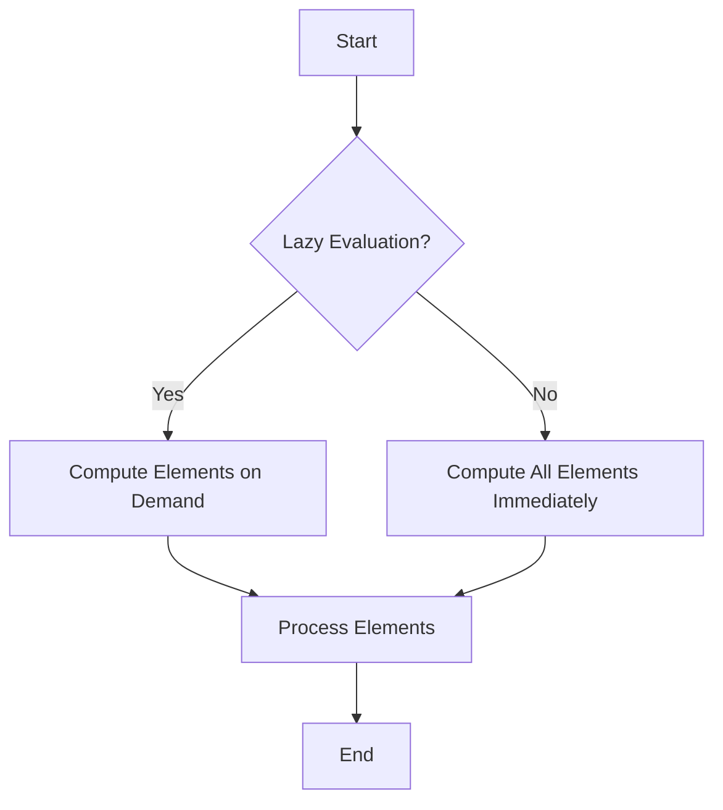

## 22.11. Optimizing Lazy Sequences

Lazy sequences are a powerful feature in Clojure that allow developers to work with potentially infinite data structures without incurring the cost of generating all elements at once. However, improper use of lazy sequences can lead to performance issues such as excessive memory consumption and stack overflows. In this section, we will explore how lazy sequences work, their benefits, common pitfalls, and strategies for optimizing their usage.

### Understanding Lazy Sequences

Lazy sequences in Clojure are sequences where elements are computed on demand. This means that elements are not generated until they are needed, which can lead to significant performance improvements, especially when dealing with large or infinite datasets.

#### Benefits of Lazy Sequences

1. **Efficiency**: Lazy sequences allow you to work with large datasets without loading everything into memory at once.
2. **Composability**: They enable the composition of sequence operations without evaluating intermediate results.
3. **Infinite Data Structures**: Lazy sequences can represent infinite data structures, such as the sequence of all natural numbers.

#### How Lazy Sequences Work

Lazy sequences are created using functions like `lazy-seq`, `map`, `filter`, and `range`. These functions return a sequence that computes its elements as they are accessed.

```clojure
(defn lazy-numbers []
  (lazy-seq (cons 1 (lazy-numbers))))

(take 5 (lazy-numbers)) ; => (1 1 1 1 1)
```

In this example, `lazy-numbers` is an infinite sequence of the number `1`. The `take` function is used to retrieve only the first five elements, demonstrating how lazy sequences compute elements on demand.

### Common Pitfalls with Lazy Sequences

While lazy sequences offer many advantages, they can also introduce performance issues if not used carefully.

#### Retaining Head References

One common pitfall is retaining references to the head of a lazy sequence. This can prevent the garbage collector from reclaiming memory, leading to excessive memory consumption.

```clojure
(def lazy-seq (map inc (range 1e6)))

(defn process-seq []
  (reduce + (take 100 lazy-seq)))

(process-seq) ; Memory usage can spike if lazy-seq is retained
```

In this example, if `lazy-seq` is retained, the entire sequence may be kept in memory, even though only a small portion is used.

#### Stack Overflows

Lazy sequences can also lead to stack overflows if they are not consumed properly. This is because each element in a lazy sequence can add a frame to the call stack.

```clojure
(defn infinite-ones []
  (lazy-seq (cons 1 (infinite-ones))))

(reduce + (infinite-ones)) ; This will cause a stack overflow
```

The `reduce` function tries to consume the entire sequence, leading to a stack overflow.

### Optimizing Lazy Sequences

To avoid these pitfalls, it's important to use lazy sequences judiciously and apply optimization techniques where necessary.

#### Using `doall` and `dorun`

The `doall` and `dorun` functions can be used to force the realization of a lazy sequence. This can be useful when you need to ensure that a sequence is fully realized before proceeding.

- **`doall`**: Realizes the entire sequence and returns it.
- **`dorun`**: Realizes the sequence but does not return it, useful for side effects.

```clojure
(defn process-seq []
  (let [seq (map inc (range 1e6))]
    (doall seq) ; Forces realization
    (reduce + (take 100 seq))))

(process-seq)
```

In this example, `doall` ensures that the sequence is fully realized before it is processed, preventing memory issues.

#### Lazy vs. Eager Evaluation

Understanding when to use lazy evaluation versus eager evaluation is crucial for optimizing performance.

- **Lazy Evaluation**: Use when working with large datasets or when the entire dataset is not needed.
- **Eager Evaluation**: Use when you need to ensure that all elements are processed or when side effects are involved.

```clojure
(defn eager-process []
  (let [seq (vec (map inc (range 1e6)))] ; Eagerly evaluated
    (reduce + (take 100 seq))))

(eager-process)
```

In this example, the sequence is eagerly evaluated using `vec`, ensuring that all elements are processed.

### Techniques for Optimizing Lazy Sequences

1. **Avoid Retaining Head References**: Ensure that references to the head of a lazy sequence are not retained longer than necessary.
2. **Use `doall` and `dorun` Appropriately**: Force realization of sequences when needed to prevent memory issues.
3. **Prefer Eager Evaluation for Side Effects**: Use eager evaluation when side effects are involved or when the entire dataset is needed.
4. **Limit the Depth of Lazy Operations**: Avoid deeply nested lazy operations to prevent stack overflows.

### Visualizing Lazy vs. Eager Evaluation

To better understand the difference between lazy and eager evaluation, let's visualize the process using a flowchart.



This flowchart illustrates the decision-making process when choosing between lazy and eager evaluation.

### When to Prefer Eager Evaluation

While lazy sequences are powerful, there are situations where eager evaluation is preferable:

- **When Side Effects Are Involved**: If your sequence operations involve side effects, eager evaluation ensures that all elements are processed.
- **When Memory Usage Is a Concern**: Eager evaluation can prevent memory issues by ensuring that sequences are fully realized.
- **When Performance Is Critical**: In some cases, eager evaluation can lead to better performance by reducing the overhead of lazy computation.

### Try It Yourself

Experiment with the following code examples to better understand lazy and eager evaluation:

1. Modify the `lazy-numbers` function to generate a sequence of natural numbers.
2. Use `doall` to force the realization of a sequence and observe the impact on memory usage.
3. Compare the performance of lazy and eager evaluation for a large dataset.

### References and Further Reading

- [Clojure Documentation on Lazy Sequences](https://clojure.org/reference/sequences)
- [MDN Web Docs on Lazy Evaluation](https://developer.mozilla.org/en-US/docs/Web/JavaScript/Reference/Global_Objects/Promise)
- [W3Schools on Functional Programming](https://www.w3schools.com/whatis/whatis_functional.asp)

### Knowledge Check

To reinforce your understanding of lazy sequences and their optimization, try answering the following questions.

## **Ready to Test Your Knowledge?**



### What is a key benefit of lazy sequences in Clojure?

- [x] They allow working with large datasets without loading everything into memory.
- [ ] They automatically optimize memory usage.
- [ ] They are always faster than eager sequences.
- [ ] They prevent all types of runtime errors.

> **Explanation:** Lazy sequences allow you to work with large datasets without loading everything into memory at once, which is a significant advantage.

### What is a common pitfall when using lazy sequences?

- [x] Retaining head references can lead to excessive memory consumption.
- [ ] They always cause stack overflows.
- [ ] Lazy sequences cannot be used with infinite data structures.
- [ ] They are incompatible with eager evaluation.

> **Explanation:** Retaining head references can prevent the garbage collector from reclaiming memory, leading to excessive memory consumption.

### How can you force the realization of a lazy sequence?

- [x] Use `doall` or `dorun`.
- [ ] Use `map` or `filter`.
- [ ] Use `reduce` or `take`.
- [ ] Use `cons` or `conj`.

> **Explanation:** `doall` and `dorun` are used to force the realization of a lazy sequence.

### When should you prefer eager evaluation over lazy evaluation?

- [x] When side effects are involved.
- [ ] When working with infinite data structures.
- [ ] When you want to minimize memory usage.
- [ ] When you need to delay computation.

> **Explanation:** Eager evaluation is preferable when side effects are involved to ensure that all elements are processed.

### What function can lead to a stack overflow if used improperly with lazy sequences?

- [x] `reduce`
- [ ] `map`
- [ ] `filter`
- [ ] `take`

> **Explanation:** `reduce` can lead to a stack overflow if it tries to consume an entire lazy sequence without proper handling.

### What is the purpose of the `doall` function?

- [x] To realize the entire sequence and return it.
- [ ] To realize the sequence without returning it.
- [ ] To create a lazy sequence.
- [ ] To filter elements from a sequence.

> **Explanation:** `doall` realizes the entire sequence and returns it, ensuring all elements are computed.

### Which of the following is a technique for optimizing lazy sequences?

- [x] Avoid retaining head references.
- [ ] Use `map` for all sequence operations.
- [ ] Always use lazy evaluation.
- [ ] Avoid using `doall`.

> **Explanation:** Avoiding retaining head references is a key technique for optimizing lazy sequences.

### What is a benefit of eager evaluation?

- [x] It ensures all elements are processed when side effects are involved.
- [ ] It always uses less memory than lazy evaluation.
- [ ] It is faster than lazy evaluation in all cases.
- [ ] It prevents stack overflows.

> **Explanation:** Eager evaluation ensures all elements are processed, which is beneficial when side effects are involved.

### How can you visualize the difference between lazy and eager evaluation?

- [x] Using a flowchart.
- [ ] Using a pie chart.
- [ ] Using a bar graph.
- [ ] Using a scatter plot.

> **Explanation:** A flowchart can effectively visualize the decision-making process between lazy and eager evaluation.

### True or False: Lazy sequences in Clojure are always more efficient than eager sequences.

- [ ] True
- [x] False

> **Explanation:** Lazy sequences are not always more efficient; their efficiency depends on the context and how they are used.



Remember, mastering lazy sequences is just the beginning. As you continue your journey with Clojure, you'll discover even more powerful techniques to optimize your code and build efficient applications. Keep experimenting, stay curious, and enjoy the journey!
