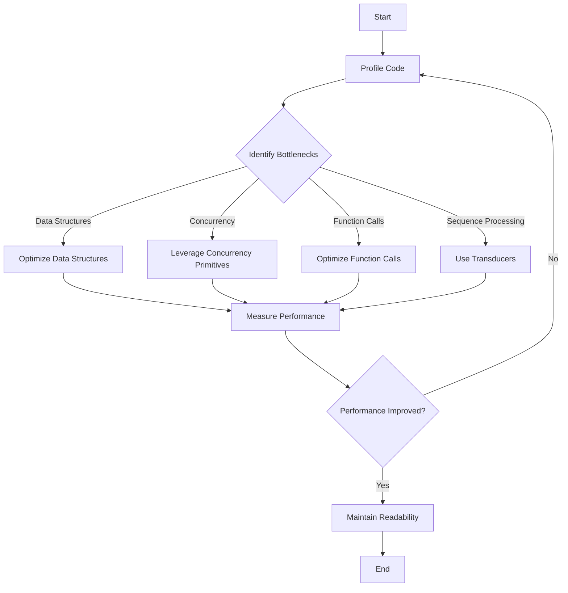

## 22.12. Best Practices for High-Performance Clojure Code

In the world of software development, performance is a critical aspect that can significantly impact the success of an application. Clojure, a functional programming language that runs on the Java Virtual Machine (JVM), offers a unique set of features that can be leveraged to write high-performance code. However, achieving optimal performance requires a deep understanding of both Clojure's capabilities and the underlying JVM. In this section, we will explore best practices for writing high-performance Clojure code, emphasizing the importance of code readability and maintainability alongside performance.

### Understanding Performance in Clojure

Before diving into specific strategies, it's essential to understand what performance means in the context of Clojure. Performance can be measured in terms of execution speed, memory usage, and responsiveness, particularly in concurrent applications. Clojure's immutable data structures, functional programming paradigms, and concurrency primitives provide a robust foundation for writing efficient code, but they also introduce unique challenges.

### Key Performance Optimization Strategies

#### 1. Profiling and Measuring

**Emphasize Profiling:** Always start with profiling your code to identify bottlenecks. Tools like [VisualVM](https://visualvm.github.io/) and [YourKit](https://www.yourkit.com/) are invaluable for JVM-based applications. Profiling helps you understand where your application spends most of its time and which parts consume the most memory.

**Measure, Don't Assume:** Avoid making assumptions about performance. Use benchmarks to measure the impact of your changes. The [Criterium](https://github.com/hugoduncan/criterium) library is a popular choice for benchmarking Clojure code.

```clojure
(require '[criterium.core :refer [quick-bench]])

(defn example-function []
  (reduce + (range 1000)))

(quick-bench (example-function))
```

#### 2. Efficient Use of Data Structures

**Choose the Right Data Structure:** Clojure provides a variety of immutable data structures, including lists, vectors, maps, and sets. Each has its strengths and weaknesses. For example, vectors offer fast random access, while lists are optimized for sequential access.

**Use Transients for Performance:** When you need to perform a series of mutations on a data structure, consider using transients. Transients provide a way to perform efficient, temporary mutations on immutable data structures.

```clojure
(defn build-vector []
  (persistent! (reduce conj! (transient []) (range 1000))))
```

#### 3. Leveraging Concurrency

**Utilize Clojure's Concurrency Primitives:** Clojure's atoms, refs, agents, and core.async channels provide powerful tools for managing concurrency. Choose the right primitive based on your use case. For example, use atoms for independent state updates and refs for coordinated transactions.

**Avoid Blocking Operations:** In asynchronous code, avoid blocking operations that can lead to performance bottlenecks. Use non-blocking constructs like futures and promises to handle asynchronous tasks.

```clojure
(defn async-task []
  (future
    (Thread/sleep 1000)
    (println "Task completed")))
```

#### 4. Optimize Function Calls

**Minimize Function Call Overhead:** In performance-critical sections, consider minimizing the overhead of function calls. Inline small functions where appropriate, but balance this with code readability.

**Use Memoization:** For functions with expensive computations that are called repeatedly with the same arguments, use memoization to cache results.

```clojure
(def memoized-fib (memoize (fn [n]
                             (if (<= n 1)
                               n
                               (+ (memoized-fib (- n 1)) (memoized-fib (- n 2)))))))
```

#### 5. Efficient Sequence Processing

**Prefer Lazy Sequences:** Clojure's lazy sequences allow you to work with potentially infinite data structures without consuming excessive memory. Use lazy sequences to defer computation until necessary.

**Use Transducers for Transformation:** Transducers provide a way to compose sequence transformations without creating intermediate collections, improving both performance and memory usage.

```clojure
(def xform (comp (filter even?) (map inc)))

(transduce xform + (range 1000))
```

### Code Readability and Maintainability

While optimizing for performance, it's crucial not to sacrifice code readability and maintainability. Here are some guidelines to ensure your code remains clean and understandable:

- **Use Descriptive Names:** Choose meaningful names for functions and variables to make your code self-documenting.
- **Comment Wisely:** Use comments to explain complex logic or performance optimizations that might not be immediately obvious.
- **Refactor Regularly:** Regularly refactor your code to improve its structure and readability. This practice helps prevent technical debt and makes future optimizations easier.

### Real-World Performance Improvements

Let's explore a real-world scenario where performance optimization made a significant impact. Consider a Clojure application that processes large datasets. Initially, the application used naive sequence processing, leading to high memory consumption and slow execution times. By switching to transducers and leveraging parallel processing with `pmap`, the team achieved a 50% reduction in execution time and a 30% decrease in memory usage.

### Checklist for High-Performance Clojure Code

To help you write high-performance Clojure code, here is a checklist of best practices:

1. **Profile and Benchmark:** Regularly profile your code and use benchmarks to measure performance improvements.
2. **Choose the Right Data Structures:** Select data structures that align with your access patterns and performance requirements.
3. **Leverage Concurrency Primitives:** Use Clojure's concurrency tools to manage state and parallelize tasks effectively.
4. **Optimize Function Calls:** Minimize function call overhead and use memoization where appropriate.
5. **Process Sequences Efficiently:** Use lazy sequences and transducers to optimize sequence processing.
6. **Maintain Readability:** Ensure your code remains readable and maintainable through descriptive naming, wise commenting, and regular refactoring.

### Encouragement and Next Steps

Remember, performance optimization is an ongoing journey. As you gain experience, you'll develop an intuition for identifying performance bottlenecks and applying the right optimizations. Keep experimenting, stay curious, and enjoy the process of making your Clojure applications faster and more efficient.

### Try It Yourself

To solidify your understanding of these concepts, try modifying the code examples provided. Experiment with different data structures, concurrency primitives, and sequence processing techniques. Observe how these changes impact performance and consider how you might apply these strategies to your own projects.

### Visualizing Performance Optimization

To better understand the flow of performance optimization in Clojure, let's visualize the process using a flowchart.



### References and Further Reading

For more information on performance optimization in Clojure, consider exploring the following resources:

- [Clojure Performance](https://clojure.org/reference/performance)
- [Criterium Benchmarking Library](https://github.com/hugoduncan/criterium)
- [VisualVM](https://visualvm.github.io/)
- [YourKit Java Profiler](https://www.yourkit.com/)

## **Ready to Test Your Knowledge?**



### What is the first step in optimizing Clojure code performance?

- [x] Profiling the code
- [ ] Refactoring the code
- [ ] Choosing the right data structures
- [ ] Using transducers

> **Explanation:** Profiling helps identify bottlenecks, which is the first step in optimization.

### Which Clojure library is commonly used for benchmarking?

- [ ] Eastwood
- [x] Criterium
- [ ] Midje
- [ ] Ring

> **Explanation:** Criterium is a popular library for benchmarking Clojure code.

### What is the benefit of using transients in Clojure?

- [x] They allow efficient temporary mutations on immutable data structures.
- [ ] They provide thread safety.
- [ ] They improve code readability.
- [ ] They enable lazy evaluation.

> **Explanation:** Transients allow efficient temporary mutations, which can improve performance.

### Which concurrency primitive should be used for independent state updates?

- [ ] Refs
- [x] Atoms
- [ ] Agents
- [ ] Channels

> **Explanation:** Atoms are suitable for independent state updates.

### What is the purpose of memoization in Clojure?

- [x] To cache results of expensive function calls
- [ ] To improve code readability
- [x] To reduce memory usage
- [ ] To enable lazy evaluation

> **Explanation:** Memoization caches results to avoid repeated expensive computations.

### How can you avoid blocking operations in asynchronous code?

- [x] Use non-blocking constructs like futures
- [ ] Use transients
- [ ] Use lazy sequences
- [ ] Use memoization

> **Explanation:** Non-blocking constructs like futures help avoid blocking operations.

### What is a key advantage of using lazy sequences?

- [x] They defer computation until necessary.
- [ ] They provide thread safety.
- [x] They improve code readability.
- [ ] They enable memoization.

> **Explanation:** Lazy sequences defer computation, which can save memory and processing time.

### Which tool is used for profiling JVM-based applications?

- [ ] Criterium
- [x] VisualVM
- [ ] Eastwood
- [ ] Leiningen

> **Explanation:** VisualVM is used for profiling JVM-based applications.

### What should you do if performance is not improved after optimization?

- [x] Re-profile the code
- [ ] Refactor the code
- [ ] Use different data structures
- [ ] Use more concurrency primitives

> **Explanation:** Re-profiling helps identify if further optimizations are needed.

### True or False: Code readability should be sacrificed for performance.

- [ ] True
- [x] False

> **Explanation:** Code readability and maintainability should not be sacrificed for performance.


