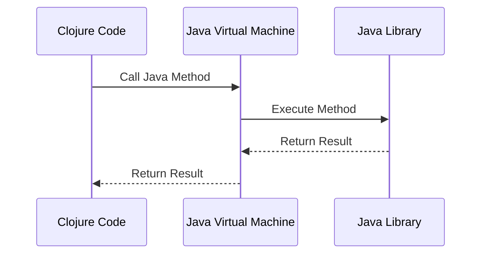

## 22.13. Leveraging Java Interop for Performance

Clojure, a dynamic and functional language, runs on the Java Virtual Machine (JVM), which allows it to seamlessly interoperate with Java. This interoperability provides a significant advantage when it comes to performance optimization. By leveraging Java's mature ecosystem and optimized libraries, Clojure developers can enhance the performance of their applications. In this section, we will explore how to effectively use Java interop in Clojure to boost performance, including calling Java methods, using Java classes, and integrating Java libraries.

### Understanding Java Interop in Clojure

Java interop in Clojure allows developers to call Java methods, instantiate Java objects, and use Java libraries directly within Clojure code. This capability is crucial for performance optimization, as it enables the use of highly optimized Java libraries and APIs that are not natively available in Clojure.

#### Calling Java Methods

To call a Java method in Clojure, you use the dot operator (`.`). Here's a simple example of calling a static method from the `Math` class:

```clojure
;; Calling a static method in Java
(defn calculate-square-root [x]
  (Math/sqrt x))

;; Usage
(calculate-square-root 16) ; => 4.0
```

For instance methods, you first create an instance of the Java class and then call the method:

```clojure
;; Creating an instance and calling an instance method
(defn get-string-length [s]
  (.length s))

;; Usage
(get-string-length "Clojure") ; => 7
```

#### Using Java Classes

Clojure allows you to create instances of Java classes using the `new` keyword or the class constructor. Here's how you can create a new `ArrayList`:

```clojure
;; Creating a new Java ArrayList
(defn create-array-list []
  (new java.util.ArrayList))

;; Alternative way using the class constructor
(defn create-array-list-alt []
  (java.util.ArrayList.))

;; Usage
(def my-list (create-array-list))
(.add my-list "Clojure")
(.add my-list "Java")
```

### Scenarios for Java Interop Performance Benefits

Java interop can be particularly beneficial in scenarios where performance is critical. Here are some common use cases:

1. **Heavy Computation**: Java's libraries for numerical computation, such as Apache Commons Math or JAMA, are highly optimized and can be leveraged for performance-intensive tasks.

2. **Data Processing**: Java's data processing libraries, like Apache POI for Excel files or Jackson for JSON parsing, offer efficient data handling capabilities.

3. **Concurrency**: Java's concurrency utilities, such as `java.util.concurrent`, provide robust and efficient concurrency mechanisms that can be used in Clojure applications.

4. **Graphics and UI**: Java's Swing and JavaFX libraries can be used for building performant graphical user interfaces.

### Integrating Java Libraries

Integrating Java libraries into a Clojure project involves adding the library as a dependency and using it within your Clojure code. Here's an example of integrating the Apache Commons Math library for numerical computations:

1. **Add Dependency**: Add the library to your `project.clj` file.

```clojure
(defproject my-clojure-project "0.1.0-SNAPSHOT"
  :dependencies [[org.clojure/clojure "1.10.1"]
                 [org.apache.commons/commons-math3 "3.6.1"]])
```

2. **Use the Library**: Import and use the library in your Clojure code.

```clojure
(ns my-clojure-project.core
  (:import [org.apache.commons.math3.stat.descriptive DescriptiveStatistics]))

(defn calculate-mean [data]
  (let [stats (DescriptiveStatistics.)]
    (doseq [d data]
      (.addValue stats d))
    (.getMean stats)))

;; Usage
(calculate-mean [1.0 2.0 3.0 4.0 5.0]) ; => 3.0
```

### Writing Custom Java Code

Sometimes, you may need to write custom Java code to achieve specific performance goals. You can compile your Java code and include it in your Clojure project. Here's a simple example:

1. **Write Java Code**: Create a Java class with the desired functionality.

```java
// File: src/java/MyMath.java
public class MyMath {
    public static double multiply(double a, double b) {
        return a * b;
    }
}
```

2. **Compile Java Code**: Compile the Java code and ensure the compiled classes are in the classpath.

3. **Use in Clojure**: Call the Java method from your Clojure code.

```clojure
(ns my-clojure-project.core
  (:import [MyMath]))

(defn multiply-numbers [a b]
  (MyMath/multiply a b))

;; Usage
(multiply-numbers 3.0 4.0) ; => 12.0
```

### Considerations for Java Interop

When using Java interop, there are several considerations to keep in mind:

- **Data Type Conversions**: Be aware of the differences between Clojure and Java data types. For example, Clojure's `nil` is equivalent to Java's `null`, and Clojure's collections are immutable, unlike Java's mutable collections.

- **Error Handling**: Java exceptions need to be handled appropriately in Clojure. Use `try` and `catch` to manage exceptions.

```clojure
(defn safe-division [a b]
  (try
    (/ a b)
    (catch ArithmeticException e
      (println "Cannot divide by zero")
      nil)))

;; Usage
(safe-division 10 0) ; => "Cannot divide by zero"
```

- **Performance Overhead**: While Java interop can enhance performance, it may also introduce overhead due to data conversions and method calls. Profile your application to ensure that the performance benefits outweigh the costs.

### Best Practices for Java Interop

To maintain a coherent codebase while using Java interop, consider the following best practices:

- **Encapsulation**: Encapsulate Java interop code within dedicated namespaces or functions to isolate it from the rest of your Clojure code.

- **Documentation**: Document the purpose and usage of Java interop code to aid future maintenance and understanding.

- **Testing**: Write tests for Java interop code to ensure its correctness and performance.

- **Profiling**: Use profiling tools to measure the performance impact of Java interop and optimize as needed.

- **Consistency**: Maintain consistency in coding style and conventions across Clojure and Java code.

### Visualizing Java Interop in Clojure

To better understand how Java interop works in Clojure, let's visualize the process using a sequence diagram:



**Diagram Description**: This sequence diagram illustrates the interaction between Clojure code, the JVM, and a Java library when a Java method is called from Clojure. The Clojure code initiates the call, which is executed by the JVM, and the result is returned back to the Clojure code.

### Try It Yourself

To deepen your understanding of Java interop in Clojure, try modifying the code examples provided. Experiment with different Java libraries, write custom Java code, and measure the performance impact. Consider the following exercises:

1. **Exercise 1**: Integrate a Java library of your choice into a Clojure project and use it to perform a specific task.

2. **Exercise 2**: Write a custom Java class with a method that performs a computationally intensive task, and call it from Clojure.

3. **Exercise 3**: Profile a Clojure application with and without Java interop to compare performance metrics.

### Summary

Leveraging Java interop in Clojure is a powerful technique for enhancing application performance. By calling Java methods, using Java classes, and integrating Java libraries, Clojure developers can take advantage of Java's optimized ecosystem. However, it's important to consider data type conversions, error handling, and performance overhead. By following best practices and experimenting with different scenarios, you can effectively use Java interop to boost the performance of your Clojure applications.

## **Ready to Test Your Knowledge?**



### What is the primary advantage of using Java interop in Clojure?

- [x] Access to optimized Java libraries
- [ ] Simplified syntax
- [ ] Improved readability
- [ ] Enhanced security

> **Explanation:** Java interop allows Clojure developers to access Java's optimized libraries, which can significantly enhance performance.

### How do you call a static Java method in Clojure?

- [x] Using the dot operator (.)
- [ ] Using the colon operator (:)
- [ ] Using the arrow operator (->)
- [ ] Using the double colon operator (::)

> **Explanation:** The dot operator (.) is used to call static methods in Java from Clojure.

### What should you consider when using Java interop for performance?

- [x] Data type conversions
- [x] Error handling
- [ ] Code readability
- [ ] Syntax highlighting

> **Explanation:** Data type conversions and error handling are important considerations when using Java interop for performance.

### Which Java library is commonly used for numerical computations in Clojure?

- [x] Apache Commons Math
- [ ] Jackson
- [ ] Apache POI
- [ ] JavaFX

> **Explanation:** Apache Commons Math is a popular library for numerical computations that can be used in Clojure through Java interop.

### How can you create an instance of a Java class in Clojure?

- [x] Using the `new` keyword
- [x] Using the class constructor
- [ ] Using the `create` keyword
- [ ] Using the `instantiate` function

> **Explanation:** You can create an instance of a Java class in Clojure using the `new` keyword or the class constructor.

### What is a potential downside of using Java interop in Clojure?

- [x] Performance overhead
- [ ] Increased security
- [ ] Simplified error handling
- [ ] Enhanced readability

> **Explanation:** Java interop can introduce performance overhead due to data conversions and method calls.

### Which of the following is a best practice for Java interop in Clojure?

- [x] Encapsulate Java interop code
- [x] Document the code
- [ ] Use Java interop for all tasks
- [ ] Avoid testing Java interop code

> **Explanation:** Encapsulating and documenting Java interop code are best practices to maintain a coherent codebase.

### What is the equivalent of Clojure's `nil` in Java?

- [x] null
- [ ] void
- [ ] zero
- [ ] empty

> **Explanation:** In Java, `null` is the equivalent of Clojure's `nil`.

### How can you handle Java exceptions in Clojure?

- [x] Using `try` and `catch`
- [ ] Using `if` and `else`
- [ ] Using `when` and `unless`
- [ ] Using `case` and `cond`

> **Explanation:** Java exceptions can be handled in Clojure using `try` and `catch`.

### True or False: Java interop in Clojure can only be used for performance optimization.

- [ ] True
- [x] False

> **Explanation:** While Java interop is often used for performance optimization, it can also be used for accessing Java libraries and APIs not available in Clojure.



Remember, this is just the beginning. As you progress, you'll discover more ways to optimize your Clojure applications using Java interop. Keep experimenting, stay curious, and enjoy the journey!
