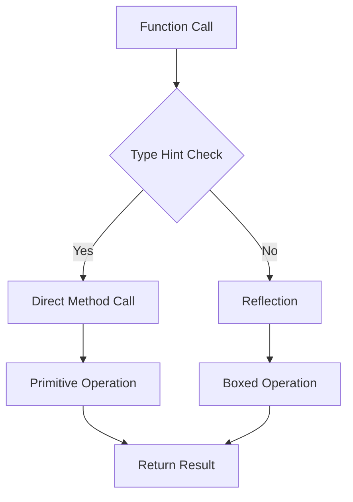

## 22.14. Using Primitives and Type Hints

In the realm of Clojure programming, performance optimization is a crucial aspect, especially when dealing with computationally intensive tasks. One of the effective strategies to enhance performance is by using primitive data types and type hints. This section delves into how these techniques can be employed to avoid reflection, improve execution speed, and ensure efficient code execution.

### Understanding Primitives in Clojure

Clojure, being a language that runs on the Java Virtual Machine (JVM), inherently supports Java's primitive data types such as `int`, `long`, `float`, `double`, and `boolean`. These types are stored directly in memory, unlike their boxed counterparts (`Integer`, `Long`, `Float`, `Double`, `Boolean`), which are objects and involve additional overhead.

#### Role of Primitives

Primitives play a significant role in performance optimization by:

- **Reducing Memory Footprint**: Primitives consume less memory compared to their boxed versions.
- **Enhancing Speed**: Operations on primitives are faster as they avoid the overhead of object creation and garbage collection.
- **Avoiding Reflection**: Using primitives can help avoid reflection, which is a costly operation in terms of performance.

### Adding Type Hints in Clojure

Type hints in Clojure are annotations that inform the compiler about the expected type of a variable or expression. This allows the compiler to generate more efficient bytecode by avoiding reflection.

#### Syntax of Type Hints

Type hints are added using the `^` (caret) notation. Here's how you can apply type hints:

```clojure
(defn add-integers
  [^int a ^int b]
  (+ a b))
```

In the example above, `^int` is a type hint indicating that both `a` and `b` are integers. This helps the compiler optimize the addition operation.

### Optimizing Functions with Primitives and Type Hints

Let's explore how to optimize functions using primitives and type hints through practical examples.

#### Example 1: Summing a List of Integers

Consider a function that sums a list of integers:

```clojure
(defn sum-list
  [numbers]
  (reduce + numbers))
```

To optimize this function, we can use type hints and primitives:

```clojure
(defn sum-list-optimized
  [^longs numbers]
  (reduce + (map ^long identity numbers)))
```

In this optimized version, we use `^longs` to indicate that `numbers` is a sequence of longs, and `^long` to hint that each element is a long. This reduces the overhead of boxing and unboxing.

#### Example 2: Calculating Factorials

Factorial calculation is a common example where performance can be critical:

```clojure
(defn factorial
  [n]
  (reduce * (range 1 (inc n))))
```

Optimized with type hints:

```clojure
(defn factorial-optimized
  [^long n]
  (reduce * (map ^long identity (range 1 (inc n)))))
```

By hinting `n` as a `^long`, we ensure that the range and multiplication operations are performed using primitive longs.

### Impact on Performance

Using primitives and type hints can significantly improve performance by:

- **Reducing Reflection**: Type hints eliminate the need for reflection, allowing the compiler to generate direct method calls.
- **Improving Execution Speed**: Operations on primitives are faster due to reduced overhead.
- **Lowering Memory Usage**: Primitives use less memory, leading to better cache utilization and reduced garbage collection.

#### Performance Considerations

While type hints and primitives offer performance benefits, they should be used judiciously:

- **Readability**: Excessive use of type hints can make code less readable and harder to maintain.
- **Compatibility**: Ensure that type hints align with the expected input types to avoid runtime errors.
- **Profiling**: Use profiling tools to identify bottlenecks and apply type hints where they have the most impact.

### When and How to Apply Type Hints

Type hints should be applied strategically to maximize performance gains:

- **Critical Paths**: Focus on optimizing code paths that are executed frequently or involve intensive computations.
- **Data Processing**: Use type hints in functions that process large datasets or perform complex calculations.
- **Interfacing with Java**: When calling Java methods, type hints can help avoid reflection and improve interop performance.

### Try It Yourself

To get hands-on experience with primitives and type hints, try modifying the examples provided:

- **Experiment with Different Types**: Change the type hints to other primitive types and observe the impact on performance.
- **Profile Your Code**: Use a profiler to measure the performance improvements achieved by using type hints.
- **Explore Edge Cases**: Test the optimized functions with edge cases to ensure they handle all inputs correctly.

### Visualizing Type Hints and Primitives

To better understand how type hints and primitives work together, let's visualize the process:



**Diagram Description**: This flowchart illustrates the decision-making process when a function call is made. If type hints are present, the compiler makes a direct method call, leading to primitive operations. Without type hints, reflection occurs, resulting in boxed operations.

### References and Further Reading

- [Clojure Official Documentation](https://clojure.org/reference/java_interop)
- [Java Primitive Data Types](https://docs.oracle.com/javase/tutorial/java/nutsandbolts/datatypes.html)
- [Performance Optimization in Clojure](https://clojure.org/guides/performance)

### Knowledge Check

To reinforce your understanding, try answering the following questions and challenges.

## **Ready to Test Your Knowledge?**



### What is the primary benefit of using primitives in Clojure?

- [x] Reducing memory footprint and enhancing speed
- [ ] Improving code readability
- [ ] Simplifying code structure
- [ ] Increasing code flexibility

> **Explanation:** Primitives reduce memory usage and enhance execution speed by avoiding the overhead of object creation and garbage collection.

### How do you add a type hint in Clojure?

- [x] Using the `^` (caret) notation
- [ ] Using the `@` symbol
- [ ] Using the `#` symbol
- [ ] Using the `&` symbol

> **Explanation:** Type hints in Clojure are added using the `^` (caret) notation to inform the compiler about the expected type.

### What is the effect of type hints on reflection?

- [x] They eliminate the need for reflection
- [ ] They increase the need for reflection
- [ ] They have no effect on reflection
- [ ] They make reflection more complex

> **Explanation:** Type hints allow the compiler to generate direct method calls, eliminating the need for reflection.

### Which of the following is a potential risk of using type hints?

- [x] Reduced code readability
- [ ] Increased memory usage
- [ ] Slower execution speed
- [ ] More frequent garbage collection

> **Explanation:** Excessive use of type hints can make code less readable and harder to maintain.

### When should you apply type hints?

- [x] In critical paths and data processing functions
- [ ] In all functions regardless of their complexity
- [ ] Only in functions that do not interact with Java
- [ ] Only in functions that are rarely used

> **Explanation:** Type hints should be applied in critical paths and functions that process large datasets or perform complex calculations.

### What is the role of primitives in avoiding reflection?

- [x] Primitives allow direct method calls without reflection
- [ ] Primitives require reflection for method calls
- [ ] Primitives have no role in reflection
- [ ] Primitives increase the need for reflection

> **Explanation:** Primitives enable direct method calls, avoiding the overhead of reflection.

### How can you measure the performance impact of type hints?

- [x] By using profiling tools
- [ ] By counting the lines of code
- [ ] By checking code readability
- [ ] By analyzing code complexity

> **Explanation:** Profiling tools can be used to measure the performance improvements achieved by using type hints.

### What is a common use case for type hints?

- [x] Interfacing with Java methods
- [ ] Writing documentation
- [ ] Designing user interfaces
- [ ] Creating database schemas

> **Explanation:** Type hints are commonly used when interfacing with Java methods to avoid reflection and improve performance.

### True or False: Type hints can be used to improve code readability.

- [ ] True
- [x] False

> **Explanation:** While type hints improve performance, they can reduce code readability if used excessively.

### Which of the following is a benefit of using primitives?

- [x] Faster operations due to reduced overhead
- [ ] Increased code complexity
- [ ] Higher memory usage
- [ ] More frequent garbage collection

> **Explanation:** Primitives offer faster operations by reducing the overhead associated with object creation and garbage collection.



Remember, this is just the beginning. As you progress, you'll discover more ways to optimize your Clojure code. Keep experimenting, stay curious, and enjoy the journey!
