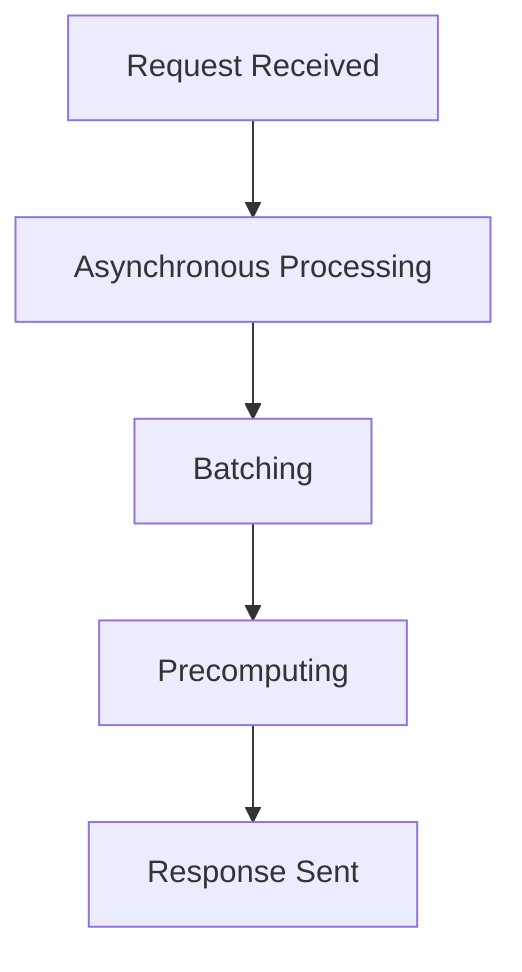

## 22.15. Latency Optimization Techniques

In today's fast-paced digital world, latency optimization is crucial for delivering high-performance applications. Whether you're building real-time systems, high-frequency trading platforms, or responsive web services, understanding and minimizing latency can significantly enhance user experience and system efficiency. In this section, we'll explore various techniques to optimize latency in Clojure applications, focusing on asynchronous processing, batching, precomputing, and more.

### Understanding Latency

**Latency** refers to the time delay between a request and its corresponding response. In computing, it is often measured in milliseconds and can be a critical factor in the performance of applications, especially those requiring real-time processing. High latency can lead to sluggish user experiences, reduced throughput, and even system failures in time-sensitive environments.

#### Significance of Latency in Applications

- **Real-Time Systems**: Applications like video conferencing, online gaming, and live streaming require minimal latency to function effectively.
- **High-Frequency Trading**: In financial markets, even microsecond delays can result in significant financial losses.
- **Web Services**: Fast response times are essential for maintaining user engagement and satisfaction.

### Techniques for Reducing Latency

#### 1. Asynchronous Processing

Asynchronous processing allows tasks to be executed concurrently, reducing wait times and improving overall system responsiveness.

**Example: Using Clojure's Core.Async**

```clojure
(require '[clojure.core.async :refer [go chan >! <!]])

(defn async-task [input]
  (go
    (let [result (<! (some-async-operation input))]
      (println "Processed result:" result))))

(defn process-requests [requests]
  (let [c (chan)]
    (doseq [req requests]
      (async-task req))
    (println "All tasks dispatched.")))

(process-requests [1 2 3 4 5])
```

**Explanation**: In this example, `core.async` is used to process requests asynchronously. Each request is handled in a separate go block, allowing other tasks to proceed without waiting for each one to complete.

#### 2. Batching

Batching involves grouping multiple operations into a single batch to reduce the overhead of individual processing.

**Example: Batching Database Writes**

```clojure
(defn batch-write [db-conn data]
  (let [batch-size 100
        batches (partition-all batch-size data)]
    (doseq [batch batches]
      (execute-batch db-conn batch))))

(batch-write db-connection large-data-set)
```

**Explanation**: Here, data is partitioned into batches of 100 items each, reducing the number of database write operations and thus minimizing latency.

#### 3. Precomputing

Precomputing involves calculating results in advance and storing them for quick retrieval, reducing the need for real-time computation.

**Example: Precomputing Expensive Calculations**

```clojure
(def precomputed-results (atom {}))

(defn expensive-calculation [input]
  ;; Simulate an expensive operation
  (Thread/sleep 1000)
  (* input input))

(defn get-result [input]
  (if-let [result (@precomputed-results input)]
    result
    (let [result (expensive-calculation input)]
      (swap! precomputed-results assoc input result)
      result)))

(get-result 42) ;; First call computes and stores the result
(get-result 42) ;; Subsequent calls retrieve the precomputed result
```

**Explanation**: In this example, results of an expensive calculation are precomputed and stored in an atom, allowing for quick retrieval on subsequent requests.

### Measuring and Monitoring Latency

To effectively optimize latency, it's essential to measure and monitor it continuously. This involves collecting metrics, analyzing them, and identifying bottlenecks.

#### Tools and Techniques

- **Profiling Tools**: Use tools like YourKit and VisualVM to profile your application and identify latency issues.
- **Logging and Monitoring**: Implement logging to track request and response times. Use monitoring tools like Prometheus and Grafana for real-time insights.
- **Latency Metrics**: Collect metrics such as average latency, percentile latency (e.g., 95th percentile), and maximum latency to understand performance trends.

### Trade-offs Between Latency and Throughput

While optimizing for latency, it's crucial to consider the trade-offs with throughput. Throughput refers to the number of requests processed in a given time frame. In some cases, reducing latency might lead to decreased throughput and vice versa.

#### Balancing Act

- **Asynchronous Processing**: While it reduces latency, it may increase complexity and resource usage.
- **Batching**: Improves throughput but may introduce latency due to batch processing delays.
- **Precomputing**: Reduces latency but requires additional storage and may lead to stale data.

### Try It Yourself

Experiment with the provided code examples by modifying parameters such as batch size or introducing additional asynchronous tasks. Observe how these changes impact latency and throughput.

### Visualizing Latency Optimization Techniques



**Diagram Description**: This flowchart illustrates the sequence of latency optimization techniques from request reception to response dispatch.

### Key Takeaways

- **Latency** is a critical performance metric, especially in real-time applications.
- **Asynchronous processing, batching, and precomputing** are effective techniques for reducing latency.
- **Monitoring and measuring latency** are essential for identifying bottlenecks and optimizing performance.
- **Trade-offs** between latency and throughput must be carefully managed.

### Embrace the Journey

Remember, optimizing latency is an ongoing process. As you gain experience, you'll develop a deeper understanding of how to balance latency and throughput effectively. Keep experimenting, stay curious, and enjoy the journey!

## **Ready to Test Your Knowledge?**



### What is latency in computing?

- [x] The time delay between a request and its corresponding response.
- [ ] The amount of data processed in a given time frame.
- [ ] The speed at which data is transferred over a network.
- [ ] The number of concurrent users an application can handle.

> **Explanation:** Latency refers to the time delay between a request and its corresponding response, which is crucial for performance in real-time applications.

### Which technique involves executing tasks concurrently to reduce wait times?

- [x] Asynchronous Processing
- [ ] Batching
- [ ] Precomputing
- [ ] Caching

> **Explanation:** Asynchronous processing allows tasks to be executed concurrently, reducing wait times and improving system responsiveness.

### What is the primary benefit of batching operations?

- [x] Reducing the overhead of individual processing
- [ ] Increasing the complexity of code
- [ ] Decreasing the number of operations
- [ ] Improving data accuracy

> **Explanation:** Batching reduces the overhead of individual processing by grouping multiple operations into a single batch.

### How does precomputing help in latency optimization?

- [x] By calculating results in advance and storing them for quick retrieval
- [ ] By executing tasks concurrently
- [ ] By grouping operations into batches
- [ ] By reducing the number of requests

> **Explanation:** Precomputing involves calculating results in advance and storing them, reducing the need for real-time computation.

### What is a potential trade-off of asynchronous processing?

- [x] Increased complexity and resource usage
- [ ] Reduced throughput
- [ ] Stale data
- [ ] Increased latency

> **Explanation:** While asynchronous processing reduces latency, it may increase complexity and resource usage.

### Which tool can be used for profiling applications to identify latency issues?

- [x] YourKit
- [ ] Prometheus
- [ ] Grafana
- [ ] Elasticsearch

> **Explanation:** YourKit is a profiling tool that can be used to identify latency issues in applications.

### What is the significance of collecting latency metrics?

- [x] To understand performance trends and identify bottlenecks
- [ ] To increase the number of requests processed
- [ ] To reduce the complexity of code
- [ ] To improve data accuracy

> **Explanation:** Collecting latency metrics helps in understanding performance trends and identifying bottlenecks.

### What does the term "throughput" refer to?

- [x] The number of requests processed in a given time frame
- [ ] The time delay between a request and its response
- [ ] The speed at which data is transferred over a network
- [ ] The amount of data processed in a given time frame

> **Explanation:** Throughput refers to the number of requests processed in a given time frame.

### Which technique might introduce latency due to processing delays?

- [x] Batching
- [ ] Asynchronous Processing
- [ ] Precomputing
- [ ] Caching

> **Explanation:** Batching may introduce latency due to batch processing delays.

### True or False: Precomputing can lead to stale data.

- [x] True
- [ ] False

> **Explanation:** Precomputing can lead to stale data if the precomputed results are not updated regularly.


