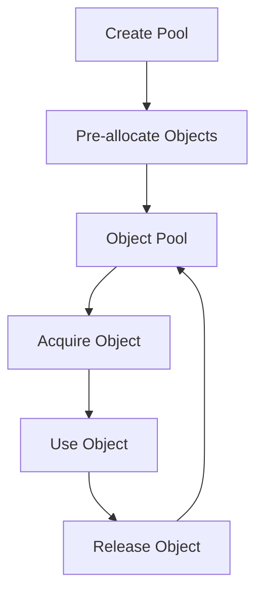

## 22.16. Memory Pool Pattern

### Introduction to the Memory Pool Pattern

The Memory Pool Pattern is a design strategy used to manage memory allocation and deallocation more efficiently. By reusing objects instead of creating and destroying them repeatedly, this pattern helps reduce the overhead associated with garbage collection, which can be particularly beneficial in high-performance applications. In Clojure, a language known for its immutable data structures and functional programming paradigm, implementing a memory pool requires careful consideration of concurrency and thread safety.

### Benefits of the Memory Pool Pattern

Implementing the Memory Pool Pattern offers several advantages:

- **Reduced Garbage Collection Overhead**: By reusing objects, the frequency of garbage collection cycles can be decreased, leading to improved application performance.
- **Improved Performance**: Object creation and destruction are costly operations. By reusing objects, applications can achieve better performance, especially in scenarios with high object churn.
- **Predictable Memory Usage**: Memory pools can help maintain a consistent memory footprint, which is crucial for applications running in environments with limited resources.

### Situations Where Object Pooling is Advantageous

Object pooling is particularly beneficial in the following scenarios:

- **High-Frequency Object Creation**: Applications that frequently create and destroy objects, such as those handling network connections or database connections, can benefit significantly from object pooling.
- **Resource-Intensive Objects**: Objects that are expensive to create, such as those involving complex initialization or resource acquisition, are ideal candidates for pooling.
- **Real-Time Systems**: Systems that require predictable performance and low latency can use object pools to avoid the unpredictability of garbage collection pauses.

### Implementing Object Pools in Clojure

In Clojure, implementing an object pool involves creating a mechanism to manage the lifecycle of pooled objects. This includes allocating objects, tracking their usage, and returning them to the pool when they are no longer needed.

#### Basic Object Pool Implementation

Let's start with a simple implementation of an object pool in Clojure:

```clojure
(ns memory-pool.core
  (:require [clojure.core.async :as async]))

(defn create-pool
  "Creates a pool with a specified number of pre-allocated objects."
  [object-factory pool-size]
  (let [pool (async/chan pool-size)]
    (dotimes [_ pool-size]
      (async/>!! pool (object-factory)))
    pool))

(defn acquire-object
  "Acquires an object from the pool, blocking if none are available."
  [pool]
  (async/<!! pool))

(defn release-object
  "Releases an object back to the pool."
  [pool obj]
  (async/>!! pool obj))

;; Example usage
(defn example-object-factory []
  {:id (java.util.UUID/randomUUID)})

(def my-pool (create-pool example-object-factory 10))

(defn use-object []
  (let [obj (acquire-object my-pool)]
    (try
      ;; Use the object
      (println "Using object:" obj)
      (finally
        ;; Release the object back to the pool
        (release-object my-pool obj)))))
```

In this example, we use Clojure's `core.async` library to manage a channel that acts as the object pool. The `create-pool` function initializes the pool with a specified number of objects created by the `object-factory`. The `acquire-object` and `release-object` functions manage the lifecycle of objects within the pool.

#### Key Considerations

- **Thread Safety**: The use of `core.async` channels ensures that object acquisition and release are thread-safe operations.
- **Blocking Behavior**: The `acquire-object` function blocks if no objects are available, which can be a limitation in some scenarios. Consider using non-blocking alternatives or timeouts if necessary.
- **Object Lifecycle Management**: Ensure that objects are properly initialized and cleaned up before being returned to the pool.

### Potential Drawbacks

While the Memory Pool Pattern offers significant benefits, it also introduces some complexities:

- **Increased Complexity**: Managing object pools adds complexity to the application, requiring careful design and testing.
- **Resource Management**: Pools must be properly sized to balance resource utilization and performance. Too small a pool can lead to contention, while too large a pool can waste resources.
- **Thread Safety Concerns**: Ensuring thread safety in a concurrent environment can be challenging and may require additional synchronization mechanisms.

### Addressing Thread Safety and Synchronization

In Clojure, ensuring thread safety in object pools involves using concurrency primitives effectively. The `core.async` library provides a robust foundation for managing concurrent operations, but additional considerations may be necessary:

- **Use of Atoms and Refs**: For more complex state management, consider using Clojure's atoms or refs to manage shared state safely.
- **Avoiding Deadlocks**: Design the pool to avoid deadlocks by ensuring that object acquisition and release operations are non-blocking or have timeouts.
- **Testing for Concurrency Issues**: Thoroughly test the pool under concurrent load to identify and resolve potential issues.

### Visualizing the Memory Pool Pattern

To better understand the flow of the Memory Pool Pattern, let's visualize it using a Mermaid.js flowchart:



**Diagram Description**: This flowchart illustrates the lifecycle of objects in a memory pool. Objects are pre-allocated and stored in the pool. When an object is needed, it is acquired from the pool, used, and then released back into the pool for future use.

### Try It Yourself

Experiment with the provided code example by modifying the pool size or the object factory function. Consider implementing additional features such as:

- **Timeouts for Object Acquisition**: Implement a non-blocking version of `acquire-object` that returns `nil` if no objects are available within a specified timeout.
- **Dynamic Pool Resizing**: Add functionality to dynamically resize the pool based on demand.

### References and Further Reading

- [Clojure Core.Async Documentation](https://clojure.github.io/core.async/)
- [Java Concurrency in Practice](https://jcip.net/)
- [Effective Java by Joshua Bloch](https://www.oreilly.com/library/view/effective-java-3rd/9780134686097/)

### Knowledge Check

To reinforce your understanding of the Memory Pool Pattern, consider the following questions and challenges:

- How does the Memory Pool Pattern help reduce garbage collection overhead?
- What are the potential drawbacks of using object pools?
- Implement a non-blocking version of the `acquire-object` function with a timeout.
- How can you ensure thread safety when implementing an object pool in Clojure?

### Summary

The Memory Pool Pattern is a powerful tool for optimizing memory management in Clojure applications. By reusing objects, you can reduce garbage collection overhead and improve performance. However, implementing this pattern requires careful consideration of concurrency and resource management. As you experiment with object pools, remember to balance complexity with performance benefits and ensure that your implementation is robust and thread-safe.

## **Ready to Test Your Knowledge?**



### What is the primary benefit of using the Memory Pool Pattern?

- [x] Reducing garbage collection overhead
- [ ] Simplifying code complexity
- [ ] Increasing memory usage
- [ ] Enhancing security

> **Explanation:** The Memory Pool Pattern reduces garbage collection overhead by reusing objects, which minimizes the need for frequent memory allocation and deallocation.

### In which scenario is object pooling most beneficial?

- [x] High-frequency object creation
- [ ] Low-memory environments
- [ ] Applications with minimal concurrency
- [ ] Static data structures

> **Explanation:** Object pooling is most beneficial in scenarios with high-frequency object creation, where objects are frequently created and destroyed.

### What Clojure library is used in the example to manage the object pool?

- [x] core.async
- [ ] clojure.set
- [ ] clojure.java.io
- [ ] clojure.data.json

> **Explanation:** The example uses the `core.async` library to manage the object pool through channels.

### What is a potential drawback of using the Memory Pool Pattern?

- [x] Increased complexity
- [ ] Reduced performance
- [ ] Higher memory usage
- [ ] Lack of thread safety

> **Explanation:** The Memory Pool Pattern can increase complexity due to the need for managing object lifecycles and ensuring thread safety.

### How can you ensure thread safety in a Clojure object pool?

- [x] Use core.async channels
- [ ] Avoid using atoms
- [ ] Use global variables
- [ ] Disable concurrency

> **Explanation:** Using `core.async` channels helps ensure thread safety by managing concurrent access to the object pool.

### What is a key consideration when sizing an object pool?

- [x] Balancing resource utilization and performance
- [ ] Maximizing pool size
- [ ] Minimizing pool size
- [ ] Ensuring all objects are identical

> **Explanation:** Properly sizing an object pool involves balancing resource utilization and performance to avoid contention or resource wastage.

### Which Clojure concurrency primitive is NOT mentioned in the article?

- [x] Promises
- [ ] Atoms
- [ ] Refs
- [ ] Agents

> **Explanation:** Promises are not mentioned in the article, which focuses on `core.async`, atoms, refs, and agents for concurrency management.

### What is the purpose of the `release-object` function in the example?

- [x] To return an object to the pool
- [ ] To create a new object
- [ ] To destroy an object
- [ ] To block object acquisition

> **Explanation:** The `release-object` function returns an object to the pool after it has been used.

### What is a potential issue with blocking behavior in object pools?

- [x] It can lead to contention and delays
- [ ] It simplifies object management
- [ ] It reduces memory usage
- [ ] It enhances security

> **Explanation:** Blocking behavior can lead to contention and delays if no objects are available, which may require non-blocking alternatives or timeouts.

### True or False: Object pooling is only beneficial in multi-threaded applications.

- [ ] True
- [x] False

> **Explanation:** Object pooling can be beneficial in both single-threaded and multi-threaded applications, especially in scenarios with high object churn or resource-intensive objects.



Remember, this is just the beginning. As you progress, you'll build more complex and efficient memory management solutions. Keep experimenting, stay curious, and enjoy the journey!
