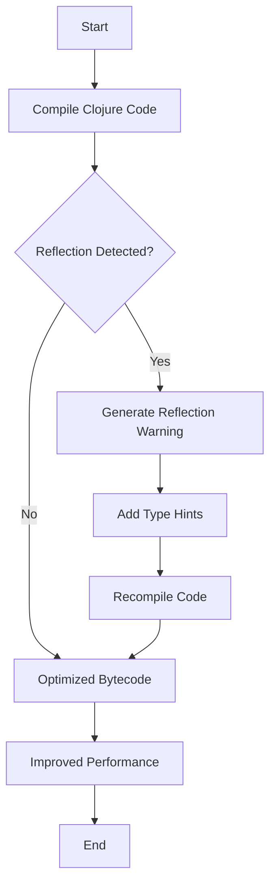

## 22.17. Avoiding Reflection Overheads

In the world of Clojure programming, performance optimization is a crucial aspect that can significantly impact the efficiency of your applications. One of the common performance bottlenecks in Clojure is the use of reflection. In this section, we will explore what reflection is, why it incurs overhead, and how you can avoid it to improve your Clojure code's performance.

### Understanding Reflection and Its Overhead

Reflection is a powerful feature in Java and Clojure that allows a program to inspect and manipulate its own structure and behavior at runtime. It provides the ability to dynamically invoke methods, access fields, and create instances of classes. While reflection offers great flexibility, it comes with a cost.

#### Why Reflection Incurs Overhead

1. **Performance Penalty**: Reflection bypasses the usual compile-time checks and optimizations, leading to slower method invocations. The JVM cannot optimize reflective calls as effectively as direct calls, resulting in increased execution time.

2. **Increased Complexity**: Reflection introduces complexity in code maintenance and debugging. It can obscure the flow of the program, making it harder to understand and optimize.

3. **Security Risks**: Reflection can potentially expose private fields and methods, leading to security vulnerabilities if not handled carefully.

### Identifying Reflection Warnings

Clojure provides a mechanism to identify reflection warnings during compilation. By enabling specific compiler flags, you can detect where reflection is being used in your code.

#### Using Compiler Flags

To enable reflection warnings, you can set the `*warn-on-reflection*` dynamic variable to `true`. This will instruct the Clojure compiler to print warnings whenever reflection is used.

```clojure
;; Enable reflection warnings
(set! *warn-on-reflection* true)

;; Example function that triggers reflection
(defn add-numbers [a b]
  (+ a b))
```

When you compile the above code with reflection warnings enabled, you might see output like:

```
Reflection warning, line: 3 - call to method + on clojure.lang.Numbers can't be resolved (argument types: java.lang.Object, java.lang.Object).
```

### Eliminating Reflection with Type Hints

Type hints are a way to provide the Clojure compiler with additional information about the types of expressions. By adding type hints, you can eliminate reflection and allow the JVM to optimize method calls.

#### Adding Type Hints

Type hints can be added using metadata in Clojure. Here's how you can add type hints to the previous example to eliminate reflection:

```clojure
;; Adding type hints to eliminate reflection
(defn add-numbers ^long [^long a ^long b]
  (+ a b))
```

In this example, we use `^long` to indicate that both `a` and `b` are of type `long`. This allows the compiler to generate optimized bytecode without reflection.

#### Impact on Startup Time and Runtime Performance

1. **Startup Time**: Type hints can reduce the startup time of your application by minimizing the need for runtime type analysis. This is particularly beneficial for applications with a large codebase.

2. **Runtime Performance**: By eliminating reflection, you enable the JVM to perform optimizations such as inlining and method specialization, leading to faster execution times.

### Proactive Reflection Warning Management

To maintain optimal performance, it's essential to proactively manage reflection warnings in your codebase. Here are some best practices:

1. **Regularly Check for Warnings**: Make it a habit to compile your code with reflection warnings enabled. Address any warnings promptly to prevent performance degradation.

2. **Use Type Hints Judiciously**: While type hints can improve performance, overusing them can lead to code clutter. Use them where they have the most significant impact.

3. **Leverage Static Analysis Tools**: Consider using tools like Eastwood, a Clojure linting tool, to automatically detect and report reflection usage in your code.

### Code Example: Avoiding Reflection in a Real-World Scenario

Let's consider a more complex example where reflection might occur in a real-world scenario, such as processing a list of numbers.

```clojure
;; Function to calculate the sum of a list of numbers
(defn sum-list [numbers]
  (reduce + numbers))

;; Enable reflection warnings
(set! *warn-on-reflection* true)

;; Example usage
(def numbers [1 2 3 4 5])
(println "Sum:" (sum-list numbers))
```

When compiled, this code may trigger reflection warnings due to the use of the `+` operator with a sequence of numbers.

#### Adding Type Hints to Eliminate Reflection

```clojure
;; Function with type hints to eliminate reflection
(defn sum-list [^java.util.List numbers]
  (reduce + (map ^long identity numbers)))

;; Example usage
(def numbers [1 2 3 4 5])
(println "Sum:" (sum-list numbers))
```

In this revised version, we add a type hint to the `numbers` parameter, indicating that it is a `java.util.List`. We also use `^long` to ensure that the elements are treated as `long` values, eliminating reflection.

### Visualizing Reflection Overhead

To better understand the impact of reflection on performance, let's visualize the process using a flowchart.



**Figure 1: Flowchart of Reflection Detection and Optimization Process**

### Encouraging Experimentation

To solidify your understanding of avoiding reflection overheads, try modifying the code examples provided. Experiment with different data types and observe how type hints affect performance. Consider creating a small benchmark to measure the impact of reflection on execution time.

### References and Further Reading

- [Clojure Official Documentation on Reflection](https://clojure.org/reference/java_interop#_reflection)
- [Java Reflection API](https://docs.oracle.com/javase/tutorial/reflect/)
- [Eastwood Linter for Clojure](https://github.com/jonase/eastwood)

### Knowledge Check

To reinforce your learning, let's test your understanding of avoiding reflection overheads in Clojure.

## **Ready to Test Your Knowledge?**



### What is reflection in Clojure?

- [x] A mechanism to inspect and manipulate code at runtime
- [ ] A way to optimize method calls
- [ ] A tool for static analysis
- [ ] A method for compiling code

> **Explanation:** Reflection allows a program to inspect and manipulate its own structure and behavior at runtime.

### Why does reflection incur overhead?

- [x] It bypasses compile-time optimizations
- [ ] It enhances security
- [ ] It simplifies code maintenance
- [ ] It improves execution speed

> **Explanation:** Reflection incurs overhead because it bypasses compile-time checks and optimizations, leading to slower method invocations.

### How can you enable reflection warnings in Clojure?

- [x] By setting `*warn-on-reflection*` to `true`
- [ ] By using the `:reflection` keyword
- [ ] By adding `^reflection` metadata
- [ ] By compiling with `-Xreflection`

> **Explanation:** Setting `*warn-on-reflection*` to `true` enables reflection warnings during compilation.

### What is the purpose of type hints in Clojure?

- [x] To provide the compiler with additional type information
- [ ] To disable reflection warnings
- [ ] To enhance code readability
- [ ] To simplify method calls

> **Explanation:** Type hints provide the compiler with additional type information, allowing it to generate optimized bytecode without reflection.

### Which of the following is a benefit of eliminating reflection?

- [x] Improved runtime performance
- [x] Reduced startup time
- [ ] Increased code complexity
- [ ] Enhanced security risks

> **Explanation:** Eliminating reflection improves runtime performance and reduces startup time by allowing the JVM to optimize method calls.

### What tool can be used for static analysis of reflection in Clojure?

- [x] Eastwood
- [ ] Leiningen
- [ ] Criterium
- [ ] Ring

> **Explanation:** Eastwood is a Clojure linting tool that can detect and report reflection usage in your code.

### How can type hints be added in Clojure?

- [x] Using metadata
- [ ] Using annotations
- [ ] Using comments
- [ ] Using macros

> **Explanation:** Type hints can be added using metadata in Clojure, providing the compiler with type information.

### What impact does reflection have on security?

- [x] It can expose private fields and methods
- [ ] It enhances security by hiding implementation details
- [ ] It has no impact on security
- [ ] It simplifies access control

> **Explanation:** Reflection can potentially expose private fields and methods, leading to security vulnerabilities if not handled carefully.

### True or False: Overusing type hints can lead to code clutter.

- [x] True
- [ ] False

> **Explanation:** While type hints can improve performance, overusing them can lead to code clutter, making the code harder to read and maintain.

### What is the main advantage of using type hints in Clojure?

- [x] Allowing the JVM to optimize method calls
- [ ] Simplifying code syntax
- [ ] Enhancing code readability
- [ ] Disabling reflection warnings

> **Explanation:** The main advantage of using type hints is allowing the JVM to optimize method calls, improving performance by eliminating reflection.



Remember, this is just the beginning. As you progress, you'll build more complex and efficient Clojure applications. Keep experimenting, stay curious, and enjoy the journey!
