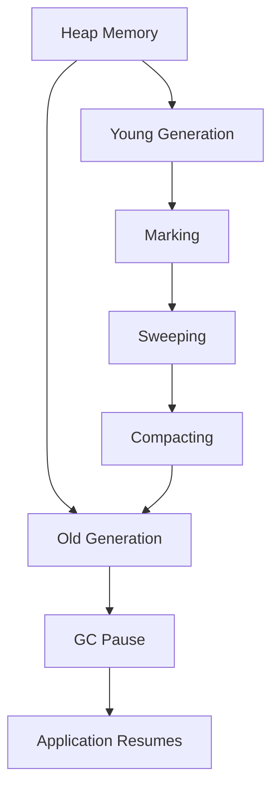

## 22.18. Managing Garbage Collection for Better Performance

Garbage collection (GC) is a critical component of the Java Virtual Machine (JVM) that automatically manages memory, freeing developers from manual memory management tasks. However, understanding and optimizing garbage collection is essential for achieving high performance in Clojure applications. In this section, we will explore how garbage collection works in the JVM, discuss various garbage collectors, provide guidance on tuning JVM flags, and demonstrate how to analyze GC logs. We'll also address memory allocation patterns that impact GC behavior.

### Understanding Garbage Collection in the JVM

Garbage collection in the JVM is responsible for reclaiming memory occupied by objects that are no longer in use. This process helps prevent memory leaks and ensures efficient memory utilization. The JVM's garbage collector operates in several phases:

1. **Marking**: Identifies which objects are still in use and which are not.
2. **Sweeping**: Reclaims memory occupied by objects that are no longer reachable.
3. **Compacting**: Reduces memory fragmentation by moving objects to contiguous memory locations.

#### Key Concepts

- **Heap Memory**: The area of memory where objects are allocated. It is divided into generations: Young, Old, and sometimes Permanent.
- **Generational Garbage Collection**: Based on the observation that most objects die young, the heap is divided into generations to optimize GC performance.
- **Stop-the-World Events**: During certain phases of garbage collection, application threads are paused, which can impact performance.

### Types of Garbage Collectors

The JVM offers several garbage collectors, each with unique characteristics and trade-offs. Choosing the right garbage collector depends on your application's requirements.

#### 1. Serial Garbage Collector

- **Characteristics**: Uses a single thread for garbage collection, suitable for small applications with low memory requirements.
- **Pros**: Simple and low overhead.
- **Cons**: Not suitable for large applications due to stop-the-world pauses.

#### 2. Parallel Garbage Collector

- **Characteristics**: Utilizes multiple threads for garbage collection, improving throughput for multi-threaded applications.
- **Pros**: Better throughput compared to the Serial GC.
- **Cons**: Can still cause noticeable pause times.

#### 3. Concurrent Mark-Sweep (CMS) Collector

- **Characteristics**: Aims to minimize pause times by performing most of the GC work concurrently with application threads.
- **Pros**: Reduced pause times.
- **Cons**: Can lead to memory fragmentation and requires more CPU resources.

#### 4. Garbage-First (G1) Collector

- **Characteristics**: Designed for applications with large heaps, G1 divides the heap into regions and prioritizes areas with the most garbage.
- **Pros**: Predictable pause times and efficient memory management.
- **Cons**: More complex to tune.

#### 5. Z Garbage Collector (ZGC)

- **Characteristics**: A low-latency garbage collector designed for applications requiring minimal pause times.
- **Pros**: Extremely low pause times.
- **Cons**: Requires more memory and CPU resources.

### Tuning JVM Flags for Garbage Collection

Tuning JVM flags can significantly impact garbage collection performance. Here are some common flags and their purposes:

- `-Xms` and `-Xmx`: Set the initial and maximum heap size, respectively. Ensure these values are set appropriately to prevent frequent GC cycles.
- `-XX:+UseG1GC`: Enables the G1 garbage collector.
- `-XX:MaxGCPauseMillis`: Sets a target for maximum GC pause time.
- `-XX:+UseZGC`: Enables the Z garbage collector.
- `-XX:ConcGCThreads`: Specifies the number of threads used for concurrent GC operations.

### Analyzing GC Logs

Analyzing GC logs is crucial for understanding garbage collection behavior and identifying performance bottlenecks. Here's how to get started:

1. **Enable GC Logging**: Use the `-Xlog:gc*` flag to enable detailed GC logging.
2. **Analyze Log Output**: Look for patterns in GC frequency, pause times, and memory usage.
3. **Identify Bottlenecks**: Long pause times or frequent GC cycles may indicate the need for tuning.

#### Sample GC Log Analysis

Consider the following sample GC log snippet:

```
[GC pause (G1 Evacuation Pause) (young), 0.0123456 secs]
   [Parallel Time: 10.0 ms, GC Workers: 4]
      [GC Worker Start (ms): Min: 1234.5, Avg: 1234.6, Max: 1234.7, Diff: 0.2]
      [Ext Root Scanning (ms): Min: 0.0, Avg: 0.1, Max: 0.2, Diff: 0.2]
      [Update RS (ms): Min: 0.1, Avg: 0.2, Max: 0.3, Diff: 0.2]
      [Processed Buffers: Min: 1, Avg: 2, Max: 3, Diff: 2]
   [Code Root Fixup: 0.0 ms]
   [Code Root Purge: 0.0 ms]
   [Clear CT: 0.0 ms]
   [Other: 2.3 ms]
      [Choose CSet: 0.0 ms]
      [Ref Proc: 0.0 ms]
      [Ref Enq: 0.0 ms]
      [Redirty Cards: 0.0 ms]
      [Humongous Register: 0.0 ms]
      [Humongous Reclaim: 0.0 ms]
      [Free CSet: 0.0 ms]
   [Eden: 512.0M(512.0M)->0.0B(512.0M) Survivors: 0.0B->0.0B Heap: 1024.0M(2048.0M)->512.0M(2048.0M)]
```

- **Pause Time**: The pause time is 0.0123456 seconds, which is within acceptable limits for many applications.
- **GC Workers**: The log shows 4 GC workers, indicating parallel processing.
- **Heap Usage**: The heap usage before and after the GC cycle is shown, helping identify memory pressure.

### Memory Allocation Patterns and GC Behavior

Understanding memory allocation patterns can help optimize garbage collection:

- **Short-Lived Objects**: Allocate short-lived objects in the Young generation to take advantage of generational GC.
- **Long-Lived Objects**: Minimize the promotion of objects to the Old generation to reduce GC overhead.
- **Object Pools**: Use object pools to manage frequently used objects and reduce allocation pressure.

### Visualizing Garbage Collection

To better understand the garbage collection process, let's visualize the heap structure and GC phases using a Mermaid.js diagram:



**Diagram Description**: This diagram illustrates the flow of garbage collection in the JVM, showing how objects move from the Young generation to the Old generation and the phases of marking, sweeping, and compacting.

### Best Practices for Managing Garbage Collection

- **Monitor and Analyze**: Regularly monitor GC logs and analyze them to identify performance issues.
- **Tune Gradually**: Make incremental changes to JVM flags and observe their impact.
- **Understand Application Needs**: Choose a garbage collector that aligns with your application's performance requirements.
- **Optimize Code**: Write efficient code to minimize unnecessary object creation and memory usage.

### Try It Yourself

Experiment with different garbage collectors and JVM flags to see how they affect your application's performance. Modify the sample GC log analysis to include additional metrics or use a different garbage collector.

### References and Further Reading

- [Oracle's Garbage Collection Tuning Guide](https://docs.oracle.com/en/java/javase/17/gctuning/)
- [Java Performance: The Definitive Guide](https://www.oreilly.com/library/view/java-performance-the/9781449363514/)
- [Understanding Java Garbage Collection](https://www.baeldung.com/java-garbage-collection)

## **Ready to Test Your Knowledge?**



### What is the primary purpose of garbage collection in the JVM?

- [x] To automatically manage memory by reclaiming unused objects.
- [ ] To manually allocate and deallocate memory.
- [ ] To optimize CPU usage.
- [ ] To enhance network performance.

> **Explanation:** Garbage collection automatically manages memory by reclaiming memory occupied by objects that are no longer in use, preventing memory leaks.

### Which garbage collector is designed for applications requiring minimal pause times?

- [ ] Serial Garbage Collector
- [ ] Parallel Garbage Collector
- [ ] Concurrent Mark-Sweep (CMS) Collector
- [x] Z Garbage Collector (ZGC)

> **Explanation:** The Z Garbage Collector (ZGC) is designed for applications requiring minimal pause times, offering extremely low latency.

### What JVM flag is used to enable the G1 garbage collector?

- [ ] -XX:+UseSerialGC
- [x] -XX:+UseG1GC
- [ ] -XX:+UseParallelGC
- [ ] -XX:+UseZGC

> **Explanation:** The `-XX:+UseG1GC` flag is used to enable the G1 garbage collector.

### What is the main advantage of the Garbage-First (G1) collector?

- [ ] Simple implementation
- [x] Predictable pause times
- [ ] Low memory usage
- [ ] Minimal CPU resources

> **Explanation:** The G1 collector offers predictable pause times and efficient memory management, making it suitable for applications with large heaps.

### Which phase of garbage collection involves identifying which objects are still in use?

- [x] Marking
- [ ] Sweeping
- [ ] Compacting
- [ ] Pausing

> **Explanation:** The marking phase involves identifying which objects are still in use and which are not.

### What is a common issue with the Concurrent Mark-Sweep (CMS) collector?

- [ ] High pause times
- [x] Memory fragmentation
- [ ] Low throughput
- [ ] High memory usage

> **Explanation:** The CMS collector can lead to memory fragmentation, which may require additional CPU resources to manage.

### How can you enable detailed GC logging in the JVM?

- [ ] Use the `-Xlog:gc*` flag
- [x] Use the `-Xlog:gc*` flag
- [ ] Use the `-XX:+PrintGCDetails` flag
- [ ] Use the `-XX:+UseGCLogFileRotation` flag

> **Explanation:** The `-Xlog:gc*` flag enables detailed GC logging in the JVM.

### Which memory allocation pattern can help optimize garbage collection?

- [x] Allocating short-lived objects in the Young generation
- [ ] Allocating all objects in the Old generation
- [ ] Using large object pools
- [ ] Avoiding object creation

> **Explanation:** Allocating short-lived objects in the Young generation takes advantage of generational GC, optimizing garbage collection.

### What is the purpose of the `-XX:MaxGCPauseMillis` flag?

- [ ] To set the initial heap size
- [ ] To enable the Serial garbage collector
- [x] To set a target for maximum GC pause time
- [ ] To disable GC logging

> **Explanation:** The `-XX:MaxGCPauseMillis` flag sets a target for the maximum GC pause time, helping manage application performance.

### True or False: The Serial garbage collector is suitable for large applications with high memory requirements.

- [ ] True
- [x] False

> **Explanation:** The Serial garbage collector is not suitable for large applications due to its single-threaded nature and potential for long pause times.



Remember, understanding and optimizing garbage collection is an ongoing process. Keep experimenting, stay curious, and enjoy the journey of mastering Clojure performance optimization!
