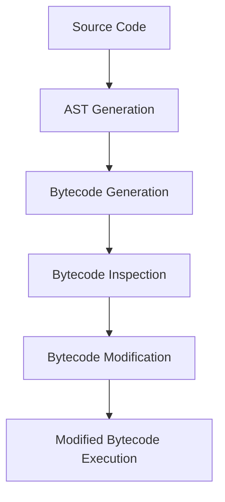

## 22.19. Bytecode-Level Optimizations

### Introduction

In the realm of performance optimization, understanding how Clojure code is transformed into JVM bytecode can provide significant advantages. Bytecode-level optimizations allow developers to fine-tune performance by directly interacting with the compiled form of their code. This section delves into the intricacies of Clojure's compilation process, explores tools like BYTEMAN and ASM for bytecode manipulation, and discusses the potential benefits and risks associated with these advanced techniques.

### Understanding Clojure's Compilation to JVM Bytecode

Clojure, a dynamic, functional language, runs on the Java Virtual Machine (JVM). This means that Clojure code is ultimately compiled into JVM bytecode, which is executed by the JVM. Understanding this process is crucial for bytecode-level optimizations.

#### The Compilation Process

1. **Source Code to Abstract Syntax Tree (AST):** Clojure source code is first parsed into an Abstract Syntax Tree (AST). This tree represents the syntactic structure of the code.
2. **AST to Bytecode:** The AST is then transformed into JVM bytecode. This bytecode is a low-level representation of the program that the JVM can execute.
3. **Execution by the JVM:** The JVM interprets or compiles this bytecode into native machine code, depending on the Just-In-Time (JIT) compiler's optimizations.

### Tools for Bytecode Inspection and Manipulation

To perform bytecode-level optimizations, developers can use various tools to inspect and modify bytecode. Two prominent tools are BYTEMAN and ASM.

#### BYTEMAN

[BYTEMAN](https://byteman.jboss.org/) is a tool that allows developers to inject code into Java applications at runtime. It is particularly useful for testing and debugging, as it can modify bytecode without altering the source code.

- **Use Cases:** BYTEMAN is often used for fault injection, performance monitoring, and testing complex scenarios.
- **Example:** Injecting logging statements into a running application to trace execution paths.

```java
RULE trace method entry
CLASS com.example.MyClass
METHOD myMethod
AT ENTRY
IF true
DO traceln("Entering myMethod")
ENDRULE
```

#### ASM

[ASM](https://asm.ow2.io/) is a Java bytecode manipulation framework. It allows developers to read, modify, and generate bytecode. ASM is more low-level than BYTEMAN and provides fine-grained control over bytecode manipulation.

- **Use Cases:** ASM is used for performance optimizations, dynamic proxy generation, and implementing custom class loaders.
- **Example:** Modifying a method to add a performance counter.

```java
import org.objectweb.asm.*;

public class MethodTimer extends MethodVisitor {
    public MethodTimer(MethodVisitor mv) {
        super(Opcodes.ASM9, mv);
    }

    @Override
    public void visitCode() {
        mv.visitCode();
        mv.visitMethodInsn(Opcodes.INVOKESTATIC, "java/lang/System", "nanoTime", "()J", false);
        mv.visitVarInsn(Opcodes.LSTORE, 1);
    }

    @Override
    public void visitInsn(int opcode) {
        if (opcode == Opcodes.RETURN) {
            mv.visitMethodInsn(Opcodes.INVOKESTATIC, "java/lang/System", "nanoTime", "()J", false);
            mv.visitVarInsn(Opcodes.LLOAD, 1);
            mv.visitInsn(Opcodes.LSUB);
            mv.visitVarInsn(Opcodes.LSTORE, 3);
            mv.visitFieldInsn(Opcodes.GETSTATIC, "java/lang/System", "out", "Ljava/io/PrintStream;");
            mv.visitVarInsn(Opcodes.LLOAD, 3);
            mv.visitMethodInsn(Opcodes.INVOKEVIRTUAL, "java/io/PrintStream", "println", "(J)V", false);
        }
        mv.visitInsn(opcode);
    }
}
```

### Benefits and Risks of Bytecode Manipulation

Bytecode manipulation can offer significant performance improvements and flexibility, but it comes with risks.

#### Benefits

- **Performance Gains:** Directly optimizing bytecode can lead to faster execution times, especially in performance-critical applications.
- **Dynamic Behavior:** Bytecode manipulation allows for dynamic behavior changes without altering source code, useful in AOP (Aspect-Oriented Programming).
- **Reduced Overhead:** By eliminating unnecessary bytecode, you can reduce the overhead and improve efficiency.

#### Risks

- **Complexity:** Bytecode manipulation is complex and requires a deep understanding of the JVM and bytecode instructions.
- **Maintainability:** Code that relies on bytecode manipulation can be harder to maintain and understand.
- **Compatibility:** Changes at the bytecode level may not be compatible with future JVM versions or other tools.

### Practical Example: Inspecting and Modifying Bytecode

Let's walk through a practical example of inspecting and modifying bytecode using ASM.

#### Step 1: Inspecting Bytecode

To inspect bytecode, we can use the `javap` tool, which is part of the JDK. This tool disassembles class files and displays the bytecode.

```bash
javap -c MyClass.class
```

#### Step 2: Modifying Bytecode

Using ASM, we can modify the bytecode to add a simple logging statement to a method.

```java
import org.objectweb.asm.*;

public class AddLoggingAdapter extends ClassVisitor {
    public AddLoggingAdapter(ClassVisitor cv) {
        super(Opcodes.ASM9, cv);
    }

    @Override
    public MethodVisitor visitMethod(int access, String name, String desc, String signature, String[] exceptions) {
        MethodVisitor mv = cv.visitMethod(access, name, desc, signature, exceptions);
        if (name.equals("myMethod")) {
            return new MethodTimer(mv);
        }
        return mv;
    }
}
```

### Visualizing Bytecode Manipulation

To better understand the process of bytecode manipulation, let's visualize the transformation of a simple method using a flowchart.



**Caption:** This flowchart illustrates the process of transforming source code into bytecode, inspecting it, modifying it, and executing the modified bytecode.

### When to Use Bytecode-Level Optimizations

Bytecode-level optimizations are not always necessary and should be reserved for specific scenarios where performance is critical, and other optimization techniques have been exhausted.

- **High-Performance Applications:** Use bytecode optimizations in applications where performance is a top priority, such as financial systems or real-time processing.
- **Dynamic Behavior Requirements:** When you need to change application behavior dynamically without altering source code.
- **Advanced Profiling and Monitoring:** For applications that require detailed profiling and monitoring beyond what standard tools offer.

### Clojure's Unique Features in Bytecode Optimization

Clojure's dynamic nature and its compilation to JVM bytecode provide unique opportunities for optimization.

- **Dynamic Typing:** Clojure's dynamic typing can be leveraged to optimize bytecode for specific types at runtime.
- **Macros:** Clojure's macros can be used to generate optimized bytecode patterns, reducing runtime overhead.
- **Interoperability with Java:** Clojure's seamless interoperability with Java allows for easy integration with bytecode manipulation tools.

### Differences and Similarities with Other Languages

Bytecode-level optimizations in Clojure share similarities with other JVM languages like Java and Scala, but there are also differences.

- **Similarities:** All JVM languages compile to bytecode, allowing for similar optimization techniques.
- **Differences:** Clojure's functional nature and dynamic typing introduce unique challenges and opportunities in bytecode optimization.

### Conclusion

Bytecode-level optimizations offer powerful tools for enhancing the performance of Clojure applications. While these techniques are advanced and come with risks, they can provide significant benefits in specific scenarios. By understanding the compilation process, leveraging tools like BYTEMAN and ASM, and carefully considering when to apply these optimizations, developers can unlock new levels of performance in their Clojure applications.

### Try It Yourself

Experiment with bytecode manipulation by using ASM to add logging to a simple Clojure function. Modify the bytecode to track execution time and observe the performance impact.

### References and Further Reading

- [BYTEMAN Documentation](https://byteman.jboss.org/)
- [ASM Guide](https://asm.ow2.io/)
- [JVM Specification](https://docs.oracle.com/javase/specs/jvms/se8/html/index.html)

## **Ready to Test Your Knowledge?**



### What is the primary purpose of bytecode-level optimizations in Clojure?

- [x] To enhance performance by directly manipulating JVM bytecode.
- [ ] To simplify the source code for better readability.
- [ ] To convert Clojure code into machine code.
- [ ] To improve the graphical user interface of applications.

> **Explanation:** Bytecode-level optimizations focus on enhancing performance by directly interacting with the compiled bytecode, allowing for fine-tuned adjustments.

### Which tool is used for injecting code into Java applications at runtime?

- [x] BYTEMAN
- [ ] ASM
- [ ] javap
- [ ] JIT

> **Explanation:** BYTEMAN is a tool that allows developers to inject code into Java applications at runtime, useful for testing and debugging.

### What is the role of ASM in bytecode manipulation?

- [x] It allows developers to read, modify, and generate bytecode.
- [ ] It compiles Clojure code into bytecode.
- [ ] It provides a graphical interface for JVM management.
- [ ] It is used for garbage collection optimization.

> **Explanation:** ASM is a framework for reading, modifying, and generating bytecode, providing fine-grained control over bytecode manipulation.

### What is a potential risk of bytecode manipulation?

- [x] Increased complexity and maintainability challenges.
- [ ] Improved readability of source code.
- [ ] Enhanced graphical user interface.
- [ ] Simplified error handling.

> **Explanation:** Bytecode manipulation can increase complexity and make code harder to maintain, posing a risk if not managed carefully.

### How can you inspect bytecode using the JDK?

- [x] By using the `javap` tool.
- [ ] By using the `java` command.
- [ ] By using the `javac` compiler.
- [ ] By using the `jar` utility.

> **Explanation:** The `javap` tool is part of the JDK and is used to disassemble class files and display the bytecode.

### What is a benefit of using bytecode-level optimizations?

- [x] Performance gains in execution time.
- [ ] Simplified source code structure.
- [ ] Enhanced user interface design.
- [ ] Reduced need for testing.

> **Explanation:** Bytecode-level optimizations can lead to performance gains by optimizing the execution time of the compiled code.

### In which scenarios are bytecode-level optimizations most suitable?

- [x] High-performance applications and dynamic behavior requirements.
- [ ] Simple web applications with static content.
- [ ] Applications with minimal performance requirements.
- [ ] Projects focused solely on user interface design.

> **Explanation:** Bytecode-level optimizations are most suitable for high-performance applications and scenarios requiring dynamic behavior changes.

### What unique feature of Clojure can be leveraged for bytecode optimization?

- [x] Macros for generating optimized bytecode patterns.
- [ ] Static typing for type safety.
- [ ] Built-in graphical libraries.
- [ ] Automatic memory management.

> **Explanation:** Clojure's macros can be used to generate optimized bytecode patterns, reducing runtime overhead.

### How does Clojure's dynamic typing affect bytecode optimization?

- [x] It allows for runtime optimizations based on specific types.
- [ ] It simplifies the bytecode generation process.
- [ ] It ensures type safety at compile time.
- [ ] It eliminates the need for bytecode manipulation.

> **Explanation:** Clojure's dynamic typing allows for runtime optimizations based on specific types, providing flexibility in bytecode optimization.

### True or False: Bytecode-level optimizations are always necessary for Clojure applications.

- [ ] True
- [x] False

> **Explanation:** Bytecode-level optimizations are not always necessary and should be reserved for specific scenarios where performance is critical.



Remember, this is just the beginning. As you progress, you'll uncover more advanced techniques and optimizations. Keep experimenting, stay curious, and enjoy the journey!
