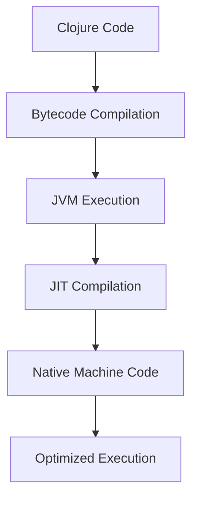

## 22.2. Optimizing Code for the JVM

Clojure, a dynamic and functional programming language, runs on the Java Virtual Machine (JVM), which provides a robust platform for building high-performance applications. Understanding how Clojure interacts with the JVM is crucial for optimizing your code to achieve the best possible performance. In this section, we will explore various strategies and techniques for optimizing Clojure code to leverage the JVM's capabilities effectively.

### Understanding Clojure on the JVM

Clojure's execution on the JVM brings several benefits, including access to a vast ecosystem of Java libraries, cross-platform compatibility, and the performance advantages of the JVM's Just-In-Time (JIT) compilation. However, it also introduces challenges, such as the need to manage interoperability between Clojure's dynamic nature and the JVM's statically-typed environment.

#### Key Concepts

- **Bytecode Compilation**: Clojure code is compiled into Java bytecode, which the JVM executes. This process allows Clojure to leverage the JVM's optimizations.
- **Dynamic Typing**: While Clojure is dynamically typed, the JVM is statically typed. This mismatch can lead to performance overhead due to reflection.
- **Interoperability**: Clojure can seamlessly interoperate with Java, allowing developers to use Java libraries and frameworks within Clojure applications.

### Writing Efficient Clojure Code

To optimize Clojure code for the JVM, developers should focus on writing efficient code that minimizes overhead and leverages JVM optimizations. Here are some key strategies:

#### 1. Use Type Hints

Type hints are a way to inform the Clojure compiler about the expected types of expressions. By providing type hints, you can reduce the need for reflection, which can significantly improve performance.

```clojure
;; Without type hints
(defn add [a b]
  (+ a b))

;; With type hints
(defn add ^long [^long a ^long b]
  (+ a b))
```

In the example above, the type hints `^long` inform the compiler that the arguments and return value are of type `long`, allowing the compiler to generate more efficient bytecode.

#### 2. Avoid Reflection

Reflection is a mechanism that allows a program to inspect and modify its own structure and behavior at runtime. While powerful, reflection can introduce significant performance overhead. To avoid reflection:

- Use type hints to specify types explicitly.
- Avoid dynamic method invocation when possible.
- Use `set!` to modify Java fields directly.

```clojure
;; Reflection example
(.setAccessible (first (.getDeclaredMethods String)) true)

;; Avoiding reflection with type hints
(let [method (.getDeclaredMethod String "valueOf" (into-array Class [Object]))]
  (.setAccessible method true))
```

#### 3. Leverage Persistent Data Structures

Clojure's persistent data structures provide efficient, immutable collections that share structure between versions. Use these data structures to minimize memory usage and improve performance.

```clojure
(def my-list (conj (list) 1 2 3))
```

#### 4. Optimize Recursion with `recur`

Clojure supports tail-call optimization through the `recur` keyword, which allows recursive functions to execute efficiently without growing the call stack.

```clojure
(defn factorial [n]
  (loop [acc 1 n n]
    (if (zero? n)
      acc
      (recur (* acc n) (dec n)))))
```

### Just-In-Time (JIT) Compilation

The JVM's JIT compiler optimizes bytecode at runtime, translating it into native machine code for improved performance. Understanding JIT behavior can help you write code that benefits from these optimizations.

#### Profiling JIT Behavior

Profiling tools like `VisualVM` and `YourKit` can help you analyze JIT compilation and identify performance bottlenecks. Use these tools to:

- Identify hot spots in your code that are frequently executed.
- Analyze method inlining and other JIT optimizations.
- Monitor garbage collection and memory usage.

### JVM Tuning Parameters

Tuning the JVM can have a significant impact on the performance of your Clojure applications. Here are some key parameters to consider:

#### 1. Heap Size

Adjusting the heap size can improve performance by reducing garbage collection frequency. Use the `-Xms` and `-Xmx` options to set the initial and maximum heap size, respectively.

```bash
java -Xms512m -Xmx2g -jar myapp.jar
```

#### 2. Garbage Collection

The JVM offers several garbage collection algorithms, each with different performance characteristics. Experiment with different garbage collectors to find the best fit for your application.

- **G1 Garbage Collector**: Suitable for applications with large heaps and low pause times.
- **CMS (Concurrent Mark-Sweep) Collector**: Reduces pause times by performing most of the garbage collection concurrently with the application.

#### 3. JIT Compiler Options

The JVM provides options to control JIT compilation behavior. Use these options to fine-tune performance:

- `-XX:+AggressiveOpts`: Enables aggressive optimizations.
- `-XX:+UseStringDeduplication`: Reduces memory usage by deduplicating strings.

### Try It Yourself

Experiment with the following code examples to see how type hints and avoiding reflection can improve performance. Modify the examples to test different scenarios and observe the impact on execution speed.

```clojure
;; Example without type hints
(defn slow-sum [a b]
  (+ a b))

;; Example with type hints
(defn fast-sum ^long [^long a ^long b]
  (+ a b))

;; Measure performance
(time (dotimes [_ 1000000] (slow-sum 1 2)))
(time (dotimes [_ 1000000] (fast-sum 1 2)))
```

### Visualizing JVM Optimization

Below is a diagram illustrating the interaction between Clojure code, the JVM, and the JIT compiler.



**Diagram Description**: This diagram shows the flow from Clojure code to optimized execution on the JVM. Clojure code is compiled into bytecode, which the JVM executes. The JIT compiler further optimizes this bytecode into native machine code for improved performance.

### Key Takeaways

- **Type Hints**: Use type hints to reduce reflection and improve performance.
- **Avoid Reflection**: Minimize reflection to reduce overhead.
- **JIT Compilation**: Leverage JIT optimizations for better execution speed.
- **JVM Tuning**: Adjust JVM parameters to optimize performance.

### References and Further Reading

- [Clojure Performance Tips](https://clojure.org/reference/performance)
- [Java Performance Tuning](https://www.oracle.com/java/technologies/javase/performance.html)
- [VisualVM](https://visualvm.github.io/)
- [YourKit Java Profiler](https://www.yourkit.com/)

## **Ready to Test Your Knowledge?**



### What is the primary benefit of using type hints in Clojure?

- [x] Reducing reflection overhead
- [ ] Improving code readability
- [ ] Enabling dynamic typing
- [ ] Simplifying syntax

> **Explanation:** Type hints help the Clojure compiler generate more efficient bytecode by reducing the need for reflection, which can improve performance.

### How does the JVM's JIT compiler improve performance?

- [x] By translating bytecode into native machine code
- [ ] By increasing the heap size
- [ ] By reducing garbage collection frequency
- [ ] By enabling dynamic typing

> **Explanation:** The JIT compiler optimizes bytecode at runtime by translating it into native machine code, which can be executed more efficiently.

### What is the purpose of the `-Xmx` JVM option?

- [x] To set the maximum heap size
- [ ] To enable JIT compilation
- [ ] To reduce garbage collection frequency
- [ ] To specify the initial heap size

> **Explanation:** The `-Xmx` option sets the maximum heap size for the JVM, which can impact performance by affecting garbage collection behavior.

### Which garbage collector is suitable for applications with large heaps and low pause times?

- [x] G1 Garbage Collector
- [ ] CMS Collector
- [ ] Serial Collector
- [ ] Parallel Collector

> **Explanation:** The G1 Garbage Collector is designed for applications with large heaps and aims to provide low pause times.

### What is the effect of using `recur` in Clojure?

- [x] Enables tail-call optimization
- [ ] Increases memory usage
- [ ] Simplifies syntax
- [ ] Reduces code readability

> **Explanation:** `recur` allows for tail-call optimization, enabling recursive functions to execute efficiently without growing the call stack.

### What is the role of `-XX:+AggressiveOpts` in JVM tuning?

- [x] Enables aggressive optimizations
- [ ] Increases heap size
- [ ] Reduces garbage collection frequency
- [ ] Enables dynamic typing

> **Explanation:** The `-XX:+AggressiveOpts` option enables aggressive optimizations in the JVM, which can improve performance.

### How can you avoid reflection in Clojure?

- [x] Use type hints
- [ ] Increase heap size
- [ ] Enable JIT compilation
- [ ] Use dynamic typing

> **Explanation:** Using type hints informs the compiler about expected types, reducing the need for reflection and improving performance.

### What is the benefit of using persistent data structures in Clojure?

- [x] Efficient memory usage and immutability
- [ ] Simplified syntax
- [ ] Dynamic typing
- [ ] Increased heap size

> **Explanation:** Persistent data structures provide efficient, immutable collections that share structure between versions, reducing memory usage and improving performance.

### Which tool can be used to profile JIT compilation behavior?

- [x] VisualVM
- [ ] Leiningen
- [ ] Clojure REPL
- [ ] Maven

> **Explanation:** VisualVM is a profiling tool that can analyze JIT compilation and identify performance bottlenecks.

### True or False: Clojure code is directly executed by the JVM without any compilation.

- [ ] True
- [x] False

> **Explanation:** Clojure code is compiled into Java bytecode, which the JVM executes. This process allows Clojure to leverage the JVM's optimizations.



Remember, optimizing Clojure code for the JVM is an ongoing process. As you continue to develop your skills, you'll discover new techniques and strategies to enhance performance. Keep experimenting, stay curious, and enjoy the journey!
