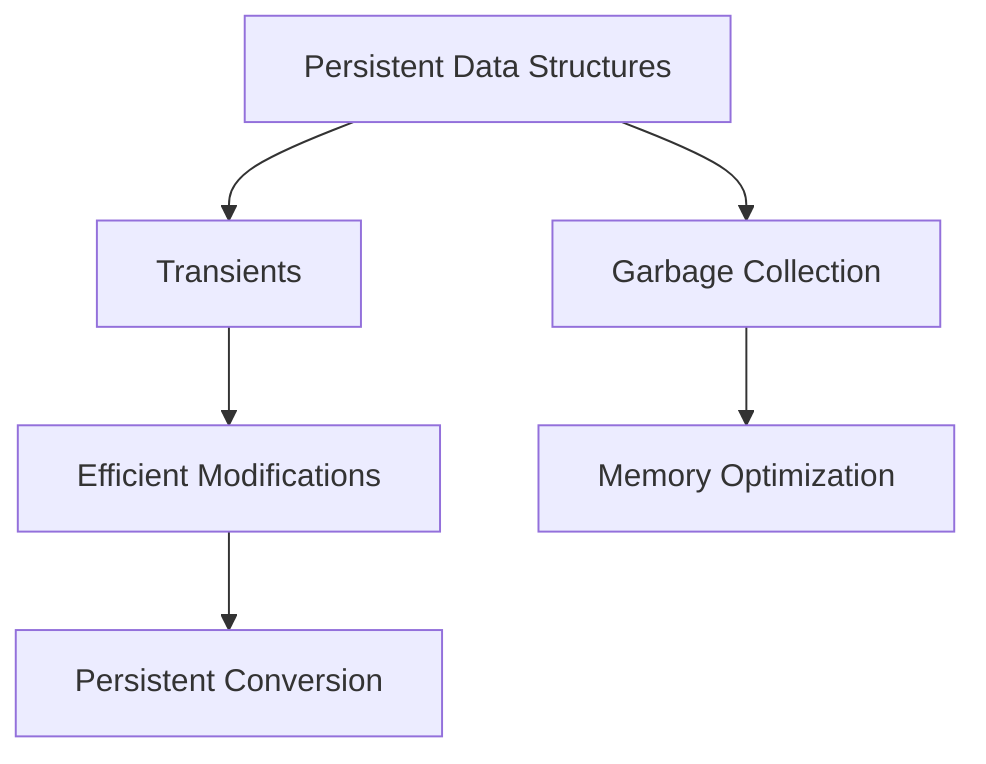

## 22.3. Reducing Memory Usage

In the world of software development, efficient memory usage is crucial for building performant applications. Clojure, being a functional programming language that runs on the Java Virtual Machine (JVM), offers a unique set of tools and techniques to manage memory effectively. In this section, we will explore various strategies to reduce memory usage in Clojure applications, focusing on optimizing data structures, leveraging primitives, avoiding memory leaks, and using memory profiling tools.

### Understanding Memory Usage in Clojure

Before diving into optimization techniques, it's essential to understand how memory is used in Clojure. Clojure's immutable data structures, while providing numerous benefits such as thread safety and simplicity, can lead to increased memory consumption if not managed properly. The JVM's garbage collector plays a significant role in managing memory, but excessive garbage collection can lead to performance bottlenecks.

### Common Sources of High Memory Usage

1. **Large Data Structures**: Storing large amounts of data in memory can quickly consume available resources.
2. **Excessive Object Creation**: Frequent creation of objects can lead to increased garbage collection overhead.
3. **Memory Leaks**: Holding references to unused objects can prevent them from being garbage collected.
4. **Inefficient Data Structures**: Using data structures that are not optimized for the task at hand can lead to unnecessary memory usage.

### Optimizing Data Structures for Memory Efficiency

#### Persistent Data Structures

Clojure's persistent data structures are designed to be memory-efficient by sharing structure between versions. However, they can still consume significant memory if not used carefully.

- **Vectors and Lists**: Use vectors for indexed access and lists for sequential access. Avoid using lists for large collections due to their linear access time.
- **Maps and Sets**: Prefer maps and sets for associative and unique collections, respectively. Use `transients` for temporary collections that need to be modified frequently.

#### Using Transients

Transients provide a way to perform efficient, mutable operations on persistent data structures. They are particularly useful when building large collections incrementally.

```clojure
(defn build-large-vector []
  (persistent!
    (reduce conj! (transient []) (range 1000000))))
```

In this example, we use a transient vector to build a large collection efficiently, converting it back to a persistent vector only when necessary.

#### Leveraging Primitives and Arrays

Clojure provides support for primitive data types and arrays, which can be used to reduce memory usage by avoiding the overhead of boxed objects.

- **Primitive Arrays**: Use primitive arrays for large collections of numbers to reduce memory footprint.

```clojure
(defn sum-ints [^ints arr]
  (reduce + arr))
```

- **Type Hints**: Use type hints to avoid unnecessary boxing and unboxing of primitive values.

```clojure
(defn add [^long a ^long b]
  (+ a b))
```

### Avoiding Memory Leaks

Memory leaks occur when objects are no longer needed but are still referenced, preventing garbage collection. Here are some strategies to avoid them:

- **Weak References**: Use weak references for caches or listeners that should not prevent garbage collection.
- **Avoid Global State**: Minimize the use of global state, which can inadvertently hold references to objects.
- **Properly Manage Resources**: Ensure that resources such as file handles and database connections are closed when no longer needed.

### Memory Profiling and Analysis

Profiling tools can help identify memory usage patterns and potential leaks in your application. Here are some tools and techniques:

- **VisualVM**: A powerful tool for profiling Java applications, including memory usage and garbage collection.
- **YourKit**: A commercial profiler that provides detailed insights into memory allocation and usage.
- **Heap Dumps**: Analyze heap dumps to identify objects consuming the most memory.

### Example: Memory Profiling with VisualVM

Let's walk through a simple example of using VisualVM to profile a Clojure application.

1. **Start VisualVM**: Launch VisualVM and connect it to your running Clojure application.
2. **Monitor Memory Usage**: Use the memory tab to monitor heap usage and garbage collection activity.
3. **Take a Heap Dump**: Capture a heap dump to analyze memory allocation.
4. **Analyze the Dump**: Use the heap dump analysis tools to identify large objects and potential memory leaks.

### Try It Yourself

Experiment with the following code examples to see how different data structures and techniques affect memory usage. Try modifying the examples to use different data structures or profiling tools.

### Visualizing Memory Management

To better understand memory management in Clojure, let's visualize the relationship between persistent data structures, transients, and garbage collection.



This diagram illustrates how persistent data structures can be efficiently modified using transients, with garbage collection playing a crucial role in memory optimization.

### References and Further Reading

- [Clojure Documentation on Transients](https://clojure.org/reference/transients)
- [Java Memory Management](https://docs.oracle.com/javase/specs/jvms/se7/html/jvms-2.html)
- [VisualVM Documentation](https://visualvm.github.io/)

### Knowledge Check

To reinforce your understanding of memory optimization in Clojure, try answering the following questions.

## **Ready to Test Your Knowledge?**



### What is a common source of high memory usage in Clojure applications?

- [x] Large data structures
- [ ] Using transients
- [ ] Type hinting
- [ ] Using primitive arrays

> **Explanation:** Large data structures can consume significant memory, especially if not managed efficiently.

### How can transients help in reducing memory usage?

- [x] By allowing efficient, mutable operations on persistent data structures
- [ ] By increasing garbage collection frequency
- [ ] By converting data structures to lists
- [ ] By avoiding the use of vectors

> **Explanation:** Transients allow for efficient modifications to persistent data structures, reducing the need for excessive copying.

### Which tool can be used for memory profiling in Clojure applications?

- [x] VisualVM
- [ ] Leiningen
- [ ] ClojureScript
- [ ] Ring

> **Explanation:** VisualVM is a powerful tool for profiling Java applications, including those written in Clojure.

### What is the benefit of using primitive arrays in Clojure?

- [x] Reduced memory footprint
- [ ] Increased code complexity
- [ ] Slower execution time
- [ ] More garbage collection

> **Explanation:** Primitive arrays avoid the overhead of boxed objects, reducing memory usage.

### How can memory leaks be avoided in Clojure applications?

- [x] By using weak references and minimizing global state
- [ ] By increasing heap size
- [ ] By using more transients
- [ ] By avoiding type hints

> **Explanation:** Weak references and minimizing global state help prevent memory leaks by allowing unused objects to be garbage collected.

### What is a heap dump used for?

- [x] Analyzing memory allocation and identifying large objects
- [ ] Increasing application performance
- [ ] Reducing code complexity
- [ ] Enhancing garbage collection

> **Explanation:** Heap dumps provide insights into memory allocation, helping identify objects consuming the most memory.

### Which of the following is a strategy for optimizing data structures?

- [x] Using maps and sets for associative and unique collections
- [ ] Using lists for indexed access
- [ ] Avoiding the use of vectors
- [ ] Using global state

> **Explanation:** Maps and sets are optimized for associative and unique collections, respectively, making them efficient choices.

### What role does garbage collection play in memory management?

- [x] It reclaims memory from unused objects
- [ ] It increases memory usage
- [ ] It prevents memory leaks
- [ ] It reduces application performance

> **Explanation:** Garbage collection reclaims memory from unused objects, helping manage memory efficiently.

### True or False: Type hints can help reduce memory usage in Clojure.

- [x] True
- [ ] False

> **Explanation:** Type hints can reduce memory usage by avoiding unnecessary boxing and unboxing of primitive values.

### What is the primary advantage of using VisualVM for memory profiling?

- [x] It provides detailed insights into memory allocation and usage
- [ ] It increases application performance
- [ ] It simplifies code
- [ ] It reduces garbage collection

> **Explanation:** VisualVM offers detailed insights into memory allocation and usage, making it a valuable tool for profiling.



Remember, optimizing memory usage is an ongoing process. As you continue to develop and refine your Clojure applications, keep experimenting with different techniques and tools to achieve the best performance. Stay curious, and enjoy the journey of mastering memory management in Clojure!
