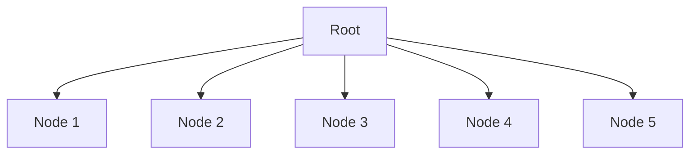

## 22.4. Efficient Data Structures and Algorithms

In the realm of software development, the choice of data structures and algorithms can significantly impact the performance and efficiency of an application. Clojure, with its emphasis on immutability and functional programming, offers a unique set of data structures and algorithms that are both powerful and efficient. In this section, we will explore the performance characteristics of Clojure's core data structures, provide guidelines for selecting the right data structure for a given problem, and introduce algorithms with better time and space complexity. We will also highlight some external libraries that offer optimized data structures.

### Understanding Clojure's Core Data Structures

Clojure provides a rich set of core data structures that are designed to be immutable and persistent. These data structures include lists, vectors, maps, and sets. Each of these data structures has its own performance characteristics and is suited for different types of operations.

#### Lists

Clojure lists are linked lists, which means they are efficient for operations that involve adding or removing elements from the front of the list. However, accessing elements by index is an O(n) operation, making lists less suitable for random access.

```clojure
;; Creating a list
(def my-list '(1 2 3 4 5))

;; Adding an element to the front
(def new-list (cons 0 my-list)) ;; => (0 1 2 3 4 5)

;; Accessing an element by index
(nth my-list 2) ;; => 3
```

#### Vectors

Vectors in Clojure are designed for efficient random access and updates. They provide O(1) time complexity for accessing elements by index and are implemented as a tree structure with a branching factor of 32.

```clojure
;; Creating a vector
(def my-vector [1 2 3 4 5])

;; Accessing an element by index
(nth my-vector 2) ;; => 3

;; Adding an element to the end
(def new-vector (conj my-vector 6)) ;; => [1 2 3 4 5 6]
```

#### Maps

Maps are key-value pairs and are implemented as hash maps. They provide efficient O(1) average time complexity for lookups, insertions, and deletions.

```clojure
;; Creating a map
(def my-map {:a 1 :b 2 :c 3})

;; Accessing a value by key
(get my-map :b) ;; => 2

;; Adding a new key-value pair
(def new-map (assoc my-map :d 4)) ;; => {:a 1, :b 2, :c 3, :d 4}
```

#### Sets

Sets are collections of unique elements and are implemented as hash sets. They provide efficient O(1) average time complexity for membership tests, insertions, and deletions.

```clojure
;; Creating a set
(def my-set #{1 2 3 4 5})

;; Checking membership
(contains? my-set 3) ;; => true

;; Adding an element
(def new-set (conj my-set 6)) ;; => #{1 2 3 4 5 6}
```

### Guidelines for Choosing the Right Data Structure

Choosing the right data structure depends on the specific requirements of your application. Here are some guidelines to help you make the right choice:

1. **Consider the Operations**: Identify the operations that are most critical to your application. If you need fast random access, use vectors. If you need fast insertion and removal from the front, use lists.

2. **Evaluate Performance Characteristics**: Consider the time complexity of different operations for each data structure. For example, maps and sets offer O(1) average time complexity for lookups, while lists offer O(n) time complexity for accessing elements by index.

3. **Think About Immutability**: Clojure's data structures are immutable, which means they are safe to use in concurrent environments. Consider how immutability can benefit your application, especially in terms of concurrency and parallelism.

4. **Leverage Persistent Data Structures**: Clojure's data structures are persistent, meaning they share structure between versions. This can lead to significant memory savings and improved performance for certain operations.

### Algorithms with Better Time and Space Complexity

In addition to choosing the right data structure, selecting efficient algorithms is crucial for optimizing performance. Here are some common algorithms and their time and space complexity:

#### Sorting Algorithms

Sorting is a common operation in many applications. Clojure provides several built-in sorting functions, such as `sort` and `sort-by`, which use a variant of the merge sort algorithm with O(n log n) time complexity.

```clojure
;; Sorting a vector
(def sorted-vector (sort [3 1 4 1 5 9 2 6 5 3 5])) ;; => [1 1 2 3 3 4 5 5 5 6 9]
```

#### Searching Algorithms

Searching for elements in a collection is another common operation. Clojure provides functions like `some` and `filter` for searching, which have O(n) time complexity.

```clojure
;; Finding an element in a vector
(some #(= % 5) [1 2 3 4 5 6]) ;; => 5
```

#### Graph Algorithms

Graphs are used to model relationships between entities. Clojure's `loom` library provides a rich set of graph algorithms, including depth-first search (DFS) and breadth-first search (BFS), both of which have O(V + E) time complexity, where V is the number of vertices and E is the number of edges.

```clojure
(require '[loom.graph :as lg])
(require '[loom.alg :as la])

;; Creating a graph
(def g (lg/digraph {:a [:b :c], :b [:d], :c [:d], :d []}))

;; Performing a depth-first search
(la/dfs g :a) ;; => (:a :b :d :c)
```

### Comparing Different Approaches

To illustrate the impact of choosing the right data structure and algorithm, let's compare two approaches to solving a problem: finding the intersection of two collections.

#### Approach 1: Using Lists

```clojure
(defn intersection-lists [list1 list2]
  (filter #(some #{%} list2) list1))

(intersection-lists '(1 2 3 4) '(3 4 5 6)) ;; => (3 4)
```

This approach has O(n^2) time complexity because `some` is called for each element in `list1`.

#### Approach 2: Using Sets

```clojure
(defn intersection-sets [set1 set2]
  (clojure.set/intersection set1 set2))

(intersection-sets #{1 2 3 4} #{3 4 5 6}) ;; => #{3 4}
```

This approach has O(n) time complexity because sets provide efficient membership tests.

### External Libraries for Optimized Data Structures

Clojure's core library provides a solid foundation of data structures, but there are also external libraries that offer optimized data structures for specific use cases.

#### `core.rrb-vector`

The `core.rrb-vector` library provides a more flexible and efficient implementation of vectors, supporting efficient concatenation and slicing operations.

```clojure
(require '[clojure.core.rrb-vector :as rrb])

;; Creating an RRB vector
(def rrb-vector (rrb/vector 1 2 3 4 5))

;; Concatenating vectors
(def concatenated (rrb/catvec rrb-vector (rrb/vector 6 7 8))) ;; => [1 2 3 4 5 6 7 8]
```

#### `clojure.data.avl`

The `clojure.data.avl` library provides an implementation of AVL trees, which are balanced binary search trees. AVL trees offer O(log n) time complexity for insertions, deletions, and lookups.

```clojure
(require '[clojure.data.avl :as avl])

;; Creating an AVL tree
(def avl-tree (avl/sorted-map :a 1 :b 2 :c 3))

;; Adding an element
(def new-avl-tree (assoc avl-tree :d 4)) ;; => {:a 1, :b 2, :c 3, :d 4}
```

### Visualizing Data Structures and Algorithms

To better understand how Clojure's data structures and algorithms work, let's visualize some of them using Mermaid.js diagrams.

#### Visualizing a Vector



**Caption**: This diagram represents the tree structure of a Clojure vector, where each node can have up to 32 children.

#### Visualizing a Depth-First Search


**Caption**: This diagram illustrates the depth-first search traversal of a graph, starting from node A.

### Knowledge Check

To reinforce your understanding of efficient data structures and algorithms in Clojure, consider the following questions:

1. What are the performance characteristics of Clojure's core data structures?
2. How do you choose the right data structure for a given problem?
3. What are some common algorithms with better time and space complexity?
4. How can external libraries enhance the performance of data structures in Clojure?

### Summary

In this section, we explored the performance characteristics of Clojure's core data structures, provided guidelines for choosing the right data structure for a given problem, and introduced algorithms with better time and space complexity. We also highlighted some external libraries that offer optimized data structures. By understanding and leveraging these concepts, you can enhance the performance and efficiency of your Clojure applications.

### Ready to Test Your Knowledge?



### What is the time complexity of accessing an element by index in a Clojure vector?

- [x] O(1)
- [ ] O(n)
- [ ] O(log n)
- [ ] O(n log n)

> **Explanation:** Clojure vectors provide O(1) time complexity for accessing elements by index due to their tree structure with a branching factor of 32.

### Which Clojure data structure is most efficient for adding or removing elements from the front?

- [x] List
- [ ] Vector
- [ ] Map
- [ ] Set

> **Explanation:** Clojure lists are linked lists, making them efficient for operations that involve adding or removing elements from the front.

### What is the average time complexity for lookups in a Clojure map?

- [x] O(1)
- [ ] O(n)
- [ ] O(log n)
- [ ] O(n log n)

> **Explanation:** Clojure maps are implemented as hash maps, providing O(1) average time complexity for lookups.

### Which library provides an implementation of AVL trees in Clojure?

- [x] clojure.data.avl
- [ ] core.rrb-vector
- [ ] loom
- [ ] clojure.set

> **Explanation:** The `clojure.data.avl` library provides an implementation of AVL trees, which are balanced binary search trees.

### What is the time complexity of sorting a collection using Clojure's `sort` function?

- [x] O(n log n)
- [ ] O(n)
- [ ] O(log n)
- [ ] O(n^2)

> **Explanation:** Clojure's `sort` function uses a variant of the merge sort algorithm, which has O(n log n) time complexity.

### Which data structure should you use for efficient membership tests in Clojure?

- [x] Set
- [ ] List
- [ ] Vector
- [ ] Map

> **Explanation:** Clojure sets provide efficient O(1) average time complexity for membership tests.

### How does Clojure achieve immutability in its data structures?

- [x] By using persistent data structures
- [ ] By copying data structures on every modification
- [ ] By using mutable data structures
- [ ] By locking data structures

> **Explanation:** Clojure achieves immutability by using persistent data structures, which share structure between versions.

### What is the time complexity of the depth-first search algorithm provided by the `loom` library?

- [x] O(V + E)
- [ ] O(V^2)
- [ ] O(E^2)
- [ ] O(V log V)

> **Explanation:** The depth-first search algorithm in the `loom` library has O(V + E) time complexity, where V is the number of vertices and E is the number of edges.

### Which Clojure data structure is implemented as a hash set?

- [x] Set
- [ ] List
- [ ] Vector
- [ ] Map

> **Explanation:** Clojure sets are implemented as hash sets, providing efficient O(1) average time complexity for membership tests.

### True or False: Clojure's data structures are mutable by default.

- [ ] True
- [x] False

> **Explanation:** Clojure's data structures are immutable by default, which means they cannot be changed once created.



Remember, mastering efficient data structures and algorithms is a journey. As you continue to explore and experiment with Clojure, you'll discover new ways to optimize your applications and solve complex problems. Keep learning, stay curious, and enjoy the process!
