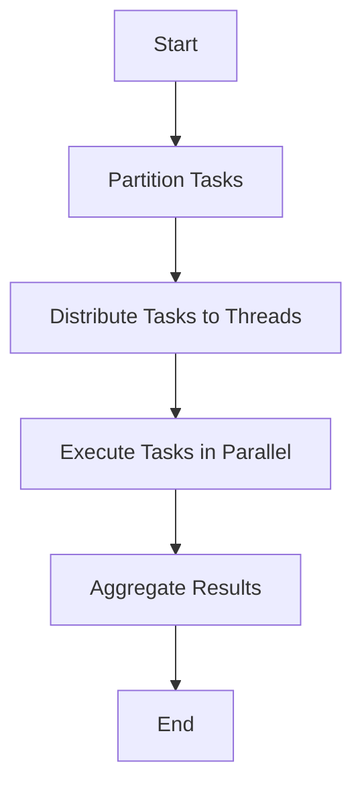

## 22.5. Parallel Processing and Load Distribution

In the realm of software development, performance optimization is a critical aspect, especially when dealing with large-scale applications. One of the most effective ways to enhance performance is through parallel processing and load distribution. In this section, we will delve into how Clojure, with its robust concurrency primitives and the underlying power of the Java Virtual Machine (JVM), can be harnessed to implement parallel processing and distribute workloads effectively.

### Understanding Parallel Processing

Parallel processing involves executing multiple computations simultaneously, which can significantly reduce the time required to perform complex operations. This is particularly beneficial in scenarios involving large datasets or computationally intensive tasks. By distributing tasks across multiple processors or cores, parallel processing can lead to substantial performance gains.

#### Benefits of Parallelism

1. **Increased Throughput**: By executing multiple tasks concurrently, the overall throughput of the system is increased, allowing more work to be completed in less time.
2. **Reduced Latency**: Parallel processing can reduce the latency of individual tasks by breaking them into smaller, concurrent operations.
3. **Scalability**: Systems designed with parallel processing in mind can scale more effectively, taking advantage of additional hardware resources as they become available.
4. **Resource Utilization**: Efficiently utilizes available CPU resources, preventing idle time and maximizing performance.

### Clojure's Concurrency Primitives

Clojure provides several concurrency primitives that facilitate parallel processing. These include `pmap`, `future`, `agent`, and more. Let's explore each of these tools and how they can be used to achieve parallelism.

#### `pmap` for Parallel Mapping

The `pmap` function in Clojure is a parallel version of the `map` function. It applies a given function to each element of a collection in parallel, distributing the workload across available processors.

```clojure
(defn square [x]
  (* x x))

;; Using pmap to square numbers in parallel
(def numbers (range 1 100))
(def squared-numbers (pmap square numbers))

;; Output the squared numbers
(println squared-numbers)
```

In this example, `pmap` is used to compute the square of each number in the list concurrently, leveraging multiple CPU cores.

#### `future` for Asynchronous Computation

The `future` construct in Clojure allows for asynchronous computation. It evaluates an expression in a separate thread and returns a reference to the result, which can be dereferenced when needed.

```clojure
(defn expensive-computation []
  (Thread/sleep 2000) ; Simulate a long-running task
  42)

;; Start the computation in a separate thread
(def result (future (expensive-computation)))

;; Do other work while the computation is running
(println "Doing other work...")

;; Retrieve the result when needed
(println "Result:" @result)
```

Here, the `expensive-computation` function is executed in a separate thread, allowing the main thread to continue executing other tasks.

#### `agent` for Managing State Changes

Agents in Clojure are used for managing state changes asynchronously. They are ideal for situations where you need to update shared state without blocking other operations.

```clojure
(def counter (agent 0))

(defn increment [n]
  (inc n))

;; Increment the counter asynchronously
(send counter increment)

;; Wait for the agent to complete its action
(await counter)

;; Output the updated counter value
(println "Counter:" @counter)
```

In this example, the `counter` agent is incremented asynchronously, allowing other operations to proceed without waiting for the state change to complete.

### Thread Pools and Executors

Thread pools and executors are essential components for managing threads efficiently. They allow for the reuse of threads, reducing the overhead of thread creation and destruction.

#### Using Executors

Clojure can leverage Java's `ExecutorService` to manage thread pools. This provides fine-grained control over the number of threads and their behavior.

```clojure
(import '(java.util.concurrent Executors))

(defn task [id]
  (println (str "Executing task " id)))

;; Create a fixed thread pool with 4 threads
(def executor (Executors/newFixedThreadPool 4))

;; Submit tasks to the executor
(dotimes [i 10]
  (.submit executor #(task i)))

;; Shutdown the executor
(.shutdown executor)
```

In this example, a fixed thread pool is created with 4 threads, and 10 tasks are submitted for execution. The executor manages the distribution of tasks across the available threads.

### Partitioning Tasks and Aggregating Results

Effective parallel processing often involves partitioning tasks into smaller units that can be processed concurrently. Once the tasks are completed, the results need to be aggregated.

#### Task Partitioning

Partitioning involves breaking down a large task into smaller, independent tasks that can be executed in parallel. This can be achieved using Clojure's `partition` function.

```clojure
(def data (range 1 101))

;; Partition the data into chunks of 10
(def partitions (partition 10 data))

;; Process each partition in parallel
(def results (pmap (fn [chunk] (reduce + chunk)) partitions))

;; Aggregate the results
(def total (reduce + results))

(println "Total sum:" total)
```

In this example, the data is partitioned into chunks of 10, and each chunk is processed in parallel to compute the sum. The results are then aggregated to obtain the total sum.

#### Result Aggregation

Once tasks are completed, their results need to be combined. This can be done using functions like `reduce` or `merge`.

```clojure
(defn merge-results [result1 result2]
  (merge-with + result1 result2))

;; Example results from parallel tasks
(def result1 {:a 1 :b 2})
(def result2 {:a 3 :b 4})

;; Aggregate the results
(def aggregated-result (merge-results result1 result2))

(println "Aggregated Result:" aggregated-result)
```

Here, two result maps are merged using the `merge-with` function, which combines values with the same key.

### Challenges in Parallel Processing

While parallel processing offers significant benefits, it also presents challenges such as synchronization and resource contention.

#### Synchronization

Synchronization is necessary when multiple threads access shared resources. Clojure provides several mechanisms to handle synchronization, such as `Refs` and `STM` (Software Transactional Memory).

```clojure
(def shared-counter (ref 0))

(defn increment-counter []
  (dosync
    (alter shared-counter inc)))

;; Increment the counter in parallel
(doseq [_ (range 10)]
  (future (increment-counter)))

;; Wait for all futures to complete
(Thread/sleep 1000)

(println "Shared Counter:" @shared-counter)
```

In this example, the `shared-counter` is incremented within a transaction, ensuring that updates are atomic and consistent.

#### Resource Contention

Resource contention occurs when multiple threads compete for the same resources, leading to performance degradation. Proper task partitioning and load balancing can help mitigate this issue.

### Visualizing Parallel Processing

To better understand the flow of parallel processing, let's visualize the process using a flowchart.



**Figure 1**: Flowchart of Parallel Processing in Clojure

This flowchart illustrates the key steps involved in parallel processing: partitioning tasks, distributing them to threads, executing them in parallel, and aggregating the results.

### Best Practices for Parallel Processing

1. **Identify Independent Tasks**: Ensure that tasks can be executed independently without dependencies.
2. **Minimize Shared State**: Reduce the need for synchronization by minimizing shared state.
3. **Use Appropriate Concurrency Primitives**: Choose the right concurrency primitive (`pmap`, `future`, `agent`) based on the task requirements.
4. **Monitor Performance**: Use profiling tools to monitor performance and identify bottlenecks.
5. **Test Thoroughly**: Ensure that parallel code is thoroughly tested to avoid race conditions and deadlocks.

### Try It Yourself

Experiment with the code examples provided in this section. Try modifying the number of threads in the executor, changing the size of partitions, or using different concurrency primitives. Observe how these changes affect performance and behavior.

### References and Further Reading

- [Clojure Concurrency](https://clojure.org/reference/concurrency)
- [Java Concurrency in Practice](https://jcip.net/)
- [Effective Java: Concurrency](https://www.oreilly.com/library/view/effective-java-3rd/9780134686097/)

## **Ready to Test Your Knowledge?**



### What is the primary benefit of parallel processing?

- [x] Increased throughput
- [ ] Reduced code complexity
- [ ] Simplified debugging
- [ ] Enhanced security

> **Explanation:** Parallel processing increases throughput by allowing multiple tasks to be executed simultaneously, thus completing more work in less time.

### Which Clojure function is used for parallel mapping?

- [x] `pmap`
- [ ] `map`
- [ ] `reduce`
- [ ] `filter`

> **Explanation:** `pmap` is the parallel version of `map`, distributing the workload across multiple processors.

### What does the `future` construct in Clojure do?

- [x] Executes an expression asynchronously
- [ ] Blocks the main thread until completion
- [ ] Executes an expression synchronously
- [ ] Creates a new thread for each task

> **Explanation:** `future` executes an expression asynchronously, allowing the main thread to continue executing other tasks.

### How can resource contention be mitigated in parallel processing?

- [x] Proper task partitioning and load balancing
- [ ] Increasing the number of threads
- [ ] Using more memory
- [ ] Disabling synchronization

> **Explanation:** Proper task partitioning and load balancing help mitigate resource contention by distributing workload evenly across resources.

### What is the role of `agent` in Clojure?

- [x] Managing state changes asynchronously
- [ ] Blocking other operations
- [ ] Executing tasks synchronously
- [ ] Handling exceptions

> **Explanation:** Agents manage state changes asynchronously, allowing other operations to proceed without waiting for state updates.

### Which Java class is used for managing thread pools in Clojure?

- [x] `ExecutorService`
- [ ] `Thread`
- [ ] `Runnable`
- [ ] `Callable`

> **Explanation:** `ExecutorService` is used for managing thread pools, providing control over thread behavior and lifecycle.

### What is the purpose of the `dosync` block in Clojure?

- [x] Ensuring atomic updates to shared resources
- [ ] Executing tasks in parallel
- [ ] Creating new threads
- [ ] Handling exceptions

> **Explanation:** The `dosync` block ensures atomic updates to shared resources, preventing race conditions and ensuring consistency.

### How does `pmap` differ from `map` in Clojure?

- [x] `pmap` executes tasks in parallel
- [ ] `pmap` executes tasks sequentially
- [ ] `pmap` is slower than `map`
- [ ] `pmap` uses more memory

> **Explanation:** `pmap` executes tasks in parallel, distributing the workload across multiple processors, unlike `map`, which executes tasks sequentially.

### What is a common challenge in parallel processing?

- [x] Synchronization and resource contention
- [ ] Increased code readability
- [ ] Simplified error handling
- [ ] Enhanced security

> **Explanation:** Synchronization and resource contention are common challenges in parallel processing, requiring careful management to avoid performance degradation.

### True or False: `pmap` is always faster than `map`.

- [ ] True
- [x] False

> **Explanation:** `pmap` is not always faster than `map`. It depends on the task and the overhead of managing parallel execution. For small tasks, `map` might be more efficient.



Remember, this is just the beginning. As you progress, you'll build more complex and interactive applications. Keep experimenting, stay curious, and enjoy the journey!
